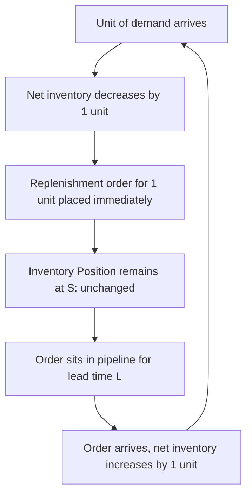

## Base Stock Policy

### Overview

The base stock policy — also called the **one-for-one** or **order-up-to-1** policy in its purest form — is the limiting case of the order-up-to structure where the review interval collapses to zero (or, equivalently, every single demand transaction immediately triggers a replenishment order). Inventory position is held constant at a target base stock level $S$ at all times: each unit of demand that arrives is instantly replaced by a replenishment order for exactly that unit.

### Core Definitions

**Key Points**

- **Base Stock Level ($S$)**: The single target inventory position, maintained continuously. This is the only decision parameter in the policy.
- **Inventory Position ($IP$)**: On-hand + on-order − backorders. Under base stock, $IP = S$ at all times, by construction, since every unit consumed is immediately reordered.
- **One-for-One Replenishment**: Each demand event triggers an order of exactly one unit (or the exact demand quantity), as opposed to batching demand into discrete lot sizes.
- **Net Inventory**: On-hand minus backorders; this is the quantity that fluctuates below $S$ while orders are in the pipeline, since $IP$ itself stays fixed.

### Policy Mechanics

$$IP_t = S \quad \text{for all } t \text{ (by construction)}$$

Every unit of demand $d$ immediately generates a replenishment order of size $d$, so inventory position never deviates from $S$. What fluctuates is **net inventory** (on-hand stock), which behaves as:

$$\text{Net Inventory}(t) = S - \text{(demand over the most recent lead time window)}$$

This is the key structural feature: base stock is the special case of $(R,Q)$ with $Q \to$ "one unit at a time" (i.e., $Q=1$ in discrete-unit terms, or continuous/infinitesimal batching), and simultaneously the special case of $(s,S)$ with $s = S - 1$ (reorder triggered by every single unit of demand).

### Relationship to Other Policies

**Key Points**

- Base stock is the limiting case of $(R,Q)$ as $Q \to 1$ (smallest possible batch): the reorder point $R$ and order-up-to level $S$ effectively merge, since every unit consumed is replaced immediately.
- Base stock is the limiting case of $(T,S)$ as $T \to 0$ (continuous review with instantaneous reaction): the protection interval shrinks to just the lead time $L$, since there is no additional review-period exposure.
- Base stock eliminates fixed ordering costs from consideration: with no batching, the "K" (fixed cost per order) term of EOQ-style trade-offs is either assumed to be zero or is dominated by holding/backorder cost considerations, since ordering happens continuously regardless of setup cost.
- In multi-echelon systems, base stock policies are the standard building block because they decompose cleanly: under mild conditions, an echelon base stock policy is optimal for serial and assembly systems (Clark-Scarf theorem, 1960), making it foundational to modern supply chain theory rather than just a single-location heuristic.

### Determining the Base Stock Level

Because the protection interval is exactly the lead time $L$ (no review-period exposure), the base stock level formula mirrors the continuous-review reorder point:

$$S = \bar{d} L + z_\alpha \sigma_{LTD}$$

$$\sigma_{LTD} = \sigma_d \sqrt{L}$$

where $\bar{d}$ is mean demand rate, $\sigma_d$ is demand rate standard deviation, $L$ is lead time, and $z_\alpha$ is the safety factor for the target cycle service level $\alpha$.

**Key Points**

- This is structurally identical to the continuous-review $(R,Q)$ reorder point formula — base stock *is* the reorder point when batch size shrinks to a single unit, so $S$ plays the same role $R$ plays elsewhere.
- Unlike $(R,Q)$ or $(s,S)$, there is no separate "how much to order" decision — the order quantity is always exactly equal to realized demand, making $Q^*$/EOQ trade-offs irrelevant to this policy's core structure.

### Worked Example

**Example**

A high-value, made-to-order component has:

- Average daily demand $\bar{d} = 4$ units/day
- Daily demand standard deviation $\sigma_d = 1.5$ units/day
- Lead time $L = 10$ days
- Target cycle service level $\alpha = 99\%$ ($z_{0.99} = 2.326$)

**Step 1 — Expected lead-time demand**:

$$\mu_{LTD} = 4 \times 10 = 40 \text{ units}$$

**Step 2 — Lead-time demand standard deviation**:

$$\sigma_{LTD} = 1.5\sqrt{10} \approx 4.74 \text{ units}$$

**Step 3 — Safety stock component**:

$$SS = 2.326 \times 4.74 \approx 11.03 \text{ units}$$

**Output**

$$S = 40 + 11.03 \approx 51 \text{ units}$$

**Interpretation**: Maintain inventory position at 51 units at all times. Every time a unit is consumed, immediately place a replenishment order for one unit. On-hand stock will fluctuate around $S - \mu_{LTD} = 11$ units (the safety stock) as pipeline orders arrive and depart, but inventory position itself never changes from 51.

### Fill Rate Under Base Stock

Because the reorder-and-replace cycle is continuous and one-for-one, fill rate under base stock has a particularly clean form using the newsvendor-style critical ratio logic applied to lead-time demand:

$$\text{Fill Rate} = 1 - \frac{\sigma_{LTD} \cdot L(z)}{\bar{d} \cdot L / n}$$

[Inference] In practice, for base stock policies, fill rate is more commonly evaluated directly via the complement of expected backorders relative to the mean pipeline demand $\bar{d}L$, since there is no natural "per-cycle" quantity analogous to $Q$ in batch policies — the appropriate denominator convention varies across textbooks and this detail should be confirmed against the specific service-level definition in use.

### Multi-Echelon Base Stock (Echelon Inventory Position)

**Key Points**

- In serial or assembly supply chains, each stage $i$ maintains its own **echelon inventory position**: stage $i$'s on-hand + everything downstream/in-transit to it and beyond, minus backorders at the end customer.
- The Clark-Scarf (1960) result establishes that a system of nested echelon base stock levels $S_1 \leq S_2 \leq \dots \leq S_n$ (installation stock increasing upstream) is optimal for serial systems under fairly general conditions, decomposing an otherwise intractable multi-stage stochastic optimization into single-stage newsvendor-like subproblems.
- This decomposition is why base stock policies are the default building block in modern multi-echelon inventory optimization (MEIO) software and academic literature, even when actual batch ordering (not literal one-for-one) is used operationally — batch systems are often analyzed as "base stock plus batching overlay."

### Diagram: Base Stock Inventory Profile (svg_diagram)

<svg xmlns="http://www.w3.org/2000/svg" viewBox="0 0 760 340">
<text x="380" y="24" text-anchor="middle" font-size="16" font-weight="bold" fill="#1a1a1a">Base Stock Policy: IP vs Net Inventory (svg_diagram)</text>
<line x1="60" y1="300" x2="720" y2="300" stroke="#333" stroke-width="2" />
<line x1="60" y1="40" x2="60" y2="300" stroke="#333" stroke-width="2" />
<text x="690" y="320" font-size="12" fill="#333">time</text>
<text x="20" y="45" font-size="12" fill="#333">units</text>

<line x1="60" y1="70" x2="720" y2="70" stroke="#2f855a" stroke-width="3" />
<text x="65" y="60" font-size="12" fill="#2f855a" font-weight="bold">Inventory Position (constant at S)</text>

<polyline points="60,180 90,170 120,200 150,190 180,220 210,195 240,230 270,210 300,190 330,215 360,240 390,220 420,200 450,225 480,205 510,180 540,210 570,195 600,220 630,200 660,190 690,215 720,205" fill="none" stroke="`#2b6cb0`" stroke-width="2" />

<text x="65" y="175" font-size="12" fill="`#2b6cb0`" font-weight="bold">Net Inventory (on-hand, fluctuates)</text>

<line x1="60" y1="255" x2="720" y2="255" stroke="#805ad5" stroke-dasharray="3,3" stroke-width="1.2" />
<text x="65" y="270" font-size="11" fill="#805ad5">Safety stock reference level</text>

<text x="380" y="335" font-size="10" fill="#666" text-anchor="middle">Every unit of demand immediately triggers a one-unit replenishment order (one-for-one)</text>

</svg>

### Process Flow: Base Stock Replenishment Logic (svg_diagram / Mermaid)

### Comparison Across Policy Structures

| Aspect | Base Stock | $(R,Q)$ | $(s,S)$ |
| --- | --- | --- | --- |
| Order trigger | Every demand unit | $IP \leq R$ | $IP \leq s$ |
| Order quantity | Exactly = demand realized | Fixed $Q$ | Variable, up to $S$ |
| Fixed ordering cost relevance | Assumed negligible | Central to sizing $Q$ | Central to sizing $S-s$ |
| Inventory position behavior | Constant at $S$ | Sawtooth between $R$ and $R+Q$ | Sawtooth, variable amplitude |
| Multi-echelon tractability | High (Clark-Scarf decomposition) | Lower | Lower |
| Best suited for | Continuous-flow, make-to-order components; multi-echelon system design | Standard single-location batch replenishment | General single-item stochastic demand with fixed order costs |

### Practical Implementation Considerations

**Key Points**

- True one-for-one base stock is most practical when per-order fixed costs are genuinely negligible — electronic purchase orders, automated EDI/API-driven procurement, or internal transfers between stages of an integrated production system.
- When fixed ordering costs are non-trivial, pure base stock is typically approximated by a "batch-base-stock" hybrid: orders are batched to size $Q$ but the underlying target position logic still follows base-stock-style echelon accounting — common in MEIO software architectures.
- [Inference] In a software system context, base stock logic maps naturally onto event-driven architectures: each consumption event (e.g., a document/asset checkout, a form issuance) can trigger an immediate, automated replenishment request via an API call or queued job, rather than relying on scheduled batch jobs — this is architecturally simpler to implement in modern event-driven systems than periodic-review polling, though it assumes the downstream fulfillment process can economically handle high-frequency, small-quantity requests.

### Conclusion

The base stock policy represents the theoretical limit of continuous, one-for-one replenishment, eliminating batching considerations entirely and reducing the control problem to a single parameter: the target inventory position $S$, sized to cover lead-time demand plus safety stock. Its primary significance extends beyond single-location control — it is the foundational building block for multi-echelon inventory theory, since echelon base stock policies decompose complex serial and assembly supply chain optimization problems into tractable, provably optimal single-stage subproblems.

**Next Steps / Related Topics**

- Clark-Scarf (1960) echelon base stock optimality for serial systems
- Echelon inventory position vs installation inventory position
- Batch-base-stock hybrid policies for non-negligible fixed ordering costs
- Multi-echelon inventory optimization (MEIO) software architectures
- Guaranteed-service vs stochastic-service models in multi-stage base stock design
- Assemble-to-order systems and component base stock allocation