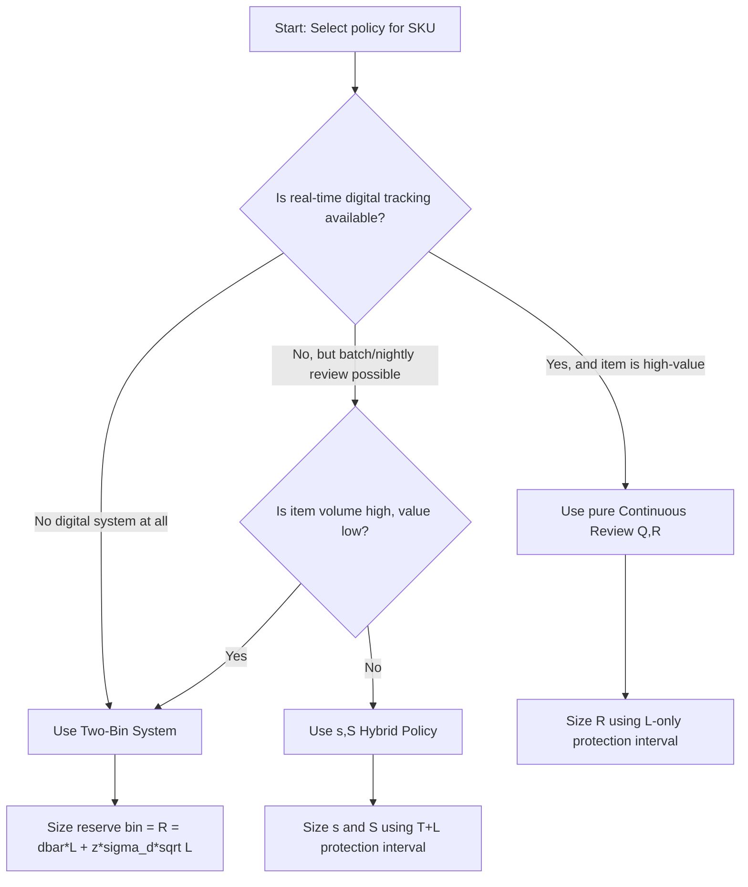

## Hybrid and Two-Bin Systems

### Overview

Hybrid inventory systems combine elements of continuous and periodic review to balance monitoring cost against responsiveness. Two-bin systems are a simple, physical implementation of a continuous-review reorder-point policy that require no electronic tracking. Together, these represent the practical middle ground used heavily in low-tech or high-volume, low-value inventory environments (e.g., fasteners, medical consumables, office supplies).

### The (s, S) Hybrid Policy

**Definition**

The $(s, S)$ policy — also called a "min-max" policy — reviews inventory position at fixed intervals $T$ (periodic characteristic), but only places an order if inventory position has fallen to or below the reorder point $s$ (continuous-review-style trigger). If triggered, the order brings inventory position up to $S$.

**Key Points**

- $s$ = reorder point (the "min")
- $S$ = order-up-to level (the "max")
- Review occurs on a schedule (e.g., nightly batch job, weekly cycle count), not continuously
- If position at review is above $s$, no order is placed — this reduces unnecessary small replenishments compared to pure $(T, S)$
- Order quantity is variable: $Q = S - \text{(position at review)}$, only when position $\le s$

**Protection Interval**

Because the check only happens at review points, the effective protection interval sits between the two pure cases:

$$T + L \quad \text{(worst case, if trigger point is reached just after a review)}$$

In practice, $(s,S)$ safety stock is computed the same way as periodic review's $T+L$ formula, since the system cannot react faster than the next scheduled review even after crossing $s$:

$$SS = z\sigma_d\sqrt{T+L}$$

**When to Use**

- ERP/MRP systems that run nightly or shift-based batch jobs rather than true real-time triggers
- Environments where continuous physical counting is impractical but daily/weekly digital snapshots are feasible
- SKUs with moderate criticality — too important for pure periodic ordering, not important enough to justify real-time infrastructure

### Two-Bin System

**Definition**

A two-bin (or "double-bin") system is a physical, visual implementation of a continuous-review $(Q, R)$ policy. Stock is physically split into two containers:

1. **Working bin** — used for day-to-day consumption
2. **Reserve bin** — sized to exactly cover demand during lead time plus safety stock

When the working bin empties, that event itself is the reorder trigger — no counting, scanning, or system lookup is required. The worker begins drawing from the reserve bin and simultaneously places (or triggers) a replenishment order sized to refill the working bin.

**Key Points**

- The reserve bin's contents are, by design, exactly the reorder point quantity $R$
- Sizing the reserve bin uses the identical formula as continuous review's reorder point:

$$R = \bar{d}L + z\sigma_d\sqrt{L} = Q_{\text{reserve bin}}$$

- The working bin is typically sized to hold one full order cycle's worth of stock (often close to $Q$ from an EOQ calculation)
- Requires no perpetual inventory system — the physical exhaustion of a bin *is* the signal
- Extremely common in Kanban-based lean manufacturing and hospital/pharmacy supply cabinets

**Mechanics of Triggering**

- **Manual trigonometry**: a card, tag, or empty-bin visual cue is physically carried to purchasing/replenishment staff (classic Kanban card)
- **Semi-automated**: barcode on the reserve bin is scanned once opened, firing a digital reorder in the ERP
- **Fully automated (IoT variant)**: weight sensors or RFID under the bin detect near-empty state and auto-generate a purchase order — this is a modern hybridization of the physical two-bin concept with continuous digital review

### Two-Bin as a Special Case of (Q, R)

The two-bin system is mathematically identical to continuous review $(Q,R)$; the only difference is the *mechanism* of detection:

| Aspect | Standard (Q,R) | Two-Bin |
| --- | --- | --- |
| Detection method | Electronic/software monitoring of inventory position | Physical exhaustion of working bin |
| Reorder point $R$ | Calculated, stored in system | Physically embodied as reserve bin contents |
| Order quantity $Q$ | Calculated (often EOQ) | Physically embodied as working bin capacity |
| Infrastructure need | POS/ERP with real-time updates | None — purely visual/physical |
| Best fit | Moderate-to-high value SKUs with digital tracking | High-volume, low-value, low-cost-of-stockout SKUs |

### Worked Example — Two-Bin Sizing

Given: $\bar{d} = 20$ units/day, $\sigma_d = 4$ units/day, $L = 5$ days, target service level 97.5% ($z = 1.96$), desired order cycle $\approx 15$ days of working-bin supply.

Reserve bin (reorder point):

$$R = (20 \times 5) + 1.96 \times 4 \times \sqrt{5} = 100 + 1.96 \times 4 \times 2.236 = 100 + 17.5 \approx 118 \text{ units}$$

Working bin (approximate cycle supply):

$$Q \approx \bar{d} \times 15 = 20 \times 15 = 300 \text{ units}$$

**Output**: Reserve bin holds 118 units (covers lead-time demand + safety stock); working bin holds ~300 units (covers a full replenishment cycle). Total system inventory at the moment the working bin is exhausted ≈ 118 units, matching exactly the calculated reorder point.

### Three-Bin Variant (Brief Note)

Some implementations use a third bin to represent "stock in transit" — separating what has been ordered but not yet received from the physical reserve. This is largely a visual/tracking refinement and does not change the underlying $(Q,R)$ mathematics; it exists to give visibility into outstanding orders on the shop floor.

### Decision Flow: Choosing a Hybrid Approach

### Common Implementation Pitfalls

- **Reserve bin undersized**: if the reserve bin does not account for lead-time *variability* (only average lead time), stockouts during the replenishment window become likely — always include $\sigma_L$ if lead time itself is variable, using the combined-variance formula $\sigma_{dL} = \sqrt{L\sigma_d^2 + \bar{d}^2\sigma_L^2}$
- **No supplier lead-time buffer**: two-bin systems assume the trigger-to-delivery lead time is roughly constant; high lead-time variance erodes the reliability of the visual signal
- **Card/tag loss in manual Kanban**: physical two-bin systems depend on the reorder signal (card, tag, scan) actually reaching purchasing — process discipline is a real operational risk, not just a math problem
- **$(s,S)$ review frequency mismatch**: setting $T$ too long defeats the purpose of the conditional trigger — the system still can't react faster than the next scheduled review

### Related Topics

- Lead-time variability and the combined demand-lead-time variance formula
- Kanban and lean pull-system design beyond inventory (production leveling, WIP limits)
- Min-max inventory systems in healthcare and pharmacy supply chains
- IoT-enabled automatic replenishment (smart shelves, RFID-triggered POs)
- Setting review interval $T$ via EOQ-derived cycle time
- Safety stock formulas under variable lead time vs. variable demand