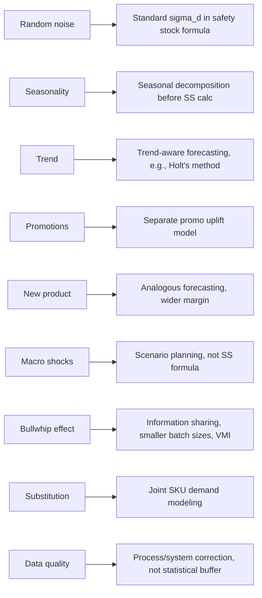

## Sources of Demand Uncertainty

### Overview

Demand uncertainty is the variability in the quantity, timing, or pattern of customer demand that cannot be perfectly predicted in advance. It is the fundamental driver behind safety stock requirements: without demand uncertainty, safety stock would be unnecessary — inventory could be timed to arrive exactly as needed. Understanding *where* uncertainty originates is a prerequisite to correctly estimating $\sigma_d$, the standard deviation term used in every safety stock formula.

### Taxonomy of Demand Uncertainty Sources

**1. Random/Stochastic Variation (Inherent Noise)**

The baseline, irreducible variability present even in stable, mature demand patterns — day-to-day fluctuation around a stable mean with no discernible cause.

**Key Points**

- Modeled as noise around a forecast, typically assumed normally distributed for tractability
- Cannot be eliminated by better forecasting, only characterized statistically
- This is the $\sigma_d$ that appears directly in standard safety stock formulas
- Estimated via historical demand variance: $\sigma_d = \sqrt{\frac{1}{n-1}\sum_{i=1}^{n}(d_i - \bar{d})^2}$

**2. Seasonality**

Predictable, recurring demand patterns tied to calendar cycles (weekly, monthly, annual).

**Key Points**

- Not true "uncertainty" if well-modeled — the risk is *residual* uncertainty left over after deseasonalizing
- Poor seasonal modeling converts a predictable pattern into apparent randomness, inflating measured $\sigma_d$
- Requires seasonal decomposition (e.g., multiplicative or additive decomposition, seasonal indices) before computing safety stock — applying non-seasonal safety stock formulas to raw seasonal data systematically over- or under-stocks during peaks/troughs
- [Inference] Most ERP-native safety stock modules default to non-seasonal formulas, so seasonal SKUs often require manual seasonal-index adjustment layered on top of standard tools

**3. Trend**

Systematic upward or downward drift in the demand baseline over time (product lifecycle growth/decline, market share shifts).

**Key Points**

- Similarly not "noise" if correctly detected — the danger is stale forecasts lagging behind a real trend, which manifests as persistent forecast bias rather than symmetric variance
- Requires trend-aware forecasting methods (e.g., double exponential smoothing/Holt's method, regression) to separate trend from noise
- Failing to detect trend causes forecast error to grow systematically over the forecast horizon, not stay constant — this violates the assumption behind most static $\sigma_d$ estimates

**4. Promotional and Marketing-Driven Demand Spikes**

Demand surges caused by discounts, marketing campaigns, bundling, or influencer/viral effects.

**Key Points**

- Often not visible in baseline historical demand data at all — a true structural break, not sampling noise
- Requires separate promotional forecasting (uplift modeling, cannibalization/pull-forward effects) rather than being folded into baseline $\sigma_d$
- Can cause severe underestimation of required stock if promotional periods are averaged into "normal" demand history, diluting the calculated variance

**5. New Product Introduction / Product Lifecycle Uncertainty**

Absence of historical data for newly launched SKUs, or demand pattern shifts during launch, growth, maturity, and decline phases.

**Key Points**

- No historical time series exists at launch — $\sigma_d$ must be estimated by analogy (comparable product families), judgmental forecasting, or wide initial safety margins
- Demand variance is typically highest during the introduction and decline phases of the product lifecycle, lowest during maturity
- [Inference] Practitioners commonly apply a higher service-level target or a multiplier on analogous-SKU variance during launch phases to compensate for estimation risk, though the specific multiplier is judgment-based rather than derived from a formula

**6. Macroeconomic and External Shocks**

Broad economic conditions, competitor actions, regulatory changes, or exogenous shocks (e.g., pandemics, natural disasters, geopolitical disruption) that shift demand outside any historically observed range.

**Key Points**

- These are tail-risk events, generally not well captured by a normal-distribution assumption on $\sigma_d$
- Standard safety stock formulas implicitly assume a stationary demand distribution; macro shocks violate stationarity entirely
- Scenario planning and stress testing (rather than statistical safety stock formulas) are the appropriate tool for this category

**7. Bullwhip Effect (Amplified Upstream Uncertainty)**

Demand variability that is *not* inherent to end-customer demand but is created or amplified as orders propagate upstream through a multi-echelon supply chain.

**Key Points**

- Caused by order batching, price fluctuations, rationing/gaming behavior, and demand-signal misreading between supply chain tiers
- Upstream nodes (distributors, manufacturers) can observe demand variance far higher than actual end-consumer demand variance, even when consumer demand is stable
- This is a *supply-chain-structural* source of uncertainty, distinct from the customer-facing sources above — it means the $\sigma_d$ relevant to a given node is not simply "true" demand variance, but variance as distorted by upstream order policies

**8. Substitution and Cross-Product Effects**

Demand uncertainty introduced by customers switching between substitutable SKUs (own-brand cannibalization, stockout-driven substitution, assortment changes).

**Key Points**

- A stockout on one SKU can inflate apparent demand on a substitute, corrupting the substitute's historical demand signal
- Makes SKU-level demand series non-independent — the demand of one item is partly a function of the availability of another
- Complicates safety stock calculation at the individual SKU level, since classical formulas assume each SKU's demand process is independent

**9. Measurement and Data Quality Issues**

Uncertainty introduced not by real-world demand variability but by errors in how demand is recorded, aggregated, or reported.

**Key Points**

- Includes point-of-sale data gaps, return/exchange misclassification, inter-warehouse transfer noise mistaken for demand, and manual data entry error
- This source inflates *measured* $\sigma_d$ without reflecting any real increase in customer behavior variability — a data-quality problem masquerading as a demand-uncertainty problem
- Often the least discussed but most correctable source: process and systems fixes reduce it, whereas statistical safety stock cannot

### Decomposition Framework

Total observed demand variance can be conceptually decomposed as:

$$\sigma_{d,\text{observed}}^2 = \sigma_{d,\text{random}}^2 + \sigma_{d,\text{residual-seasonal}}^2 + \sigma_{d,\text{residual-trend}}^2 + \sigma_{d,\text{promo}}^2 + \sigma_{d,\text{bullwhip}}^2 + \sigma_{d,\text{measurement}}^2 + \dots$$

**Key Points**

- Only the residual, irreducible components after removing known structural effects (seasonality, trend, promotions) should feed into the standard $z\sigma_d\sqrt{L}$ safety stock formula
- Using *raw, undecomposed* historical variance directly in the safety stock formula is one of the most common practical errors — it conflates predictable pattern with true randomness, generally leading to systematic over-stocking during predictable troughs and under-stocking during predictable peaks simultaneously

### Source-to-Mitigation Mapping

### Practical Implication for Safety Stock Modeling

**Key Points**

- Blindly computing $\sigma_d$ from raw historical demand and plugging it into $SS = z\sigma_d\sqrt{L}$ implicitly assumes *all* variability is random noise — this is rarely true in practice
- Correct practice separates structural, forecastable variation (seasonality, trend, promotions) from genuine residual randomness, and sizes safety stock only against the latter
- Sources like the bullwhip effect and substitution effects indicate that demand uncertainty at any given inventory node is partly a function of supply chain and assortment structure, not solely customer behavior — meaning mitigation sometimes lies in process redesign (information sharing, smaller batch ordering, SKU rationalization) rather than in statistical buffer sizing alone

### Related Topics

- Forecast error metrics (MAD, MSE, MAPE, tracking signal) and their relationship to $\sigma_d$
- Seasonal decomposition methods (classical, X-13ARIMA-SEATS, STL)
- Combined demand and lead-time variability formula
- Bullwhip effect quantification and mitigation strategies (VMI, EDI, collaborative forecasting/CPFR)
- Service level vs. fill rate as competing safety stock targets
- Judgmental forecasting techniques for new product introductions