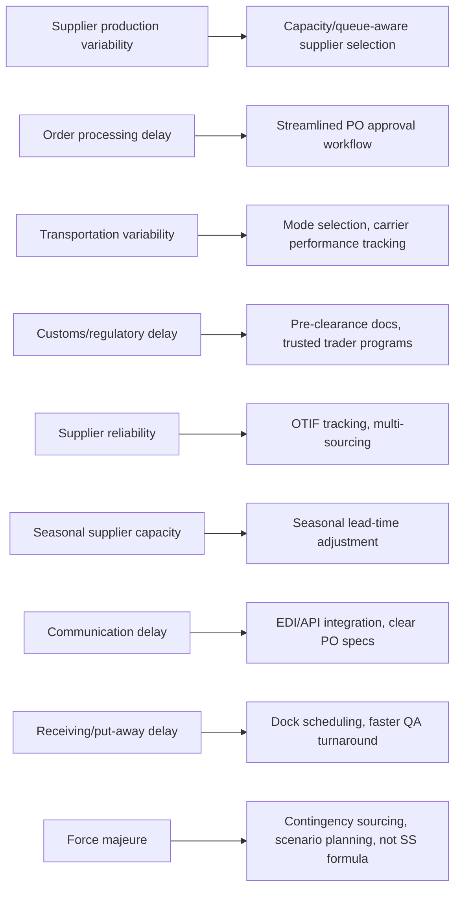

## Sources of Lead Time Uncertainty

### Overview

Lead time uncertainty is the variability in the elapsed time between placing a replenishment order and having usable stock on hand. It is the second core input (alongside demand uncertainty) driving safety stock requirements, and in many supply chains it is the *larger* contributor to stockout risk — because lead time variability affects the entire demand-over-lead-time distribution multiplicatively, not just additively. Understanding where lead time uncertainty originates is necessary to correctly estimate $\sigma_L$, the standard deviation of lead time used in combined-uncertainty safety stock formulas.

### Why Lead Time Uncertainty Matters Disproportionately

**Key Points**

- When both demand and lead time are variable, the combined standard deviation of demand-over-lead-time is:

$$\sigma_{dL} = \sqrt{L\sigma_d^2 + \bar{d}^2\sigma_L^2}$$

- The second term, $\bar{d}^2\sigma_L^2$, scales with the *square* of average demand — meaning even modest lead-time variability can dominate total uncertainty when average demand is high
- This is why lead-time reliability is often a higher-leverage improvement than demand forecasting accuracy for high-volume SKUs

### Taxonomy of Lead Time Uncertainty Sources

**1. Supplier Production/Processing Variability**

Variation in how long the supplier actually takes to manufacture, assemble, or pick-and-pack an order once it is placed.

**Key Points**

- Driven by supplier capacity constraints, machine downtime, labor availability, and queue position behind other customers' orders
- Suppliers running near capacity exhibit disproportionately higher processing-time variance (queueing-theory effect: variance increases sharply as utilization approaches 100%)
- [Inference] A supplier's quoted "standard lead time" often reflects an average or best-case figure rather than a distribution, so relying on it alone typically understates $\sigma_L$

**2. Order Processing and Administrative Delay**

Time lost in the buyer's or supplier's internal order-handling processes before physical fulfillment even begins.

**Key Points**

- Includes purchase order approval chains, credit checks, EDI/system processing lags, and manual order entry errors requiring correction
- Highly sensitive to organizational process design — a purely administrative source of variance, not a physical/logistics one
- Often the most controllable source, since it depends on internal workflow rather than external partners

**3. Transportation and Logistics Variability**

Variation in transit time once goods leave the supplier's facility.

**Key Points**

- Mode-dependent: ocean freight typically exhibits higher absolute variance than air freight, though air freight has higher variance *relative to* its shorter mean transit time in percentage terms
- Driven by carrier capacity/booking constraints, route congestion, weather, customs clearance delays (for international shipments), and port/terminal congestion
- Multi-leg shipments (supplier → consolidator → port → destination port → distribution center) accumulate variance at each handoff, and these variances generally do not cancel out — they add

**4. Customs, Regulatory, and Compliance Delays**

Time uncertainty introduced specifically at international or regulated-goods border crossings.

**Key Points**

- Includes customs inspection selection (random or risk-based), documentation errors, tariff classification disputes, and changing trade regulations
- Regulatory delay is often bimodal rather than normally distributed — most shipments clear quickly, but a meaningful minority face significant holds — which can make a normal-distribution assumption on $\sigma_L$ a poor fit for internationally sourced SKUs
- [Inference] For heavily regulated categories (pharmaceuticals, food, chemicals, certain electronics), practitioners commonly model lead time with a fat-tailed or empirical distribution rather than a normal approximation, given the bimodal clearance pattern

**5. Supplier Reliability and Performance Variability**

Systematic differences in a given supplier's historical on-time delivery performance, independent of any single order's specific delay cause.

**Key Points**

- Measured via metrics like On-Time-In-Full (OTIF) rate and historical lead-time distribution per supplier
- A supplier with 95% historical OTIF has empirically demonstrable $\sigma_L$ that should be used directly rather than relying on quoted lead times
- Multi-sourcing (dual/multi-supplier strategies) can reduce effective lead-time variance for the buyer, even if no single supplier's own variance changes, because the buyer's realized lead time becomes the minimum or blended outcome across suppliers

**6. Capacity and Seasonal Constraints at the Supplier**

Lead time inflation during periods when supplier demand from *all* its customers peaks simultaneously (e.g., pre-holiday manufacturing surges).

**Key Points**

- This is a form of supplier-side bullwhip exposure — the buyer's lead time becomes a function of aggregate industry demand, not just their own order
- Requires seasonal lead-time adjustment analogous to seasonal demand adjustment — using a single average $\sigma_L$ across the year understates risk during peak periods and overstates it during off-peak periods

**7. Information and Communication Delays**

Time lost due to miscommunication, unclear specifications, or delayed confirmations between buyer and supplier.

**Key Points**

- Includes ambiguous purchase order specifications requiring clarification, delayed order confirmations, and time-zone/business-hours misalignment in international sourcing
- Reduced through structured EDI/API integration and clear PO templates rather than statistical buffering
- Often underestimated because it is intermittent and process-dependent rather than a fixed step in the fulfillment timeline

**8. Internal Receiving and Put-Away Delay**

Variability occurring *after* physical goods arrive at the buyer's facility but before they are recorded as available inventory.

**Key Points**

- Includes receiving dock congestion, quality inspection/QA hold time, put-away labor availability, and system update lag (goods physically present but not yet reflected in inventory position)
- Frequently excluded from "lead time" definitions that stop at "goods arrive at dock," which understates the *effective* lead time relevant to inventory availability
- [Inference] Best practice generally defines lead time as ending at "available-to-promise" or system-confirmed receipt, not physical dock arrival, though this convention varies by organization

**9. Force Majeure and Disruption Events**

Low-probability, high-impact events causing extreme lead time deviations (natural disasters, geopolitical disruption, supplier bankruptcy, labor strikes, pandemics).

**Key Points**

- These represent tail risk outside the normal operating distribution — analogous to macroeconomic demand shocks
- Standard $\sigma_L$-based safety stock formulas are not designed to protect against this category; scenario planning, contingency sourcing, and business continuity planning are the appropriate tools
- Including disruption-event outliers in a routine $\sigma_L$ calculation can dramatically and inappropriately inflate day-to-day safety stock — these should typically be modeled/handled separately from routine variability

### Source-to-Mitigation Mapping

### Combined Uncertainty: Worked Example

Given: $\bar{d} = 30$ units/day, $\sigma_d = 6$ units/day, $\bar{L} = 10$ days, $\sigma_L = 3$ days.

$$\sigma_{dL} = \sqrt{L\sigma_d^2 + \bar{d}^2\sigma_L^2} = \sqrt{10 \times 6^2 + 30^2 \times 3^2} = \sqrt{360 + 8100} = \sqrt{8460} \approx 92.0$$

**Output**: Note that the lead-time-variability term (8,100) dominates the demand-variability term (360) by more than 22x in this example. This illustrates why reducing $\sigma_L$ (e.g., from 3 days to 1 day) typically yields far larger safety stock reductions than proportionally equivalent improvements in demand forecasting accuracy, when average demand is high relative to its own variability.

### Practical Implication

**Key Points**

- Lead time should be treated as an empirically measured, per-supplier (and ideally per-lane/per-mode) statistical distribution, not a single quoted number
- Structural sources (seasonality in supplier capacity, bimodal customs clearance) violate the normal-distribution assumption underlying standard safety stock formulas in the same way seasonal/promotional demand does — decomposition before plugging into $\sigma_{dL}$ is equally important on the lead-time side
- Disruption-class events should be excluded from routine $\sigma_L$ estimation and handled through separate contingency mechanisms, to avoid systematically over-provisioning day-to-day safety stock

### Related Topics

- Combined demand-and-lead-time variance formula derivation
- Supplier scorecards and OTIF (On-Time-In-Full) metrics
- Multi-sourcing and dual-sourcing strategies for lead-time risk reduction
- Vendor-managed inventory (VMI) as a lead-time-variance reduction mechanism
- Modeling non-normal (skewed/bimodal) lead-time distributions
- Risk pooling and safety stock centralization across multiple locations