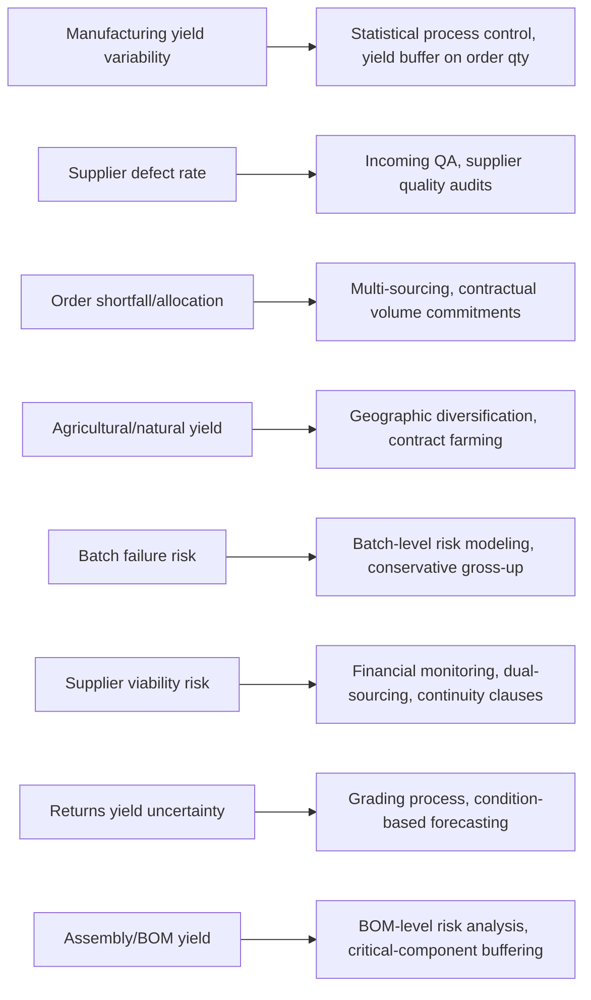

## Supply and Yield Uncertainty

### Overview

Supply and yield uncertainty refers to variability in the *quantity* of usable inventory actually delivered or produced, as distinct from variability in demand (how much is needed) or lead time (when it arrives). Even a perfectly forecasted, perfectly timed order can leave a system understocked if the quantity received is short, defective, or otherwise unusable. This is a frequently underweighted third pillar of inventory uncertainty alongside demand and lead time, and it requires its own variance term in safety stock calculations rather than being folded into either of the other two.

### Distinguishing Supply/Yield Uncertainty from Lead Time Uncertainty

**Key Points**

- Lead time uncertainty concerns **when** stock arrives; supply/yield uncertainty concerns **how much usable stock** arrives, regardless of timing
- An order can arrive exactly on time and still leave the buyer short if only 92% of units pass quality inspection
- These are mathematically independent sources of variance and, when both are present, both terms must be included in a combined safety stock model — using only demand and lead time variance while ignoring yield systematically understates required safety stock in manufacturing and process-industry contexts

### Taxonomy of Supply and Yield Uncertainty Sources

**1. Manufacturing Process Yield Variability**

Variation in the fraction of produced units that meet quality specifications, inherent to any production process (internal or supplier's).

**Key Points**

- Common in process industries (chemicals, pharmaceuticals, semiconductors, food processing) where output quality is probabilistic rather than deterministic
- Modeled via a yield rate $Y$ (fraction of good units), often itself treated as a random variable with its own mean $\bar{Y}$ and standard deviation $\sigma_Y$
- Required gross production/order quantity to net a target good-unit quantity $Q_{\text{net}}$ is approximately $Q_{\text{gross}} = Q_{\text{net}} / \bar{Y}$, but the *variance* around that gross order also propagates into net-quantity uncertainty

**2. Supplier Quality and Defect Rate Variability**

Variation in the proportion of a delivered shipment that fails incoming quality inspection or later fails in use.

**Key Points**

- Distinct from process yield in that it is measured at receipt (or point of use) rather than at the supplier's production line
- Driven by supplier process control maturity, raw material quality consistency, and handling/packaging during transit
- Tracked via metrics such as parts-per-million (PPM) defect rate, incoming inspection reject rate, and warranty/return rate

**3. Order Quantity Shortfall / Partial Shipment**

The supplier ships less than the ordered quantity, whether due to their own stockout, allocation decisions during shortage, or shipping error.

**Key Points**

- Common when a supplier is capacity-constrained and allocates limited output across multiple customers ("fair share" or priority-based rationing)
- Distinct from a quality-driven yield loss — the units simply were never shipped, rather than being shipped and rejected
- Particularly prevalent during industry-wide component shortages (e.g., semiconductor shortages), where confirmed order quantities are not a reliable predictor of actual receipt quantity

**4. Agricultural and Natural-Resource Yield Variability**

Variation in raw material output driven by biological, climatic, or geological factors rather than industrial process control.

**Key Points**

- Applies to agricultural inputs (crop yield per hectare varies with weather, pests, disease), fisheries, and extractive resources (mining ore grade variability)
- Typically exhibits much higher variance than manufactured-goods yield, and can be correlated across many suppliers simultaneously (e.g., a regional drought affects all suppliers sourcing from that region) — meaning this source of uncertainty resists diversification through multi-sourcing more than manufacturing yield does
- [Inference] Because agricultural yield uncertainty is often correlated with broader weather/climate patterns, safety stock models for agriculturally-sourced inputs sometimes need to account for correlated (rather than independent) supply risk across otherwise-separate suppliers

**5. Batch and Lot-Based Production Variability**

Yield variation introduced by discrete-batch manufacturing, where each production run's outcome is itself a random draw (batch success/failure, batch size variability, setup/changeover losses).

**Key Points**

- Common in pharmaceuticals, specialty chemicals, and semiconductor fabrication, where an entire batch can fail quality release
- Creates a distinctly non-continuous risk profile: unlike gradual yield-rate variation, a failed batch can mean zero usable output from an entire production run
- Requires either explicit batch-failure-probability modeling (rather than a continuous yield-rate distribution) or conservative safety stock sized against worst-realistic-case batch outcomes

**6. Supplier Financial and Operational Viability Risk**

Risk that a supplier reduces output, exits a product line, or ceases operating entirely (bankruptcy, plant closure, strategic deprioritization of the buyer's account).

**Key Points**

- A structural, discrete-event form of supply uncertainty rather than a continuous statistical variance
- Not well captured by standard $\sigma$-based safety stock formulas — mitigated through supplier financial health monitoring, dual-sourcing, and contractual continuity-of-supply clauses rather than inventory buffering alone
- [Inference] Organizations facing single-source dependency risk commonly carry strategic buffer stock beyond what statistical safety stock formulas would recommend, as an explicit hedge against this discrete risk rather than as a response to routine variance

**7. Return and Reverse-Logistics Yield Uncertainty**

For inventory systems that rely partly on returned, refurbished, or remanufactured units as a supply source, uncertainty in both the *volume* and *condition* of returns.

**Key Points**

- Relevant in closed-loop supply chains, rental/leasing businesses, and industries with significant customer returns (electronics, apparel)
- Return volume is itself demand-dependent and therefore correlated with the original demand process, while return *condition* (grade A/B/C, scrap) adds an additional yield-style variance layer on top

**8. Component and Sub-Assembly Availability (Assembly Yield)**

In multi-component assembly, the effective "yield" of a finished unit is constrained by the availability and quality of every required component — a stockout or defect in any single component can block completion of the whole assembly.

**Key Points**

- Effective assembly yield is a function of the *joint* availability of all inputs, not any single input's yield in isolation
- Creates correlated risk: a shortage in one critical, hard-to-substitute component can bottleneck output regardless of how well-stocked every other component is
- Bill-of-materials (BOM) level risk analysis, rather than single-SKU safety stock, is required to properly capture this source

### Incorporating Yield Uncertainty into Safety Stock

**Key Points**

- A simplified approach treats yield as a multiplicative factor on order quantity: to net an expected $Q_{\text{net}}$ good units with mean yield $\bar{Y}$, order $Q_{\text{gross}} = Q_{\text{net}}/\bar{Y}$
- A more rigorous approach models the *variance* of net usable quantity given both order-quantity variance and yield-rate variance, combining it with demand and lead-time variance in an extended safety stock formula rather than treating gross-up as sufficient on its own
- [Inference] In practice, many organizations handle yield risk through a fixed "yield buffer" percentage added to order quantities (a rule-of-thumb multiplier) rather than a fully stochastic yield-variance model, trading statistical rigor for operational simplicity

### Worked Example — Yield-Adjusted Order Quantity

Given: Required net good units $Q_{\text{net}} = 1{,}000$, mean process yield $\bar{Y} = 0.92$ (92%), yield standard deviation $\sigma_Y = 0.04$.

Gross order quantity to target the mean:

$$Q_{\text{gross}} = \frac{1{,}000}{0.92} \approx 1{,}087 \text{ units}$$

**Output**: Ordering 1,087 units nets an *expected* 1,000 good units, but because $\sigma_Y = 0.04$, actual good-unit output could reasonably range roughly between $1{,}087 \times 0.84 \approx 913$ and $1{,}087 \times 1.00 \approx 1{,}087$ units (approx. ±2$\sigma_Y$ band on yield rate) — meaning a pure mean-based gross-up leaves meaningful residual shortfall risk that a yield-variance-aware safety stock calculation would explicitly buffer against.

### Source-to-Mitigation Mapping

### Practical Implication

**Key Points**

- Treating received quantity as deterministic once an order is placed is a common but incomplete simplification — in manufacturing, agricultural, and allocation-constrained sourcing contexts, quantity received is itself a random variable requiring its own uncertainty term
- Discrete, event-driven supply risks (batch failure, supplier exit, allocation cuts) are structurally different from continuous statistical variance and are generally better addressed through diversification, contracts, and contingency buffers than through standard $z\sigma\sqrt{L}$-style safety stock formulas
- Combined models that incorporate demand, lead-time, *and* yield/supply variance give a materially more complete picture of total stockout risk than models addressing only the first two

### Related Topics

- Combined demand, lead-time, and yield variance safety stock formulas
- Statistical process control (SPC) and yield rate monitoring
- Bill-of-materials (BOM) level risk and criticality analysis
- Dual-sourcing and supplier diversification strategy
- Incoming quality inspection sampling plans (AQL, ANSI/ASQ Z1.4)
- Contingency and strategic buffer stock vs. statistical safety stock