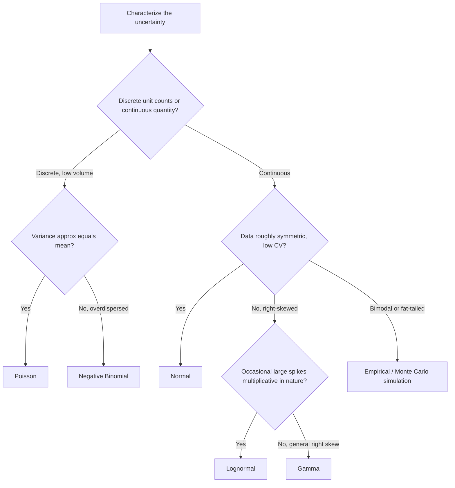

## Probability Distributions for Modeling Uncertainty

### Overview

Safety stock formulas require an assumption about the shape of the underlying uncertainty — not just its mean and standard deviation, but the full probability distribution, since the service-level factor $z$ and its analogues are derived from distributional properties (tail area, skewness, discreteness). Selecting an inappropriate distribution is one of the most common sources of systematic error in inventory models, independent of whether the mean and variance are estimated correctly. This topic surveys the distributions most commonly used to model demand, lead time, and combined uncertainty in inventory systems.

### The Normal Distribution

**Definition**

The standard default distribution in classical inventory theory, characterized fully by its mean $\mu$ and standard deviation $\sigma$, symmetric around the mean.

**Key Points**

- Underlies the canonical safety stock formula $SS = z\sigma\sqrt{L}$, where $z$ is the standard normal deviate for the target service level
- Justified theoretically by the Central Limit Theorem when demand over a period is the sum of many small, independent customer transactions
- Symmetric — implies equal probability of overshoot and undershoot around the mean, which is a poor fit whenever real demand is skewed (e.g., mostly small orders with occasional very large ones)
- Allows negative values in the tail, which is physically meaningless for demand or lead time, though this is often an acceptable approximation error when the coefficient of variation ($\sigma/\mu$) is low

**When Appropriate**

- High-volume, high-frequency demand items where many independent customers contribute to aggregate demand
- Demand with low-to-moderate coefficient of variation (roughly CV < 0.5 as a practical rule of thumb) — [Inference] this threshold is a common practitioner heuristic rather than a strict mathematical boundary, and appropriateness should be checked against actual data fit

### The Poisson Distribution

**Definition**

Models the count of discrete, independent events (unit demands) occurring in a fixed interval, characterized by a single parameter $\lambda$ (both the mean and variance of the distribution).

**Key Points**

- Appropriate for slow-moving, low-volume, discrete-unit demand — the "many small transactions" assumption behind the normal approximation breaks down when actual unit counts per period are low (e.g., average demand of 2–3 units/day)
- Variance equals the mean by construction ($\sigma^2 = \lambda$), which is a strong and sometimes unrealistic constraint — real demand often shows variance exceeding the mean (overdispersion)
- Naturally non-negative and integer-valued, avoiding the normal distribution's physically-meaningless negative-tail problem
- Commonly used for spare parts, service parts, and slow-moving SKUs in MRO (maintenance, repair, operations) inventory

### The Negative Binomial Distribution

**Definition**

A discrete distribution modeling count data similarly to Poisson, but with an additional parameter allowing variance to exceed the mean (overdispersion) — often derived as a Poisson process where the rate $\lambda$ itself varies according to a Gamma distribution.

**Key Points**

- Addresses the Poisson distribution's key limitation: real intermittent demand frequently shows variance greater than the mean, which negative binomial can capture and Poisson cannot
- Widely used in modern spare-parts and intermittent-demand inventory models as a more realistic alternative to Poisson
- Requires estimating two parameters (rather than Poisson's one), increasing data requirements and estimation complexity

### The Gamma Distribution

**Definition**

A continuous, right-skewed distribution defined on non-negative values, parameterized by shape and scale parameters, capable of representing a wide range of distributional shapes from near-exponential to near-normal.

**Key Points**

- Frequently used to model lead time, since lead times are strictly non-negative and often right-skewed (most orders arrive close to the typical time, but a tail of unusually late shipments pulls the distribution rightward)
- Also used to model demand over lead time in continuous-review models as an alternative to the normal approximation, particularly when demand is itself skewed
- The exponential distribution is a special case of gamma (shape parameter = 1), sometimes used for simple lead-time modeling when a single rate parameter suffices

### The Lognormal Distribution

**Definition**

A continuous distribution where the logarithm of the variable is normally distributed — inherently right-skewed and strictly positive.

**Key Points**

- Common choice for modeling demand and lead time in contexts with occasional large spikes (a multiplicative rather than additive error structure) — e.g., promotional demand surges, or lead times affected by rare but severe delays
- Avoids the normal distribution's negative-tail problem entirely by construction
- Parameter estimation is more involved than normal (requires working with log-transformed data), and interpretation of parameters is less intuitive to practitioners than mean/standard deviation

### The Empirical (Historical) Distribution

**Definition**

Using the actual observed historical distribution of demand or lead time directly — via bootstrapping, historical simulation, or direct percentile lookup — rather than fitting to any named theoretical distribution.

**Key Points**

- Avoids distributional-assumption risk entirely: no need to verify normality, skewness fit, or parameter estimation validity
- Particularly valuable for lead time distributions that are bimodal or fat-tailed (e.g., customs-clearance-driven bimodality discussed under lead time uncertainty), where no simple named distribution fits well
- Requires substantial historical data to populate tail percentiles reliably — sparse data in the tail (rare but important extreme events) is a key weakness, since the empirical distribution cannot represent outcomes outside the observed historical range
- Increasingly practical given modern computational tools (Monte Carlo simulation, bootstrap resampling) that were historically impractical for manual calculation

### Compound/Combined Distributions

**Definition**

Distributions arising from combining a demand-count distribution with a demand-per-transaction-size distribution, or combining separate demand and lead-time distributions into a single demand-over-lead-time distribution.

**Key Points**

- Relevant when both the *number* of demand transactions and the *size* of each transaction are random (e.g., number of customer orders per day is Poisson, but order size itself varies) — this compound structure generally produces a more overdispersed, right-skewed result than either component alone
- The combined demand-over-lead-time distribution used in most safety stock formulas is itself technically a compound distribution (a mixture over the lead-time distribution of demand distributions), though the standard formula $\sigma_{dL} = \sqrt{L\sigma_d^2 + \bar{d}^2\sigma_L^2}$ is a normal-approximation shortcut to the true compound distribution's variance, not an exact derivation for arbitrary component distributions

### Distribution Selection Guide

| Uncertainty Characteristic | Recommended Distribution | Why |
| --- | --- | --- |
| High-volume, low CV demand | Normal | CLT justification, simple $z$-based formula |
| Low-volume, discrete-unit demand | Poisson | Discrete, non-negative, single-parameter |
| Discrete demand with overdispersion ($\sigma^2 > \mu$) | Negative Binomial | Captures excess variance Poisson cannot |
| Right-skewed continuous lead time | Gamma | Non-negative, flexible skew |
| Demand/lead time with rare large spikes | Lognormal | Multiplicative error structure, strictly positive |
| Bimodal or fat-tailed lead time (e.g., customs delay) | Empirical/simulation | No theoretical distribution fits well |
| Complex, multi-source combined uncertainty | Empirical/Monte Carlo simulation | Avoids compounding distributional-assumption errors |

### Decision Flow for Distribution Selection

### Consequences of Distributional Misspecification

**Key Points**

- Applying a normal-distribution $z$-factor to genuinely skewed or discrete low-volume demand tends to understate the required buffer in the right tail (where stockout risk actually concentrates) while overstating symmetric protection on the left tail, which is of little practical value since negative demand cannot occur
- Using Poisson for overdispersed real-world demand systematically understates required safety stock, since it assumes less variance than actually exists
- [Inference] In practice, many ERP and inventory-planning software packages default to normal-distribution assumptions regardless of underlying data characteristics, making distributional fit-checking (e.g., via goodness-of-fit tests, Q-Q plots, or simple CV/skewness inspection) a manual due-diligence step rather than something handled automatically by off-the-shelf tools

### Practical Fit-Checking Approach

**Key Points**

- Compute the coefficient of variation ($CV = \sigma/\mu$) as a first-pass screen — low CV supports normal approximation, high CV suggests skewed alternatives
- Compare sample skewness and kurtosis against the theoretical values for candidate distributions
- For low-volume/intermittent demand, check whether observed variance exceeds the mean (evidence against Poisson, in favor of negative binomial)
- Where feasible, use empirical/simulation-based approaches as a robustness check against whatever theoretical distribution is chosen for the closed-form formula

### Related Topics

- Central Limit Theorem justification and its breakdown conditions for low-volume demand
- Intermittent and lumpy demand forecasting (Croston's method, SBA)
- Monte Carlo simulation for inventory policy evaluation
- Service level vs. fill rate under non-normal demand distributions
- Goodness-of-fit testing for demand and lead-time data
- Combined demand-lead-time variance formula and its normal-approximation assumptions