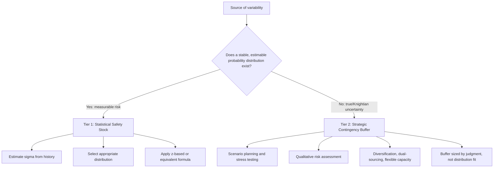

## Distinguishing Measurable Risk from True Uncertainty

### Overview

Inventory theory, like decision theory more broadly, relies on a foundational distinction first articulated systematically by economist Frank Knight: **risk** is variability that can be quantified with a known probability distribution, while **true uncertainty** (often called Knightian uncertainty) is variability for which no reliable probability distribution can be established. This distinction matters directly for safety stock design because every formula covered elsewhere in this material — $z\sigma\sqrt{L}$, Poisson-based buffers, empirical simulation — is a **risk management tool**. It is only valid for the portion of total variability that is genuinely measurable risk. Applying these same tools to true uncertainty produces false confidence, not real protection.

### Knight's Original Distinction

**Key Points**

- Frank Knight's 1921 formulation (*Risk, Uncertainty, and Profit*) separates:
  - **Risk**: randomness with a knowable probability distribution, estimable from historical frequency or theoretical derivation
  - **Uncertainty**: randomness where the set of possible outcomes, their probabilities, or both are unknown or unknowable in advance
- This is not merely a matter of degree ("more" vs. "less" variance) — it is a qualitative distinction in whether probability itself is a meaningful, estimable concept for the situation
- [Inference] Most operational inventory management literature does not use Knight's original terminology explicitly, but the practical distinction (routine variability vs. disruption/black-swan events) maps closely onto his framework and is widely applied under other names (e.g., "known unknowns" vs. "unknown unknowns")

### Measurable Risk in Inventory Systems

**Definition**

Variability that recurs with sufficient frequency and stability that historical data can support a reliable probability distribution estimate.

**Key Points**

- Random/stochastic day-to-day demand variation around a stable mean
- Routine lead-time variability from normal supplier processing and transportation variance
- Manufacturing yield variability under stable, in-control process conditions
- These sources are well-suited to formal statistical treatment: computing $\sigma_d$, $\sigma_L$, fitting an appropriate distribution (see probability distributions for modeling uncertainty), and deriving a service-level-based safety stock quantity
- The underlying assumption enabling this treatment is **stationarity** — the statistical process generating the variability is assumed stable over time, so past frequency is a valid guide to future probability

### True Uncertainty in Inventory Systems

**Definition**

Variability arising from events or regime changes for which no historical frequency distribution reliably predicts future probability — because the event is unprecedented, the underlying structure has shifted, or the reference class is too small/ambiguous to support frequentist estimation.

**Key Points**

- Structural demand shifts from unprecedented market disruption, novel competitor entry, or fundamental shifts in consumer behavior
- Macroeconomic and geopolitical shocks (discussed under demand uncertainty) and force majeure supply disruptions (discussed under lead time and yield uncertainty) — both explicitly flagged elsewhere as poorly suited to standard $\sigma$-based formulas
- Genuinely novel product categories with no comparable historical analog
- Supply chain structural breaks (a key supplier's business model changing, a new regulatory regime with no precedent) where the very shape of possible outcomes, not just their probabilities, is unknown
- Applying a computed $z\sigma\sqrt{L}$ safety stock to protect against this category is a **category error** — the formula answers "how much buffer is needed against known variability?" not "how much buffer is needed against the possibility that the situation itself changes?"

### Why the Distinction Is Operationally Critical

**Key Points**

- Statistical safety stock formulas implicitly assume the historical sample used to estimate $\sigma$ is representative of the future — this assumption is reasonable for measurable risk and false by definition for true uncertainty
- Treating a true-uncertainty event as if it were measurable risk (e.g., extending the historical lookback window to include a rare disruption, then computing $\sigma$ as usual) tends to distort the *routine* buffer without actually protecting against the *next* disruption, since the next disruption is unlikely to resemble the last one closely enough for the inflated variance to be the right size or shape of protection
- Conversely, ignoring true uncertainty entirely and sizing inventory purely off statistical risk formulas leaves an organization structurally exposed to exactly the events most capable of causing severe stockouts or write-offs

### A Two-Tier Framework for Inventory Protection

**Key Points**

- **Tier 1 — Statistical safety stock**: sized using $z\sigma\sqrt{L}$-family formulas (or their Poisson/gamma/empirical-distribution variants) against measurable, recurring demand/lead-time/yield risk. Optimized for cost-efficiency at a target service level.
- **Tier 2 — Strategic/contingency buffer**: sized using scenario planning, stress testing, and qualitative risk assessment against true uncertainty. Not derived from a probability distribution, but from judgment about plausible disruption scenarios and their business impact.
- These two tiers are conceptually and computationally separate — conflating them (e.g., trying to derive a single $\sigma$ that "covers everything, including the unknown") is the central practical error this distinction is meant to prevent

### Diagnostic Questions to Classify a Source

**Key Points**

- Has this type of variation occurred repeatedly, under comparable conditions, enough times to estimate a stable frequency? → supports treatment as measurable risk
- Is the underlying process (demand generation, supplier operations, transportation network) structurally the same as when the historical data was collected? → if no, historical $\sigma$ may not apply even to a recurring-seeming event
- Is the event a matter of "how much/how often" (risk) or "whether the rules of the game have changed" (uncertainty)? → the former is statistically modelable, the latter generally is not
- Would extending the lookback window to include this event materially distort routine-period variance estimates? → if yes, this is a signal the event belongs in a separate contingency analysis rather than the routine $\sigma$ calculation

### Practical Consequences for Safety Stock Governance

**Key Points**

- Organizations should maintain separate governance processes for the two tiers: routine safety stock recalculation (data-driven, often automated/system-generated) versus strategic buffer review (periodic, judgment-driven, typically involving supply chain risk management or executive review rather than a formula)
- Historical outlier events (e.g., a pandemic-driven demand spike, a major supplier bankruptcy) should generally be **excluded** from routine $\sigma$ recalculation once the disruption passes, and instead documented as inputs to scenario planning — this is the practical implementation of keeping the two tiers separate
- [Inference] A common, though imperfect, practitioner heuristic is that if an event's probability of recurrence and impact can both be reasonably estimated (even roughly), it likely belongs in a risk-treatment framework (sometimes with a fattened-tail distribution or explicit scenario weighting); if either probability or impact is fundamentally unknowable in advance, it belongs in contingency/resilience planning rather than any inventory formula

### Relationship to Broader Risk Management Concepts

**Key Points**

- This distinction parallels the finance and risk management concept of distinguishing diversifiable/idiosyncratic risk from systemic or tail risk requiring different hedging tools
- It also parallels the "known unknowns" vs. "unknown unknowns" framing common in project and program risk management
- Modern supply chain resilience literature increasingly frames this as the difference between **efficiency-optimized inventory** (Tier 1, minimizing holding cost at a target service level) and **resilience-oriented buffer** (Tier 2, protecting against disruption regardless of statistical cost-optimality) — reflecting a broader post-2020 industry shift toward explicitly budgeting for both simultaneously rather than treating resilience buffer as a formula output

### Related Topics

- Scenario planning and stress testing methodologies for supply chain risk
- Black swan events and fat-tailed risk in supply chain management
- Efficiency vs. resilience trade-offs in inventory strategy
- Strategic/contingency stock vs. statistical safety stock budgeting
- Supply chain risk management frameworks (e.g., SCRM maturity models)
- Historical outlier treatment in demand and lead-time data cleansing