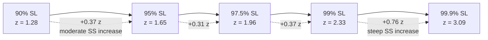

## Safety Stock and Service Level Relationship

### Overview

Safety stock is the buffer inventory held above expected demand during lead time, and it exists specifically to absorb variability. Service level is the probability (or fill-rate target) that a company chooses not to stock out during a replenishment cycle. The two are tied together through statistics: safety stock is the physical quantity, and service level is the probability target that determines how large that quantity needs to be.

Because demand and lead time are rarely constant, any inventory system that plans only for the *average* demand will stock out roughly half the time. Safety stock shifts the reorder point upward to cover the variability above the mean, and the amount of that shift is controlled directly by the desired service level.

### Core Relationship

The general safety stock formula is:

$$SS = z \cdot \sigma_{dLT}$$

Where:

- $SS$ = safety stock quantity
- $z$ = the z-score (standard normal deviate) corresponding to the desired service level
- $\sigma_{dLT}$ = standard deviation of demand during lead time

The service level determines $z$ through the cumulative standard normal distribution. Higher desired service level → larger $z$ → more safety stock. The relationship is **non-linear**: each additional percentage point of service level near the top of the distribution (e.g., 99% → 99.9%) requires a disproportionately larger increase in safety stock than the same percentage-point increase lower down (e.g., 90% → 91%).

### Type of Service Level Matters

There are two distinct definitions of "service level" commonly used in inventory theory, and conflating them is a frequent source of error.

**Cycle service level ($P_1$)**

The probability that a replenishment cycle does *not* stock out at all, i.e., that on-hand inventory doesn't hit zero before the next order arrives. This maps directly to the z-score via the standard normal distribution:

$$P_1 = \Phi(z)$$

**Fill rate ($P_2$)**

The proportion of *demand units* satisfied directly from stock, not the proportion of cycles without stockout. Fill rate accounts for the *magnitude* of a stockout, not just its occurrence, and requires the expected shortage per cycle (using the unit normal loss function $L(z)$), not just $z$ directly.

$$P_2 = 1 - \frac{\sigma_{dLT} \cdot L(z)}{Q}$$

Where $Q$ is order quantity and $L(z)$ is the standard normal loss function.

[Inference] Practitioners often quote a "99% service level" without specifying which definition applies, and the resulting safety stock can differ substantially depending on which one is meant — this ambiguity is a common source of miscommunication between planning and finance teams.

### Z-Score Table for Common Cycle Service Levels

| Service Level ($P_1$) | z-score |
| --- | --- |
| 50% | 0.00 |
| 80% | 0.84 |
| 85% | 1.04 |
| 90% | 1.28 |
| 95% | 1.65 |
| 97.5% | 1.96 |
| 99% | 2.33 |
| 99.5% | 2.58 |
| 99.9% | 3.09 |

### Computing $\sigma_{dLT}$

When both demand and lead time vary independently (the general case), the combined standard deviation during lead time is:

$$\sigma_{dLT} = \sqrt{LT \cdot \sigma_d^2 + \bar{d}^2 \cdot \sigma_{LT}^2}$$

Where:

- $LT$ = average lead time
- $\sigma_d$ = standard deviation of demand per period
- $\bar{d}$ = average demand per period
- $\sigma_{LT}$ = standard deviation of lead time

If lead time is constant (no variability), this collapses to:

$$\sigma_{dLT} = \sigma_d \sqrt{LT}$$

### Worked Example

A distributor sells a SKU with:

- Average daily demand $\bar{d} = 50$ units, $\sigma_d = 10$ units
- Average lead time $LT = 6$ days, $\sigma_{LT} = 1.5$ days
- Target cycle service level: 95% → $z = 1.65$

**Step 1 — Combined variability:**

$$\sigma_{dLT} = \sqrt{6 \cdot 10^2 + 50^2 \cdot 1.5^2} = \sqrt{600 + 5625} = \sqrt{6225} \approx 78.9$$

**Step 2 — Safety stock:**

$$SS = 1.65 \times 78.9 \approx 130.2 \Rightarrow 131 \text{ units}$$

**Step 3 — Reorder point:**

$$ROP = \bar{d} \cdot LT + SS = (50 \times 6) + 131 = 431 \text{ units}$$

Raising the target to 99% ($z = 2.33$) changes only $SS$:

$$SS = 2.33 \times 78.9 \approx 183.9 \Rightarrow 184 \text{ units}$$

A 4-point increase in service level (95% → 99%) increased safety stock by roughly 40%, illustrating the non-linear cost curve of chasing high service levels.

### The Diminishing-Returns Curve

The z-score (and therefore safety stock) accelerates sharply as service level approaches 100%, since the normal distribution's tail thins out asymptotically. This is why most operations target a "sweet spot" — commonly 95–98% for standard items — rather than pursuing near-100% availability, which carries disproportionate holding cost for diminishing stockout-risk reduction.

<svg xmlns="http://www.w3.org/2000/svg" viewBox="0 0 640 380">
<text x="320" y="24" text-anchor="middle" font-size="15" font-weight="bold" fill="#1a1a1a">Safety Stock vs. Service Level (svg_diagram)</text>
<line x1="70" y1="320" x2="600" y2="320" stroke="#333" stroke-width="1.5" />
<line x1="70" y1="320" x2="70" y2="50" stroke="#333" stroke-width="1.5" />

<text x="335" y="355" text-anchor="middle" font-size="12" fill="#333">Cycle Service Level (%)</text>

<text x="25" y="185" text-anchor="middle" font-size="12" fill="#333" transform="rotate(-90 25 185)">Safety Stock (units)</text>

<text x="70" y="335" font-size="10" text-anchor="middle" fill="#555">80</text>

<text x="180" y="335" font-size="10" text-anchor="middle" fill="#555">90</text>

<text x="290" y="335" font-size="10" text-anchor="middle" fill="#555">95</text>

<text x="400" y="335" font-size="10" text-anchor="middle" fill="#555">99</text>

<text x="510" y="335" font-size="10" text-anchor="middle" fill="#555">99.5</text>

<text x="590" y="335" font-size="10" text-anchor="middle" fill="#555">99.9</text>

<path d="M 70 300 Q 200 280, 290 250 T 400 190 Q 480 140, 510 100 T 590 55" fill="none" stroke="`#2563eb`" stroke-width="2.5" />

<circle cx="70" cy="300" r="4" fill="#2563eb" />
<circle cx="180" cy="270" r="4" fill="#2563eb" />
<circle cx="290" cy="250" r="4" fill="#2563eb" />
<circle cx="400" cy="190" r="4" fill="#2563eb" />
<circle cx="510" cy="100" r="4" fill="#2563eb" />
<circle cx="590" cy="55" r="4" fill="#2563eb" />

<text x="600" y="60" font-size="10" fill="`#dc2626`" text-anchor="end">steep climb</text>

<text x="80" y="295" font-size="10" fill="`#059669`">gradual climb</text>

</svg>

### Practical Implications

**Key Points**

- Safety stock and service level are causally linked: service level is the *input* (policy decision), safety stock is the *output* (physical quantity)
- Cycle service level (probability of no stockout) and fill rate (percentage of demand met) are different metrics that produce different safety stock requirements for the same target percentage
- The relationship is convex — small service level increases near 99%+ produce large inventory cost increases
- Demand variability ($\sigma_d$) and lead time variability ($\sigma_{LT}$) both independently inflate $\sigma_{dLT}$, and lead time variability is often the larger and more overlooked contributor since it's scaled by $\bar{d}^2$
- Service level targets should be set per SKU class (e.g., via ABC/XYZ segmentation) rather than uniformly, since uniform high service levels overspend on low-value or low-variability items

**Example**

A retailer segments SKUs by criticality: A-items (high revenue impact) get 99% service level, C-items (low impact, substitutable) get 90%. This avoids applying the steep end of the z-curve to inventory that doesn't warrant it.

### Common Pitfalls

- Applying a fill-rate target's percentage directly as a $z$-score lookup (they are not interchangeable — fill rate requires the loss function, not the raw CDF)
- Ignoring lead time variability and computing $\sigma_{dLT}$ from demand variance alone, which understates required safety stock whenever supplier lead times are inconsistent
- Assuming demand is normally distributed for slow-moving or intermittent-demand SKUs; for such items, the normal-distribution-based formula tends to be inappropriate, and Poisson- or negative-binomial-based methods are typically preferred [Inference: the degree of error depends on how intermittent the actual demand pattern is]
- Treating service level as a one-time setting rather than revisiting it as demand variance, supplier reliability, or holding costs change over time

**Next Steps**

- Fill rate vs. cycle service level: derivation using the unit normal loss function
- Reorder point (ROP) calculation incorporating safety stock
- Demand distribution assumptions: normal vs. Poisson vs. negative binomial for intermittent demand
- Multi-echelon safety stock allocation
- Safety stock under non-normal lead time distributions (e.g., gamma-distributed lead times)
- Cost-based optimization: balancing holding cost against stockout cost to select an economically optimal service level rather than an arbitrary target