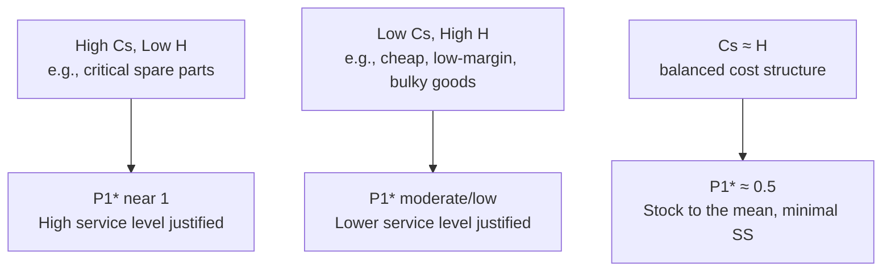

## Cost Trade-off Between Overstock and Stockout

### Overview

Every safety stock decision is fundamentally an economic balancing act between two opposing cost categories: the cost of holding too much inventory (overstock) and the cost of holding too little (stockout). Setting safety stock purely by a service-level target, as in the previous section, ignores whether that target is *economically justified*. This section addresses the cost-based approach: choosing safety stock (and implicitly, service level) by minimizing the sum of holding cost and shortage cost, rather than picking an arbitrary percentage.

### The Two Cost Categories

**Overstock (holding) costs**

Costs incurred from carrying excess inventory beyond what is needed to meet demand:

- Capital cost (opportunity cost of cash tied up in inventory)
- Storage/warehousing cost (space, utilities, handling)
- Insurance and taxes on inventory value
- Obsolescence, spoilage, or shrinkage risk
- Markdown risk for perishable or fashion/seasonal goods

Typically expressed as an annual **holding cost rate** $H$, often 15–30% of unit cost per year depending on industry, applied per unit per period.

**Stockout (shortage) costs**

Costs incurred when demand exceeds available stock:

- Lost sale margin (if the customer buys elsewhere, one-time)
- Cost of expediting/emergency replenishment
- Backorder handling costs
- Customer goodwill erosion and long-term churn risk (often the largest but hardest to quantify)
- Contractual penalties (common in B2B and government supply contracts)

Denoted $C_s$, the shortage cost per unit short.

### The Total Cost Function

$$TC(SS) = H \cdot SS + C_s \cdot E[\text{shortage} \mid SS]$$

Where:

- $H$ = holding cost per unit per period
- $SS$ = safety stock quantity (decision variable)
- $C_s$ = shortage cost per unit
- $E[\text{shortage} \mid SS]$ = expected shortage quantity per cycle given safety stock level $SS$

The optimal safety stock is the value that minimizes $TC(SS)$ — where the marginal cost of adding one more unit of safety stock (extra holding cost) equals the marginal reduction in expected shortage cost it buys.

### Critical Ratio (Newsvendor-Derived Optimal Service Level)

Rather than solving the cost function directly, the classical approach (borrowed from the newsvendor model) derives the *economically optimal* cycle service level directly from the cost ratio:

$$P_1^* = \frac{C_s}{C_s + H}$$

This is the **critical ratio**. It says: the optimal probability of *not* stocking out equals the shortage cost's share of total marginal cost. Once $P_1^*$ is known, the corresponding $z$-score is found from the standard normal table (as in the previous section), and safety stock follows as usual:

$$SS^* = z(P_1^*) \cdot \sigma_{dLT}$$

This single formula is what connects this chapter's cost-based reasoning back to the statistical safety stock formula — the critical ratio is how an economically justified service level target is derived, rather than assumed.

### Worked Example

A retailer stocks a SKU with:

- Unit cost: $40
- Annual holding cost rate: 25% → $H = \$10$/unit/year
- Shortage cost per unit (lost margin + goodwill estimate): $C_s = \$60$
- $\sigma_{dLT} = 78.9$ units (reusing the prior section's example)

**Step 1 — Critical ratio:**

P_1^* = \frac{60}{60 + 10} = \frac{60}{70} \approx 0.857 \text{ (85.7%)}

**Step 2 — Corresponding z-score:**

Interpolating from the standard normal table, $z \approx 1.07$ for $P_1 = 0.857$.

**Step 3 — Optimal safety stock:**

$$SS^* = 1.07 \times 78.9 \approx 84.4 \Rightarrow 85 \text{ units}$$

Compare this to the arbitrary 95% target from the prior section ($SS = 131$ units) — the cost-optimal policy here actually calls for *less* safety stock than a flat 95% rule, because the holding cost is relatively high compared to shortage cost for this SKU. [Inference] This divergence is the core argument for cost-based safety stock policy over uniform service-level targets: a flat percentage ignores each SKU's specific cost structure.

### Sensitivity of the Critical Ratio

The critical ratio makes explicit why different SKU categories warrant different service levels: high-margin, hard-to-substitute, or contractually penalized items justify high safety stock; low-margin, bulky, or easily substituted items do not.

### Cost Curve Visualization

<svg xmlns="http://www.w3.org/2000/svg" viewBox="0 0 640 380">
<text x="320" y="24" text-anchor="middle" font-size="15" font-weight="bold" fill="#1a1a1a">Holding Cost vs. Shortage Cost vs. Total Cost (svg_diagram)</text>
<line x1="70" y1="320" x2="600" y2="320" stroke="#333" stroke-width="1.5" />
<line x1="70" y1="320" x2="70" y2="50" stroke="#333" stroke-width="1.5" />

<text x="335" y="355" text-anchor="middle" font-size="12" fill="#333">Safety Stock Level (units)</text>

<text x="25" y="185" text-anchor="middle" font-size="12" fill="#333" transform="rotate(-90 25 185)">Cost ($)</text>

<line x1="70" y1="300" x2="600" y2="70" stroke="#dc2626" stroke-width="2" />
<text x="605" y="70" font-size="10" fill="#dc2626">Holding Cost</text>
<path d="M 70 60 Q 200 100, 330 200 T 600 300" fill="none" stroke="#f59e0b" stroke-width="2" />
<text x="90" y="55" font-size="10" fill="#f59e0b">Shortage Cost</text>
<path d="M 70 150 Q 200 100, 300 105 T 450 170 Q 550 230, 600 290" fill="none" stroke="#2563eb" stroke-width="2.5" />
<text x="380" y="95" font-size="10" fill="#2563eb" font-weight="bold">Total Cost</text>
<circle cx="305" cy="103" r="5" fill="#059669" />
<text x="315" y="100" font-size="10" fill="#059669" font-weight="bold">Optimal SS*</text>
<line x1="305" y1="103" x2="305" y2="320" stroke="#059669" stroke-width="1" stroke-dasharray="4,3" />
</svg>

The total cost curve is U-shaped (or approximately so): too little safety stock incurs high expected shortage cost, too much incurs excessive holding cost. The minimum of the total cost curve corresponds to the critical-ratio-derived $SS^*$.

### Refinements and Real-World Complications

**Key Points**

- Shortage cost $C_s$ is the hardest input to estimate in practice — lost-sale margin is measurable, but goodwill/churn effects are not, and are often approximated via managerial judgment or customer-loss regression models
- The critical ratio assumes shortage cost is *linear* per unit short; in reality, costs can be stepped (e.g., a contractual penalty triggers only past a threshold) or nonlinear
- For make-to-order or B2B contracts, $C_s$ may include explicit service-level agreement (SLA) penalty clauses, which make the ratio far more tractable to compute precisely
- Overstock cost should include **obsolescence risk**, which rises non-linearly for products with short lifecycles (electronics, fashion, perishables) — a simple percentage-of-cost holding rate can understate true overstock risk for these categories
- The model implicitly assumes a single-period or single-cycle framing (newsvendor-style); multi-period inventory with continuous review requires the $\sigma_{dLT}$-based reorder point framing layered on top, as shown in the worked example

**Example**

A hospital pharmacy stocks a life-critical drug with a near-infinite effective $C_s$ (a stockout could mean patient harm) against a low $H$ (drug cost is modest and shelf life is long). The critical ratio approaches 1, justifying near-100% service level and correspondingly large safety stock — consistent with the earlier point that steep-tail z-scores are appropriate only when shortage cost truly justifies it.

**Next Steps**

- Newsvendor model: full derivation and single-period optimal order quantity
- Estimating shortage cost empirically (lost-sale surveys, churn regression, SLA penalty schedules)
- Multi-echelon cost trade-offs (where holding cost differs by stocking location)
- Service-level-differentiated safety stock policy by ABC/XYZ segmentation
- Incorporating obsolescence and perishability into the holding cost term
- Stochastic dynamic programming approaches for multi-period safety stock optimization