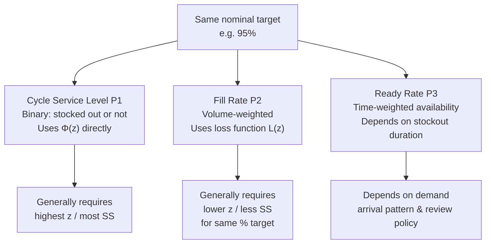

## Cycle Service Level versus Fill Rate versus Ready Rate

### Overview

"Service level" is used loosely in inventory practice to mean at least three distinct, non-interchangeable metrics: cycle service level ($P_1$), fill rate ($P_2$), and ready rate (sometimes called volume fill rate or time-based availability). Each answers a different question about stockout performance, uses a different unit of measurement, and — critically — produces a different required safety stock for the *same* nominal percentage target. Confusing them is one of the most common and costly errors in safety stock design, since a "99%" target under one definition can correspond to a very different physical inventory quantity than "99%" under another.

### The Three Metrics Defined

**Cycle service level ($P_1$) — probability of no stockout per cycle**

The probability that a full replenishment cycle (order-to-order interval) completes *without* the stock position hitting zero at any point.

$$P_1 = P(\text{demand during lead time} \leq ROP) = \Phi(z)$$

This is a **binary, cycle-level** measure — it doesn't care whether the stockout was 1 unit short or 1,000 units short; a cycle either stocked out or it didn't.

**Fill rate ($P_2$) — proportion of units satisfied directly from stock**

The fraction of *total demand volume* met immediately from on-hand inventory, without backorder or delay.

$$P_2 = 1 - \frac{E[\text{shortage per cycle}]}{Q}$$

Using the standard normal loss function $L(z)$ and lead-time demand standard deviation $\sigma_{dLT}$:

$$E[\text{shortage per cycle}] = \sigma_{dLT} \cdot L(z)$$

$$P_2 = 1 - \frac{\sigma_{dLT} \cdot L(z)}{Q}$$

Where $Q$ is the order quantity (or EOQ). Fill rate is a **volume-weighted, continuous** measure — it directly reflects the magnitude of shortages, not just their occurrence.

**Ready rate ($P_3$) — probability of being in stock at a random point in time**

The probability that, at an arbitrary moment (not tied to a specific cycle), on-hand inventory is greater than zero. This is a **time-weighted availability** measure, relevant for systems with continuous demand arrival (e.g., retail shelf availability) rather than discrete order cycles.

$$P_3 \approx 1 - \frac{E[\text{stockout duration per cycle}]}{\text{cycle length}}$$

Ready rate is most meaningful in continuous-review, high-frequency-demand contexts (e.g., retail shelf stock, vending, spare parts depots) where "is it available right now" matters more than "did this order cycle complete cleanly."

### Why They Diverge — Numerical Comparison

Using the running example ($\sigma_{dLT} = 78.9$, $Q = 300$ units, cycle length reused from earlier context):

| Metric | Target | Corresponding z | Notes |
| --- | --- | --- | --- |
| Cycle service level $P_1$ | 95% | 1.65 | From $\Phi^{-1}(0.95)$ directly |
| Fill rate $P_2$ | 95% | ~1.15 (lower) | Requires solving $L(z)$ iteratively — fewer standard deviations needed because shortage magnitude, not occurrence, is being bounded |
| Ready rate $P_3$ | 95% | context-dependent | Depends on stockout duration distribution, not just lead-time demand variance |

[Inference] As a rule of thumb, achieving a given fill-rate percentage typically requires a *lower* z-score (and thus less safety stock) than achieving the same percentage as a cycle service level, because fill rate only penalizes the *size* of a shortfall rather than treating any shortfall as a full failure — but the exact gap depends on the order quantity $Q$ relative to $\sigma_{dLT}$, so this should be verified numerically per SKU rather than assumed as a fixed offset.

### Solving for z Under a Fill Rate Target

Unlike cycle service level, fill rate has no closed-form inverse — the loss function $L(z)$ must be solved iteratively or via lookup table.

**Step-by-step (numerical, for $P_2 = 0.95$, $Q = 300$, $\sigma_{dLT} = 78.9$):**

1. Rearranging the fill rate formula: $L(z) = \dfrac{(1 - P_2) \cdot Q}{\sigma_{dLT}}$
2. Compute target loss: $L(z) = \dfrac{0.05 \times 300}{78.9} \approx 0.190$
3. Look up $z$ such that $L(z) \approx 0.190$ in a unit normal loss function table → $z \approx 1.14$
4. Safety stock: $SS = 1.14 \times 78.9 \approx 90.0$ units

Compare to the $P_1 = 95\%$ result from earlier ($SS = 131$ units) — a materially smaller safety stock is required to hit a 95% fill rate than a 95% cycle service level in this configuration, confirming the rule of thumb above for this specific $Q/\sigma_{dLT}$ ratio.

### Relationship Diagram

### Choosing the Right Metric by Context

**Key Points**

- Cycle service level is simplest to compute and communicate, but overstates risk severity since it treats a 1-unit shortfall the same as a total stockout
- Fill rate is the preferred metric in most commercial/retail contexts because it aligns with what customers and revenue actually experience — partial availability matters
- Ready rate is preferred for continuous-review systems and shelf-stock contexts where "can a customer buy this right now" is the operative question, rather than "did this specific order cycle avoid stockout"
- Contracts and SLAs should specify *which* metric is meant — "99% service level" is ambiguous and can lead to disputes over whether targets were met
- ERP and inventory planning systems vary in which metric they compute by default; this should always be confirmed rather than assumed when configuring reorder point logic

**Example**

A B2B distributor promises a customer "98% service level" in a contract without specifying the metric. If measured as cycle service level, a single day of stockout on a fast-moving SKU could count as a full cycle failure even if 97% of units were still delivered on time — triggering an SLA penalty despite strong practical performance. Specifying fill rate instead would better reflect the actual customer experience and avoid the dispute.

### Common Pitfalls

- Using the cycle-service-level z-score formula ($SS = z \cdot \sigma_{dLT}$) when the actual business target is a fill rate — this systematically overstocks relative to the true requirement
- Assuming ready rate and fill rate are equivalent; they are related but not identical, since ready rate is time-based and fill rate is volume-based — they converge only under specific demand-arrival assumptions [Inference]
- Reporting achieved service level using one metric while the target was set using another, making performance tracking internally inconsistent
- Ignoring that $Q$ (order quantity) directly affects the fill-rate-to-z relationship — a change in order quantity changes required safety stock for a fixed fill rate target, unlike cycle service level which is $Q$-independent

**Next Steps**

- Unit normal loss function: full table and interpolation methods
- Order quantity (EOQ) interaction with fill rate targets
- Ready rate modeling in continuous-review (s, S) systems
- Backorder vs. lost-sale assumptions and their effect on each metric's formula
- SLA contract design: selecting and defining the right service metric
- Simulation-based validation of service level achievement under non-normal demand