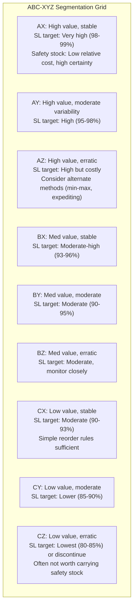

## Setting Differentiated Service Level Targets by Item Class

### Overview

Applying a single uniform service level target (e.g., "95% for everything") across an entire SKU catalog is a common but economically inefficient default. Items differ in demand volatility, margin, criticality, and holding cost, so the cost-optimal service level derived from the critical ratio ($P_1^* = C_s / (C_s + H)$) naturally differs by item. Differentiated service level targets segment the catalog into classes and assign each class a service level appropriate to its economic profile, concentrating safety stock investment where it earns the most protection per dollar.

### Segmentation Frameworks

**ABC classification (value-based)**

Segments SKUs by their contribution to revenue or profit, typically following a Pareto (80/20) pattern:

| Class | Typical % of SKUs | Typical % of Value | Characteristic |
| --- | --- | --- | --- |
| A | ~10–20% | ~70–80% | High revenue/profit impact |
| B | ~20–30% | ~15–25% | Moderate impact |
| C | ~50–70% | ~5–10% | Low individual impact, high count |

ABC alone answers "how much value is at stake" but says nothing about *predictability* — an A-item with highly volatile demand needs a different safety stock treatment than an A-item with stable demand, even though both warrant a high service level target.

**XYZ classification (variability-based)**

Segments SKUs by demand predictability, typically using the coefficient of variation:

$$CV = \frac{\sigma_d}{\bar{d}}$$

| Class | CV range (typical) | Characteristic |
| --- | --- | --- |
| X | CV < 0.5 | Stable, predictable demand |
| Y | 0.5 ≤ CV < 1.0 | Moderate variability, some trend/seasonality |
| Z | CV ≥ 1.0 | Highly erratic, intermittent, or lumpy demand |

**Combined ABC-XYZ matrix**

Crossing the two dimensions produces a 9-cell matrix that jointly captures value and predictability, which is the standard basis for differentiated service level policy:

### Assigning Targets: Two Approaches

**Approach 1 — Heuristic tiering**

Assign fixed service level bands per matrix cell based on business judgment and industry convention (as shown in the diagram above). Fast to implement, easy to communicate to stakeholders, but not rigorously cost-optimal.

**Approach 2 — Cost-driven differentiation via critical ratio**

Apply the critical ratio formula from the cost trade-off analysis (prior section) *per class* rather than per SKU, using class-representative estimates of $C_s$ and $H$:

P_1^*_{\text{class}} = \frac{C_{s,\text{class}}}{C_{s,\text{class}} + H_{\text{class}}}

A-class items typically carry a high effective $C_s$ (lost sale margin plus reputational/contractual cost), pushing $P_1^*$ toward the 95–99% range. C-class items typically have low $C_s$ relative to $H$ (thin margin, easily substituted, low holding cost impact per unit), pushing $P_1^*$ lower — sometimes to the point where carrying safety stock at all is not cost-justified.

[Inference] This cost-driven approach is more defensible analytically than heuristic tiering, but it requires reasonably reliable per-class estimates of shortage cost, which in practice are often approximated using proxies such as gross margin or SLA penalty schedules rather than direct measurement.

### Worked Example: Differentiated Policy Across Three Classes

Using $\bar{d} = 50$/day, $LT = 6$ days for all three, but differing $\sigma_{dLT}$ by class variability:

| Class | $\sigma_{dLT}$ | Target $P_1$ | $z$ | $SS = z \cdot \sigma_{dLT}$ |
| --- | --- | --- | --- | --- |
| AX (stable, critical) | 78.9 | 99% | 2.33 | 184 units |
| BY (moderate) | 120.0 | 92% | 1.41 | 169 units |
| CZ (erratic, low value) | 200.0 | 82% | 0.92 | 184 units |

Note that CZ, despite the lowest service level target, still ends up with substantial absolute safety stock because its demand variability ($\sigma_{dLT}$) is so much higher — illustrating that **service level target and resulting safety stock quantity are not proportional**; high variability can offset a low target.

### Special Handling for Z-Class (Erratic Demand) Items

Standard normal-distribution-based safety stock formulas assume roughly continuous, normally distributed demand. Z-class items — especially intermittent or lumpy demand (many zero-demand periods interspersed with spikes) — often violate this assumption. [Inference] For such items, the normal approximation can meaningfully misestimate required safety stock, and alternative approaches are generally preferred:

- **Croston's method** or its variants (SBA, TSB) for intermittent demand forecasting
- **Poisson or negative binomial demand models** instead of normal approximation
- **Min-max or periodic review with judgmental buffers** rather than formula-driven safety stock
- **Postponement/expediting strategies** instead of carrying safety stock at all, if supplier lead times allow

### Governance and Review Cadence

**Key Points**

- Segmentation is not static — SKUs migrate between ABC and XYZ classes as sales patterns, seasonality, and product lifecycle stage change, so the matrix should be recomputed periodically (commonly quarterly)
- New product introductions typically lack sufficient demand history for reliable XYZ classification and are often defaulted to a conservative (higher) service level until enough data accumulates
- End-of-life or declining products should generally be shifted toward lower service level targets as their $C_s$ (lost future sales) diminishes
- Differentiated targets should be reflected directly in the reorder point formula per SKU ($ROP = \bar{d} \cdot LT + z_{\text{class}} \cdot \sigma_{dLT}$), not applied as a post-hoc adjustment
- Stakeholder alignment matters: sales/commercial teams often push for uniformly high service levels, while finance pushes for lower holding cost — the ABC-XYZ framework gives a structured, defensible middle ground for these negotiations

**Example**

A distributor initially applies a flat 95% service level across 10,000 SKUs. After ABC-XYZ segmentation, they discover that 60% of SKUs are CZ or CY class, where a 95% target was driving disproportionate holding cost for minimal revenue protection. Reducing those classes to 85% while raising AX/AY classes to 98% reduces total inventory investment while *improving* effective availability on the SKUs that actually drive revenue.

**Next Steps**

- Croston's method and intermittent demand forecasting
- Dynamic re-segmentation and classification drift monitoring
- Multi-criteria classification (adding lead time variability or supplier risk as a third axis, e.g., ABC-XYZ-F)
- Service level target governance: review cadence and stakeholder sign-off process
- New product introduction (NPI) safety stock policy under limited demand history
- Linking differentiated service levels to reorder point automation in ERP/planning systems