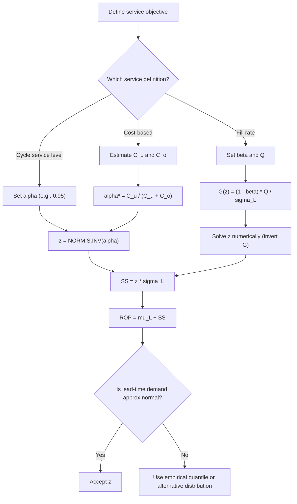

## Standard Normal Distribution and Z-Score Selection

### Overview

The **standard normal distribution** $\mathcal{N}(0,1)$ is the reference distribution that converts any normally distributed lead-time demand into a universal scale. In safety stock calculus, it provides the mapping between a **target service level** (a probability) and the **z-score** (a number of standard deviations of buffer above the mean). Selecting $z$ correctly is the step that turns a business service target into a physical inventory quantity.

**Key Points**

- Any normal variable $X\sim\mathcal{N}(\mu,\sigma^2)$ standardizes to $Z=(X-\mu)/\sigma\sim\mathcal{N}(0,1)$
- The z-score is the **inverse CDF** (quantile function) of the standard normal evaluated at the target service level: $z=\Phi^{-1}(\alpha)$
- Safety stock is $SS=z\,\sigma_L$, so $z$ is the multiplier on lead-time demand variability
- Two different service definitions (cycle service level and fill rate) lead to two different z-selection procedures
- $z$ depends only on the service target, not on demand volume, lead time, or cost, unless a cost-based optimum is used

---

### The Standard Normal Distribution

**Probability density function (PDF)**

$$\phi(z)=\frac{1}{\sqrt{2\pi}}\,e^{-z^{2}/2}$$

**Cumulative distribution function (CDF)**

$$\Phi(z)=P(Z\le z)=\int_{-\infty}^{z}\phi(t)\,dt$$

**Quantile (inverse CDF) function**

$$z_{\alpha}=\Phi^{-1}(\alpha)\quad\Longleftrightarrow\quad \Phi(z_{\alpha})=\alpha$$

**Properties**

| Property | Statement |
| --- | --- |
| Mean | $E[Z]=0$ |
| Variance | $\text{Var}(Z)=1$ |
| Symmetry | $\phi(-z)=\phi(z)$, $\Phi(-z)=1-\Phi(z)$ |
| Peak density | $\phi(0)=1/\sqrt{2\pi}\approx 0.3989$ |
| Inflection points | $z=\pm 1$ |
| Standardization | $Z=(X-\mu)/\sigma$ |
| Unstandardization | $X=\mu+z\sigma$ |

**Empirical (68-95-99.7) rule**

| Interval | Probability |
| --- | --- |
| $\mu\pm 1\sigma$ | 68.27% |
| $\mu\pm 2\sigma$ | 95.45% |
| $\mu\pm 3\sigma$ | 99.73% |

Note that safety stock uses a **one-sided** quantile ($P(Z\le z)$), not a two-sided interval. The 95% one-sided quantile is $z=1.645$, whereas the 95% two-sided interval uses $z=1.960$. Confusing the two is a common error.

---

### Visualizing $\Phi$ and the Service Level

<svg xmlns="http://www.w3.org/2000/svg" viewBox="0 0 640 320" role="img">
<title>Standard Normal Curve with One-Sided 95% Quantile (svg_diagram)</title>
<text x="320" y="24" text-anchor="middle" font-family="sans-serif" font-size="16" font-weight="bold">Standard Normal Curve with One-Sided 95% Quantile (svg_diagram)</text>
<path d="M 60 260 C 130 260, 180 245, 230 170 C 265 110, 290 70, 320 70 C 350 70, 375 110, 410 170 C 460 245, 510 260, 580 260 L 580 260 L 60 260 Z" fill="#1f77b4" fill-opacity="0.15" />
<path d="M 445 260 L 445 218 C 470 246, 520 260, 580 260 Z" fill="#d62728" fill-opacity="0.45" />
<path d="M 60 260 C 130 260, 180 245, 230 170 C 265 110, 290 70, 320 70 C 350 70, 375 110, 410 170 C 460 245, 510 260, 580 260" fill="none" stroke="#1f77b4" stroke-width="3" />
<line x1="40" y1="260" x2="600" y2="260" stroke="#333" stroke-width="2" />
<line x1="320" y1="70" x2="320" y2="260" stroke="#333" stroke-width="1.5" stroke-dasharray="5,4" />
<line x1="445" y1="218" x2="445" y2="260" stroke="#d62728" stroke-width="2" />
<text x="320" y="282" text-anchor="middle" font-family="sans-serif" font-size="12">z = 0</text>
<text x="445" y="282" text-anchor="middle" font-family="sans-serif" font-size="12">z = 1.645</text>
<text x="200" y="150" text-anchor="middle" font-family="sans-serif" font-size="13" fill="#1f77b4">Area = 0.95 (service level)</text>
<text x="540" y="235" text-anchor="middle" font-family="sans-serif" font-size="12" fill="#d62728">Tail = 0.05</text>
<text x="320" y="306" text-anchor="middle" font-family="sans-serif" font-size="11">Standard normal variable Z</text>
</svg>

---

### Selecting $z$ for a Cycle Service Level (Type I)

The **cycle service level** $\alpha$ is the probability of no stockout during a replenishment cycle:

$$\alpha=P(D_L\le ROP)=\Phi\!\left(\frac{ROP-\mu_L}{\sigma_L}\right)=\Phi(z)$$


$$z=\Phi^{-1}(\alpha),\qquad SS=z\,\sigma_L,\qquad ROP=\mu_L+z\,\sigma_L$$

**Reference table (one-sided)**

| $\alpha$ | $z_{\alpha}$ | Stockout probability $1-\alpha$ |
| --- | --- | --- |
| 50.00% | 0.000 | 50.00% |
| 75.00% | 0.674 | 25.00% |
| 80.00% | 0.842 | 20.00% |
| 85.00% | 1.036 | 15.00% |
| 90.00% | 1.282 | 10.00% |
| 92.50% | 1.440 | 7.50% |
| 95.00% | 1.645 | 5.00% |
| 97.50% | 1.960 | 2.50% |
| 98.00% | 2.054 | 2.00% |
| 99.00% | 2.326 | 1.00% |
| 99.50% | 2.576 | 0.50% |
| 99.90% | 3.090 | 0.10% |
| 99.99% | 3.719 | 0.01% |

**Worked example**

$\mu_L=450$, $\sigma_L=36$, target $\alpha=98\%$.

$$z=\Phi^{-1}(0.98)=2.054,\quad SS=2.054\times 36=73.94\approx 74\text{ units},\quad ROP=450+73.94\approx 524$$

**Key Points**

- Each step from 95% to 99% to 99.9% demands progressively larger $z$: 1.645, 2.326, 3.090
- Safety stock rises roughly $\Delta z\cdot\sigma_L$, so the cost of an extra service point grows with $\sigma_L$
- A service level of 100% would require $z=\infty$ under a normal model, which is why normal-based policies never promise it

---

### Selecting $z$ for a Fill Rate (Type II)

The **fill rate** $\beta$ is the fraction of demand satisfied from stock. With order quantity $Q$ per cycle, expected units short per cycle are:

$$ESC=\sigma_L\,G(z),\qquad G(z)=\phi(z)-z\,[1-\Phi(z)]$$

Here $G(z)$ is the **standard normal loss function** (unit normal loss integral). The fill rate is:

$$\beta=1-\frac{ESC}{Q}=1-\frac{\sigma_L\,G(z)}{Q}$$

Solving for the required loss value:

$$G(z)=\frac{(1-\beta)\,Q}{\sigma_L}$$

Then $z=G^{-1}\!\left(\dfrac{(1-\beta)Q}{\sigma_L}\right)$ must be found numerically or by table lookup, because $G$ has no closed-form inverse.

**Standard normal loss function table (selected)**

| $z$ | $G(z)$ |
| --- | --- |
| 0.00 | 0.3989 |
| 0.50 | 0.1978 |
| 1.00 | 0.0833 |
| 1.28 | 0.0475 |
| 1.50 | 0.0293 |
| 1.645 | 0.0206 |
| 2.00 | 0.0085 |
| 2.33 | 0.0034 |
| 2.50 | 0.0020 |
| 3.00 | 0.0004 |

**Worked example**

$\sigma_L=36$, $Q=400$, target fill rate $\beta=99\%$.

$$G(z)=\frac{(0.01)(400)}{36}=0.1111$$

From the table, $G(z)=0.1111$ lies between $z=0.50$ ($0.1978$) and $z=1.00$ ($0.0833$), near $z\approx 0.85$. Numerically solving gives $z\approx 0.83$.

$$SS=0.83\times 36\approx 29.9\approx 30\text{ units}$$

**Conclusion**: A 99% **fill rate** with $Q=400$ needs only $z\approx 0.83$, equivalent to a cycle service level of $\Phi(0.83)\approx 79.7\%$. A 99% **cycle service level** would need $z=2.326$ and $SS\approx 84$. The two service definitions are not interchangeable, and fill rate targets are often cheaper to achieve when $Q$ is large relative to $\sigma_L$.

---

### Selecting $z$ from Cost (Newsvendor / Critical Ratio)

When the business can quantify shortage and holding cost, choose the service level that minimizes total expected cost. For a single-period (or per-cycle) problem with underage cost $C_u$ (cost of a unit short) and overage cost $C_o$ (cost of a unit left over):

$$\alpha^{*}=\frac{C_u}{C_u+C_o},\qquad z^{*}=\Phi^{-1}(\alpha^{*})$$

**Worked example**

Unit margin lost per shortage $C_u=\$18$; holding/obsolescence cost per unit left over $C_o=\$6$.

$$\alpha^{*}=\frac{18}{18+6}=0.75,\qquad z^{*}=\Phi^{-1}(0.75)=0.674$$

In a continuous-review $(s,Q)$ policy with backorder penalty $p$ per unit short and holding cost $h$ per unit per year with annual demand $D$ and order quantity $Q$, a common optimality condition is:

$$1-\Phi(z^{*})=\frac{h\,Q}{p\,D}\quad\Longleftrightarrow\quad \Phi(z^{*})=1-\frac{hQ}{pD}$$

This form assumes a per-unit-short penalty applied to backorders [Inference: the exact form depends on the shortage cost structure, for example a per-event penalty leads to a different condition].

**Key Points**

- Cost-based $z$ is derived, not chosen: the service level is an output of the cost trade-off
- High margin products with low holding cost imply high $\alpha^{*}$, and the reverse implies low $\alpha^{*}$
- Category-level service tiers (A/B/C) approximate this logic when cost data is imperfect

---

### Selection Workflow



---

### Implementation

**Python: quantiles and loss function**

```python
import numpy as np
from scipy.stats import norm
from scipy.optimize import brentq

def z_from_cycle_service(alpha: float) -> float:
    """One-sided z for a target cycle service level."""
    return norm.ppf(alpha)

def loss_function(z: float) -> float:
    """Standard normal loss G(z) = phi(z) - z * (1 - Phi(z))."""
    return norm.pdf(z) - z * norm.sf(z)   # sf(z) = 1 - cdf(z), numerically stable

def z_from_fill_rate(beta: float, Q: float, sigma_L: float) -> float:
    """Solve G(z) = (1 - beta) * Q / sigma_L for z."""
    target = (1.0 - beta) * Q / sigma_L
    if target >= loss_function(-10):           # infeasible/degenerate guard
        return -10.0
    return brentq(lambda z: loss_function(z) - target, -5.0, 8.0)

def z_from_costs(C_u: float, C_o: float) -> float:
    """Newsvendor critical-ratio z."""
    return norm.ppf(C_u / (C_u + C_o))

print(z_from_cycle_service(0.95))                          # 1.6448...
print(z_from_cycle_service(0.99))                          # 2.3263...
print(z_from_fill_rate(beta=0.99, Q=400, sigma_L=36))      # ~0.83
print(z_from_costs(18, 6))                                 # 0.6744...
```

**Output** (approximate): `1.6449`, `2.3263`, `≈0.83`, `0.6745`. Values are subject to floating-point and solver tolerance.

**Excel / Google Sheets**



```
z (cycle service):     =NORM.S.INV(0.95)
alpha from z:          =NORM.S.DIST(1.645, TRUE)
Density at z:          =NORM.S.DIST(1.645, FALSE)
Loss function G(z):    =NORM.S.DIST(z,FALSE) - z*(1-NORM.S.DIST(z,TRUE))
Safety stock:          =NORM.S.INV(0.95) * sigma_L
```

**R**

```r
qnorm(0.95)                    # z for alpha = 0.95
pnorm(1.645)                   # alpha from z
G <- function(z) dnorm(z) - z * (1 - pnorm(z))
uniroot(function(z) G(z) - 0.1111, c(-5, 8))$root   # fill-rate z
```

---

### Inverse Approximation (No Table or Library)

For quick manual calculation, the Abramowitz and Stegun rational approximation (formula 26.2.23) gives $z$ for an upper-tail probability $p=1-\alpha$, $0<p\le 0.5$:

$$t=\sqrt{-2\ln p},\qquad z\approx t-\frac{2.515517+0.802853\,t+0.010328\,t^{2}}{1+1.432788\,t+0.189269\,t^{2}+0.001308\,t^{3}}$$

with absolute error below about $4.5\times10^{-4}$.

**Example**: $\alpha=0.95$, $p=0.05$.

$$t=\sqrt{-2\ln 0.05}=\sqrt{5.9915}=2.4477$$


$$z\approx 2.4477-\frac{2.515517+1.96517+0.06188}{1+3.50700+1.13390+0.019177}\approx 2.4477-\frac{4.54257}{5.66008}\approx 1.6451$$

This is close to the exact value 1.6449.

---

### Validity of the Normal Assumption

The $z$-score maps service to safety stock accurately only if lead-time demand is approximately normal.

| Condition | Normal assumption |
| --- | --- |
| High-volume, smooth demand, moderate $L$ | Generally reasonable (central limit effect) |
| Coefficient of variation $\sigma_L/\mu_L$ large (for example, above about 0.5) | Left tail places mass below zero; normal becomes unrealistic [Inference: threshold is a rule of thumb] |
| Intermittent or lumpy demand | Poor fit; use Poisson, negative binomial, compound Poisson, or bootstrap |
| Right-skewed demand (for example, promotions) | Normal understates upper-tail need at high service levels |
| Very high service targets ($\alpha\ge 99.9\%$) | Result depends heavily on the extreme tail, which is estimated poorly from limited history |

**Alternatives when normality fails**

- **Empirical quantile**: $ROP=\hat{Q}_{\alpha}(D_L)$ from observed lead-time demand
- **Gamma distribution**: $ROP=F^{-1}_{\text{Gamma}}(\alpha;k,\theta)$ with $k=\mu_L^2/\sigma_L^2$, $\theta=\sigma_L^2/\mu_L$ (method of moments)
- **Poisson / negative binomial**: for count data with low volume
- **Bootstrap**: resample historical windows to build the lead-time demand distribution

**Python: gamma alternative**

```python
from scipy.stats import gamma

def rop_gamma(mu_L, sigma_L, alpha):
    k = (mu_L**2) / (sigma_L**2)
    theta = (sigma_L**2) / mu_L
    return gamma.ppf(alpha, a=k, scale=theta)

print(rop_gamma(mu_L=450, sigma_L=36, alpha=0.95))
```

For low coefficients of variation the result is close to $\mu_L+1.645\sigma_L$; the gap widens as skew increases.

---

### Worked Example: Full Chain

A SKU has daily demand $\bar{d}=50$, $\sigma_d=12$, fixed lead time $L=9$ days, order quantity $Q=400$.

$$\mu_L=450,\qquad \sigma_L=12\sqrt{9}=36$$

| Service objective | $z$ | Safety stock | ROP |
| --- | --- | --- | --- |
| Cycle service level 90% | 1.282 | 46.15 | 496.15 |
| Cycle service level 95% | 1.645 | 59.22 | 509.22 |
| Cycle service level 99% | 2.326 | 83.74 | 533.74 |
| Fill rate 99% ($Q=400$) | ≈0.83 | ≈29.9 | ≈479.9 |
| Fill rate 99.9% ($Q=400$) | ≈1.90 | ≈68.4 | ≈518.4 |
| Cost-based ($C_u=18$, $C_o=6$) | 0.674 | 24.27 | 474.27 |

**Conclusion**: The same physical SKU yields safety stock ranging from about 24 to 84 units depending purely on how the service objective is defined. Selecting and documenting the service definition is as important as computing $z$.

---

### Common Pitfalls

- **One-sided vs. two-sided $z$**: using 1.960 for a 95% one-sided service target overstates safety stock; the correct value is 1.645
- **Type I vs. Type II confusion**: applying $z=\Phi^{-1}(\beta)$ to a fill rate target
- **Ignoring $Q$ in fill-rate calculations**
- **Rounding $z$ too coarsely** (for example, using 1.6 or 1.7 instead of 1.645), which shifts the effective service level noticeably at high targets
- **Assuming service level applies per period rather than per cycle**: $\alpha$ is a per-replenishment-cycle probability; annual stockout frequency is roughly (cycles per year) $\times(1-\alpha)$
- **Applying normal quantiles to intermittent demand**
- **Using the same $z$ for all SKUs** without considering class-specific value, margin, or criticality
- **Treating $z$ as a purely statistical parameter**: it embeds a business decision about acceptable risk
- **Ignoring estimation error in $\hat{\sigma}_L$**, which makes the realized service level lower than the nominal target [Inference: magnitude depends on sample size and demand stability]
- **Negative $z$**: service levels below 50% produce negative safety stock; enforce $SS\ge 0$ in practice unless intentionally under-stocking

**Annual stockout frequency example**

With 12 replenishment cycles per year and $\alpha=95\%$:

$$E[\text{stockout events per year}]=12\times 0.05=0.6$$

At $\alpha=99\%$: $12\times 0.01=0.12$ events per year, roughly one stockout event every 8 years.

---

### Sensitivity of Safety Stock to $z$

$$\frac{dSS}{d\alpha}=\sigma_L\,\frac{dz}{d\alpha}=\frac{\sigma_L}{\phi(z)}$$

Because $\phi(z)$ shrinks rapidly in the tail, marginal safety stock per service point grows sharply:

| $\alpha$ | $z$ | $\phi(z)$ | Marginal $\Delta SS$ per +1 pt of $\alpha$ (units, $\sigma_L=36$) |
| --- | --- | --- | --- |
| 90% | 1.282 | 0.1755 | ≈ 2.05 |
| 95% | 1.645 | 0.1031 | ≈ 3.49 |
| 99% | 2.326 | 0.0267 | ≈ 13.5 |
| 99.9% | 3.090 | 0.0034 | ≈ 106 |

These marginal figures are first-order approximations from $\sigma_L/\phi(z)\times 0.01$; actual increments over large steps differ.

**Conclusion**: Beyond roughly 97.5–99% cycle service, each additional point of service is very expensive in inventory. This is the quantitative basis for tiering service targets across SKU classes instead of applying a blanket high target.

---

**Related Topics**

- Standard normal loss function and expected units short per cycle
- Fill rate (Type II) vs. cycle service level (Type I) vs. ready rate
- Newsvendor model and critical ratio
- Safety stock under constant lead time and demand variability
- Safety stock under combined demand and lead time variability
- Non-normal demand models: gamma, Poisson, negative binomial, compound Poisson
- Bootstrap and empirical-quantile safety stock
- ABC/XYZ classification and service-level tiering
- Estimation error in $\sigma_L$ and safety factor adjustment
- Multi-item service constraints and Lagrangian optimization