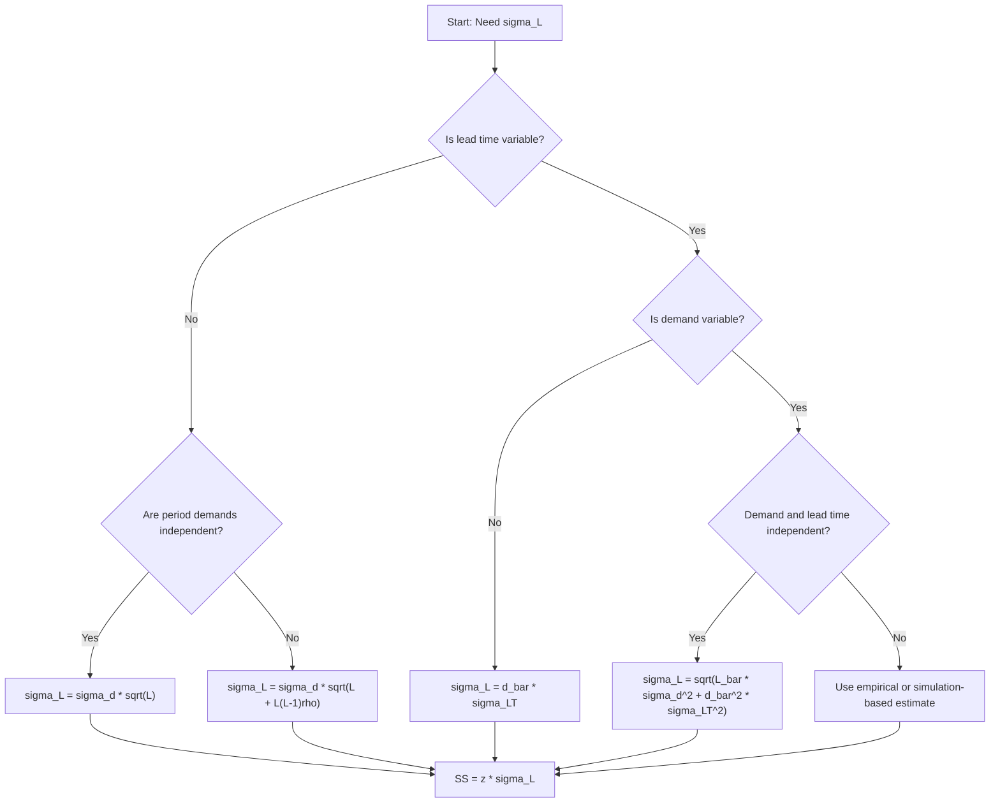

## Standard Deviation of Demand During Lead Time

### Overview

The **standard deviation of demand during lead time** (denoted $\sigma_{DLT}$ or $\sigma_L$) measures how much cumulative demand over the replenishment lead time fluctuates around its expected value. It is the central quantity in safety stock calculation because safety stock exists to absorb the *variability* of demand accumulated between placing an order and receiving it, not the average demand itself (which cycle stock and the reorder point already cover).

**Key Points**

- Demand during lead time (DLT) is a random variable: $D_L = \sum_{t=1}^{L} d_t$
- Expected DLT is $\mu_L = L\bar{d}$; its standard deviation $\sigma_L$ sizes the safety buffer
- The formula depends on whether lead time is fixed or variable, and on whether period demands are independent
- Units of $\sigma_L$ are units of product (not units per period)
- Safety stock is then $SS = z \cdot \sigma_L$, where $z$ is the service-level factor

---

### Notation

| Symbol | Meaning |
| --- | --- |
| $d_t$ | Demand in period $t$ |
| $\bar{d}$ | Mean demand per period |
| $\sigma_d$ | Standard deviation of demand per period |
| $L$ | Lead time (in the same period units as $d$) |
| $\bar{L}$ | Mean lead time |
| $\sigma_{LT}$ | Standard deviation of lead time |
| $\mu_L$ | Expected demand during lead time |
| $\sigma_L$ | Standard deviation of demand during lead time |
| $\rho$ | Correlation between demands in adjacent periods |

---

### Case 1: Constant Lead Time, Independent Demand

If lead time $L$ is fixed and per-period demands are independent and identically distributed (i.i.d.), variances add:

$$\text{Var}(D_L) = \sum_{t=1}^{L} \text{Var}(d_t) = L\sigma_d^2$$


$$\sigma_L = \sigma_d\sqrt{L}$$

This is the **square-root-of-time rule**. Doubling the lead time increases $\sigma_L$ by a factor of $\sqrt{2}\approx 1.414$, not 2.

**Example**

Weekly demand for a SKU has $\bar{d}=200$ units and $\sigma_d = 40$ units. Lead time is fixed at 4 weeks.

$$\sigma_L = 40\sqrt{4} = 80 \text{ units}$$


$$\mu_L = 4 \times 200 = 800 \text{ units}$$

**Conclusion**: Demand during the 4-week lead time is approximately $800 \pm 80$ units (one standard deviation).

---

### Case 2: Variable Lead Time, Constant Demand Rate

If demand per period is a constant $\bar{d}$ (no demand variability) but lead time varies:

$$D_L = \bar{d}\,L \quad\Rightarrow\quad \sigma_L = \bar{d}\,\sigma_{LT}$$

**Example**

$\bar{d}=200$ units/week, $\sigma_{LT}=0.5$ weeks.

$$\sigma_L = 200 \times 0.5 = 100 \text{ units}$$


---

### Case 3: Variable Demand and Variable Lead Time (Independent)

When both demand and lead time are random and independent of each other, use the **law of total variance** (compound/random-sum variance):

$$\text{Var}(D_L) = E[L]\,\text{Var}(d) + (E[d])^2\,\text{Var}(L)$$


$$\boxed{\sigma_L = \sqrt{\bar{L}\,\sigma_d^2 + \bar{d}^2\,\sigma_{LT}^2}}$$

The two terms decompose the uncertainty:

- $\bar{L}\sigma_d^2$: variance from **demand fluctuation** over the average lead time
- $\bar{d}^2\sigma_{LT}^2$: variance from **lead time fluctuation** scaled by the mean demand rate

**Derivation Sketch**

Let $D_L = \sum_{i=1}^{N} d_i$ where $N=L$ is a random count. Conditioning on $N$:

$$E[D_L \mid N] = N\bar{d}, \qquad \text{Var}(D_L \mid N) = N\sigma_d^2$$


$$\text{Var}(D_L) = E[\text{Var}(D_L\mid N)] + \text{Var}(E[D_L\mid N]) = \bar{L}\sigma_d^2 + \bar{d}^2\sigma_{LT}^2$$

**Example**

$\bar{d}=200$, $\sigma_d=40$, $\bar{L}=4$ weeks, $\sigma_{LT}=0.5$ weeks.

$$\sigma_L = \sqrt{4(40)^2 + (200)^2(0.5)^2} = \sqrt{6400 + 10000} = \sqrt{16400} \approx 128.06 \text{ units}$$

**Output**

| Component | Variance | Share |
| --- | --- | --- |
| Demand variability ($\bar{L}\sigma_d^2$) | 6,400 | 39.0% |
| Lead time variability ($\bar{d}^2\sigma_{LT}^2$) | 10,000 | 61.0% |
| **Total** | **16,400** | **100%** |
| $\sigma_L$ |  | **≈ 128.06 units** |

**Conclusion**: Even though $\sigma_{LT}$ looks small (0.5 weeks), lead time variability dominates the total risk here because it is multiplied by a large mean demand rate.

---

### Case 4: Autocorrelated Demand

If demands across periods are correlated, variances no longer simply add. For a fixed lead time $L$ and constant pairwise correlation $\rho$ between distinct periods:

$$\text{Var}(D_L) = \sigma_d^2\left[L + L(L-1)\rho\right]$$


$$\sigma_L = \sigma_d\sqrt{L + L(L-1)\rho}$$

- $\rho = 0$ recovers $\sigma_d\sqrt{L}$
- $\rho > 0$ (trending or persistent demand) **increases** $\sigma_L$ above the square-root-of-time value
- $\rho < 0$ (mean-reverting demand) **decreases** $\sigma_L$

For an AR(1) demand process with lag-1 correlation $\phi$, the exact variance uses $\text{Var}(D_L)=\sigma_d^2\left[L + 2\sum_{k=1}^{L-1}(L-k)\phi^k\right]$.

**Example**

$\sigma_d=40$, $L=4$, $\rho=0.3$ (constant pairwise, simplifying assumption).

$$\sigma_L = 40\sqrt{4 + 4(3)(0.3)} = 40\sqrt{7.6} \approx 110.27 \text{ units}$$

Compared with 80 units under independence, ignoring positive autocorrelation understates $\sigma_L$ by roughly 27%.

---

### Case 5: Forecast-Error-Based $\sigma_L$

In practice, safety stock should protect against **forecast error**, not raw demand dispersion. If a forecast is available, replace $\sigma_d$ with the standard deviation of one-period-ahead forecast error $\sigma_e$:

$$\sigma_L = \sigma_e\sqrt{L} \quad\text{(independent errors)}$$

Using $\sigma_d$ when a forecast exists (for example, seasonal or trending demand) overstates required safety stock because the predictable component of demand variation is not really uncertainty.

**Estimating $\sigma_e$ from history**

$$\sigma_e = \sqrt{\frac{1}{n-1}\sum_{t=1}^{n}(e_t - \bar{e})^2}, \qquad e_t = d_t - F_t$$

The **RMSE** (root mean squared error, which assumes unbiased forecasts) is often used as a proxy:

$$\text{RMSE} = \sqrt{\frac{1}{n}\sum_{t=1}^{n}e_t^2}$$

The **MAD**-based approximation (assuming normally distributed errors) is:

$$\sigma_e \approx 1.25 \times \text{MAD}$$

Here $\text{MAD} = \frac{1}{n}\sum |e_t|$ and the factor $\sqrt{\pi/2}\approx 1.2533$ applies only under normality [Inference: quality of the approximation degrades for skewed or heavy-tailed error distributions].

---

### Time-Unit Conversion

$\sigma_d$ and $L$ must use consistent units. To convert per-period standard deviation to a different period length (assuming independence):

$$\sigma_{\text{new}} = \sigma_{\text{old}}\sqrt{\frac{T_{\text{new}}}{T_{\text{old}}}}$$

**Example**: daily $\sigma_d = 15$ units. Weekly (7-day) $\sigma = 15\sqrt{7}\approx 39.69$ units. Lead time of 3 weeks (21 days):

$$\sigma_L = 15\sqrt{21} \approx 68.74 \text{ units}$$

**Key Points**

- Never multiply $\sigma_d$ by $L$ directly under independence; use $\sqrt{L}$
- Never mix daily $\sigma_d$ with weekly $L$
- Non-integer lead times (for example, 2.5 weeks) are handled directly by $\sqrt{L}$ under the standard formula

---

### Decision Flow for Selecting the Formula



---

### Empirical (Direct) Estimation

Instead of deriving $\sigma_L$ from component parameters, compute it **directly** from historical lead-time demand observations. For each replenishment cycle $j$, record total demand $D_{L,j}$ during the actual lead time:

$$\hat{\mu}_L = \frac{1}{m}\sum_{j=1}^{m} D_{L,j}, \qquad \hat{\sigma}_L = \sqrt{\frac{1}{m-1}\sum_{j=1}^{m}\left(D_{L,j}-\hat{\mu}_L\right)^2}$$

**Advantages**: captures correlation, seasonality, and dependence between demand and lead time automatically.

**Limitations**: requires many observed cycles $m$ (often too few for slow-moving items); overlapping windows create serial dependence that biases the estimate [Inference: sliding-window overlap typically underestimates true variance].

**Example (Python)**

```python
import numpy as np
import pandas as pd

def sigma_dlt_theoretical(d_bar, sigma_d, L_bar, sigma_LT):
    """Independent demand and lead time (Case 3)."""
    return np.sqrt(L_bar * sigma_d**2 + (d_bar**2) * sigma_LT**2)

def sigma_dlt_empirical(daily_demand: pd.Series, L: int) -> float:
    """Direct estimate from rolling non-overlapping L-day windows."""
    n_windows = len(daily_demand) // L
    windows = daily_demand.iloc[: n_windows * L].to_numpy().reshape(n_windows, L)
    totals = windows.sum(axis=1)
    return totals.std(ddof=1)

# Theoretical
print(sigma_dlt_theoretical(d_bar=200, sigma_d=40, L_bar=4, sigma_LT=0.5))
# -> 128.0624...

# Empirical (synthetic)
rng = np.random.default_rng(42)
demand = pd.Series(rng.normal(loc=28.57, scale=15.1, size=364))  # ~200/wk
print(sigma_dlt_empirical(demand, L=28))  # 4-week windows
```

**Output** (theoretical): `128.0624...`. The empirical result varies with the random seed and the number of windows (`ddof=1` applies Bessel's correction).

---

### Monte Carlo Simulation Approach

When distributions are non-normal, or demand and lead time are dependent, simulate:

```python
import numpy as np

def simulate_dlt(n=100_000, d_mu=200, d_sigma=40, L_mu=4, L_sigma=0.5, seed=1):
    rng = np.random.default_rng(seed)
    L = np.clip(rng.normal(L_mu, L_sigma, n), 0.5, None)   # truncate to positive
    # Weekly demand per unit time; scale by realized L via sqrt rule for the noise term
    mean_dlt = d_mu * L
    noise = rng.normal(0, d_sigma * np.sqrt(L))
    dlt = np.clip(mean_dlt + noise, 0, None)
    return dlt.mean(), dlt.std(ddof=1), np.percentile(dlt, [90, 95, 99])

mu, sd, pct = simulate_dlt()
print(mu, sd, pct)
```

Simulation output will approximate the analytical $\sigma_L\approx 128$; truncation at zero slightly alters it. Results vary by seed and distributional assumptions.

---

### Connection to Safety Stock and Reorder Point

$$SS = z_{\alpha}\,\sigma_L$$


$$ROP = \mu_L + SS = \bar{d}\bar{L} + z_{\alpha}\,\sigma_L$$

**Example** (continuing Case 3, target cycle service level 95%, $z_{0.95}=1.645$):

$$SS = 1.645 \times 128.06 \approx 210.66 \approx 211 \text{ units}$$


$$ROP = 800 + 211 = 1011 \text{ units}$$

**Sensitivity Comparison** (same SKU, 95% service level)

| Assumption | $\sigma_L$ | Safety Stock |
| --- | --- | --- |
| Demand variability only (Case 1) | 80.00 | ≈ 132 |
| Lead time variability only (Case 2) | 100.00 | ≈ 165 |
| Both, independent (Case 3) | 128.06 | ≈ 211 |
| Demand autocorrelation $\rho=0.3$ (Case 4) | 110.27 | ≈ 181 |

**Conclusion**: Omitting lead time variability in this example would understate safety stock by roughly 37%, exposing the SKU to far more stockouts than the nominal 95% target.

---

### Common Pitfalls

- **Wrong time base**: using weekly $\sigma_d$ with a lead time in days
- **Linear scaling**: computing $\sigma_d \times L$ instead of $\sigma_d\sqrt{L}$
- **Ignoring lead time variance**: understates $\sigma_L$ whenever supplier reliability is imperfect
- **Using $\sigma_d$ instead of forecast error $\sigma_e$**: overstates safety stock for forecastable demand
- **Assuming independence**: promotions, trends, and bullwhip effects often induce positive autocorrelation
- **Assuming demand and lead time independence**: violated when large orders lengthen supplier lead times (for example, capacity constraints); the Case 3 formula is then unreliable
- **Small samples**: $\hat{\sigma}$ from fewer than roughly 30 observations is unstable [Inference: rule-of-thumb threshold]
- **Sample vs. population**: use $n-1$ (Bessel's correction) when estimating from samples
- **Intermittent demand**: the normal-based formula performs poorly for slow-moving or lumpy items; consider Croston-type methods or bootstrap/empirical distributions
- **Review period omission**: under periodic review, replace $L$ with $L+R$ (lead time plus review period) in the formulas above

---

### Periodic Review Adjustment

Under a periodic review policy with review interval $R$, protection is required over $L+R$:

$$\sigma_{L+R} = \sqrt{(\bar{L}+R)\,\sigma_d^2 + \bar{d}^2\,\sigma_{LT}^2}$$

**Example**: $R=1$ week, other parameters as in Case 3.

$$\sigma_{L+R} = \sqrt{5(1600) + 40000(0.25)} = \sqrt{8000 + 10000} = \sqrt{18000}\approx 134.16 \text{ units}$$


---

### Behavioral Notes

- Analytical results assume the distributional and independence conditions stated in each case; real-world behavior may vary with data quality, demand patterns, and supplier behavior.
- Library behavior described here (for example, `ddof=1`) reflects standard NumPy/pandas semantics; defaults may differ across versions and libraries (`numpy.std` defaults to `ddof=0`, `pandas.Series.std` defaults to `ddof=1`).

---

**Related Topics**

- Safety stock formulas under demand-only, lead-time-only, and combined variability
- Service level metrics: cycle service level vs. fill rate ($\alpha$ vs. $\beta$ service)
- The $z$-score and standard normal loss function $G(z)$
- Forecast error metrics: MAD, MAPE, RMSE, and bias
- Lead time distributions and estimating $\sigma_{LT}$
- Correlated demand across time and the bullwhip effect
- Non-normal demand: Poisson, negative binomial, gamma, and bootstrap methods
- Intermittent demand modeling (Croston, SBA, TSB)
- Multi-echelon safety stock and risk pooling
- Periodic review $(R,S)$ and continuous review $(s,Q)$ policies