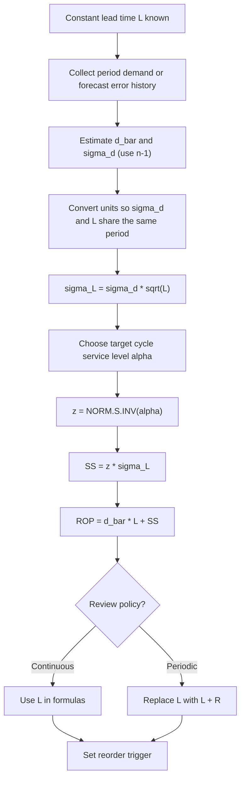

## Safety Stock Formula Under Constant Lead Time

### Overview

When the replenishment lead time $L$ is **fixed and known with certainty**, the only source of uncertainty during the replenishment window is **demand variability**. The safety stock is the buffer sized to cover demand in excess of its expected value during that window, at a chosen probability of not stocking out.

**Key Points**

- Lead time is deterministic: $\sigma_{LT} = 0$
- Demand per period is random with mean $\bar{d}$ and standard deviation $\sigma_d$
- Safety stock protects against the *deviation* of lead-time demand from its mean $\mu_L = \bar{d}L$
- Core result: $SS = z\,\sigma_d\sqrt{L}$
- The formula targets a **cycle service level** (probability of no stockout per replenishment cycle), not a fill rate

---

### Notation

| Symbol | Meaning |
| --- | --- |
| $\bar{d}$ | Mean demand per period |
| $\sigma_d$ | Standard deviation of demand per period (or of forecast error, $\sigma_e$) |
| $L$ | Constant lead time (same period units as $d$) |
| $R$ | Review interval (periodic review only) |
| $\mu_L$ | Expected demand during lead time, $\bar{d}L$ |
| $\sigma_L$ | Standard deviation of demand during lead time |
| $z$ | Standard normal quantile for the target service level |
| $\alpha$ | Target cycle service level (probability of no stockout) |
| $SS$ | Safety stock |
| $ROP$ | Reorder point |

---

### Derivation

**Step 1: Lead-time demand as a random sum.** With constant $L$ and i.i.d. period demands:

$$D_L = \sum_{t=1}^{L} d_t$$

**Step 2: Moments.**

$$E[D_L] = L\bar{d}, \qquad \text{Var}(D_L) = L\sigma_d^2 \;\Rightarrow\; \sigma_L = \sigma_d\sqrt{L}$$

**Step 3: Normal approximation.** By the central limit theorem, or by assuming normally distributed period demand, $D_L \sim \mathcal{N}(\mu_L, \sigma_L^2)$.

**Step 4: Service-level condition.** A stockout occurs if $D_L > ROP$. We require:

$$P(D_L \le ROP) = \alpha$$


$$ROP = \mu_L + z_{\alpha}\,\sigma_L, \qquad z_{\alpha} = \Phi^{-1}(\alpha)$$

**Step 5: Safety stock is the buffer above expected demand.**

$$\boxed{SS = ROP - \mu_L = z_{\alpha}\,\sigma_d\sqrt{L}}$$


$$\boxed{ROP = \bar{d}L + z_{\alpha}\,\sigma_d\sqrt{L}}$$


---

### Service Level to $z$ Mapping

| Cycle Service Level $\alpha$ | $z_{\alpha}$ |
| --- | --- |
| 80.00% | 0.842 |
| 85.00% | 1.036 |
| 90.00% | 1.282 |
| 95.00% | 1.645 |
| 97.50% | 1.960 |
| 99.00% | 2.326 |
| 99.50% | 2.576 |
| 99.90% | 3.090 |

**Key Points**

- Safety stock grows **nonlinearly** with service level: moving from 95% to 99% raises $z$ by about 41%
- Each additional "nine" of service costs progressively more inventory
- $\alpha = 50\%$ gives $z=0$ and $SS=0$: the reorder point equals mean lead-time demand, so roughly half of cycles stock out

---

### Worked Example 1: Basic Calculation

Daily demand for a SKU has $\bar{d}=50$ units and $\sigma_d = 12$ units. Lead time is a fixed 9 days. Target cycle service level is 95%.

$$\mu_L = 50 \times 9 = 450 \text{ units}$$


$$\sigma_L = 12\sqrt{9} = 36 \text{ units}$$


$$SS = 1.645 \times 36 = 59.22 \approx 60 \text{ units}$$


$$ROP = 450 + 59.22 = 509.22 \approx 510 \text{ units}$$

**Output**

| Quantity | Value |
| --- | --- |
| Mean lead-time demand $\mu_L$ | 450 |
| $\sigma_L$ | 36.00 |
| Safety stock | 59.22 → 60 |
| Reorder point | 509.22 → 510 |

**Conclusion**: Reorder when inventory position falls to 510 units. Safety stock of 60 units absorbs demand up to $\mu_L + 1.645\sigma_L$ during the lead time.

---

### Worked Example 2: Effect of Service Level

Same SKU as Example 1, comparing service targets:

| $\alpha$ | $z$ | $SS = z \times 36$ | $ROP$ |
| --- | --- | --- | --- |
| 90% | 1.282 | 46.15 | 496.15 |
| 95% | 1.645 | 59.22 | 509.22 |
| 99% | 2.326 | 83.74 | 533.74 |
| 99.9% | 3.090 | 111.24 | 561.24 |

Going from 95% to 99% costs an extra 24.52 units of safety stock (about 41% more) for a 4-point service gain.

---

### Worked Example 3: Effect of Lead Time (Square-Root Scaling)

Same SKU, 95% service level, varying constant lead time:

| $L$ (days) | $\sigma_L = 12\sqrt{L}$ | $SS = 1.645\sigma_L$ |
| --- | --- | --- |
| 1 | 12.00 | 19.74 |
| 4 | 24.00 | 39.48 |
| 9 | 36.00 | 59.22 |
| 16 | 48.00 | 78.96 |
| 36 | 72.00 | 118.44 |

Quadrupling lead time (9 → 36 days) only doubles safety stock. This is the **square-root law** of safety stock with respect to lead time.

---

### Visualizing the Buffer

<svg xmlns="http://www.w3.org/2000/svg" viewBox="0 0 640 300" role="img">
<title>Safety Stock on the Lead-Time Demand Distribution (svg_diagram)</title>
<text x="320" y="24" text-anchor="middle" font-family="sans-serif" font-size="16" font-weight="bold">Safety Stock on the Lead-Time Demand Distribution (svg_diagram)</text>
<line x1="40" y1="250" x2="600" y2="250" stroke="#333" stroke-width="2" />
<path d="M 60 250 C 130 250, 180 235, 230 160 C 265 100, 290 60, 320 60 C 350 60, 375 100, 410 160 C 460 235, 510 250, 580 250" fill="none" stroke="#1f77b4" stroke-width="3" />
<path d="M 410 160 C 460 235, 510 250, 580 250 L 580 250 L 410 250 Z" fill="#d62728" fill-opacity="0.35" />
<line x1="320" y1="60" x2="320" y2="250" stroke="#333" stroke-width="1.5" stroke-dasharray="5,4" />
<line x1="410" y1="150" x2="410" y2="250" stroke="#d62728" stroke-width="2" />
<line x1="322" y1="215" x2="408" y2="215" stroke="#2ca02c" stroke-width="2" />
<polygon points="408,215 398,210 398,220" fill="#2ca02c" />
<polygon points="322,215 332,210 332,220" fill="#2ca02c" />
<text x="320" y="270" text-anchor="middle" font-family="sans-serif" font-size="12">Mean (450)</text>
<text x="410" y="270" text-anchor="middle" font-family="sans-serif" font-size="12">ROP (509.22)</text>
<text x="365" y="207" text-anchor="middle" font-family="sans-serif" font-size="12" fill="#2ca02c">SS = 59.22</text>
<text x="500" y="225" text-anchor="middle" font-family="sans-serif" font-size="12" fill="#d62728">Stockout risk 5%</text>
<text x="320" y="290" text-anchor="middle" font-family="sans-serif" font-size="11">Demand during lead time (units)</text>
</svg>

---

### Decision Flow



---

### Periodic Review Variant

Under a periodic review system with review interval $R$ and constant lead time $L$, the stock must cover uncertainty over the **protection interval** $L+R$:

$$SS = z_{\alpha}\,\sigma_d\sqrt{L+R}$$


$$S = \bar{d}(L+R) + SS \quad\text{(order-up-to level)}$$

**Example**: $\bar{d}=50$, $\sigma_d=12$, $L=9$, $R=7$ days, $\alpha=95\%$.

$$SS = 1.645 \times 12\sqrt{16} = 1.645 \times 48 = 78.96 \approx 79 \text{ units}$$


$$S = 50 \times 16 + 78.96 = 878.96 \approx 879 \text{ units}$$

**Key Points**

- Periodic review carries more safety stock than continuous review because exposure lasts $L+R$ rather than $L$
- Continuous review is the special case $R=0$

---

### Using Forecast Error Instead of Demand Deviation

When a forecast exists, safety stock should be driven by the standard deviation of **forecast error** $\sigma_e$, since the predictable part of demand is not uncertainty:

$$SS = z_{\alpha}\,\sigma_e\sqrt{L}$$

with $e_t = d_t - F_t$ and

$$\sigma_e = \sqrt{\frac{1}{n-1}\sum_{t=1}^{n}(e_t-\bar{e})^2}$$

If forecasts are unbiased, RMSE is a reasonable proxy for $\sigma_e$. If $\bar{e}\neq 0$ (systematic bias), correct the bias first; otherwise the shortfall is not covered by a symmetric buffer.

**Caveat**: the $\sqrt{L}$ scaling assumes forecast errors are uncorrelated across periods. Errors from multi-step-ahead forecasts are typically positively correlated [Inference: this varies by forecasting method and demand pattern], in which case $\sigma_L$ exceeds $\sigma_e\sqrt{L}$ and the formula understates the required buffer.

---

### Implementation

**Python**

```python
import numpy as np
from scipy.stats import norm

def safety_stock_constant_lt(d_bar, sigma_d, L, service_level, review_period=0.0):
    """
    Safety stock and reorder point under constant lead time.

    d_bar, sigma_d : mean and std of demand per period (same period unit as L)
    L              : constant lead time
    service_level  : target cycle service level, e.g. 0.95
    review_period  : R for periodic review (0 for continuous review)
    """
    protection = L + review_period
    z = norm.ppf(service_level)
    sigma_L = sigma_d * np.sqrt(protection)
    ss = z * sigma_L
    rop_or_S = d_bar * protection + ss
    return {"z": z, "sigma_L": sigma_L, "safety_stock": ss, "rop_or_S": rop_or_S}

print(safety_stock_constant_lt(d_bar=50, sigma_d=12, L=9, service_level=0.95))
# {'z': 1.6448..., 'sigma_L': 36.0, 'safety_stock': 59.21..., 'rop_or_S': 509.21...}

print(safety_stock_constant_lt(50, 12, 9, 0.95, review_period=7))
# safety_stock ~ 78.95, rop_or_S ~ 878.95
```

**Output** (first call): `z ≈ 1.6449`, `sigma_L = 36.0`, `safety_stock ≈ 59.21`, `rop_or_S ≈ 509.21`. Small differences from the hand calculation (59.22) arise because the table rounds $z$ to 1.645 while `norm.ppf(0.95)` returns approximately 1.64485.

**Estimating $\sigma_d$ from data**

```python
import pandas as pd

daily = pd.Series([48, 55, 41, 60, 52, 39, 47, 58, 50, 44, 61, 46])
d_bar = daily.mean()
sigma_d = daily.std(ddof=1)   # pandas default is ddof=1; numpy.std default is ddof=0
print(d_bar, sigma_d)
```

**Excel / Google Sheets**



```
=NORM.S.INV(0.95) * STDEV.S(B2:B366) * SQRT(9)
```

- `NORM.S.INV(alpha)` returns $z_{\alpha}$
- `STDEV.S` applies the sample (n-1) estimator
- `SQRT(L)` applies the square-root scaling

---

### Assumptions and Validity Conditions

| Assumption | Consequence if violated |
| --- | --- |
| Lead time is truly constant | Safety stock understated; use the variable lead time formula |
| Period demands are independent | Positive autocorrelation understates $\sigma_L$; negative overstates it |
| Demand is stationary (constant $\bar{d}$, $\sigma_d$) | Trend or seasonality biases $\mu_L$ and $\sigma_L$; use forecast error instead |
| Lead-time demand is approximately normal | Poor tail accuracy for low-volume, intermittent, or skewed demand |
| $\sigma_d$ is estimated, not known | Estimation error in $\hat{\sigma}_d$ propagates; small samples give unstable $\hat{\sigma}_d$ [Inference: rule of thumb is $n \geq 30$] |
| Unmet demand is backordered or lost consistently | Cycle service level definition may need adjustment |
| Single-echelon, single-item | Multi-echelon and pooled items require different treatment |

---

### Cycle Service Level vs. Fill Rate

This formula guarantees a **cycle service level** (Type I service): the probability that no stockout occurs in a replenishment cycle. It says nothing about the *quantity* short when a stockout does occur.

To target a **fill rate** $\beta$ (Type II service) with order quantity $Q$, solve for $z$ using the standard normal loss function $G(z)$:

$$G(z) = \frac{(1-\beta)\,Q}{\sigma_L}, \qquad SS = z\,\sigma_L$$

where

$$G(z) = \phi(z) - z\,[1-\Phi(z)]$$

**Key Points**

- Two policies with the same $\alpha$ can have very different fill rates depending on $Q$
- Larger $Q$ improves fill rate at a fixed safety stock because there are fewer exposure cycles per unit of demand
- Use $\alpha$ when stockout *events* matter, and $\beta$ when *units short* matter

---

### Common Pitfalls

- **Unit mismatch**: weekly $\sigma_d$ with lead time in days, or vice versa
- **Linear scaling**: using $\sigma_d \times L$ instead of $\sigma_d\sqrt{L}$
- **Confusing $\sigma_d$ with $\bar{d}$**: the buffer scales with variability, not with volume
- **Rounding down**: round safety stock up to the next whole unit (or pack size) to preserve the service target
- **Using $\alpha$ where $\beta$ is intended** (or the reverse)
- **Ignoring the review period** under periodic review
- **Ignoring bias** in forecast error
- **Using raw demand deviation on seasonal items**, which inflates the buffer with predictable variation
- **Treating the formula as exact for intermittent demand**: normal-based buffers may be negative-tailed or unrealistic
- **Stale parameters**: $\bar{d}$ and $\sigma_d$ should be re-estimated on a defined cadence

---

### Sensitivity Summary

Because $SS = z\,\sigma_d\sqrt{L}$ is multiplicative, relative changes compound:

$$\frac{\Delta SS}{SS}\approx \frac{\Delta z}{z} + \frac{\Delta \sigma_d}{\sigma_d} + \frac{1}{2}\frac{\Delta L}{L}$$

| Driver | Elasticity of $SS$ |
| --- | --- |
| $\sigma_d$ | 1.0 (proportional) |
| $L$ | 0.5 (square root) |
| $z$ | Nonlinear in $\alpha$; rises steeply above 97.5% |
| $\bar{d}$ | 0 (no direct effect on $SS$, though it shifts $ROP$) |

**Conclusion**: Reducing demand variability (better forecasting) improves safety stock one-for-one, whereas cutting lead time yields only square-root gains. Mean demand level changes the reorder point but not the buffer.

---

**Related Topics**

- Standard normal loss function and fill-rate-based safety stock
- Safety stock formula under variable lead time and constant demand
- Safety stock formula under combined demand and lead time variability
- Periodic review $(R,S)$ policies and order-up-to levels
- Forecast error metrics: MAD, RMSE, MAPE, bias
- Non-normal demand distributions: Poisson, negative binomial, gamma
- Intermittent demand and bootstrap-based buffers
- Risk pooling and multi-echelon safety stock
- Economic order quantity and its interaction with $\alpha$ and $\beta$ service
- Cost-optimal service level (newsvendor critical ratio)