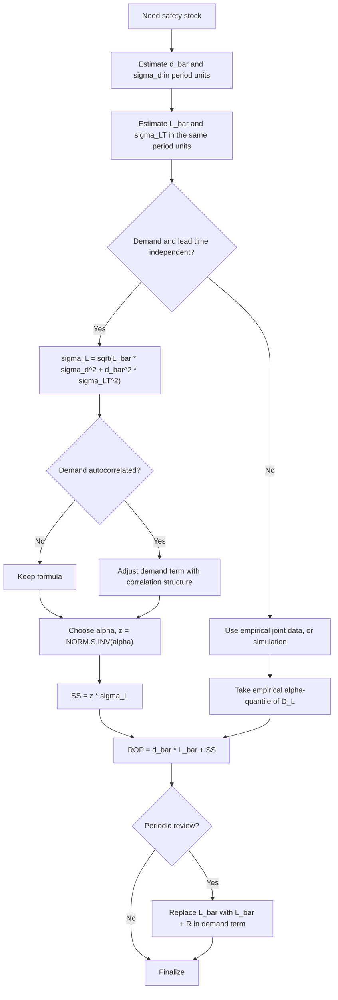

## Safety Stock Formula Under Variable Demand and Variable Lead Time

### Overview

When both **demand per period** and **replenishment lead time** are random, the demand accumulated during lead time is a **random sum of random variables**. Its variance has two distinct components: fluctuation of demand within a given lead time, and fluctuation of the lead time itself scaled by the demand rate. Safety stock is then sized on the combined standard deviation $\sigma_L$ using the standard normal quantile for the target service level.

**Key Points**

- Both demand ($\bar{d}$, $\sigma_d$) and lead time ($\bar{L}$, $\sigma_{LT}$) are random, and are assumed **independent** of each other in the standard formula
- Combined lead-time demand variance: $\text{Var}(D_L)=\bar{L}\sigma_d^2+\bar{d}^2\sigma_{LT}^2$
- Safety stock: $SS=z_{\alpha}\sqrt{\bar{L}\,\sigma_d^2+\bar{d}^2\,\sigma_{LT}^2}$
- The two variance terms are **additive under squares**, not additive as standard deviations
- Ignoring lead time variability can materially understate safety stock when supplier reliability is poor

---

### Notation

| Symbol | Meaning |
| --- | --- |
| $d_t$ | Demand in period $t$ |
| $\bar{d}$ | Mean demand per period |
| $\sigma_d$ | Standard deviation of demand per period (or forecast error $\sigma_e$) |
| $L$ | Lead time (random), in the same period units as $d$ |
| $\bar{L}$ | Mean lead time |
| $\sigma_{LT}$ | Standard deviation of lead time |
| $D_L$ | Total demand during lead time |
| $\mu_L$ | $E[D_L]=\bar{d}\bar{L}$ |
| $\sigma_L$ | Standard deviation of $D_L$ |
| $\alpha$ | Target cycle service level |
| $z_{\alpha}$ | $\Phi^{-1}(\alpha)$ |
| $R$ | Review period (periodic review) |

---

### Derivation

**Step 1: Model.** Let $L$ be a nonnegative random lead time (treated as a nonnegative integer count of periods for the derivation) and $d_1, d_2, \dots$ i.i.d. period demands with mean $\bar{d}$ and variance $\sigma_d^2$, independent of $L$:

$$D_L=\sum_{t=1}^{L} d_t$$

**Step 2: Conditional moments given $L=\ell$.**

$$E[D_L\mid L=\ell]=\ell\,\bar{d},\qquad \text{Var}(D_L\mid L=\ell)=\ell\,\sigma_d^2$$

**Step 3: Law of total expectation.**

$$E[D_L]=E\big[E[D_L\mid L]\big]=\bar{d}\,E[L]=\bar{d}\bar{L}$$

**Step 4: Law of total variance.**

$$\text{Var}(D_L)=E\big[\text{Var}(D_L\mid L)\big]+\text{Var}\big(E[D_L\mid L]\big)$$


$$=E[L]\,\sigma_d^2+\bar{d}^{\,2}\,\text{Var}(L)=\bar{L}\,\sigma_d^2+\bar{d}^{\,2}\sigma_{LT}^2$$

**Step 5: Standard deviation.**

$$\boxed{\sigma_L=\sqrt{\bar{L}\,\sigma_d^2+\bar{d}^{\,2}\,\sigma_{LT}^2}}$$

**Step 6: Safety stock and reorder point** (normal approximation of $D_L$):

$$\boxed{SS=z_{\alpha}\sqrt{\bar{L}\,\sigma_d^2+\bar{d}^{\,2}\,\sigma_{LT}^2}}$$


$$\boxed{ROP=\bar{d}\bar{L}+z_{\alpha}\sqrt{\bar{L}\,\sigma_d^2+\bar{d}^{\,2}\,\sigma_{LT}^2}}$$

**Key Points**

- The derivation holds for a random integer-valued $L$; treating $L$ as continuous (for example, 2.5 weeks) is a standard practical extension
- Independence between $d_t$ and $L$ is essential to Step 4; the formula is not valid when large orders lengthen supplier lead times
- The demand term uses $\bar{L}$ (a linear factor), whereas the lead-time term uses $\bar{d}^{\,2}$

---

### Decomposing the Uncertainty

The two variance components separate the sources of risk:

$$\underbrace{\bar{L}\,\sigma_d^2}_{\text{demand variability}}\quad+\quad\underbrace{\bar{d}^{\,2}\sigma_{LT}^2}_{\text{lead time variability}}$$

Share of total variance attributable to each source:

$$\omega_{d}=\frac{\bar{L}\,\sigma_d^2}{\sigma_L^2},\qquad \omega_{LT}=\frac{\bar{d}^{\,2}\sigma_{LT}^2}{\sigma_L^2},\qquad \omega_d+\omega_{LT}=1$$

The ratio of the two terms indicates where improvement effort pays off:

$$\frac{\text{lead time term}}{\text{demand term}}=\frac{\bar{d}^{\,2}\sigma_{LT}^2}{\bar{L}\,\sigma_d^2}=\frac{CV_d^{-2}\,\sigma_{LT}^2}{\bar{L}}\quad\text{where }CV_d=\frac{\sigma_d}{\bar{d}}$$

Equivalently, dividing by $\bar{d}^2$: the lead time term dominates when $\sigma_{LT}^2/\bar{L}>CV_d^2$. Low-CV (stable) demand items with unreliable suppliers are therefore dominated by lead time risk.

---

### Worked Example 1: Baseline

Weekly demand: $\bar{d}=200$, $\sigma_d=40$. Lead time: $\bar{L}=4$ weeks, $\sigma_{LT}=0.5$ weeks. Target $\alpha=95\%$ ($z=1.645$).

$$\mu_L=200\times 4=800$$


$$\text{Var}(D_L)=4(40)^2+(200)^2(0.5)^2=6{,}400+10{,}000=16{,}400$$


$$\sigma_L=\sqrt{16{,}400}\approx 128.06$$


$$SS=1.645\times 128.06\approx 210.66\approx 211\text{ units}$$


$$ROP=800+210.66\approx 1{,}011\text{ units}$$

**Output**

| Component | Variance | Share |
| --- | --- | --- |
| Demand variability | 6,400 | 39.0% |
| Lead time variability | 10,000 | 61.0% |
| Total | 16,400 | 100% |
| $\sigma_L$ | 128.06 |  |
| Safety stock | 210.66 |  |
| Reorder point | 1,010.66 |  |

**Conclusion**: Although $\sigma_{LT}=0.5$ weeks appears small next to $\bar{L}=4$, it drives 61% of the variance because it is scaled by the mean weekly demand of 200 units.

---

### Worked Example 2: Comparing Simplifications

Same SKU as Example 1. Comparing common (incorrect) shortcuts against the full formula:

| Method | $\sigma_L$ | $SS$ at 95% | Error vs full |
| --- | --- | --- | --- |
| Demand variability only: $\sigma_d\sqrt{\bar{L}}$ | 80.00 | 131.6 | −37.5% |
| Lead time variability only: $\bar{d}\sigma_{LT}$ | 100.00 | 164.5 | −21.9% |
| **Full combined formula** | **128.06** | **210.7** | 0% |
| Adding standard deviations: $80+100$ | 180.00 | 296.1 | +40.6% |

**Conclusion**: Adding the two standard deviations directly overstates the buffer by about 41%, and using either component alone understates it. Variances add; standard deviations do not.

---

### Worked Example 3: Sensitivity to $\sigma_{LT}$

$\bar{d}=200$, $\sigma_d=40$, $\bar{L}=4$, $\alpha=95\%$; varying lead time standard deviation:

| $\sigma_{LT}$ (weeks) | Lead time variance | $\sigma_L$ | $SS$ |
| --- | --- | --- | --- |
| 0.00 | 0 | 80.00 | 131.6 |
| 0.25 | 2,500 | 94.34 | 155.2 |
| 0.50 | 10,000 | 128.06 | 210.7 |
| 1.00 | 40,000 | 210.71 | 346.6 |
| 1.50 | 90,000 | 305.77 | 503.0 |
| 2.00 | 160,000 | 401.00 | 659.6 |

Safety stock roughly quadruples from $\sigma_{LT}=0$ to $\sigma_{LT}=1.0$ week, while $\bar{L}$ stays unchanged. **Improving supplier reliability** can therefore be more valuable than reducing average lead time.

---

### Worked Example 4: Trade-off Between Mean and Variability of Lead Time

Supplier A: $\bar{L}=2$ weeks, $\sigma_{LT}=1.0$. Supplier B: $\bar{L}=5$ weeks, $\sigma_{LT}=0.2$. Same demand ($\bar{d}=200$, $\sigma_d=40$), $\alpha=95\%$.

**Supplier A**

$$\sigma_L=\sqrt{2(1600)+40000(1.0)}=\sqrt{3200+40000}=\sqrt{43200}\approx 207.85,\quad SS\approx 341.9$$

**Supplier B**

$$\sigma_L=\sqrt{5(1600)+40000(0.04)}=\sqrt{8000+1600}=\sqrt{9600}\approx 97.98,\quad SS\approx 161.2$$

| Supplier | $\bar{L}$ | $\sigma_{LT}$ | $\mu_L$ | $SS$ | $ROP$ |
| --- | --- | --- | --- | --- | --- |
| A | 2 | 1.0 | 400 | 341.9 | 741.9 |
| B | 5 | 0.2 | 1,000 | 161.2 | 1,161.2 |

**Conclusion**: Supplier B has a much longer lead time but needs less than half the safety stock, because its reliability is high. Pipeline (cycle) inventory is higher for B, so total cost comparison must also include the cost of carrying $\mu_L$ and any price differences. [Inference: the preferred supplier depends on holding cost, price, and order size, which are not specified here.]

---

### Visualizing the Variance Decomposition

<svg xmlns="http://www.w3.org/2000/svg" viewBox="0 0 640 300" role="img">
<title>Lead-Time Demand Variance Decomposition (svg_diagram)</title>
<text x="320" y="24" text-anchor="middle" font-family="sans-serif" font-size="16" font-weight="bold">Lead-Time Demand Variance Decomposition (svg_diagram)</text>
<line x1="70" y1="250" x2="600" y2="250" stroke="#333" stroke-width="2" />
<line x1="70" y1="50" x2="70" y2="250" stroke="#333" stroke-width="2" />
<rect x="120" y="211" width="110" height="39" fill="#1f77b4" fill-opacity="0.8" stroke="#333" />
<text x="175" y="238" text-anchor="middle" font-family="sans-serif" font-size="11" fill="#fff">6,400</text>
<text x="175" y="270" text-anchor="middle" font-family="sans-serif" font-size="12">Demand term</text>
<text x="175" y="284" text-anchor="middle" font-family="sans-serif" font-size="11">L̄ σ_d²</text>
<rect x="290" y="172" width="110" height="78" fill="#ff7f0e" fill-opacity="0.8" stroke="#333" />
<text x="345" y="215" text-anchor="middle" font-family="sans-serif" font-size="11" fill="#fff">10,000</text>
<text x="345" y="270" text-anchor="middle" font-family="sans-serif" font-size="12">Lead time term</text>
<text x="345" y="284" text-anchor="middle" font-family="sans-serif" font-size="11">d̄² σ_LT²</text>
<rect x="460" y="122" width="110" height="128" fill="#2ca02c" fill-opacity="0.8" stroke="#333" />
<text x="515" y="190" text-anchor="middle" font-family="sans-serif" font-size="11" fill="#fff">16,400</text>
<text x="515" y="270" text-anchor="middle" font-family="sans-serif" font-size="12">Total variance</text>
<text x="515" y="284" text-anchor="middle" font-family="sans-serif" font-size="11">σ_L = 128.06</text>
<text x="50" y="254" text-anchor="end" font-family="sans-serif" font-size="10">0</text>
<text x="50" y="126" text-anchor="end" font-family="sans-serif" font-size="10">16,400</text>
</svg>

---

### Decision Flow



---

### Variants and Extensions

**1. Periodic review with review period $R$ (constant $R$)**

Exposure spans $L+R$. If $R$ is fixed and $L$ is random:

$$\sigma_{L+R}=\sqrt{(\bar{L}+R)\,\sigma_d^2+\bar{d}^{\,2}\sigma_{LT}^2}$$

**Example**: $R=1$ week, parameters from Example 1.

$$\sigma_{L+R}=\sqrt{5(1600)+40000(0.25)}=\sqrt{18000}\approx 134.16,\quad SS\approx 220.7$$

**2. Forecast-error-based demand term**

Replace $\sigma_d$ with the standard deviation of forecast error $\sigma_e$ (measured at a horizon matching the lead time):

$$\sigma_L=\sqrt{\bar{L}\,\sigma_e^2+\bar{d}^{\,2}\sigma_{LT}^2}$$

This avoids buffering predictable variation such as seasonality or trend. Forecast error at horizon $\ell$ typically grows with $\ell$, so the $\sqrt{\bar{L}}$ scaling of $\sigma_e$ may understate risk [Inference: depends on the forecasting method and error correlation structure].

**3. Autocorrelated demand**

With constant pairwise correlation $\rho$ between distinct periods and fixed conditional length $\ell$:

$$\text{Var}(D_L\mid L=\ell)=\sigma_d^2\big[\ell+\ell(\ell-1)\rho\big]$$

Taking expectation over $L$:

$$\text{Var}(D_L)=\sigma_d^2\big[\bar{L}+\rho\,(E[L^2]-\bar{L})\big]+\bar{d}^{\,2}\sigma_{LT}^2,\qquad E[L^2]=\sigma_{LT}^2+\bar{L}^2$$

For $\rho>0$ the demand term grows faster than $\bar{L}\sigma_d^2$. The constant-$\rho$ assumption is a simplification; real processes (for example, AR(1)) have decaying correlation with lag.

**3b. Example (autocorrelated)**: $\rho=0.2$, parameters of Example 1.

$$E[L^2]=0.25+16=16.25,\quad \bar{L}+\rho(E[L^2]-\bar{L})=4+0.2(12.25)=6.45$$


$$\text{Var}(D_L)=1600(6.45)+10{,}000=10{,}320+10{,}000=20{,}320,\quad \sigma_L\approx 142.55$$

Ignoring $\rho=0.2$ understates $\sigma_L$ by about 10% here (128.06 vs 142.55).

**4. Correlation between demand and lead time** ($\text{Cov}\neq 0$)

If average demand and lead time are correlated (for example, high-demand periods strain the supplier, lengthening $L$), the independence-based formula does not hold. A first-order adjustment adds a covariance term for the *rate* $\bar{d}_L$ realized during a given lead time:

$$\text{Var}(D_L)\approx \bar{L}\,\sigma_d^2+\bar{d}^{\,2}\sigma_{LT}^2+2\,\bar{d}\,\bar{L}\,\text{Cov}(\bar{d}_L,L)$$

Here $\bar{d}_L$ denotes the per-period mean demand realized during the lead time in a given cycle. The exact expression depends on the joint model [Inference: this first-order form is a heuristic and its accuracy depends on the strength and shape of the dependence]. Where dependence is material, estimate $D_L$ empirically or by simulation.

**5. Lead time variability in a coarser unit than demand**

Convert both to a consistent unit before use. If lead time is measured in days and demand in weeks, either convert $\bar{L},\sigma_{LT}$ to weeks or convert $\bar{d},\sigma_d$ to days. Daily demand scales as $\sigma_{\text{week}}=\sigma_{\text{day}}\sqrt{7}$ under independence.

**Example**: daily $\bar{d}=30$, $\sigma_d=8$; $\bar{L}=10$ days, $\sigma_{LT}=3$ days; $\alpha=97.5\%$ ($z=1.960$).

$$\sigma_L=\sqrt{10(64)+900(9)}=\sqrt{640+8100}=\sqrt{8740}\approx 93.49$$


$$SS=1.960\times 93.49\approx 183.2,\quad ROP=300+183.2=483.2$$


---

### Estimating the Inputs

| Parameter | Estimator | Notes |
| --- | --- | --- |
| $\bar{d}$ | Sample mean of period demand (or forecast) | Use a window matching stationarity |
| $\sigma_d$ | $\sqrt{\frac{1}{n-1}\sum(d_t-\bar{d})^2}$ | Use forecast error $\sigma_e$ where a forecast exists |
| $\bar{L}$ | Mean of observed lead times (order date to receipt date) | Measure to *usable* stock (include receiving and put-away) |
| $\sigma_{LT}$ | $\sqrt{\frac{1}{m-1}\sum(L_j-\bar{L})^2}$ | Needs enough deliveries; sparse orders give unstable estimates |

**Python**

```python
import numpy as np
import pandas as pd
from scipy.stats import norm

def sigma_L_combined(d_bar, sigma_d, L_bar, sigma_LT, rho=0.0):
    """
    sigma of demand during lead time under independent demand and lead time.
    Optional constant pairwise demand correlation rho (0 = independent demand).
    """
    EL2 = sigma_LT**2 + L_bar**2
    demand_term = sigma_d**2 * (L_bar + rho * (EL2 - L_bar))
    lead_term = (d_bar**2) * (sigma_LT**2)
    return np.sqrt(demand_term + lead_term)

def safety_stock(d_bar, sigma_d, L_bar, sigma_LT, alpha, review_period=0.0, rho=0.0):
    z = norm.ppf(alpha)
    # Review period enters the demand exposure only
    sigma = np.sqrt(
        sigma_d**2 * ((L_bar + review_period) + rho * ((sigma_LT**2 + (L_bar + review_period)**2) - (L_bar + review_period)))
        + (d_bar**2) * (sigma_LT**2)
    )
    ss = z * sigma
    return {"z": z, "sigma_L": sigma, "SS": ss, "ROP_or_S": d_bar * (L_bar + review_period) + ss}

print(safety_stock(200, 40, 4, 0.5, 0.95))
# z=1.6449, sigma_L~128.06, SS~210.64, ROP~1010.64

print(safety_stock(200, 40, 4, 0.5, 0.95, review_period=1.0))
# sigma_L~134.16 (independent demand), SS~220.7

# Estimating lead-time statistics from receipt history
orders = pd.DataFrame({
    "order_date":   pd.to_datetime(["2026-01-05","2026-01-19","2026-02-02","2026-02-16","2026-03-02"]),
    "receipt_date": pd.to_datetime(["2026-01-30","2026-02-13","2026-03-02","2026-03-14","2026-03-30"]),
})
lt_weeks = (orders["receipt_date"] - orders["order_date"]).dt.days / 7
L_bar, sigma_LT = lt_weeks.mean(), lt_weeks.std(ddof=1)
print(L_bar, sigma_LT)
```

**Note on the `review_period` handling in the periodic branch**: when the review period is applied together with autocorrelation, the code reuses the effective exposure $L+R$ in the demand term; independence ($\rho=0$) reduces this to the standard formula. The exact autocorrelation adjustment for periodic review depends on how $R$ interacts with the correlation structure [Inference: the combined form shown is a simplification].

**Monte Carlo verification**

```python
def simulate_ss(d_mu, d_sigma, L_mu, L_sigma, alpha, n=200_000, seed=7):
    rng = np.random.default_rng(seed)
    L = np.clip(rng.normal(L_mu, L_sigma, n), 0.1, None)   # truncate to positive
    dlt = np.clip(d_mu * L + rng.normal(0.0, d_sigma * np.sqrt(L)), 0.0, None)
    q = np.quantile(dlt, alpha)
    return dlt.mean(), dlt.std(ddof=1), q, q - dlt.mean()

mean_dlt, sd_dlt, rop_emp, ss_emp = simulate_ss(200, 40, 4, 0.5, 0.95)
print(mean_dlt, sd_dlt, rop_emp, ss_emp)
```

Expected output is close to the analytical $\mu_L\approx800$, $\sigma_L\approx128$, and $ROP\approx1{,}010$ to $1{,}011$; results vary with seed and truncation choices.

**Excel / Google Sheets**



```
sigma_L:   =SQRT(Lbar*sigma_d^2 + dbar^2*sigma_LT^2)
z:         =NORM.S.INV(alpha)
SS:        =NORM.S.INV(alpha)*SQRT(Lbar*sigma_d^2 + dbar^2*sigma_LT^2)
ROP:       =dbar*Lbar + SS
sigma_LT:  =STDEV.S(lead_time_range)
```

---

### Assumptions and Validity

| Assumption | Effect if violated |
| --- | --- |
| Demand and lead time independent | Formula misstates $\sigma_L$; use covariance adjustment or simulation |
| Period demands i.i.d. | Autocorrelation biases $\sigma_L$ (positive $\rho$ understates) |
| Lead time distribution stationary | Supplier deterioration or improvement invalidates $\sigma_{LT}$ |
| $D_L$ approximately normal | Skewness (from variable $L$) inflates upper-tail risk; normal can understate the high quantile |
| $\sigma_{LT}$ small relative to $\bar{L}$ (for a normal, nonnegative $L$) | If $\sigma_{LT}/\bar{L}$ is large, $L$ is not normal and truncation matters |
| Single supplier, single lead time | Multi-source or split-shipment settings need different handling |
| No order crossover | If later orders can arrive before earlier ones, effective lead time is not $L$ |

**Key Points**

- Variable lead time makes $D_L$ **right-skewed** even if period demand is symmetric, so normal quantiles can understate the tail at high service levels [Inference: extent depends on the lead time distribution]
- For high service targets or heavy-tailed lead times, use an empirical quantile of $D_L$ or a gamma fit with mean $\mu_L$ and variance $\sigma_L^2$
- Estimate $\sigma_{LT}$ from actual receipts; supplier-quoted lead times typically understate variability

---

### Common Pitfalls

- **Adding standard deviations** instead of variances
- **Omitting the $\bar{d}^{\,2}$ factor** on the lead time term, or omitting the $\bar{L}$ factor on the demand term
- **Unit inconsistency** between demand periods and lead time
- **Using quoted (promised) lead times** rather than realized lead times when computing $\sigma_{LT}$
- **Measuring lead time to physical receipt** rather than to availability in stock
- **Treating $\sigma_{LT}$ as zero** when few deliveries have been observed (a small sample does not prove low variability)
- **Ignoring the review period** in periodic systems
- **Applying the formula when demand and lead time are correlated**
- **Double counting**: including buffer padding in the planned lead time and then also computing safety stock on the padded value
- **Using $\sigma_d$ instead of forecast error $\sigma_e$** when a forecast exists
- **Negative lead times or values below the physical minimum** from normal approximations; enforce $L\ge L_{\min}$ in simulation
- **Assuming exact service levels**: the cycle service level achieved depends on estimation error and distribution shape

---

### Managerial Levers

Because $\sigma_L^2=\bar{L}\sigma_d^2+\bar{d}^{\,2}\sigma_{LT}^2$, the marginal effect of each lever on variance is:

| Lever | Effect on $\sigma_L^2$ | Practical means |
| --- | --- | --- |
| Reduce $\sigma_d$ (better forecasts) | $\Delta=\bar{L}\,\Delta(\sigma_d^2)$ | Demand sensing, collaborative planning |
| Reduce $\bar{L}$ | $\Delta=\sigma_d^2\,\Delta\bar{L}$ | Nearshoring, faster transport, supplier proximity |
| Reduce $\sigma_{LT}$ | $\Delta=\bar{d}^{\,2}\,\Delta(\sigma_{LT}^2)$ | Supplier scorecards, reliability contracts, buffer at supplier, dedicated capacity |
| Reduce $\bar{d}$ (through range or demand shaping) | Reduces the lead time term quadratically | Product rationalization |

**Conclusion**: For items with stable demand but unreliable supply, improving supplier reliability ($\sigma_{LT}$) delivers the largest reduction in safety stock, because its contribution scales with $\bar{d}^{\,2}$. For volatile-demand items with reliable supply, better forecasting is the more effective lever.

---

**Related Topics**

- Safety stock under constant lead time (demand-only variability)
- Safety stock under variable lead time and constant demand
- Standard deviation of demand during lead time and its estimation
- Standard normal distribution, loss function, and fill-rate-based safety stock
- Correlated demand and lead time: covariance-adjusted and simulation-based methods
- Non-normal lead-time demand: gamma, negative binomial, and bootstrap quantiles
- Periodic review $(R,S)$ policy and order-up-to level
- Supplier performance measurement and lead time reliability metrics
- Order crossover and effective lead time
- Multi-echelon safety stock and risk pooling