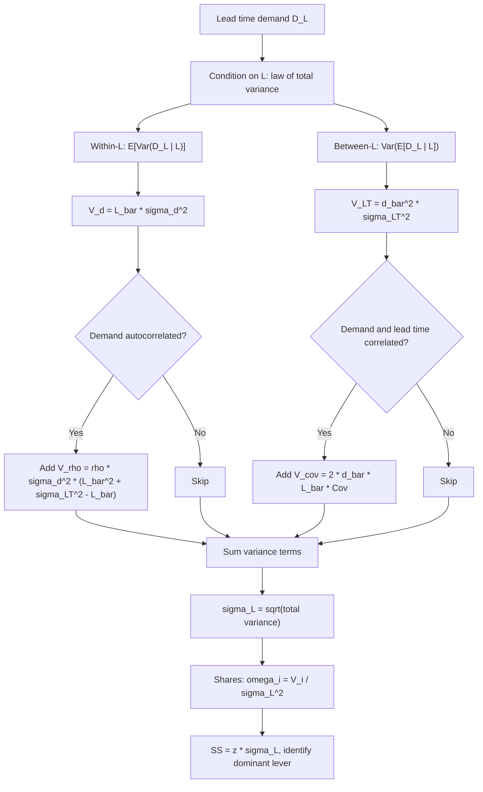

## Lead Time Demand Variance Decomposition

### Overview

**Lead time demand variance decomposition** splits the total variance of demand accumulated during replenishment, $\text{Var}(D_L)$, into distinct, attributable components. The decomposition follows from the **law of total variance** and separates uncertainty that arises from *how much customers order* (demand variability) from uncertainty that arises from *how long the replenishment window lasts* (lead time variability). It answers a practical question: **which source of uncertainty is driving safety stock, and which lever reduces it most?**

**Key Points**

- Total variance is additive across independent sources: variances add, standard deviations do not
- The base decomposition has two terms: $\bar{L}\sigma_d^2$ (demand) and $\bar{d}^{\,2}\sigma_{LT}^2$ (lead time)
- Extensions add terms for autocorrelation, demand-lead time covariance, and forecast-error structure
- Each term maps to a managerial lever: forecasting quality, supplier reliability, or lead time length
- Because $SS=z\,\sigma_L$, safety stock responds to the **square root** of total variance, so equal variance reductions do not translate into equal safety stock reductions

---

### Notation

| Symbol | Meaning |
| --- | --- |
| $d_t$ | Demand in period $t$ |
| $\bar{d}$, $\sigma_d$ | Mean and standard deviation of demand per period |
| $L$ | Random lead time (periods) |
| $\bar{L}$, $\sigma_{LT}$ | Mean and standard deviation of lead time |
| $D_L$ | Demand during lead time, $\sum_{t=1}^{L}d_t$ |
| $\mu_L$ | $E[D_L]=\bar{d}\bar{L}$ |
| $\sigma_L^2$ | $\text{Var}(D_L)$ |
| $CV_d$ | $\sigma_d/\bar{d}$ |
| $CV_{LT}$ | $\sigma_{LT}/\bar{L}$ |
| $\omega_d,\ \omega_{LT}$ | Variance shares of the demand and lead time terms |
| $\rho$ | Correlation between demands in distinct periods |
| $\sigma_e$ | Standard deviation of forecast error |

---

### Foundation: The Law of Total Variance

For any random variable $Y$ and conditioning variable $X$:

$$\text{Var}(Y)=\underbrace{E\big[\text{Var}(Y\mid X)\big]}_{\text{within-group (unexplained by }X)}+\underbrace{\text{Var}\big(E[Y\mid X]\big)}_{\text{between-group (explained by }X)}$$

Setting $Y=D_L$ and $X=L$ (the realized lead time) yields the decomposition:

| Component | Meaning | Interpretation |
| --- | --- | --- |
| $E[\text{Var}(D_L\mid L)]$ | Average variance of demand *given* a fixed lead time | Demand randomness |
| $\text{Var}(E[D_L\mid L])$ | Variance of the conditional mean caused by $L$ varying | Lead time randomness |

---

### Two-Component Decomposition

**Conditional moments** (i.i.d. demand independent of $L$):

$$E[D_L\mid L]=L\,\bar{d},\qquad \text{Var}(D_L\mid L)=L\,\sigma_d^2$$

**Decomposition**

$$\sigma_L^2=\underbrace{E[L]\,\sigma_d^2}_{V_d\ (\text{demand})}+\underbrace{\bar{d}^{\,2}\,\text{Var}(L)}_{V_{LT}\ (\text{lead time})}=\underbrace{\bar{L}\,\sigma_d^2}_{V_d}+\underbrace{\bar{d}^{\,2}\sigma_{LT}^2}_{V_{LT}}$$

**Variance shares**

$$\omega_d=\frac{V_d}{\sigma_L^2},\qquad \omega_{LT}=\frac{V_{LT}}{\sigma_L^2},\qquad \omega_d+\omega_{LT}=1$$

**Dominance condition.** Dividing both terms by $\bar{d}^{\,2}\bar{L}$:

$$\frac{V_{LT}}{V_d}=\frac{\bar{d}^{\,2}\sigma_{LT}^2}{\bar{L}\,\sigma_d^2}=\frac{\sigma_{LT}^2/\bar{L}}{CV_d^{\,2}}$$

- Lead time variability dominates when $\sigma_{LT}^2/\bar{L}>CV_d^{\,2}$
- Demand variability dominates when $\sigma_{LT}^2/\bar{L}<CV_d^{\,2}$
- The break-even is $\sigma_{LT}=CV_d\sqrt{\bar{L}}$

**Standard-deviation composition** (Pythagorean, not linear):

$$\sigma_L=\sqrt{V_d+V_{LT}}=\sqrt{\sigma_{d,\text{eff}}^2+\sigma_{LT,\text{eff}}^2}$$

where $\sigma_{d,\text{eff}}=\sigma_d\sqrt{\bar{L}}$ and $\sigma_{LT,\text{eff}}=\bar{d}\,\sigma_{LT}$ are the standalone standard deviations from each source.

---

### Visualizing the Decomposition

<svg xmlns="http://www.w3.org/2000/svg" viewBox="0 0 640 330" role="img">
<title>Right-Triangle Composition of sigma_L (svg_diagram)</title>
<text x="320" y="24" text-anchor="middle" font-family="sans-serif" font-size="16" font-weight="bold">Right-Triangle Composition of σ_L (svg_diagram)</text>
<polygon points="140,260 140,90 400,260" fill="#2ca02c" fill-opacity="0.12" stroke="#333" stroke-width="2" />
<line x1="140" y1="260" x2="400" y2="260" stroke="#1f77b4" stroke-width="5" />
<line x1="140" y1="260" x2="140" y2="90" stroke="#ff7f0e" stroke-width="5" />
<line x1="140" y1="90" x2="400" y2="260" stroke="#2ca02c" stroke-width="5" />
<rect x="140" y="240" width="20" height="20" fill="none" stroke="#333" />
<text x="270" y="284" text-anchor="middle" font-family="sans-serif" font-size="13" fill="#1f77b4">σ_d√L̄ = 80.00 (demand only)</text>
<text x="128" y="180" text-anchor="end" font-family="sans-serif" font-size="13" fill="#ff7f0e">d̄σ_LT = 100.00</text>
<text x="128" y="197" text-anchor="end" font-family="sans-serif" font-size="13" fill="#ff7f0e">(lead time only)</text>
<text x="290" y="160" text-anchor="middle" font-family="sans-serif" font-size="13" fill="#2ca02c" transform="rotate(33 290 160)">σ_L = 128.06</text>
<text x="500" y="130" text-anchor="start" font-family="sans-serif" font-size="12">σ_L² = V_d + V_LT</text>
<text x="500" y="150" text-anchor="start" font-family="sans-serif" font-size="12">16,400 = 6,400 + 10,000</text>
<text x="500" y="180" text-anchor="start" font-family="sans-serif" font-size="12">ω_d = 39.0%</text>
<text x="500" y="198" text-anchor="start" font-family="sans-serif" font-size="12">ω_LT = 61.0%</text>
<text x="320" y="315" text-anchor="middle" font-family="sans-serif" font-size="11">Independent sources combine as legs of a right triangle</text>
</svg>

---

### Worked Example 1: Baseline Decomposition

$\bar{d}=200$, $\sigma_d=40$, $\bar{L}=4$, $\sigma_{LT}=0.5$ (weekly units), $\alpha=95\%$ ($z=1.645$).

$$V_d=4(40)^2=6{,}400,\qquad V_{LT}=(200)^2(0.5)^2=10{,}000$$


$$\sigma_L^2=16{,}400,\qquad \sigma_L=128.06$$

**Output**

| Term | Variance | Share | Standalone $\sigma$ | Standalone $SS$ (95%) |
| --- | --- | --- | --- | --- |
| Demand $V_d$ | 6,400 | 39.0% | 80.00 | 131.6 |
| Lead time $V_{LT}$ | 10,000 | 61.0% | 100.00 | 164.5 |
| **Combined** | **16,400** | **100%** | **128.06** | **210.7** |

**Conclusion**: Standalone safety stocks sum to 296.1, but the combined requirement is 210.7. The difference reflects the Pythagorean (square-root-of-sum-of-squares) combination of independent sources, and it is the reason safety stocks must never be computed per source and then added.

---

### Marginal Contribution of Each Source

Because $SS\propto\sigma_L=\sqrt{V_d+V_{LT}}$, the marginal effect of a change in one variance term is:

$$\frac{\partial SS}{\partial V_i}=\frac{z}{2\sigma_L}$$

The **reduction in safety stock** from eliminating a source entirely:

| Scenario | New $\sigma_L$ | New $SS$ | $SS$ saved | % saved |
| --- | --- | --- | --- | --- |
| Eliminate demand variance ($\sigma_d\to0$) | $\sqrt{10{,}000}=100.00$ | 164.5 | 46.2 | 21.9% |
| Eliminate lead time variance ($\sigma_{LT}\to0$) | $\sqrt{6{,}400}=80.00$ | 131.6 | 79.1 | 37.5% |
| Both | 0 | 0 | 210.7 | 100% |

Note that eliminating the demand term alone (39% of variance) saves only 21.9% of safety stock, whereas eliminating the lead time term (61% of variance) saves 37.5%. **Safety stock savings are smaller than variance-share reductions** because of the square root.

**Reduction formulas**

$$\text{SS saving from removing source }i=1-\sqrt{1-\omega_i}$$

Check: $1-\sqrt{1-0.61}=1-0.6245=0.3755$, matching 37.5%.

---

### Partial Improvement Analysis

If a lever reduces a source's standard deviation by a fraction $\delta$ (so $\sigma\to(1-\delta)\sigma$, variance $\to(1-\delta)^2\times$):

$$\sigma_L^{\text{new}}=\sqrt{(1-\delta_d)^2V_d+(1-\delta_{LT})^2V_{LT}}$$

**Example**: $\delta_d=0.20$ (20% better forecast error) versus $\delta_{LT}=0.20$ (20% more reliable supplier), using Example 1.

| Scenario | New $V_d$ | New $V_{LT}$ | $\sigma_L$ | $SS$ | Saving |
| --- | --- | --- | --- | --- | --- |
| Baseline | 6,400 | 10,000 | 128.06 | 210.7 | 0% |
| Forecast error −20% | 4,096 | 10,000 | 118.72 | 195.3 | 7.3% |
| Lead time SD −20% | 6,400 | 6,400 | 113.14 | 186.1 | 11.7% |
| Both −20% | 4,096 | 6,400 | 102.41 | 168.5 | 20.0% |

**Conclusion**: For this SKU, a 20% improvement in supplier reliability reduces safety stock by 11.7%, versus 7.3% for an equal-percentage forecast improvement. Target the lever attached to the larger variance share.

---

### Extended Decomposition: Adding Autocorrelation

With constant pairwise demand correlation $\rho$ between distinct periods, the conditional variance becomes $\sigma_d^2[\ell+\ell(\ell-1)\rho]$. Taking expectation over $L$, using $E[L^2]=\bar{L}^2+\sigma_{LT}^2$:

$$\sigma_L^2=\underbrace{\bar{L}\sigma_d^2}_{V_d^{(0)}\text{ (independent demand)}}+\underbrace{\rho\,\sigma_d^2\big(\bar{L}^2+\sigma_{LT}^2-\bar{L}\big)}_{V_\rho\text{ (autocorrelation)}}+\underbrace{\bar{d}^{\,2}\sigma_{LT}^2}_{V_{LT}}$$

Three-way shares: $\omega_d^{(0)}+\omega_\rho+\omega_{LT}=1$.

**Example**: $\rho=0.2$, parameters of Example 1.

$$V_\rho=0.2\times1600\times(16+0.25-4)=320\times12.25=3{,}920$$

| Term | Variance | Share |
| --- | --- | --- |
| Demand (independent) $V_d^{(0)}$ | 6,400 | 31.5% |
| Autocorrelation $V_\rho$ | 3,920 | 19.3% |
| Lead time $V_{LT}$ | 10,000 | 49.2% |
| **Total** | **20,320** | **100%** |

$\sigma_L=\sqrt{20{,}320}\approx142.55$.

Under a constant-$\rho$ model, $V_\rho$ grows roughly with $\bar{L}^2$, so long lead times amplify the effect. Real processes typically show correlation decaying with lag (for example, AR(1)), for which the constant-$\rho$ form overstates the effect [Inference: the direction of the bias depends on the actual correlation structure].

---

### Extended Decomposition: Demand-Lead Time Covariance

If the demand rate realized during a cycle, $\bar{d}_L$, correlates with the lead time, an additional term appears. A first-order form:

$$\sigma_L^2\approx V_d+V_{LT}+\underbrace{2\,\bar{d}\,\bar{L}\,\text{Cov}(\bar{d}_L,L)}_{V_{\text{cov}}}$$

- $\text{Cov}>0$ (high demand coincides with long lead time): variance is **larger** than the independent formula
- $\text{Cov}<0$: variance is smaller
- Positive covariance is common when high demand strains supplier capacity

This first-order expression is a heuristic; its accuracy depends on the strength and form of the dependence [Inference]. When dependence is material, estimate $D_L$ empirically or by simulation instead.

**Example**: $\text{Cov}(\bar{d}_L,L)=+2.0$ (units per week × weeks), parameters of Example 1.

$$V_{\text{cov}}=2\times200\times4\times2.0=3{,}200,\qquad \sigma_L^2=6{,}400+10{,}000+3{,}200=19{,}600,\qquad \sigma_L=140.00$$

The independent formula understates $\sigma_L$ by about 8.5% here.

---

### Extended Decomposition: Forecast Error Basis

When a forecast is used, safety stock should cover **forecast error** rather than raw demand dispersion. Replace $\sigma_d$ with $\sigma_e$:

$$\sigma_L^2=\bar{L}\,\sigma_e^2+\bar{d}^{\,2}\sigma_{LT}^2$$

This gives a **three-way view** relating raw demand variance to what a forecast explains:

$$\sigma_d^2=\underbrace{\sigma_{\text{explained}}^2}_{\text{trend, seasonality, promotions}}+\underbrace{\sigma_e^2}_{\text{unexplained}}$$

| Term | Covered by | Sized by |
| --- | --- | --- |
| Explained demand variance | Forecast and cycle stock | Not part of safety stock |
| Unexplained (forecast error) | Safety stock | $\bar{L}\sigma_e^2$ |
| Lead time variance | Safety stock | $\bar{d}^{\,2}\sigma_{LT}^2$ |

**Example**: seasonal SKU with raw $\sigma_d=40$, but forecast error $\sigma_e=25$.

$$\sigma_L=\sqrt{4(625)+10{,}000}=\sqrt{12{,}500}\approx111.80,\quad SS=1.645\times111.80\approx183.9$$

Compared with using raw $\sigma_d$ (SS 210.7), safety stock falls 12.7% without any change in service target. The forecast error should be measured at a horizon matching lead time; error at longer horizons is usually larger, and errors across periods may be positively correlated [Inference: depends on the forecasting method], so the $\sqrt{\bar{L}}$ scaling of $\sigma_e$ can understate risk.

---

### Time-Domain View: Per-Period Contributions

The demand term can be expressed as the sum of per-period contributions when the conditional length is $\ell$:

$$V_d=\sum_{\ell}P(L=\ell)\cdot\ell\,\sigma_d^2=\sigma_d^2\sum_{\ell}\ell\,P(L=\ell)$$

**Discrete lead time example.** Lead time takes values 3, 4, 6 weeks with probabilities 0.3, 0.5, 0.2; $\bar{d}=200$, $\sigma_d=40$.

$$\bar{L}=0.3(3)+0.5(4)+0.2(6)=0.9+2.0+1.2=4.1$$


$$E[L^2]=0.3(9)+0.5(16)+0.2(36)=2.7+8.0+7.2=17.9,\qquad \sigma_{LT}^2=17.9-16.81=1.09$$


$$V_d=4.1\times1600=6{,}560,\qquad V_{LT}=40{,}000\times1.09=43{,}600$$


$$\sigma_L^2=50{,}160,\qquad \sigma_L\approx223.97,\qquad SS(95\%)\approx368.4$$

| Lead time $\ell$ | $P$ | Cond. mean $200\ell$ | Cond. variance $1600\ell$ | Contribution to $V_d$ | Contribution to $V_{LT}$ |
| --- | --- | --- | --- | --- | --- |
| 3 | 0.3 | 600 | 4,800 | 1,440 | $0.3(600-820)^2=14{,}520$ |
| 4 | 0.5 | 800 | 6,400 | 3,200 | $0.5(800-820)^2=200$ |
| 6 | 0.2 | 1,200 | 9,600 | 1,920 | $0.2(1200-820)^2=28{,}880$ |
| **Total** | 1.0 | 820 |  | **6,560** | **43,600** |

Here $V_{LT}$ is exactly the variance of the conditional means, $\text{Var}(E[D_L\mid L])$, computed around the overall mean 820. This confirms $\sigma_L^2=6{,}560+43{,}600=50{,}160$.

**Conclusion**: The rare long lead time (6 weeks, probability 0.2) contributes 66% of lead time variance, showing how tail lead time events dominate the lead time term.

---

### Decomposition Procedure



---

### Implementation

**Python**

```python
import numpy as np
import pandas as pd
from scipy.stats import norm

def decompose_variance(d_bar, sigma_d, L_bar, sigma_LT, rho=0.0, cov_dL=0.0):
    """
    Decompose Var(D_L) into demand, autocorrelation, lead time, and covariance terms.
    Independent demand and lead time when rho = 0 and cov_dL = 0.
    """
    V_d   = L_bar * sigma_d**2
    V_rho = rho * sigma_d**2 * (L_bar**2 + sigma_LT**2 - L_bar)
    V_LT  = d_bar**2 * sigma_LT**2
    V_cov = 2.0 * d_bar * L_bar * cov_dL
    total = V_d + V_rho + V_LT + V_cov
    parts = pd.Series({"demand": V_d, "autocorr": V_rho, "lead_time": V_LT, "covariance": V_cov})
    return parts, total, np.sqrt(total)

def report(d_bar, sigma_d, L_bar, sigma_LT, alpha=0.95, **kw):
    z = norm.ppf(alpha)
    parts, total, sigma_L = decompose_variance(d_bar, sigma_d, L_bar, sigma_LT, **kw)
    out = pd.DataFrame({"variance": parts, "share_%": (parts / total * 100).round(2)})
    out.loc["TOTAL"] = [total, 100.0]
    ss = z * sigma_L
    return out, sigma_L, ss, d_bar * L_bar + ss

table, sigma_L, ss, rop = report(200, 40, 4, 0.5, 0.95)
print(table)
print(f"sigma_L={sigma_L:.2f}  SS={ss:.2f}  ROP={rop:.2f}")
# sigma_L=128.06  SS~210.64  ROP~1010.64

# Marginal savings from eliminating each source
for name in ["demand", "lead_time"]:
    parts, total, _ = decompose_variance(200, 40, 4, 0.5)
    share = parts[name] / total
    print(name, f"SS saving = {1 - np.sqrt(1 - share):.3%}")
# demand ~21.9%, lead_time ~37.5%
```

**Output**: the variance table for Example 1, then `sigma_L=128.06`, `SS≈210.64` (using `norm.ppf(0.95)=1.64485`; hand calculation with 1.645 gives 210.66), and savings of about 21.9% and 37.5%.

**Empirical decomposition from history**

```python
def empirical_decomposition(cycles: pd.DataFrame):
    """
    cycles: one row per replenishment cycle with columns
        L      = realized lead time (periods)
        D_L    = realized total demand during that lead time
    Uses the between/within split of the total variance of D_L.
    """
    # Total empirical variance of D_L
    total = cycles["D_L"].var(ddof=1)
    # Regression-based split: explained by L (between) vs residual (within)
    slope, intercept = np.polyfit(cycles["L"], cycles["D_L"], 1)
    fitted = slope * cycles["L"] + intercept
    between = fitted.var(ddof=1)
    within = (cycles["D_L"] - fitted).var(ddof=1)
    return {"total": total, "between_L": between, "within_L": within,
            "share_between": between / total, "share_within": within / total}

rng = np.random.default_rng(3)
L = np.clip(rng.normal(4, 0.5, 400), 1, None)
D = rng.normal(200 * L, 40 * np.sqrt(L))
res = empirical_decomposition(pd.DataFrame({"L": L, "D_L": D}))
print(res)
```

The regression-based split is an approximation (a linear conditional mean); between and within components do not sum exactly to `total` because the fitted values and residuals are uncorrelated only in-sample for an OLS fit with intercept [Inference: for OLS the sum is exact in-sample, but the linear-mean assumption may not match the true conditional mean]. Empirical shares vary with sample size and random seed.

**Excel / Google Sheets**



```
V_d:        = Lbar * sigma_d^2
V_LT:       = dbar^2 * sigma_LT^2
Total:      = V_d + V_LT
Share d:    = V_d / Total
Share LT:   = V_LT / Total
sigma_L:    = SQRT(Total)
SS saving (remove LT):  = 1 - SQRT(1 - V_LT/Total)
```

---

### Assumptions and Validity

| Assumption | Consequence if violated |
| --- | --- |
| Demand independent of lead time | Add covariance term or use simulation |
| Period demands independent | Add autocorrelation term ($\rho>0$ raises variance) |
| Stationary $\bar{d},\sigma_d,\bar{L},\sigma_{LT}$ | Drift makes shares unreliable; re-estimate on a schedule |
| $L$ measured in the same unit as demand periods | Unit mismatch corrupts both terms |
| Lead time observations reflect the future distribution | Supplier changes invalidate $\sigma_{LT}$ |
| $D_L$ approximately normal for the service quantile | Variable $L$ makes $D_L$ right-skewed; normal may understate the upper tail [Inference: magnitude depends on the lead time distribution] |
| Sufficient observations for $\hat\sigma_{LT}$ | Few deliveries give unstable estimates; a small sample does not prove low variability |
| No order crossover | Crossing orders shorten effective lead time in ways the model does not capture |

---

### Interpretation Guide

| Pattern | Diagnosis | Action |
| --- | --- | --- |
| $\omega_{LT}$ high, low $CV_d$ | Supplier unreliability dominates | Supplier scorecards, reliability contracts, dual sourcing, buffer at supplier |
| $\omega_d$ high | Forecast uncertainty dominates | Demand sensing, collaborative planning, promotion signals, better statistical models |
| $\omega_\rho$ material | Persistent demand swings (trends, promotions) | Model the trend explicitly, use forecast error basis |
| $V_{\text{cov}}>0$ | Demand surges lengthen lead times | Capacity reservation, expedite agreements, joint planning with supplier |
| Both shares near 50% | Balanced | Pursue the cheaper lever first; gains from both compound in quadrature |

**Elasticity table** (log-derivatives of $\sigma_L$, independent case):

$$\frac{\partial\ln\sigma_L}{\partial\ln\sigma_d}=\omega_d,\qquad \frac{\partial\ln\sigma_L}{\partial\ln\sigma_{LT}}=\omega_{LT},\qquad \frac{\partial\ln\sigma_L}{\partial\ln\bar{d}}=\omega_{LT}\ (\text{via }V_{LT}\text{ only, with }\sigma_{LT}\text{ fixed})$$


$$\frac{\partial\ln\sigma_L}{\partial\ln\bar{L}}=\tfrac12\,\omega_d\ (\text{via }V_d\text{ only, with }\sigma_{LT}\text{ fixed})$$

These elasticities hold with the other parameters held fixed; if $\sigma_{LT}$ scales with $\bar{L}$ (constant $CV_{LT}$), reducing $\bar{L}$ also reduces $V_{LT}$ and the effect is larger.

**Elasticity example** (Example 1, $\omega_d=0.39$, $\omega_{LT}=0.61$): a 10% reduction in $\sigma_{LT}$ lowers $\sigma_L$ by about $0.61\times10\%\approx6.1\%$ to first order; the exact value is $1-\sqrt{0.39+0.61(0.9)^2}/1=1-\sqrt{0.8841}\cdot$ scaled, giving about 5.9% [Inference: first-order and exact values differ slightly because the response is nonlinear].

Exact check: $V_{LT}\to0.81\times10{,}000=8{,}100$, total $14{,}500$, $\sigma_L=120.42$, reduction $=1-120.42/128.06=5.97\%$.

---

### Common Pitfalls

- **Adding standard deviations** of the two sources instead of variances
- **Assuming equal variance share implies equal safety stock share**: the square root breaks proportionality
- **Attributing variance shares to the wrong parameter** (for example, using $\sigma_d^2$ without the $\bar{L}$ factor)
- **Omitting $\bar{d}^{\,2}$** when scaling the lead time term
- **Unit mismatch** between demand period and lead time
- **Ignoring autocorrelation** in trending or promoted items
- **Ignoring demand-lead time covariance** when supplier capacity is tight
- **Estimating $\sigma_{LT}$ from quoted lead times** rather than realized receipts
- **Reading decomposition shares as causal impacts**: they describe variance attribution under a model, not the outcome of an intervention on a real supply chain
- **Comparing shares across SKUs** without normalizing: absolute variance matters for cost; shares matter for lever choice
- **Static decomposition**: shares shift as forecast accuracy or supplier performance changes

---

**Related Topics**

- Safety stock under variable demand and variable lead time
- Law of total variance and law of total expectation
- Standard deviation of demand during lead time
- Autocorrelated demand and effective variance scaling
- Forecast error distributions and horizon-dependent error
- Supplier lead time reliability metrics and scorecards
- Correlated demand and lead time: covariance and copula methods
- Non-normal lead time demand: gamma, bootstrap, and simulation
- Sensitivity and elasticity analysis of safety stock
- Multi-echelon variance propagation and the bullwhip effect