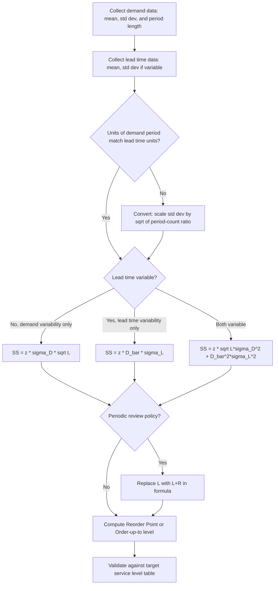

## Worked Numerical Safety Stock Calculations

### Overview

This reference walks through fully worked numerical examples of the core safety stock formulas, moving from the basic single-echelon case through variants that account for demand variability, lead time variability, and combined variability. Each example shows the formula, substituted values, and the arithmetic step-by-step so the calculation path is auditable.

### Formula Reference

| Scenario | Formula |
| --- | --- |
| Demand variability only (constant lead time) | $SS = z \cdot \sigma_D \cdot \sqrt{L}$ |
| Lead time variability only (constant demand) | $SS = z \cdot \bar{D} \cdot \sigma_L$ |
| Combined demand + lead time variability | $SS = z \cdot \sqrt{L \cdot \sigma_D^2 + \bar{D}^2 \cdot \sigma_L^2}$ |
| Periodic review (with review period $R$) | $SS = z \cdot \sigma_D \cdot \sqrt{L + R}$ |

Where $z$ = safety factor (from the standard normal distribution for the target cycle service level), $\sigma_D$ = standard deviation of demand per period, $\bar{D}$ = average demand per period, $L$ = lead time (in the same period units as $\sigma_D$), $\sigma_L$ = standard deviation of lead time, $R$ = review period length.

### Example 1 — Demand Variability Only

**Given:**

- Average daily demand $\bar{D} = 120$ units
- Standard deviation of daily demand $\sigma_D = 25$ units
- Lead time $L = 9$ days (constant, no variability)
- Target cycle service level = 95% → $z = 1.65$

**Calculation:**

$$SS = z \cdot \sigma_D \cdot \sqrt{L} = 1.65 \times 25 \times \sqrt{9}$$

$$SS = 1.65 \times 25 \times 3 = 123.75 \approx 124 \text{ units}$$

**Reorder point:**

$$ROP = \bar{D} \cdot L + SS = (120 \times 9) + 124 = 1080 + 124 = 1204 \text{ units}$$

### Example 2 — Lead Time Variability Only

**Given:**

- Average daily demand $\bar{D} = 120$ units (constant, no variability)
- Average lead time $\bar{L} = 9$ days
- Standard deviation of lead time $\sigma_L = 2$ days
- Target cycle service level = 95% → $z = 1.65$

**Calculation:**

$$SS = z \cdot \bar{D} \cdot \sigma_L = 1.65 \times 120 \times 2$$

$$SS = 396 \text{ units}$$

**Key Points**

- Note the substantial jump vs. Example 1 (124 → 396 units) despite similar-looking inputs — this illustrates that lead time variability, when present, typically dominates the safety stock requirement because it scales with the full mean demand $\bar{D}$ rather than only with demand's standard deviation $\sigma_D$.

**Reorder point:**

$$ROP = \bar{D} \cdot \bar{L} + SS = (120 \times 9) + 396 = 1080 + 396 = 1476 \text{ units}$$

### Example 3 — Combined Demand and Lead Time Variability

**Given:**

- Average daily demand $\bar{D} = 120$ units
- Standard deviation of daily demand $\sigma_D = 25$ units
- Average lead time $\bar{L} = 9$ days
- Standard deviation of lead time $\sigma_L = 2$ days
- Target cycle service level = 95% → $z = 1.65$

**Calculation — step by step:**

Step 1: Compute the demand-variance term:

$$L \cdot \sigma_D^2 = 9 \times 25^2 = 9 \times 625 = 5625$$

Step 2: Compute the lead-time-variance term:

$$\bar{D}^2 \cdot \sigma_L^2 = 120^2 \times 2^2 = 14400 \times 4 = 57600$$

Step 3: Sum and take the square root:

$$\sqrt{5625 + 57600} = \sqrt{63225} \approx 251.4$$

Step 4: Multiply by $z$:

$$SS = 1.65 \times 251.4 \approx 414.9 \approx 415 \text{ units}$$

**Reorder point:**

$$ROP = \bar{D} \cdot \bar{L} + SS = 1080 + 415 = 1495 \text{ units}$$

**Key Points**

- The combined formula's result (415) is close to, but not the simple sum of, Examples 1 and 2 (124 + 396 = 520) — because variances (not standard deviations) add, the combined effect is smaller than a naive linear sum would suggest. This is a direct consequence of the statistical rule $\sqrt{a^2+b^2} \le a+b$.

### Example 4 — Periodic Review Policy

**Given:**

- A retailer reviews inventory and places orders only every $R = 7$ days (weekly review), rather than continuously.
- Average daily demand $\bar{D} = 50$ units
- Standard deviation of daily demand $\sigma_D = 12$ units
- Lead time $L = 4$ days
- Target cycle service level = 98% → $z = 2.05$

**Calculation:**

The exposure period under periodic review is $L + R$ (the order must cover demand until the next review *plus* the following lead time):

$$SS = z \cdot \sigma_D \cdot \sqrt{L+R} = 2.05 \times 12 \times \sqrt{4+7}$$

$$\sqrt{11} \approx 3.317$$

$$SS = 2.05 \times 12 \times 3.317 \approx 81.6 \approx 82 \text{ units}$$

**Order-up-to level:**

$$S = \bar{D} \cdot (L+R) + SS = 50 \times 11 + 82 = 550 + 82 = 632 \text{ units}$$

### Example 5 — Sensitivity to Service Level (Same Base Data)

Using the Example 3 base data ($\bar{D}=120$, $\sigma_D=25$, $\bar{L}=9$, $\sigma_L=2$; combined-variability term $\sqrt{63225}\approx251.4$), compare safety stock across service levels:

| Service Level | $z$ | $SS = z \times 251.4$ | ROP |
| --- | --- | --- | --- |
| 90% | 1.28 | 321.8 ≈ 322 | 1402 |
| 95% | 1.65 | 414.8 ≈ 415 | 1495 |
| 97.5% | 1.96 | 492.7 ≈ 493 | 1573 |
| 99% | 2.33 | 585.8 ≈ 586 | 1666 |
| 99.9% | 3.09 | 776.8 ≈ 777 | 1857 |

**Key Points**

- Safety stock scales **linearly** with $z$ but $z$ itself grows nonlinearly (accelerating) as service level approaches 100%, per the inverse normal CDF — moving from 99% to 99.9% costs nearly as much added stock as moving from 90% to 97.5%, illustrating steeply diminishing returns on near-perfect service targets.

### Example 6 — Unit-Conversion Pitfall (Weekly Demand Data with Daily Lead Time)

A common real-world error: demand data is reported weekly, but lead time is quoted in days. Formulas require **matching time units** throughout.

**Given (as originally reported):**

- Average weekly demand $= 700$ units, $\sigma$(weekly demand) $= 90$ units
- Lead time $L = 10$ days

**Incorrect approach (unit mismatch):**

$$SS_{wrong} = 1.65 \times 90 \times \sqrt{10} = 1.65 \times 90 \times 3.162 \approx 469.6 \text{ — WRONG, mixes weekly } \sigma \text{ with a day-count L}$$

**Correct approach — convert to consistent daily units first:**

$$\bar{D}_{daily} = 700/7 = 100 \text{ units/day}$$

Under the common assumption that daily demands are i.i.d. and weekly variance is the sum of 7 daily variances:

$$\sigma_{weekly}^2 = 7 \cdot \sigma_{daily}^2 \implies \sigma_{daily} = \sigma_{weekly}/\sqrt{7} = 90/\sqrt{7} \approx 34.02$$

$$SS_{correct} = 1.65 \times 34.02 \times \sqrt{10} = 1.65 \times 34.02 \times 3.162 \approx 177.5 \approx 178 \text{ units}$$

**Key Points**

- The naive (incorrect) unit-mismatched calculation overstates safety stock by roughly 2.6× (469.6 vs. 177.5) in this example — always convert $\bar{D}$ and $\sigma_D$ to the *same period length* as $L$ before applying any safety stock formula. [Inference — the direction and rough magnitude of this bias generalizes whenever a variance computed over a longer aggregation period is applied directly against a shorter lead-time unit without rescaling; exact ratio is instance-specific.]

### Calculation Flow

### Common Pitfalls

- **Unit mismatch** between demand aggregation period and lead time (Example 6) — the single most frequent real-world computational error.
- **Adding standard deviations instead of variances** when combining demand and lead time uncertainty — always combine via the sum-of-variances form under the square root, never $SS = z(\sigma_D\sqrt{L} + \bar{D}\sigma_L)$, which overstates required stock.
- **Using a service-level $z$ value intended for cycle service level (probability of no stockout per cycle) when the actual business requirement is fill rate** (percentage of units satisfied from stock) — these require different formulas (fill rate uses the normal loss function, not a direct $z$ lookup).
- **Forgetting the review period term** $R$ for periodic-review systems, systematically understating required stock for retailers or businesses that batch orders rather than reviewing continuously.
- **Applying a single global $z$ across highly heterogeneous SKUs** without considering that very low-volume/intermittent-demand items may violate the normal-distribution assumption underlying $z$, requiring alternative approaches (e.g., empirical percentiles or Poisson-based methods for slow movers).

### Related Topics

- Normal distribution safety factor ($z$) tables and service-level-to-$z$ conversion
- Fill rate vs. cycle service level and the normal loss function
- Safety stock for intermittent/lumpy demand (Croston's method context)
- Demand variance aggregation across time periods (square-root-of-time rule)
- Periodic vs. continuous review inventory policy design
- Multi-echelon extensions (Guaranteed Service Model, Stochastic Service Model)
- Reorder point and order-up-to level derivation
- Sensitivity analysis of safety stock to service level targets