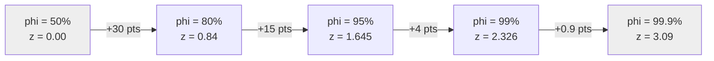

## Sensitivity of Safety Stock to Service Level Changes

### Overview

Safety stock under the standard normal-demand model is:

$$SS = z \cdot \sigma_{LT}$$

where $z$ is the z-score corresponding to the target cycle service level (CSL) and $\sigma_{LT}$ is the standard deviation of demand over lead time. Because $SS$ is a direct, linear function of $z$, but $z$ itself is a *nonlinear* (and increasingly steep) function of the service level $\phi$, small increases in target service level near the high end produce disproportionately large increases in required safety stock. This nonlinearity is the central planning concern in this section.

### The z–Service Level Relationship

$z = \Phi^{-1}(\phi)$, where $\Phi^{-1}$ is the inverse standard normal CDF and $\phi$ is the target cycle service level (probability of not stocking out in a replenishment cycle).

Representative values:

| Service Level $\phi$ | z-score | $\Delta z$ from previous row |
| --- | --- | --- |
| 50% | 0.000 | — |
| 80% | 0.842 | 0.842 |
| 85% | 1.036 | 0.194 |
| 90% | 1.282 | 0.246 |
| 95% | 1.645 | 0.363 |
| 97% | 1.881 | 0.236 |
| 98% | 2.054 | 0.173 |
| 99% | 2.326 | 0.272 |
| 99.5% | 2.576 | 0.250 |
| 99.9% | 3.090 | 0.514 |

**Key Points**

- Between 90% and 95%, $z$ rises by 0.363 — a large jump for a 5-point service improvement.
- Between 95% and 99%, $z$ rises by 0.681 across only 4 points of service level.
- Between 99% and 99.9%, $z$ rises by 0.764 across less than 1 point of service level.
- The marginal $z$ (and therefore marginal safety stock) required per unit of service-level improvement grows without bound as $\phi \to 100\%$, since $\Phi^{-1}(\phi) \to \infty$.

This is the well-known "diminishing returns" (or more precisely, *increasing marginal cost*) property of safety stock investment: each additional fraction of a percentage point of protection near the top of the distribution costs progressively more inventory.

### Sensitivity as a Derivative

To quantify sensitivity formally, treat $SS(\phi) = \Phi^{-1}(\phi) \cdot \sigma_{LT}$ and differentiate with respect to $\phi$:

$$\frac{dSS}{d\phi} = \sigma_{LT} \cdot \frac{d}{d\phi}\Phi^{-1}(\phi) = \frac{\sigma_{LT}}{\phi(z)}$$

where $\phi(z)$ is the standard normal probability density function (pdf) evaluated at $z = \Phi^{-1}(\phi)$:

$$\phi(z) = \frac{1}{\sqrt{2\pi}} e^{-z^2/2}$$

**[Inference]** Note: this section overloads $\phi$ for both "target service level" (a probability) and the "standard normal density function" (a common notational collision in inventory textbooks) — context disambiguates which is meant.

Since $\phi(z)$ (the density) is largest at $z=0$ (i.e., 50% service level) and shrinks toward zero in the tails, $\frac{1}{\phi(z)}$ — and hence the sensitivity $dSS/d\phi$ — grows explosively as service level approaches 100%. This is the calculus explanation for the "hockey stick" shape of the safety-stock-vs-service-level curve.

### Elasticity Formulation

A more planning-friendly measure is the **elasticity** of safety stock with respect to service level — the percentage change in $SS$ per percentage change in $\phi$:

$$E_{SS,\phi} = \frac{d SS/SS}{d\phi/\phi} = \frac{\phi}{z \cdot \phi(z)}$$

This tells a planner, for example, "a 1% increase in target service level near 98% requires approximately X% more safety stock," which is often more actionable than the raw derivative when comparing SKUs with different $\sigma_{LT}$.

### Sensitivity to Lead Time Variability Interaction

Safety stock sensitivity to service level is not independent of $\sigma_{LT}$. Since $SS = z \cdot \sigma_{LT}$, and under the combined demand/lead-time variability model:

$$\sigma_{LT} = \sqrt{L \cdot \sigma_D^2 + \bar{D}^2 \cdot \sigma_L^2}$$

any increase in $\sigma_{LT}$ (from either demand variability $\sigma_D$ or lead-time variability $\sigma_L$) **scales the entire sensitivity curve multiplicatively**. A SKU with high $\sigma_{LT}$ (erratic demand, unreliable supplier) will see much larger *absolute* safety stock swings for the same service-level change than a SKU with low $\sigma_{LT}$, even though the *relative* (percentage) sensitivity curve shape is identical — the $z$-to-$\phi$ relationship doesn't depend on $\sigma_{LT}$ at all.

**Key Points**

- Relative sensitivity (elasticity) depends only on the target service level $\phi$, not on $\sigma_{LT}$.
- Absolute sensitivity (units of stock per point of service level) scales linearly with $\sigma_{LT}$.
- High-variability SKUs are where service-level policy decisions have the largest inventory cost impact — prioritize sensitivity analysis there.

### Worked Example

Consider a SKU with $\sigma_{LT} = 50$ units.

Compute $SS$ at 90%, 95%, 98%, and 99.5% service levels:

| $\phi$ | $z$ | $SS = z \times 50$ |
| --- | --- | --- |
| 90% | 1.282 | 64.1 |
| 95% | 1.645 | 82.3 |
| 98% | 2.054 | 102.7 |
| 99.5% | 2.576 | 128.8 |

**Example**

- Moving from 90% → 95% (+5 points): $SS$ increases by 18.2 units (+28.4%).
- Moving from 95% → 98% (+3 points): $SS$ increases by 20.4 units (+24.8%).
- Moving from 98% → 99.5% (+1.5 points): $SS$ increases by 26.1 units (+25.4%).

Note that even though the service-level increments shrink (5 → 3 → 1.5 points), the absolute safety stock increments stay roughly the same size or grow — this is the sensitivity effect in action: the "cost per point" of service level rises sharply.

### Marginal Cost Per Percentage Point

Define **marginal safety stock cost** as the additional inventory (and its holding cost) required to move from $\phi_1$ to $\phi_2$:

$$\Delta SS = (z_2 - z_1) \cdot \sigma_{LT}$$

$$\Delta \text{Holding Cost} = \Delta SS \cdot C_h$$

where $C_h$ is the annual holding cost per unit. This lets a planner directly price out a proposed service-level increase before committing to a policy change.

**Example**

For the SKU above with $C_h = \$8$/unit/year, raising service level from 98% to 99.5%:

$$\Delta SS = 26.1 \text{ units}, \quad \Delta \text{Cost} = 26.1 \times 8 = \$208.80/\text{year}$$

Compare this to the expected stockout cost avoided (using the loss function / expected shortage per cycle, covered under expected stockout quantity calculus) to determine whether the service-level increase is economically justified — this is the core logic behind the **critical ratio / cost-based optimal service level** approach, as opposed to arbitrarily choosing round-number targets like 95% or 99%.

### Visualizing the Curve

Below is an SVG plotting $z$ against $\phi$, illustrating the convex, accelerating shape:

<svg xmlns="http://www.w3.org/2000/svg" viewBox="0 0 640 400">
<text x="320" y="24" text-anchor="middle" font-size="16" font-family="sans-serif" font-weight="bold">z-score vs. Service Level (svg_diagram)</text>
<line x1="60" y1="340" x2="600" y2="340" stroke="black" stroke-width="2" />
<line x1="60" y1="340" x2="60" y2="50" stroke="black" stroke-width="2" />
<text x="330" y="375" text-anchor="middle" font-size="13" font-family="sans-serif">Service Level (%)</text>
<text x="20" y="200" text-anchor="middle" font-size="13" font-family="sans-serif" transform="rotate(-90 20 200)">z-score</text>
<text x="60" y="358" text-anchor="middle" font-size="11" font-family="sans-serif">50</text>
<text x="195" y="358" text-anchor="middle" font-size="11" font-family="sans-serif">80</text>
<text x="330" y="358" text-anchor="middle" font-size="11" font-family="sans-serif">95</text>
<text x="465" y="358" text-anchor="middle" font-size="11" font-family="sans-serif">99</text>
<text x="590" y="358" text-anchor="middle" font-size="11" font-family="sans-serif">99.9</text>
<polyline points="60,340 195,262 330,171 400,120 465,80 530,45 590,10" fill="none" stroke="#2563eb" stroke-width="3" />
<circle cx="330" cy="171" r="4" fill="#dc2626" />
<circle cx="465" cy="80" r="4" fill="#dc2626" />
<circle cx="590" cy="10" r="4" fill="#dc2626" />
<text x="345" y="171" font-size="11" font-family="sans-serif" fill="#dc2626">95% (z=1.65)</text>
<text x="475" y="75" font-size="11" font-family="sans-serif" fill="#dc2626">99% (z=2.33)</text>
<text x="450" y="20" font-size="11" font-family="sans-serif" fill="#dc2626">99.9% (z=3.09)</text>
</svg>

### Practical Implications for Policy Design

**Key Points**

- **Avoid uniform blanket service levels.** Applying 99% service to every SKU is expensive; the sensitivity curve means high-service targets should be reserved for SKUs justified by criticality (A-items, safety/regulatory, high stockout cost), per service-level differentiation strategies (e.g., ABC/XYZ segmentation, discussed elsewhere in this chapter).
- **Diminishing marginal service, increasing marginal cost.** Beyond ~98–99%, further service gains are extremely capital-intensive; question whether the marginal holding cost is justified against the marginal stockout cost avoided.
- **Small target errors compound at high service levels.** A forecasting or policy error of ±1 percentage point in target $\phi$ has a much larger $SS$ consequence at $\phi=99\%$ than at $\phi=85\%$ — a governance argument for periodically re-validating service-level targets rather than treating them as static.
- **Sensitivity informs negotiation with stakeholders.** When sales/customer-service teams request higher fill rates, quantifying $\Delta SS$ and $\Delta$ Cost (as in the worked example) gives a concrete, defensible basis for trade-off discussions instead of an intuition-based debate.

**[Unverified]** Real-world demand distributions are frequently non-normal (e.g., intermittent, lumpy, or right-skewed demand for slow-movers), in which case the $z \cdot \sigma_{LT}$ formula and its sensitivity behavior are approximations; actual sensitivity may differ and is better assessed via empirical percentiles or bootstrapped simulation for such SKUs.

### Related Topics

- Cost-based (critical ratio) approach to determining optimal service level
- Service-level differentiation via ABC/XYZ segmentation
- Non-normal demand distributions and safety stock (Poisson, negative binomial, empirical percentile methods)
- Expected shortage per cycle and the standard normal loss function
- Combined demand and lead-time variability formula derivation
- Fill rate vs. cycle service level: distinct sensitivity behavior
- Multi-echelon safety stock sensitivity and risk pooling effects