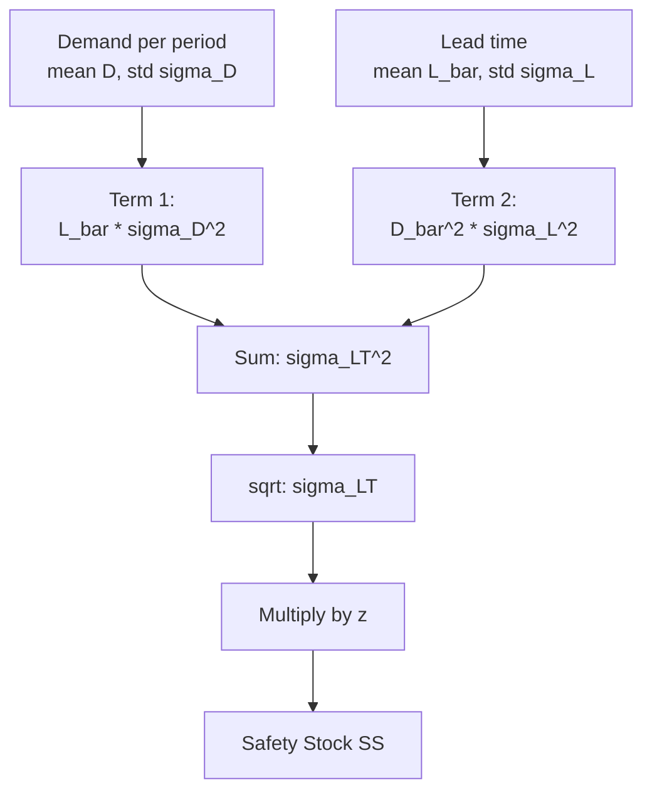

## King's Method for Combined Demand and Lead Time Variability

### Overview

King's method (attributed to Peter King, in his widely cited *APICS/Production and Inventory Management* article on safety stock) is the standard closed-form formula for computing safety stock when **both** demand and lead time are random variables. It generalizes the simple $SS = z \cdot \sigma_D \sqrt{L}$ formula (which assumes constant lead time) to the realistic case where lead time itself fluctuates from order to order.

### The Core Formula

$$SS = z \cdot \sqrt{\bar{L} \cdot \sigma_D^2 + \bar{D}^2 \cdot \sigma_L^2}$$

Where:

- $z$ = z-score for the target cycle service level
- $\bar{L}$ = average (mean) lead time
- $\sigma_D$ = standard deviation of demand per period (e.g., per day or per week)
- $\bar{D}$ = average demand per period
- $\sigma_L$ = standard deviation of lead time (in the same period units as $\bar{D}$ and $\sigma_D$)

The term under the square root, $\sigma_{LT}^2 = \bar{L} \cdot \sigma_D^2 + \bar{D}^2 \cdot \sigma_L^2$, is the **variance of demand over the (random) lead time**, and $\sigma_{LT} = \sqrt{\bar{L}\sigma_D^2 + \bar{D}^2\sigma_L^2}$ is its standard deviation.

**Key Points**

- The first term, $\bar{L} \cdot \sigma_D^2$, captures uncertainty from demand variability, scaled by how long (on average) that uncertainty accumulates.
- The second term, $\bar{D}^2 \cdot \sigma_L^2$, captures uncertainty from lead time variability, scaled by the square of average demand — meaning even modest lead-time variability can dominate total variance when average demand is large.
- If $\sigma_L = 0$ (deterministic lead time), the formula collapses to the classic $SS = z \cdot \sigma_D \sqrt{L}$.
- If $\sigma_D = 0$ (deterministic demand), the formula collapses to $SS = z \cdot \bar{D} \cdot \sigma_L$.

### Derivation Logic

King's formula follows from treating total demand over the lead time, $X_{LT}$, as the sum of a random number ($L$, itself random) of random daily demands ($D_1, D_2, \ldots$). Using the law of total variance for a random sum:

$$\text{Var}(X_{LT}) = E[L] \cdot \text{Var}(D) + \text{Var}(L) \cdot (E[D])^2$$

This is a direct application of the **compound distribution variance decomposition**:

$$\text{Var}(X_{LT}) = \underbrace{E[L]\,\text{Var}(D)}_{\text{demand variability, scaled by mean lead time}} + \underbrace{(E[D])^2\,\text{Var}(L)}_{\text{lead time variability, scaled by mean demand}^2}$$

**[Inference]** The formula assumes demand periods are i.i.d. (independent and identically distributed) and that demand and lead time are statistically independent of each other — both are standard simplifying assumptions in the inventory literature, not universally verified in practice.

### Step-by-Step Calculation Procedure

**Step 1 — Gather period-level demand statistics**

Collect historical demand data per unit period (day/week) and compute $\bar{D}$ and $\sigma_D$.

**Step 2 — Gather lead time statistics**

Collect historical (or supplier-quoted with variability data) lead times and compute $\bar{L}$ and $\sigma_L$, in the *same time units* as demand periods.

**Step 3 — Compute the combined variance**

$$\sigma_{LT}^2 = \bar{L} \cdot \sigma_D^2 + \bar{D}^2 \cdot \sigma_L^2$$

**Step 4 — Take the square root**

$$\sigma_{LT} = \sqrt{\sigma_{LT}^2}$$

**Step 5 — Select z for target service level**

Choose $z = \Phi^{-1}(\phi)$ per target cycle service level $\phi$.

**Step 6 — Compute safety stock**

$$SS = z \cdot \sigma_{LT}$$

### Worked Example

A distributor sells a SKU with the following characteristics:

- Average daily demand: $\bar{D} = 40$ units/day
- Standard deviation of daily demand: $\sigma_D = 8$ units/day
- Average lead time: $\bar{L} = 10$ days
- Standard deviation of lead time: $\sigma_L = 3$ days
- Target service level: 95% ($z = 1.645$)

**Example**

Step 3:

$$\sigma_{LT}^2 = (10)(8^2) + (40^2)(3^2) = (10)(64) + (1600)(9) = 640 + 14{,}400 = 15{,}040$$

Step 4:

$$\sigma_{LT} = \sqrt{15{,}040} \approx 122.6$$

Step 6:

$$SS = 1.645 \times 122.6 \approx 201.7 \text{ units} \approx 202 \text{ units}$$

**Comparison to the naive (constant lead time) formula**, which ignores $\sigma_L$:

$$SS_{naive} = z \cdot \sigma_D \sqrt{L} = 1.645 \times 8 \times \sqrt{10} \approx 1.645 \times 8 \times 3.162 \approx 41.6 \text{ units}$$

This comparison is stark: ignoring lead-time variability here understates safety stock by roughly **380%** (202 vs. 42 units) — demonstrating why supplier lead-time variability is often the dominant driver of safety stock in real supply chains, not demand variability.

**[Inference]** This magnitude of understatement is specific to this example's parameters (a relatively high $\sigma_L$ relative to $\bar{L}$, combined with high $\bar{D}$); the ratio will vary case by case, but the general direction — that ignoring $\sigma_L$ underestimates true risk — always holds when $\sigma_L > 0$.

### Variance Contribution Breakdown

| Source | Term | Value | % of Total Variance |
| --- | --- | --- | --- |
| Demand variability | $\bar{L}\sigma_D^2$ | 640 | 4.3% |
| Lead time variability | $\bar{D}^2\sigma_L^2$ | 14,400 | 95.7% |
| **Total** | $\sigma_{LT}^2$ | **15,040** | 100% |

**Key Points**

- In this example, lead time variability accounts for over 95% of total uncertainty — a common real-world pattern, especially for imported goods, single-source suppliers, or SKUs with historically inconsistent delivery performance.
- This decomposition is a diagnostic tool: it tells a planner whether to invest in demand forecasting improvements or supplier/logistics reliability improvements to reduce required safety stock most effectively.

### Diagram: Variance Decomposition Flow

### Unit Consistency Requirements

**Key Points**

- $\bar{D}$ and $\sigma_D$ must be expressed per the same period unit (e.g., both per day).
- $\bar{L}$ and $\sigma_L$ must be expressed in that *same* period unit (e.g., both in days) — mixing days and weeks is a common practical error that silently corrupts the calculation.
- If lead time data is naturally recorded in different units than demand data (e.g., lead time tracked in weeks, demand tracked daily), convert one to match the other before applying the formula.

### Assumptions and Limitations

**Key Points**

- **Normality assumption.** The formula computes only the mean and variance of lead-time demand; converting that into a safety stock figure via $z \cdot \sigma_{LT}$ implicitly assumes the lead-time demand distribution is approximately normal. For highly lumpy, intermittent, or heavily right-skewed demand, this can materially misstate the true percentile, and empirical or simulation-based approaches are preferable.
- **Independence assumption.** The formula assumes demand and lead time are independent. In practice this can be violated — e.g., a supplier's lead time may lengthen precisely during periods of high demand (capacity constraints), which the formula does not capture and would understate real risk in that case. **[Speculation]** Some practitioners apply an empirical correlation adjustment term to compensate, though this is not part of King's original formulation.
- **i.i.d. period demand.** The formula assumes demand in each period is drawn independently from an identical distribution; strong autocorrelation (e.g., trending or seasonal demand) violates this and generally requires a time-series-adjusted variance estimate rather than a flat $\sigma_D$.
- **Discrete lead time draws.** The formula treats lead time as a continuous random variable for computational convenience, though actual lead times are realized in discrete days; this is a standard, immaterial approximation for most practical lead time magnitudes.

### Relationship to Other Safety Stock Formulas

| Scenario | Formula | Notes |
| --- | --- | --- |
| Constant lead time, variable demand | $SS = z\sigma_D\sqrt{L}$ | Special case of King's ($\sigma_L=0$) |
| Variable lead time, constant demand | $SS = z\bar{D}\sigma_L$ | Special case of King's ($\sigma_D=0$) |
| Both variable (King's method) | $SS = z\sqrt{\bar{L}\sigma_D^2 + \bar{D}^2\sigma_L^2}$ | General case |
| Non-normal demand | Empirical percentile / simulation | Used when normality assumption fails |

### Practical Implementation Notes

**Key Points**

- **Data requirements.** King's method requires historical lead time *variability* data, not just average lead time — many ERP/MRP systems default to a single point-estimate lead time field and must be extended or supplemented (e.g., via a separate lead-time-variance table per supplier/SKU) to apply this formula correctly.
- **Rolling recalculation.** $\sigma_D$, $\bar{D}$, $\bar{L}$, and $\sigma_L$ should be recalculated periodically (e.g., monthly/quarterly) using a rolling window, since demand patterns and supplier reliability drift over time.
- **Supplier scorecard linkage.** Since $\sigma_L$ often dominates total variance (as shown above), tracking and actively managing supplier lead-time consistency (not just average lead time) is frequently a higher-leverage lever for safety stock reduction than demand forecast improvement.

**Next Steps**

- Empirical/simulation-based safety stock for non-normal demand distributions
- Correlation-adjusted variants of King's formula for dependent demand and lead time
- Supplier lead-time variability measurement and scorecarding methodologies
- Multi-echelon extensions of combined variability safety stock
- Sensitivity analysis of King's formula parameters (covered under safety stock sensitivity to service level)
- Bootstrap and Monte Carlo simulation approaches to lead-time-demand risk modeling
- Reorder point (ROP) calculation incorporating King's method safety stock