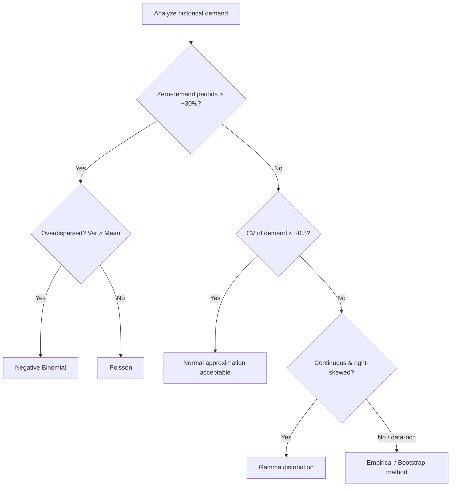

## Non-Normal Demand Distributions in Safety Stock Modeling

### Overview

The classical safety stock formula $SS = z \cdot \sigma_{LT}$ assumes lead-time demand follows a **normal distribution**. This assumption is convenient but frequently wrong in practice — particularly for slow-moving SKUs, intermittent demand, spare parts, and promotional items. When demand is non-normal, applying the normal-based $z$-score formula can produce safety stock levels that are significantly wrong (in either direction), because it mischaracterizes the actual shape and tail behavior of the demand distribution.

### Why the Normal Assumption Fails

**Key Points**

- **Non-negativity violation.** Normal distributions extend to $-\infty$, but demand cannot be negative. For SKUs with low mean and high variability (low $\bar{D}/\sigma_D$ ratio), the normal model assigns non-trivial probability mass to impossible negative demand values, distorting the computed percentiles.
- **Discreteness.** Many SKUs (especially slow movers) sell in small integer quantities (0, 1, 2, 3 units per period) — a continuous normal distribution poorly approximates such granular, discrete outcomes.
- **Intermittency.** Demand for many SKUs is **zero** in most periods with occasional non-zero spikes (spare parts, MRO items, long-tail retail). This produces a distribution with a large point-mass at zero — nothing like a symmetric bell curve.
- **Skewness.** Real demand is often right-skewed (occasional very large orders) rather than symmetric, meaning the true 95th percentile may be considerably farther from the mean than $1.645\sigma$ would suggest.
- **Overdispersion.** Real demand variance frequently exceeds its mean ($\sigma_D^2 > \bar{D}$), which a Poisson model (mean = variance) cannot capture, motivating the negative binomial alternative described below.

### Diagnosing Non-Normality

**Key Points**

- **Coefficient of variation (CV) test.** $CV = \sigma_D / \bar{D}$. As a general heuristic, when $CV > 0.5$–$1.0$, or when $\bar{D}$ is small (single digits per period), the normal approximation becomes increasingly unreliable. **[Inference]** Specific CV thresholds vary across the inventory literature; there is no single universally agreed cutoff, and this should be treated as a practical rule of thumb rather than a hard statistical boundary.
- **Proportion of zero-demand periods.** If a large share of periods (commonly cited threshold: >30%) show zero demand, the SKU is typically classified as "intermittent" and normal-based methods are discouraged in favor of specialized intermittent-demand methods.
- **Skewness and kurtosis statistics.** Compute sample skewness and kurtosis from historical demand; substantial deviation from 0 (skewness) and 3 (kurtosis, for a normal reference) signals non-normality.
- **Demand classification schemes** (e.g., the Syntetos-Boylan classification) categorize SKUs into smooth, erratic, intermittent, and lumpy demand based on CV of demand size and average inter-demand interval, guiding which forecasting/safety-stock method to apply.

### Demand Classification Framework (Syntetos-Boylan)

| Category | CV² of demand size | Avg. inter-demand interval | Typical Approach |
| --- | --- | --- | --- |
| Smooth | Low (<0.49) | Low (<1.32) | Normal-based methods (standard) |
| Erratic | High (≥0.49) | Low (<1.32) | Normal-based, with wider tails / empirical adjustment |
| Intermittent | Low (<0.49) | High (≥1.32) | Poisson / negative binomial, Croston's method |
| Lumpy | High (≥0.49) | High (≥1.32) | Negative binomial, bootstrapping, specialized methods |

**[Unverified]** The 0.49 and 1.32 threshold values originate from the Syntetos-Boylan-Croston research and are widely cited, but different studies and software implementations sometimes use slightly adjusted cutoffs; treat these as reference benchmarks rather than fixed universal constants.

### Alternative Distributions for Safety Stock Modeling

#### Poisson Distribution

Used for low-volume, discrete-count demand where variance approximately equals the mean ($\sigma_D^2 \approx \bar{D}$).

$$P(X = k) = \frac{e^{-\lambda}\lambda^k}{k!}$$

Safety stock is computed by finding the smallest $k$ such that the cumulative Poisson probability meets or exceeds the target service level $\phi$:

$$SS = k^* - \lambda_{LT}, \quad \text{where } k^* = \min\{k : \sum_{i=0}^{k} P(X=i) \geq \phi\}$$

Here $\lambda_{LT} = \bar{D} \cdot \bar{L}$ is the expected demand over the lead time.

**Key Points**

- Appropriate for slow-moving parts with roughly Poisson-like arrival patterns (e.g., random independent customer orders for a spare part).
- A key limitation: Poisson forces variance = mean, which understates risk for demand that is *overdispersed* (variance > mean) — very common in real intermittent demand data.

#### Negative Binomial Distribution

Preferred over Poisson when demand is overdispersed ($\sigma_D^2 > \bar{D}$), which is the empirically common case for intermittent/lumpy demand.

$$P(X=k) = \binom{k+r-1}{k} p^r (1-p)^k$$

Parameters $r$ (dispersion) and $p$ are fit from the sample mean $\bar{D}$ and variance $\sigma_D^2$:

$$p = \frac{\bar{D}}{\sigma_D^2}, \qquad r = \frac{\bar{D}^2}{\sigma_D^2 - \bar{D}}$$

Safety stock is again computed as the $\phi$-th percentile of the fitted negative binomial distribution over the lead time, minus the expected lead-time demand.

**Key Points**

- Requires $\sigma_D^2 > \bar{D}$ for the parameters to be valid (if $\sigma_D^2 \leq \bar{D}$, Poisson should be used instead).
- Widely used in spare-parts and service-parts inventory management literature as the standard alternative to the normal model.

#### Gamma Distribution

A continuous, right-skewed, non-negative distribution often used to model lead-time demand when it is continuous (not count-based) but skewed — e.g., aggregate weekly demand for a moderately fast-moving item that still shows meaningful right-skew.

$$f(x) = \frac{1}{\Gamma(k)\theta^k} x^{k-1} e^{-x/\theta}, \quad x > 0$$

Shape ($k$) and scale ($\theta$) parameters are fit via method-of-moments from $\bar{D}_{LT}$ and $\sigma_{LT}$:

$$\theta = \frac{\sigma_{LT}^2}{\bar{D}_{LT}}, \qquad k = \frac{\bar{D}_{LT}^2}{\sigma_{LT}^2}$$

Safety stock is the $\phi$-th percentile of the fitted gamma distribution minus $\bar{D}_{LT}$.

**Key Points**

- Naturally respects the non-negativity constraint that the normal distribution violates.
- Reduces to a good approximation of the normal distribution as $k$ grows large (high-volume, less-skewed demand), and increasingly diverges from normal as $k$ shrinks (making it a flexible choice across a range of skewness levels).

### Empirical / Bootstrap Approach

When no parametric distribution fits well, or historical data is rich enough, safety stock can be computed directly from the empirical distribution of historical lead-time demand without assuming any functional form:

**Step-by-step procedure:**

1. Collect historical demand observations for each period within representative lead-time windows.
2. Construct (via bootstrap resampling) a large number of simulated lead-time-demand totals by resampling historical daily/weekly demand values (with replacement) across the lead-time length, repeated thousands of times.
3. Sort the simulated lead-time-demand totals.
4. Take the $\phi$-th percentile of the simulated distribution directly as the target inventory position (base stock level); safety stock is this percentile minus average lead-time demand.

**Key Points**

- Makes no parametric assumption at all — directly captures whatever skewness, kurtosis, or intermittency exists in the real historical data.
- Requires a reasonably large and representative historical dataset; short or non-stationary histories (e.g., a new product with 3 months of data) undermine bootstrap reliability.
- Computationally more intensive than closed-form formulas but increasingly standard given modern computing capacity and widespread use in advanced APS (Advanced Planning Systems) and inventory optimization software.

### Diagram: Distribution Selection Logic

### Worked Example: Poisson vs. Negative Binomial vs. Normal

A spare part shows: mean lead-time demand $\lambda_{LT} = \bar{D}_{LT} = 4$ units, variance of lead-time demand $\sigma_{LT}^2 = 12$ (overdispersed, since $12 > 4$). Target service level $\phi = 95\%$.

**Example**

*Normal approach (incorrect but commonly misapplied):*

$$\sigma_{LT} = \sqrt{12} \approx 3.46, \quad SS = 1.645 \times 3.46 \approx 5.7 \text{ units}$$

*Negative binomial approach (appropriate, since variance > mean):*

$$p = \frac{4}{12} = 0.333, \qquad r = \frac{4^2}{12-4} = \frac{16}{8} = 2$$

Computing the cumulative negative binomial distribution with $r=2$, $p=0.333$ and finding $k^*$ such that cumulative probability $\geq 0.95$ **[Inference — requires numerical CDF evaluation, not hand-calculable in closed form]** typically yields $k^* \approx 11$–$12$ units, giving:

$$SS \approx 12 - 4 = 8 \text{ units (approximate)}$$

**Key Points**

- The normal approximation (5.7 units) understates the negative-binomial-implied safety stock (~8 units) by roughly 30–40% in this overdispersed example — a materially different reorder point that could lead to a materially higher realized stockout rate than intended.
- This gap illustrates why blindly applying the normal formula to low-volume, overdispersed spare parts is a common and costly practical error.

### Practical Implementation Considerations

**Key Points**

- **Software support.** Most modern inventory optimization / APS platforms (e.g., specialized demand planning modules) offer built-in negative binomial or empirical percentile calculations for classified intermittent SKUs; simpler ERP safety stock modules often default to the normal formula regardless of demand shape, requiring manual override or supplementary tooling for affected SKUs.
- **Segment, don't blanket-apply.** A common and recommended practice is to run demand classification (e.g., Syntetos-Boylan) across the full SKU portfolio, then route each segment to the appropriate distributional method rather than applying one formula uniformly.
- **Re-validation cadence.** Because demand patterns (especially intermittency) can shift as a product moves through its lifecycle, periodic re-classification (e.g., quarterly) is advisable rather than a one-time distributional assignment.
- **Behavior may vary** across specific dataset characteristics, software implementations, and parameter-fitting methods; the general recommendations above reflect standard inventory-management practice but should be validated against the specific SKU population in question.

**Next Steps**

- Croston's method and its variants (SBA, TSB) for intermittent demand forecasting
- Syntetos-Boylan-Croston (SBC) demand classification in depth
- Bootstrap/Monte Carlo simulation methods for inventory optimization
- Fitting and validating gamma/negative binomial parameters from limited historical data
- Fill-rate-based (vs. cycle-service-level-based) safety stock under non-normal demand
- Spare parts and service-level inventory management (specialized subfield)
- Multi-echelon inventory optimization under non-normal demand distributions