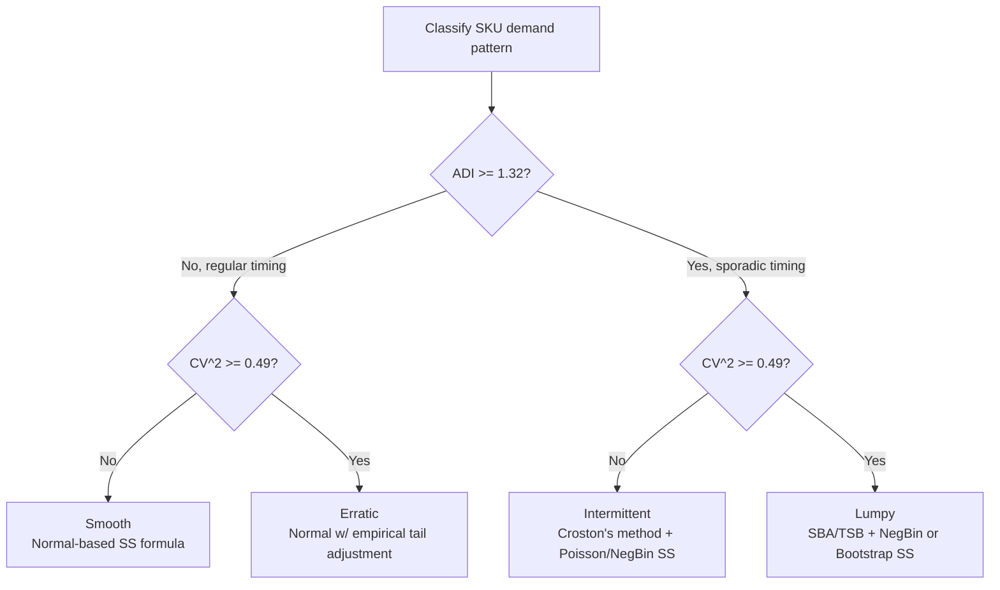

## Safety Stock for Slow-Moving and Intermittent Demand

### Overview

Slow-moving and intermittent-demand SKUs (spare parts, MRO items, long-tail retail SKUs, low-volume service parts) violate the core assumptions of classical normal-distribution safety stock formulas: continuous, high-volume, roughly symmetric demand. This section covers the specific methods developed to address safety stock calculation when demand occurs sporadically, in small discrete quantities, with many zero-demand periods.

### Characterizing Intermittent Demand

**Key Points**

- **Intermittent demand** is defined by demand that occurs only in some periods, with **zero demand** in the remainder — as opposed to continuous demand present (at varying levels) in every period.
- Two defining parameters: **average inter-demand interval (ADI)** — the average number of periods between successive non-zero demand occurrences — and the **coefficient of variation squared (CV²)** of the non-zero demand sizes.
- **Lumpy demand** is a further subcategory: intermittent demand where the non-zero demand sizes themselves are also highly variable (high CV²), as opposed to intermittent-but-consistent-size demand.
- Standard forecasting error metrics (MAPE, in particular) become unstable or meaningless for intermittent demand because they involve dividing by actual demand, which is frequently zero.

### Demand Classification (Syntetos-Boylan-Croston Framework)

| Category | ADI | CV² | Characteristics |
| --- | --- | --- | --- |
| Smooth | < 1.32 | < 0.49 | Regular, low-variability — normal-based methods fine |
| Erratic | < 1.32 | ≥ 0.49 | Regular timing, variable quantity |
| Intermittent | ≥ 1.32 | < 0.49 | Sporadic timing, consistent quantity when it occurs |
| Lumpy | ≥ 1.32 | ≥ 0.49 | Sporadic timing AND variable quantity — hardest case |

**[Unverified]** The specific threshold values (1.32 and 0.49) come from the original Syntetos-Boylan-Croston research; some subsequent studies and commercial software use adjusted cutoffs, so treat these as standard reference benchmarks rather than universal constants.

### Diagram: Classification and Method Routing

### Croston's Method (Demand Forecasting Foundation)

Before computing safety stock for intermittent demand, the underlying forecast itself typically uses **Croston's method** rather than standard exponential smoothing, because standard smoothing applied directly to a series full of zeros produces biased, erratic forecasts.

Croston's method separately forecasts:

1. **Non-zero demand size** ($\hat{z}_t$), updated via exponential smoothing only when demand occurs.
2. **Inter-demand interval** ($\hat{p}_t$), updated via exponential smoothing only when demand occurs, tracking the number of periods since the last non-zero demand.

The forecast demand rate per period is then:

$$\hat{D}_t = \frac{\hat{z}_t}{\hat{p}_t}$$

**Key Points**

- Croston's method updates its two component estimates only on periods with non-zero demand, leaving the forecast unchanged during zero-demand stretches — this avoids the artificial "demand fade to zero" bias that plain exponential smoothing exhibits on intermittent series.
- **Known bias:** Croston's original method has a well-documented **positive bias** — it tends to overforecast expected demand on average. This has been demonstrated analytically in follow-up research.
- **Syntetos-Boylan Approximation (SBA)** corrects this bias with a simple multiplicative adjustment factor applied to the Croston forecast, and is generally recommended over the original Croston method for this reason.
- **Teunter-Syntetos-Babai (TSB) method** is a further variant that updates the demand probability every period (not just at demand occurrences), better handling the case where demand patterns are shifting or obsolescence risk is a concern.

### From Forecast to Safety Stock: Distributional Approaches

Once a demand rate estimate exists (via Croston/SBA/TSB), safety stock still requires a *distribution* to determine the percentile corresponding to the target service level. The normal distribution is generally inappropriate here (see prior chapter section on non-normal demand); the standard alternatives are:

#### Poisson-Based Safety Stock

Appropriate when non-zero demand sizes are fairly consistent (low CV², i.e., "intermittent" rather than "lumpy" per the classification table) and variance of lead-time demand ≈ mean.

$$SS = k^* - \lambda_{LT}$$

where $k^*$ is the smallest integer such that the cumulative Poisson probability with rate $\lambda_{LT} = \hat{D} \cdot \bar{L}$ reaches the target service level $\phi$.

#### Negative Binomial-Based Safety Stock

Preferred when demand is **lumpy** (high CV², overdispersed: variance of lead-time demand > mean), which is the more common real-world case for genuinely lumpy SKUs.

$$p = \frac{\bar{D}_{LT}}{\sigma_{LT}^2}, \qquad r = \frac{\bar{D}_{LT}^2}{\sigma_{LT}^2 - \bar{D}_{LT}}$$

Safety stock is the difference between the $\phi$-th percentile of the fitted negative binomial and the mean lead-time demand $\bar{D}_{LT}$.

#### Empirical/Bootstrap-Based Safety Stock

When historical data is sufficiently rich, directly resample historical demand values across simulated lead-time windows (with replacement) to build an empirical lead-time-demand distribution, then take its $\phi$-th percentile directly — bypassing any parametric distributional assumption entirely. This is often the most robust approach for genuinely lumpy, hard-to-parametrize SKUs, given adequate data history.

### Worked Example

A service-parts SKU has these characteristics over a 90-day history:

- Non-zero demand occurred in 18 of 90 days → ADI $\approx 90/18 = 5$ days (≥ 1.32 → sporadic timing)
- Average non-zero demand size: 6 units, std dev of non-zero demand size: 2 units → CV² $= (2/6)^2 \approx 0.11$ (< 0.49 → consistent size when it occurs)
- Classification: **Intermittent** (not lumpy) → Poisson-based approach is appropriate

**Example**

Forecast demand rate via Croston/SBA: $\hat{D} \approx 6 \times (18/90) = 1.2$ units/day (demand size × frequency of occurrence).

Lead time: $\bar{L} = 7$ days → $\lambda_{LT} = 1.2 \times 7 = 8.4$ units expected over lead time.

Target service level: 95%. Using cumulative Poisson probabilities with $\lambda = 8.4$:

| $k$ | Cumulative $P(X \leq k)$ |
| --- | --- |
| 12 | ~0.885 |
| 13 | ~0.928 |
| 14 | ~0.959 |

The smallest $k$ reaching 95% is $k^* = 14$.

$$SS = 14 - 8.4 = 5.6 \approx 6 \text{ units}$$

**[Inference]** The cumulative Poisson values shown are standard tabulated/computed results for $\lambda = 8.4$; exact values would typically be obtained via statistical software (e.g., a Poisson CDF function) rather than hand calculation, and are presented here rounded for illustration.

### Reorder Point Under Intermittent Demand

The reorder point (ROP) formula structure is unchanged conceptually, but its inputs come from the intermittent-demand-specific forecast and distribution:

$$ROP = \bar{D}_{LT} + SS = \lambda_{LT} + SS$$

For the example above: $ROP = 8.4 + 5.6 = 14$ units (i.e., simply $k^*$, since $SS$ was defined as $k^* - \lambda_{LT}$).

### Special Considerations for Slow-Moving Inventory

**Key Points**

- **(s, Q) vs. periodic review implications.** For very slow movers, continuous review with a low reorder point (s,Q) policy is common since demand events are rare enough that periodic review batching offers little benefit and risks larger review-period-driven safety stock inflation.
- **Minimum order quantities and lot sizing interact with safety stock.** If supplier MOQs force order quantities far above the computed EOQ, effective safety stock coverage duration extends automatically — this should be considered jointly with reorder point setting, not in isolation (covered further under EOQ/lot-sizing interaction topics).
- **Obsolescence risk trade-off.** Because slow movers by definition sell rarely, holding high safety stock carries elevated obsolescence/write-off risk relative to fast movers — the standard holding-cost-vs-stockout-cost trade-off calculus should incorporate an explicit obsolescence cost term for these SKUs, not just standard carrying cost.
- **Data sparsity challenge.** Slow movers inherently generate less historical data per unit time, making parameter estimation (for $\hat{D}$, $\sigma_D$, or empirical bootstrap distributions) statistically noisier; longer historical windows or Bayesian/pooled estimation across similar SKUs are common mitigations. **[Speculation]** The specific choice of pooling method (e.g., pooling across a product family) is context-dependent and not a single standardized formula in the literature.
- **Zero-safety-stock policies.** For extremely slow-moving, low-criticality items, some organizations deliberately carry zero safety stock and accept occasional stockouts/backorders as economically preferable to carrying rarely-used inventory — a valid policy outcome of the cost-based trade-off, not a modeling failure.

### Software and Practical Implementation

**Key Points**

- Standard ERP MRP modules frequently lack native Croston/SBA/TSB forecasting or Poisson/negative-binomial safety stock calculations, defaulting instead to normal-distribution-based safety stock regardless of demand pattern — this is a common source of poorly-calibrated safety stock for spare parts categories in practice.
- Dedicated service-parts planning software and advanced demand-planning platforms typically include built-in intermittent-demand classification and appropriate distributional safety stock calculations as standard features.
- **Behavior may vary** by specific software implementation, and organizations without access to specialized tooling often approximate intermittent-demand safety stock using spreadsheet-based Poisson/negative-binomial calculations or simplified empirical percentile lookups.

### Related Topics

- Croston's method, SBA, and TSB forecasting methods in depth
- Syntetos-Boylan-Croston (SBC) demand classification methodology
- Bootstrap/Monte Carlo simulation for lead-time-demand distributions
- Obsolescence cost modeling and its integration into safety stock economics
- (s, Q) vs. (R, S) inventory policies for slow-moving items
- Multi-echelon spare parts inventory optimization
- Service-level vs. fill-rate distinctions for low-volume SKUs