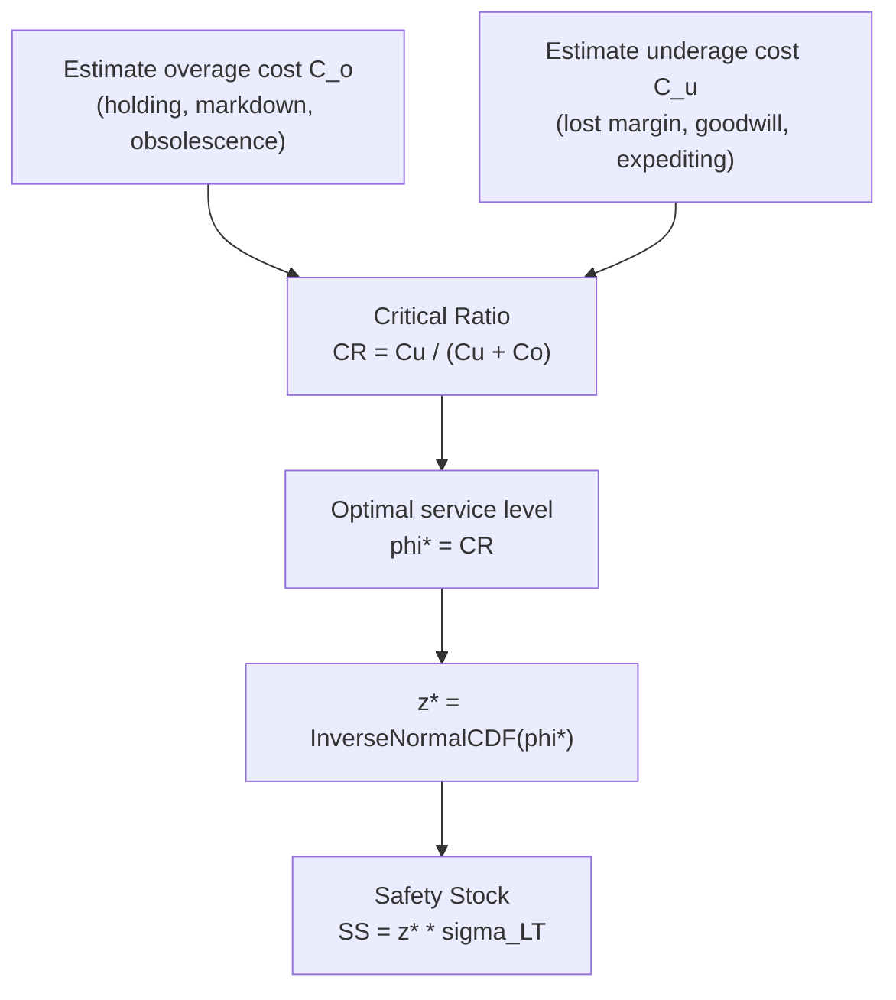

## The Newsvendor Model and the Critical Ratio

### Overview

The newsvendor model (also called the "newsboy problem") is the foundational single-period inventory optimization model that provides the economic justification for the target service level $\phi$ used throughout safety stock calculus. Rather than arbitrarily picking a service level (e.g., "95%"), the newsvendor model derives the **economically optimal** service level directly from the cost of overstocking versus the cost of understocking — this optimal service level is called the **critical ratio**.

### The Core Problem Setup

A decision-maker must choose an order/stock quantity $Q$ before observing actual demand $D$ (a random variable), for a single selling period. Two error types are possible:

- **Overage (overstock):** $Q > D$ — leftover units incur an overage cost $C_o$ per unit (e.g., salvage loss, holding cost, obsolescence, markdown loss).
- **Underage (understock):** $Q < D$ — unmet demand incurs an underage cost $C_u$ per unit (e.g., lost margin, lost customer goodwill, expediting cost, backorder cost).

The objective is to choose $Q$ to minimize total expected cost (equivalently, maximize expected profit).

### Deriving the Critical Ratio

**Step 1 — Define expected total cost as a function of Q**

$$E[TC(Q)] = C_o \int_0^Q (Q-x)f(x)\,dx + C_u \int_Q^{\infty} (x-Q)f(x)\,dx$$

where $f(x)$ is the probability density function of demand.

**Step 2 — Differentiate with respect to Q and set to zero**

Using Leibniz's rule to differentiate the expected cost function and setting the derivative to zero to find the optimum:

$$\frac{d E[TC(Q)]}{dQ} = C_o \cdot F(Q) - C_u \cdot [1-F(Q)] = 0$$

**Step 3 — Solve for F(Q)**

$$C_o F(Q) = C_u [1-F(Q)]$$

$$C_o F(Q) + C_u F(Q) = C_u$$

$$F(Q^*) = \frac{C_u}{C_u + C_o}$$

This ratio, $\frac{C_u}{C_u + C_o}$, is the **critical ratio (CR)** — it equals the cumulative probability $F(Q^*)$ at the optimal order quantity, meaning it is exactly the **optimal cycle service level**:

$$CR = \phi^* = \frac{C_u}{C_u + C_o}$$

**Key Points**

- The critical ratio directly answers "what service level should I actually target?" — replacing an arbitrary round-number choice (95%, 99%) with one grounded in the actual economics of the specific product.
- $Q^* = F^{-1}(CR)$ — the optimal order quantity is the $CR$-th percentile of the demand distribution, found by inverting the demand CDF at the critical ratio.
- If $C_u$ (understock cost) is high relative to $C_o$ (overstock cost), $CR$ approaches 1, justifying a high service level and large safety stock.
- If $C_o$ is high relative to $C_u$, $CR$ is low, justifying a lower service level and less safety stock — carrying excess inventory is more costly than occasionally running out.
- If $C_u = C_o$, $CR = 0.5$, meaning the optimal policy targets the median of the demand distribution.

### Connecting the Critical Ratio to Safety Stock

Under the standard normal-demand safety stock model, the critical ratio directly determines the z-score to use:

$$z^* = \Phi^{-1}(CR) = \Phi^{-1}\left(\frac{C_u}{C_u+C_o}\right)$$

$$SS^* = z^* \cdot \sigma_{LT}$$

This is the formal bridge between the classical safety stock formula (which requires choosing a $z$) and the newsvendor model (which derives the "correct" $z$ from cost data), replacing subjective service-level target-setting with a cost-optimization result.

### Diagram: Critical Ratio Derivation Flow

### Worked Example — Classic Newsvendor (Single Period)

A seasonal product costs $C = \$20$/unit to procure and sells at $P = \$50$/unit. Unsold units are salvaged at $S = \$5$/unit at season end.

**Example**

Underage cost (lost margin from not having a unit to sell):

$$C_u = P - C = 50 - 20 = \$30 \text{ per unit}$$

Overage cost (net loss on each unsold unit):

$$C_o = C - S = 20 - 5 = \$15 \text{ per unit}$$

Critical ratio:

$$CR = \frac{30}{30+15} = \frac{30}{45} = 0.667 \; (66.7\%)$$

If demand is normally distributed with mean 1,000 units and $\sigma = 150$ units:

$$z^* = \Phi^{-1}(0.667) \approx 0.431$$

$$Q^* = 1000 + 0.431 \times 150 \approx 1{,}065 \text{ units}$$

**Interpretation:** Despite the healthy margin structure, the fairly high overage cost relative to underage cost (salvage recovers only 25% of cost) pulls the optimal target service level down to 66.7% — well below the "default" 95% many practitioners might otherwise assume, illustrating why blindly applying a standard service level without cost analysis can be economically suboptimal in either direction.

### Worked Example — Applying Critical Ratio to Ongoing Replenishment Safety Stock

For a continuously replenished (non-seasonal) SKU, the underage/overage costs map differently:

- $C_u$: cost of a stockout (lost sale margin, expediting cost, or backorder handling cost, per unit short)
- $C_o$: annual holding cost per unit (since overstock in a replenishment context is carried and re-sold later, not lost — the "cost" is the *holding cost*, not the full purchase cost)

**Example**

A distributor estimates:

- Stockout cost: $C_u = \$40$/unit (expediting + margin loss)
- Annual holding cost: $C_o = \$8$/unit/year

$$CR = \frac{40}{40+8} = \frac{40}{48} = 0.833 \;(83.3\%)$$

$$z^* = \Phi^{-1}(0.833) \approx 0.967$$

Given $\sigma_{LT} = 60$ units:

$$SS^* = 0.967 \times 60 \approx 58 \text{ units}$$

**Key Points**

- In the replenishment context, $C_o$ is properly the *marginal annual holding cost*, not the full unit cost — this is a common point of confusion when adapting the single-period newsvendor logic to multi-period replenishment systems.
- **[Inference]** This adaptation is a widely used practical heuristic bridging the single-period newsvendor model to continuous review systems; it is an approximation rather than a formally re-derived multi-period optimal policy, since the newsvendor model's original derivation is strictly single-period.

### Estimating Underage and Overage Costs in Practice

**Key Points**

- **Underage cost ($C_u$) components** commonly include: lost contribution margin, cost of expedited replenishment (air freight vs. ocean, e.g.), cost of a backorder/rush order process, and a goodwill/customer-churn cost component that is inherently harder to quantify and is often estimated judgmentally or via customer research.
- **Overage cost ($C_o$) components** commonly include: annual holding cost (capital cost of tied-up inventory, warehousing, insurance, shrinkage/obsolescence risk) — see standard holding cost rate derivations elsewhere in this curriculum.
- **Goodwill cost estimation is the most contested input.** Unlike holding cost (fairly mechanically computable) or gross margin (directly observable), the "cost" of a dissatisfied or churned customer is frequently estimated via proxy methods (customer lifetime value impact, historical churn correlation with stockout incidents) and carries meaningfully more uncertainty. **[Speculation]** Different organizations may reasonably arrive at quite different goodwill cost estimates for economically similar situations, given the inherent difficulty of measuring this cost directly.

### Sensitivity of the Critical Ratio to Cost Estimates

**Key Points**

- Because $CR = C_u/(C_u+C_o)$ is a ratio, the optimal service level is more sensitive to the *relative* magnitude of $C_u$ and $C_o$ than to their absolute values — doubling both costs proportionally leaves $CR$ (and thus $SS^*$) completely unchanged.
- Small errors in estimating $C_u$ (often the harder cost to pin down, due to the goodwill component) can materially shift the computed optimal service level, especially when $C_u$ and $C_o$ are of comparable magnitude (where $CR$ is most sensitive to their ratio).
- A practical mitigation is **sensitivity/scenario analysis**: compute $SS^*$ under a plausible low, base, and high estimate of $C_u$, and assess whether the resulting safety stock range is operationally tolerable, rather than treating a single point estimate of $CR$ as precise.

### Assumptions and Limitations

**Key Points**

- **Single-period framing.** The newsvendor model was originally derived for genuinely single-period problems (seasonal goods, perishables); its extension to ongoing multi-period replenishment (as in the second worked example) is a widely used but formally approximate adaptation, not an exact re-derivation for that setting.
- **Known demand distribution.** The model assumes the demand distribution ($F$) is known or well-estimated; in practice this is itself uncertain, compounding the overall estimation error alongside cost uncertainty.
- **Linear cost structure.** The model assumes constant per-unit overage and underage costs; real cost structures sometimes exhibit nonlinearities (e.g., stepped expediting costs, tiered salvage pricing) that a more complex model would be needed to capture precisely.
- **Behavior may vary** depending on how closely the actual cost structure and demand distribution of a specific SKU matches these idealized assumptions; the model provides a principled starting point rather than a guaranteed-optimal real-world prescription.

### Related Topics

- Holding cost rate derivation and its components
- Stockout cost estimation methodologies (expediting, goodwill, backorder costs)
- Multi-period extensions of the newsvendor model (base-stock policy under repeated newsvendor logic)
- Service-level differentiation via ABC/XYZ segmentation using critical-ratio logic per segment
- Sensitivity of safety stock to service level changes (prior chapter section)
- Perishable and seasonal inventory management
- Expected shortage cost and the standard normal loss function