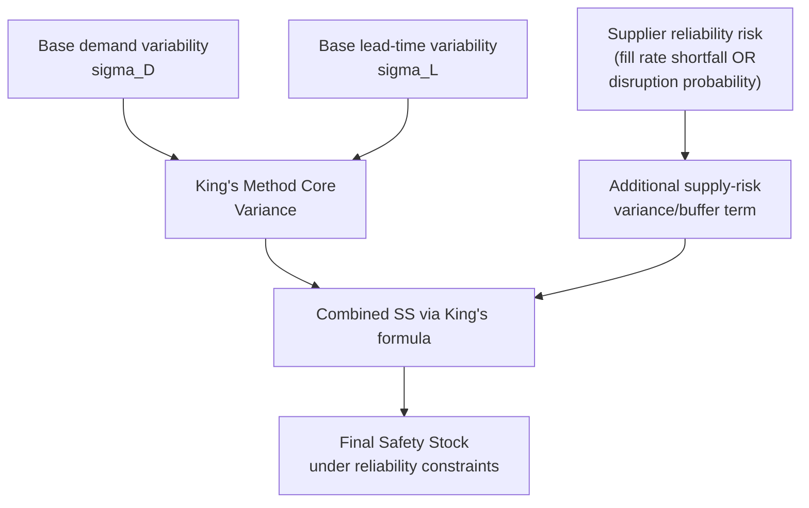

## Safety Stock Under Supplier Reliability Constraints

### Overview

Supplier reliability constraints extend the basic safety stock calculus beyond ordinary lead-time and demand variability to account for **discrete, higher-impact supply disruptions**: partial fulfillment, complete order failures, quality rejections, and capacity-driven allocation. These differ statistically from the continuous lead-time variability captured by King's method (covered earlier in this chapter) — they are often better modeled as **probabilistic disruption events** layered on top of standard variability, rather than as an increase in $\sigma_L$ alone.

### Distinguishing Reliability Risk from Lead-Time Variability

**Key Points**

- **Lead-time variability** (captured by $\sigma_L$ in King's method) models *continuous* fluctuation in delivery timing — a shipment might arrive a few days early or late around a stable average.
- **Supplier reliability risk** captures *discrete* failure modes: an order fails to arrive at all within a planning-relevant window, arrives with only partial quantity fulfilled, or arrives with a quality defect rate requiring rejection of part of the shipment.
- Treating a reliability problem purely as "high $\sigma_L$" tends to understate risk, because the normal-distribution-based King's method formula assumes a roughly symmetric, continuous variability pattern — not a "usually fine, occasionally catastrophic" bimodal pattern that discrete supply failures actually produce.
- **[Inference]** This distinction is a widely recognized point in supply chain risk literature, though the specific choice of statistical treatment (mixture model vs. inflated $\sigma_L$ vs. separate buffer) varies by practitioner and context rather than following one single standardized formula.

### Modeling Approach 1: Fill-Rate-Adjusted Safety Stock

When a supplier has a known historical **order fill rate** $FR_s$ (the fraction of ordered quantity typically received, e.g., 92%), the effective mean lead-time demand requirement can be grossed up to compensate:

$$Q_{effective} = \frac{Q_{required}}{FR_s}$$

For safety stock specifically, if partial shortfalls behave as an additional independent source of quantity variance, an additional variance term can be incorporated:

$$\sigma_{supply}^2 = \bar{D}_{LT}^2 \cdot \text{Var}(1 - FR_s)$$

$$\sigma_{total} = \sqrt{\sigma_{LT}^2 + \sigma_{supply}^2}$$

$$SS = z \cdot \sigma_{total}$$

**Key Points**

- This treats supplier under-fulfillment as an additional independent variance source, combined with demand/lead-time variance under a square-root-of-sum-of-squares aggregation (an extension of the same variance-additivity logic used in King's method).
- **[Inference]** This formulation is a reasonable, commonly applied extension of the standard variance-additivity approach, but is not as universally standardized in the literature as King's core formula itself — different organizations may implement variants of this supply-side variance term.

### Modeling Approach 2: Disruption Probability / Mixture Model

For suppliers with occasional **complete order failures** (not just partial shortfalls) — e.g., a $p_{fail}$ probability that an order doesn't arrive at all within the expected window, requiring a full extra lead-time cycle to recover — a mixture model separates "normal" outcomes from "disruption" outcomes:

$$E[LT_{effective}] = (1-p_{fail}) \cdot \bar{L}_{normal} + p_{fail} \cdot \bar{L}_{disrupted}$$

$$\text{Var}(LT_{effective}) = (1-p_{fail})\bar{L}_{normal}^2 + p_{fail}\bar{L}_{disrupted}^2 - [E(LT_{effective})]^2 + \text{weighted variance terms}$$

**[Inference]** The exact variance formula for a two-state mixture distribution follows standard mixture-distribution variance decomposition (law of total variance); the general form is $\text{Var}(X) = E[\text{Var}(X|\text{state})] + \text{Var}(E[X|\text{state}])$, applied here across the "normal" and "disrupted" states.

This effective (inflated) mean and variance of lead time can then be substituted directly into King's method formula in place of the ordinary $\bar{L}$ and $\sigma_L$:

$$SS = z\sqrt{E[LT_{effective}] \cdot \sigma_D^2 + \bar{D}^2 \cdot \text{Var}(LT_{effective})}$$

**Key Points**

- This approach is appropriate when disruptions are rare-but-severe (e.g., a 5% chance of a full extra lead-time cycle due to customs delay, factory shutdown, or capacity reallocation) rather than continuous minor timing noise.
- Requires historical or judgmentally estimated $p_{fail}$ and $\bar{L}_{disrupted}$ — data that is often sparser and noisier than ordinary lead-time records, since disruption events are by definition infrequent.

### Diagram: Reliability Risk Layering

### Worked Example — Fill-Rate Adjustment

A component has:

- $\bar{D}_{LT} = 500$ units (expected lead-time demand)
- $\sigma_{LT} = 80$ units (from standard King's method, demand + timing variability only)
- Supplier historical fill rate: mean $FR_s = 0.90$, with observed variance in fill rate $\text{Var}(FR_s) = 0.0025$ (i.e., std dev of ~5 percentage points)
- Target service level: 97% ($z = 1.881$)

**Example**

Additional supply-shortfall variance:

$$\sigma_{supply}^2 = \bar{D}_{LT}^2 \cdot \text{Var}(1-FR_s) = 500^2 \times 0.0025 = 250{,}000 \times 0.0025 = 625$$

Combined variance:

$$\sigma_{total}^2 = 80^2 + 625 = 6{,}400 + 625 = 7{,}025$$

$$\sigma_{total} = \sqrt{7{,}025} \approx 83.8$$

Safety stock:

$$SS = 1.881 \times 83.8 \approx 157.6 \approx 158 \text{ units}$$

**Comparison:** Without the supplier fill-rate adjustment, $SS = 1.881 \times 80 \approx 150.5$ units. The reliability-adjusted figure (158 units) is only modestly higher here because the fill-rate variance (625) is small relative to existing lead-time-demand variance (6,400) — illustrating that **the magnitude of the reliability adjustment should be checked against baseline variance**, not applied as a fixed across-the-board inflation factor.

### Worked Example — Disruption Probability Approach

A supplier has a 90% chance of on-time delivery in $\bar{L}_{normal} = 14$ days, but a 10% chance of a disruption event pushing delivery to $\bar{L}_{disrupted} = 35$ days (e.g., customs hold or alternate-source rerouting).

**Example**

Effective mean lead time:

$$E[LT] = 0.9(14) + 0.1(35) = 12.6 + 3.5 = 16.1 \text{ days}$$

**[Inference]** Full variance computation for this mixture requires the standard two-state mixture variance formula; a simplified illustrative approximation of the inflated effective variance (not a precise closed-form derivation shown here) suggests the effective standard deviation of lead time would be substantially higher than either state's own internal variability alone, due to the added between-state variance component — this is the standard behavior of mixture distributions, where component means being far apart materially inflates total variance even if each individual state has low internal variance.

**Key Points**

- The disruption-probability approach typically produces a much larger effective $\sigma_L$ inflation than the fill-rate approach for the same "10% something goes wrong" framing, because it models the outcome as a full lead-time-doubling-or-more event rather than a moderate proportional shortfall — the two methods are not interchangeable and should be matched to which failure mode actually describes the supplier's real risk profile.

### Alternative/Complementary Strategies Beyond Safety Stock Inflation

Because heavily inflating safety stock to buffer supplier unreliability can become very costly (particularly for high-value or bulky items), several complementary strategies are commonly used alongside or instead of pure safety stock increases:

**Key Points**

- **Dual/multi-sourcing.** Splitting volume across two or more suppliers reduces reliance on any single supplier's failure probability; if failures are reasonably independent across suppliers, the probability of *simultaneous* disruption is much lower than either individually.
- **Supplier scorecarding and reliability improvement programs.** Actively working to reduce $p_{fail}$ or tighten $\sigma_L$ at the source is often more cost-effective long-term than perpetually carrying larger safety stock to compensate for a known-unreliable supplier.
- **Buffer differentiation by criticality.** Applying reliability-adjusted safety stock preferentially to critical, hard-to-substitute, long-lead-time components (consistent with criticality-based service-level differentiation) rather than uniformly across the full purchased-parts portfolio.
- **Contractual mechanisms.** Service level agreements (SLAs) with financial penalties for late/incomplete delivery can shift some of the economic cost of unreliability back to the supplier, changing the effective $C_o$ vs. $C_u$ trade-off (connecting back to the critical-ratio/newsvendor framing) rather than solely absorbing it via inventory.
- **Postponement / dynamic buffer strategies** in advanced planning systems can adjust reorder points reactively as real-time supplier performance signals emerge (e.g., raising buffer temporarily upon receiving qualitative or quantitative early warning of supplier distress), rather than only relying on backward-looking historical $\sigma_L$ estimates.

### Data and Estimation Considerations

**Key Points**

- **Sparse disruption data.** True disruption events (as opposed to routine minor lead-time noise) are infrequent by nature, making $p_{fail}$ and $\bar{L}_{disrupted}$ statistically noisy to estimate from a single supplier's own history alone; pooling data across similar supplier categories/geographies, or incorporating qualitative supplier risk assessments, is a common practical supplement.
- **Leading indicators vs. lagging historical averages.** Purely historical lead-time/fill-rate statistics are inherently backward-looking; many organizations supplement quantitative safety stock models with qualitative supplier risk scoring (financial health, geopolitical exposure, single-vs-multi-sourcing status) to adjust buffers proactively rather than only reactively.
- **Behavior may vary** significantly across industries, supplier geographies, and product categories — the specific magnitude of appropriate reliability-driven safety stock inflation is highly context-dependent and should be calibrated against the specific supplier and category in question rather than applying a generic industry rule of thumb.

### Related Topics

- King's method for combined demand and lead time variability (foundation for this extension)
- Newsvendor model and critical ratio (framework for costing reliability trade-offs)
- Multi-sourcing and supply risk diversification strategies
- Supplier scorecarding and performance measurement systems
- Service-level differentiation via ABC/XYZ segmentation
- Mixture distributions and law of total variance (statistical foundation)
- Dynamic/adaptive reorder point systems in advanced planning software