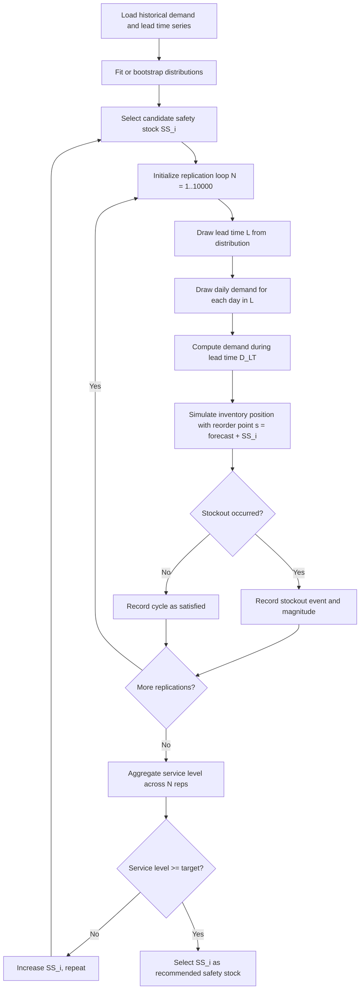

## Simulation-based safety stock estimation

### Overview

**Key Points**

- Simulation-based safety stock estimation replaces closed-form formulas (e.g., $SS = z \cdot \sigma_{LTD}$) with Monte Carlo or discrete-event simulation of demand and lead time processes to empirically derive the stock level needed to hit a target service level.
- Used when demand/lead-time distributions are non-normal, intermittent, correlated, or when analytical formulas break down (e.g., very low volume SKUs, lumpy demand, lead time variability with fat tails).
- Core idea: repeatedly simulate the replenishment cycle thousands of times, record stockout frequency/severity at candidate safety stock levels, and select the level that achieves the target service metric (Type 1, Type 2, or fill rate).

Analytical safety stock formulas assume demand during lead time is normally distributed and that demand/lead-time variability are independent. Real-world SKUs — especially intermittent-demand, promotional, or supply-constrained items — routinely violate these assumptions. Simulation sidesteps distributional assumptions entirely by sampling directly from empirical or fitted distributions and propagating them through the actual inventory policy logic (reorder point, review period, order-up-to level).

---

### When Analytical Formulas Fail

| Condition | Why the formula breaks | Simulation advantage |
| --- | --- | --- |
| Intermittent/lumpy demand (many zero-demand periods) | Normal distribution assumption invalid | Uses empirical distribution (e.g., Poisson, Negative Binomial, or bootstrapped historical draws) |
| Lead time variability is large relative to demand variability | Convolution of demand and lead time distributions has no closed form | Simulation draws lead time and demand jointly per replication |
| Demand and lead time are correlated (e.g., supplier delays coincide with demand spikes) | Formula assumes independence | Simulation can sample from a joint/copula distribution |
| Multi-echelon or multi-item pooling effects | No simple analytical aggregate | Simulation propagates stock levels through the network |
| Nonstationary demand (trend, seasonality, promotions) | Formula assumes stationary $\mu, \sigma$ | Simulation can use a time-varying demand generator |
| Batch/case-pack ordering, MOQs, discrete lot sizing | Continuous approximation error | Simulation enforces discrete order quantities exactly |

---

### Core Simulation Methodology

**Step 1 — Characterize input distributions**

Two approaches:

1. **Parametric**: Fit a distribution to historical demand (Negative Binomial or Poisson for intermittent demand; Gamma or Lognormal for continuous positive demand) and to lead time (Gamma or Lognormal, since lead time is strictly positive and right-skewed).
2. **Empirical/bootstrap**: Resample directly from historical daily/weekly demand observations and historical lead time observations, preserving the actual shape of the data without assuming a parametric family.

**Step 2 — Define the replenishment policy under test**

Common policies:

- **(s, Q)**: continuous review, reorder point $s$, fixed order quantity $Q$
- **(s, S)**: continuous review, order up to $S$ when inventory drops to or below $s$
- **(R, S)**: periodic review with period $R$, order up to $S$

The safety stock is embedded in $s$ (or $S$): $s = \hat{D}_{LT} + SS$, where $\hat{D}_{LT}$ is expected demand during lead time.

**Step 3 — Run the simulation loop**

For each replication (typically 1,000–10,000+ iterations):

1. Draw a lead time $L_i$ from the lead time distribution.
2. Draw daily/period demand for each day within $L_i$ from the demand distribution.
3. Sum to get demand-during-lead-time $D_{LT,i}$.
4. Track running inventory position against the policy, applying the candidate reorder point/safety stock.
5. Record whether a stockout occurred, the stockout quantity (if any), and the ending inventory (for holding cost).

**Step 4 — Aggregate service-level metrics across replications**

- **Type 1 (cycle service level)**: fraction of replenishment cycles with zero stockouts
- **Type 2 (fill rate)**: fraction of demand units satisfied directly from stock
- **Average/worst-case stockout duration and magnitude**

**Step 5 — Search over candidate safety stock levels**

Run the simulation across a grid (or binary search) of safety stock values, plot achieved service level vs. safety stock, and select the minimum safety stock that meets or exceeds the target.

---

### Simulation Architecture (svg_diagram)

<svg xmlns="http://www.w3.org/2000/svg" viewBox="0 0 900 460" font-family="monospace" font-size="13">
<rect x="0" y="0" width="900" height="460" fill="#0d1117" />
<text x="20" y="25" fill="#e6edf3" font-size="15" font-weight="bold">Simulation-Based Safety Stock Estimation Pipeline (svg_diagram)</text>

<rect x="20" y="50" width="160" height="70" rx="6" fill="#1f6feb" opacity="0.85" />
<text x="30" y="78" fill="#ffffff">Historical Data</text>
<text x="30" y="96" fill="#ffffff">Demand + Lead Time</text>
<text x="30" y="112" fill="#c9d1d9" font-size="11">series</text>
<rect x="220" y="50" width="180" height="70" rx="6" fill="#238636" opacity="0.85" />
<text x="230" y="78" fill="#ffffff">Distribution Fitting</text>
<text x="230" y="96" fill="#ffffff">or Empirical Bootstrap</text>
<text x="230" y="112" fill="#c9d1d9" font-size="11">NegBin / Gamma / raw draws</text>
<rect x="440" y="50" width="180" height="70" rx="6" fill="#8957e5" opacity="0.85" />
<text x="450" y="78" fill="#ffffff">Monte Carlo Engine</text>
<text x="450" y="96" fill="#ffffff">N = 1,000-10,000 reps</text>
<text x="450" y="112" fill="#c9d1d9" font-size="11">draw L, draw D per day</text>
<rect x="660" y="50" width="200" height="70" rx="6" fill="#da3633" opacity="0.85" />
<text x="670" y="78" fill="#ffffff">Policy Simulation</text>
<text x="670" y="96" fill="#ffffff">(s,Q) / (s,S) / (R,S)</text>
<text x="670" y="112" fill="#c9d1d9" font-size="11">apply candidate SS</text>

<line x1="180" y1="85" x2="220" y2="85" stroke="#8b949e" stroke-width="2" marker-end="url(#arrow)" />
<line x1="400" y1="85" x2="440" y2="85" stroke="#8b949e" stroke-width="2" marker-end="url(#arrow)" />
<line x1="620" y1="85" x2="660" y2="85" stroke="#8b949e" stroke-width="2" marker-end="url(#arrow)" />

<line x1="760" y1="120" x2="760" y2="180" stroke="#8b949e" stroke-width="2" marker-end="url(#arrow)" />
<rect x="620" y="180" width="240" height="90" rx="6" fill="#f0883e" opacity="0.85" />
<text x="630" y="205" fill="#0d1117" font-weight="bold">Metric Aggregation</text>
<text x="630" y="223" fill="#0d1117" font-size="11">Type 1 CSL, Type 2 fill rate,</text>
<text x="630" y="239" fill="#0d1117" font-size="11">stockout magnitude, holding cost</text>
<line x1="620" y1="225" x2="200" y2="225" stroke="#8b949e" stroke-width="2" marker-end="url(#arrow)" />
<rect x="20" y="180" width="180" height="90" rx="6" fill="#1f6feb" opacity="0.85" />
<text x="30" y="205" fill="#ffffff">SS Grid Search</text>
<text x="30" y="223" fill="#ffffff" font-size="11">candidate SS values</text>
<text x="30" y="239" fill="#ffffff" font-size="11">re-run engine per candidate</text>
<line x1="110" y1="180" x2="110" y2="120" stroke="#8b949e" stroke-width="2" stroke-dasharray="4,3" marker-end="url(#arrow)" />
<text x="120" y="150" fill="#8b949e" font-size="11">feedback loop</text>
<line x1="110" y1="270" x2="110" y2="330" stroke="#8b949e" stroke-width="2" marker-end="url(#arrow)" />
<rect x="20" y="330" width="380" height="100" rx="6" fill="#21262d" stroke="#30363d" stroke-width="1.5" />
<text x="35" y="355" fill="#e6edf3" font-weight="bold">Output: SS vs Service Level Curve</text>
<text x="35" y="375" fill="#c9d1d9" font-size="11">Select minimum SS meeting target</text>
<text x="35" y="392" fill="#c9d1d9" font-size="11">(e.g., 97% Type 2 fill rate)</text>
<text x="35" y="409" fill="#c9d1d9" font-size="11">Feed into ERP reorder point</text>
</svg>

---

### Algorithm Flow



---

### Reference Implementation (Python)

```python
import numpy as np

def simulate_safety_stock(
    demand_samples: np.ndarray,      # historical daily demand (empirical pool)
    lead_time_samples: np.ndarray,   # historical lead time observations (days)
    candidate_ss: float,
    forecast_daily_demand: float,
    n_reps: int = 10000,
    target_fill_rate: float = 0.97,
    rng_seed: int = 42
) -> dict:
    """
    Empirical bootstrap simulation for safety stock evaluation.
    Uses historical resampling rather than parametric assumptions.
    """
    rng = np.random.default_rng(rng_seed)
    stockout_cycles = 0
    total_demand = 0.0
    total_unmet = 0.0

    for _ in range(n_reps):
        # Draw a lead time realization
        L = int(rng.choice(lead_time_samples))
        L = max(L, 1)

        # Draw L days of demand from the empirical pool (with replacement)
        daily_draws = rng.choice(demand_samples, size=L, replace=True)
        d_lt = daily_draws.sum()

        # Reorder point under test
        reorder_point = forecast_daily_demand * L + candidate_ss

        total_demand += d_lt
        if d_lt > reorder_point:
            stockout_cycles += 1
            total_unmet += (d_lt - reorder_point)

    cycle_service_level = 1 - (stockout_cycles / n_reps)
    fill_rate = 1 - (total_unmet / total_demand) if total_demand > 0 else 1.0

    return {
        "candidate_ss": candidate_ss,
        "type1_cycle_service_level": cycle_service_level,
        "type2_fill_rate": fill_rate,
        "meets_target": fill_rate >= target_fill_rate,
    }


def find_minimum_safety_stock(
    demand_samples, lead_time_samples, forecast_daily_demand,
    target_fill_rate=0.97, ss_grid=None, n_reps=5000
):
    """Grid search over candidate SS values to find the minimum SS hitting target."""
    if ss_grid is None:
        max_demand_guess = np.percentile(demand_samples, 99) * np.percentile(lead_time_samples, 99)
        ss_grid = np.linspace(0, max_demand_guess, 40)

    results = []
    for ss in ss_grid:
        res = simulate_safety_stock(
            demand_samples, lead_time_samples, ss,
            forecast_daily_demand, n_reps, target_fill_rate
        )
        results.append(res)
        if res["meets_target"]:
            return res, results  # first SS meeting target (grid is ascending)

    return results[-1], results  # target not reachable within grid
```

`[Inference]` The grid search above assumes monotonicity of fill rate with respect to safety stock, which holds for standard (s, Q)/(s, S) policies but should be verified if the policy includes non-monotonic elements (e.g., batching side effects).

---

### Choosing Distributions for Input Sampling

| Demand pattern | Recommended distribution | Notes |
| --- | --- | --- |
| Smooth, continuous, roughly symmetric | Normal or Gamma | Gamma avoids negative demand draws |
| Intermittent (many zero periods) | Negative Binomial or Poisson | Captures overdispersion vs. Poisson when variance > mean |
| Highly lumpy/erratic | Empirical bootstrap | No parametric form fits well; preserves actual spikes |
| Lead time (always positive, right-skewed) | Gamma or Lognormal | Avoid Normal — can imply negative lead times |

Parametric fitting typically uses maximum likelihood estimation (e.g., `scipy.stats.nbinom.fit` or method-of-moments for Negative Binomial). Empirical bootstrap requires a sufficiently large historical sample (commonly cited guidance suggests at least 1–2 years of daily data, or enough cycles to cover seasonal patterns) — `[Inference]` the exact minimum sample size needed for stable results depends on demand variance and desired confidence interval width, and should be validated via bootstrap convergence checks (e.g., plotting estimated fill rate against number of replications until it stabilizes).

---

### Variance Reduction Techniques

Monte Carlo simulation for rare-event tails (e.g., 99% service level) can require very large replication counts for stable estimates. Standard variance reduction methods:

- **Common Random Numbers (CRN)**: reuse the same random draws across different candidate SS levels to reduce noise when comparing them, isolating the effect of SS itself.
- **Antithetic variates**: pair each random draw with its complementary draw to cancel sampling error.
- **Importance sampling**: oversample tail/stockout scenarios and reweight results, useful when target service levels are very high (99%+) and stockout events are rare under naive sampling.
- **Stratified sampling**: partition the lead time or demand distribution into strata and sample proportionally, reducing variance versus pure random sampling.

---

### Comparison: Analytical vs. Simulation-Based Estimation

| Dimension | Analytical formula | Simulation-based |
| --- | --- | --- |
| Speed | Instant (closed-form) | Slower (thousands of iterations per SKU) |
| Assumptions | Normality, independence | None required (empirical) or flexible parametric |
| Handles intermittent demand | Poorly | Well |
| Handles correlated demand/lead time | No | Yes (joint sampling) |
| Handles discrete lot sizing / MOQs | Approximate | Exact |
| Scalability across thousands of SKUs | Trivial | Requires computational budget management |
| Interpretability | High (single formula) | Lower (requires simulation output curve) |
| Multi-echelon extension | Very difficult analytically | Natural extension |

`[Inference]` For large SKU portfolios (tens of thousands of items), running full Monte Carlo per SKU nightly can become computationally expensive; a common hybrid pattern is to use analytical formulas for well-behaved, high-volume SKUs and reserve simulation for intermittent, high-variability, or high-value SKUs where the analytical error is largest.

---

### Multi-Echelon Extension

Simulation naturally extends to multi-echelon networks (e.g., central DC → regional warehouses → stores) where analytical safety stock formulas require restrictive assumptions (e.g., METRIC or Graves-Willems approximations). In a simulated network:

1. Each echelon has its own reorder policy and safety stock parameter.
2. Downstream demand becomes upstream order variability (bullwhip effect emerges naturally in the simulation rather than needing to be modeled analytically).
3. Service level is evaluated at the point of final customer demand, not just at each intermediate node.
4. Safety stock at each echelon is jointly optimized (often via iterative search or simulation-optimization frameworks) to hit end-customer service targets at minimum total network holding cost.

---

### Practical Implementation Considerations

- **Replication count**: 5,000–10,000 reps is typical for stable estimates at 95–99% service targets; fewer reps introduce estimation noise that can bias the selected SS level.
- **Confidence intervals**: Report the simulated service level with a confidence interval (e.g., via bootstrap resampling of the replication results) rather than a single point estimate, since Monte Carlo output is itself a random variable.
- **Re-fitting cadence**: Demand and lead time distributions should be periodically re-fit (e.g., monthly or quarterly) as historical data accumulates or seasonality shifts.
- **Cold-start SKUs**: New items with no history require either analog/proxy SKU distributions or conservative default safety stock until sufficient data accumulates.
- **Holding cost trade-off**: Pair the service-level-vs-SS curve with a holding cost curve to select the SS level minimizing total cost (holding cost + expected stockout cost), not just the minimum SS meeting a fixed service target — this is a simulation-optimization problem, solvable via the grid search shown above or more efficiently via gradient-free optimizers (e.g., Nelder-Mead, Bayesian optimization) when the SKU count is large.

---

**Related Topics**

- Multi-echelon inventory optimization (METRIC model, Graves-Willems approximation)
- Simulation-optimization methods (response surface methodology, Bayesian optimization for SS tuning)
- Bootstrap confidence intervals for service-level estimation
- Compound Poisson / Negative Binomial demand modeling for intermittent demand
- Bullwhip effect quantification via multi-echelon simulation
- Discrete-event simulation frameworks (SimPy) for inventory policy testing
- Joint demand–lead time correlation modeling via copulas