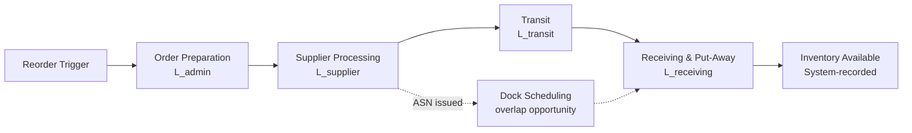

## Components of Total Order Lead Time

### Definition

Total order lead time is the cumulative elapsed time from the moment a replenishment need is recognized to the moment the ordered goods are available for use (put-away complete and system-recorded). It is a composite metric built from several sequential and sometimes parallel sub-durations, each with its own variability profile that feeds into the lead time demand and safety stock calculations covered under the reorder point formula.

$$L_{total} = L_{admin} + L_{supplier} + L_{transit} + L_{receiving}$$

### Core Components

#### 1. Order Preparation / Administrative Lead Time ($L_{admin}$)

The internal time between recognizing a reorder trigger and the purchase order actually being transmitted to the supplier.

- Demand review and reorder point trigger confirmation
- Internal approval workflows (budget sign-off, purchasing manager authorization)
- PO creation and transmission (EDI, email, portal entry)

**Key Points**

- Often the most controllable component, since it is internal to the buying organization.
- Highly sensitive to automation level: manual approval chains can add days; automated EDI/MRP-triggered POs can reduce this to near zero.

#### 2. Supplier Processing / Manufacturing Lead Time ($L_{supplier}$)

The time the supplier requires to process the order and make goods ready for shipment.

- Order acknowledgment and scheduling into supplier's production queue
- Raw material availability at the supplier (if make-to-order)
- Manufacturing or assembly time
- Quality inspection and packaging at origin

**Key Points**

- For make-to-stock suppliers, this component is typically short (pick-and-pack from existing inventory).
- For make-to-order or custom items, this is usually the largest and most variable component.
- [Inference] Supplier-side capacity constraints (e.g., seasonal demand spikes across their customer base) often introduce lead time variability that the buying organization cannot observe directly, which is one reason $\sigma_L$ estimates based only on historical PO-to-receipt dates tend to understate true risk during industry-wide demand surges.

#### 3. Transit / Transportation Lead Time ($L_{transit}$)

The time goods spend physically in transit from the supplier's shipping point to the buyer's receiving location.

- Mode of transport (ocean, air, rail, truck, parcel)
- Distance and route (direct vs. multi-leg/transshipment)
- Customs clearance (for international shipments)
- Carrier consolidation/deconsolidation at hubs

**Key Points**

- Typically the component with the highest absolute variability for international or multi-modal shipments.
- Ocean freight carries materially higher $\sigma_L$ than air freight due to port congestion, weather, and customs delays.

#### 4. Receiving and Put-Away Lead Time ($L_{receiving}$)

The internal time from physical dock arrival to the inventory being recorded as available-to-use in the inventory management system.

- Dock scheduling and unloading
- Inbound quality inspection / incoming inspection hold
- System receipt transaction (ASN matching, PO reconciliation)
- Put-away to storage location and system update

**Key Points**

- Frequently underestimated in lead time models; goods can sit "on the dock" for days before being system-recognized as available.
- Quality inspection holds (especially for regulated or incoming-inspection-required items) can add substantial and variable delay here.

### Sequential vs. Overlapping Components

Not all components are strictly sequential in every process design. Some organizations pipeline steps to compress total lead time:

- **Sequential (typical):** admin → supplier processing → transit → receiving, each waiting for the prior to complete.
- **Overlapping (optimized):** advance shipping notices (ASN) allow receiving dock scheduling to begin during transit; blanket POs or vendor-managed inventory (VMI) can collapse $L_{admin}$ to near zero.

### Variance Aggregation Across Components

Because total lead time is a sum of largely independent random variables, its variance is the sum of the component variances (not the sum of standard deviations):

$$\sigma_{L_{total}}^2 = \sigma_{L_{admin}}^2 + \sigma_{L_{supplier}}^2 + \sigma_{L_{transit}}^2 + \sigma_{L_{receiving}}^2$$

$$\sigma_{L_{total}} = \sqrt{\sigma_{L_{admin}}^2 + \sigma_{L_{supplier}}^2 + \sigma_{L_{transit}}^2 + \sigma_{L_{receiving}}^2}$$

This aggregated $\sigma_{L_{total}}$ is the value substituted into the full reorder point formula's $\sigma_L$ term.

**Worked Example**

| Component | Mean (days) | Std Dev (days) |
| --- | --- | --- |
| Admin | 1.0 | 0.3 |
| Supplier processing | 5.0 | 1.5 |
| Transit | 8.0 | 2.0 |
| Receiving | 1.5 | 0.5 |

$$L_{total} = 1.0 + 5.0 + 8.0 + 1.5 = 15.5 \text{ days}$$

$$\sigma_{L_{total}} = \sqrt{0.3^2 + 1.5^2 + 2.0^2 + 0.5^2} = \sqrt{0.09 + 2.25 + 4.0 + 0.25} = \sqrt{6.59} \approx 2.57 \text{ days}$$

This $L_{total} = 15.5$ and $\sigma_{L_{total}} \approx 2.57$ then feed directly into $d_L = \bar{d} \times L$ and the safety stock $\sigma_{d_L}$ calculation.

### Measurement Practices

- **PO timestamp logging:** capture discrete timestamps at each handoff (PO issued, supplier acknowledgment, ship date, dock arrival, system receipt) to decompose $L_{total}$ into its components rather than measuring only order-to-receipt as a single black-box interval.
- **Rolling lead time tracking:** recalculate $L$ and $\sigma_L$ per supplier/SKU combination on a rolling window (e.g., trailing 12 months) rather than using a static contractual lead time, since actual performance often drifts from quoted lead time.
- [Inference] Quoted supplier lead times (used in many legacy MRP setups as a static parameter) frequently understate actual observed lead time and its variance, because quoted lead time reflects best-case processing and typically excludes queue time in the supplier's production schedule.

### Factors That Inflate Total Lead Time Variability

- Single-sourcing from suppliers with volatile capacity utilization
- Cross-border shipments subject to customs inspection variability
- Consolidated/LTL (less-than-truckload) freight dependent on carrier scheduling
- Seasonal demand surges shared across a supplier's customer base
- Incoming quality inspection sampling holds
- Manual, non-EDI purchase order transmission and approval chains

### Related Topics

- Full reorder point formula combining lead time demand and safety stock
- Supplier lead time variability measurement and statistical process control
- Vendor-managed inventory (VMI) and blanket purchase orders as lead time compression strategies
- Advance shipping notice (ASN) integration for receiving dock scheduling
- Multi-sourcing and dual-sourcing strategies to reduce supplier-side lead time risk
- Freight mode selection trade-offs (cost vs. lead time vs. variability)
- Incoming quality inspection sampling plans and their impact on receiving lead time