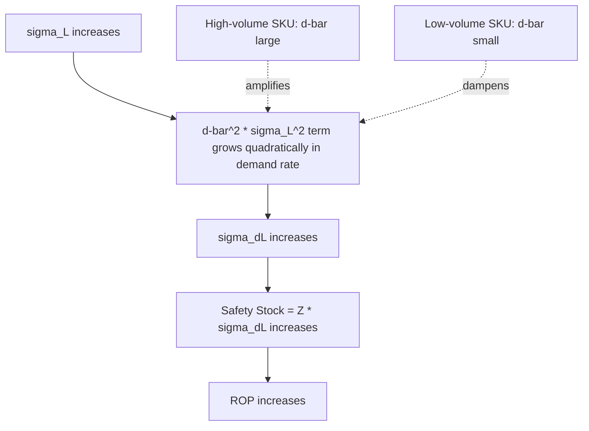

## Impact of Lead Time Variability on Reorder Point

### Definition

Lead time variability refers to the dispersion (standard deviation, $\sigma_L$) of actual replenishment lead times around their mean ($L$). Unlike demand variability, which affects consumption *rate* uncertainty, lead time variability affects *duration* uncertainty — how long the exposure window to stockout risk actually lasts. Because the reorder point formula treats $L$ as a multiplier on both mean demand and demand variance, fluctuations in $L$ propagate non-linearly into required safety stock and total ROP.

### Where Lead Time Variability Enters the Formula

Recall the full reorder point formula:

$$ROP = (\bar{d} \times L) + Z \times \sqrt{L \times \sigma_d^2 + \bar{d}^2 \times \sigma_L^2}$$

$\sigma_L$ appears only inside the safety stock term, but it is scaled by $\bar{d}^2$ (squared average demand), not $\bar{d}$ linearly. This structural asymmetry is the central mechanism by which lead time variability disproportionately affects fast-moving, high-volume SKUs.

**Key Points**

- The demand-variability term scales with $L$ (linearly).
- The lead-time-variability term scales with $\bar{d}^2$ (quadratically in demand rate).
- For a high-volume item, even modest $\sigma_L$ can dominate total safety stock requirement; for a low-volume item, $\sigma_L$ contributes comparatively little.

### Isolating the Lead-Time-Variability Contribution

To see the effect in isolation, compare the two limiting cases from the full reorder point formula.

**Case A — Lead time treated as constant ($\sigma_L = 0$):**

$$SS_A = Z \times \sigma_d \times \sqrt{L}$$

**Case B — Lead time variable, demand treated as constant ($\sigma_d = 0$):**

$$SS_B = Z \times \bar{d} \times \sigma_L$$

Comparing $SS_A$ to $SS_B$ shows that safety stock driven purely by lead time variability grows linearly with $\bar{d}$, while safety stock driven purely by demand variability grows only with $\sqrt{L}$. As average demand increases, $SS_B$ overtakes $SS_A$ in relative importance.

### Worked Comparison

Using the same base inputs, hold demand variability constant and vary $\sigma_L$ to isolate its marginal effect on ROP.

**Fixed inputs:** $\bar{d} = 40$ units/day, $\sigma_d = 8$ units/day, $L = 12$ days, $Z = 1.65$ (95% service level)

| Scenario | $\sigma_L$ (days) | $\sigma_{d_L}$ | Safety Stock | ROP |
| --- | --- | --- | --- | --- |
| No lead time variability | 0 | $\sqrt{12 \times 64} = 27.7$ | 45.7 | 526 |
| Low lead time variability | 1 | $\sqrt{768 + 1600} = 48.7$ | 80.3 | 561 |
| Moderate (prior example) | 2 | $\sqrt{768 + 6400} = 84.7$ | 139.7 | 620 |
| High lead time variability | 4 | $\sqrt{768 + 25600} = 162.4$ | 268.0 | 748 |

**Interpretation:** Increasing $\sigma_L$ from 0 to 4 days (a 4x change in a single input) drives ROP from 526 to 748 units — a 42% increase — while $d_L$ itself (480 units) never changes. All of that swing is attributable to the safety stock term's sensitivity to $\sigma_L$.

### Why the Effect Is Non-Linear

Because $\sigma_L$ enters the formula as $\bar{d}^2 \times \sigma_L^2$ inside a square root, doubling $\sigma_L$ does not double the safety stock contribution from that term in isolation — it roughly doubles the *variance* contribution, and since safety stock is proportional to the square root of total variance, the practical effect depends on how large the lead-time-variance term is relative to the demand-variance term. When the lead-time term dominates (common for high-$\bar{d}$ SKUs or unreliable suppliers), safety stock grows nearly proportionally with $\sigma_L$ itself, per the isolated Case B relationship above.

### Sources of Lead Time Variability

- Supplier production queue congestion and capacity fluctuation
- Transit mode variability (ocean/customs delays vs. air freight consistency)
- Order transmission and approval delays (manual vs. automated PO issuance)
- Receiving/inspection hold variability at the buyer's dock
- Multi-tier supply chains where upstream sub-supplier delays cascade downstream

[Inference] Because lead time variability compounds across the components covered under total order lead time (admin, supplier, transit, receiving) via variance summation ($\sigma_{L_{total}}^2 = \sum \sigma_{L_i}^2$), a single unreliable link in the chain — most often international transit or a capacity-constrained supplier — will typically dominate the total $\sigma_L$ even if the other components are highly consistent, since variance summation is driven by the largest individual variance term.

### Practical Implications for Inventory Policy

**Key Points**

- **Supplier selection matters beyond mean lead time.** Two suppliers with identical average lead time but different $\sigma_L$ require materially different safety stock investment; the more variable supplier is more expensive to serve even at equal average lead time.
- **Reducing $\sigma_L$ can be more cost-effective than reducing $\sigma_d$.** Since $\sigma_L$'s contribution scales with $\bar{d}^2$, initiatives that stabilize supplier/transit reliability (contracts with penalty clauses, expedited-but-consistent freight, safety buffers at the supplier) often yield larger safety stock reductions per dollar invested for high-volume SKUs than demand forecasting improvements.
- **Dual sourcing** can reduce effective $\sigma_L$ by allowing the buyer to route around a delayed shipment, though it introduces its own modeling complexity (mixture distribution across two supply lead times rather than a single normal distribution).
- **Blanket POs / VMI** reduce the $L_{admin}$ component's contribution to $\sigma_L$ but do not address transit or supplier processing variability.

### Risk of Ignoring Lead Time Variability

Many simplified or legacy inventory models set $\sigma_L = 0$ and use only $SS = Z \times \sigma_d \times \sqrt{L}$ (Case A above). [Inference] This simplification is common where lead time variance data is not systematically tracked (see Components of Total Order Lead Time), but it structurally understates true stockout risk whenever actual $\sigma_L > 0$, since the omitted $\bar{d}^2 \sigma_L^2$ term is strictly additive under the square root — the achieved service level will fall below the nominal target used to select $Z$, with the shortfall growing as $\bar{d}$ and $\sigma_L$ increase.

### Related Topics

- Full reorder point formula combining lead time demand and safety stock
- Components of total order lead time
- Dual-sourcing and multi-sourcing safety stock modeling (mixture distributions)
- Supplier scorecard metrics for lead time reliability
- Statistical process control applied to supplier delivery performance
- Service level selection and Z-score determination
- Demand variability vs. lead time variability: relative cost of reduction initiatives