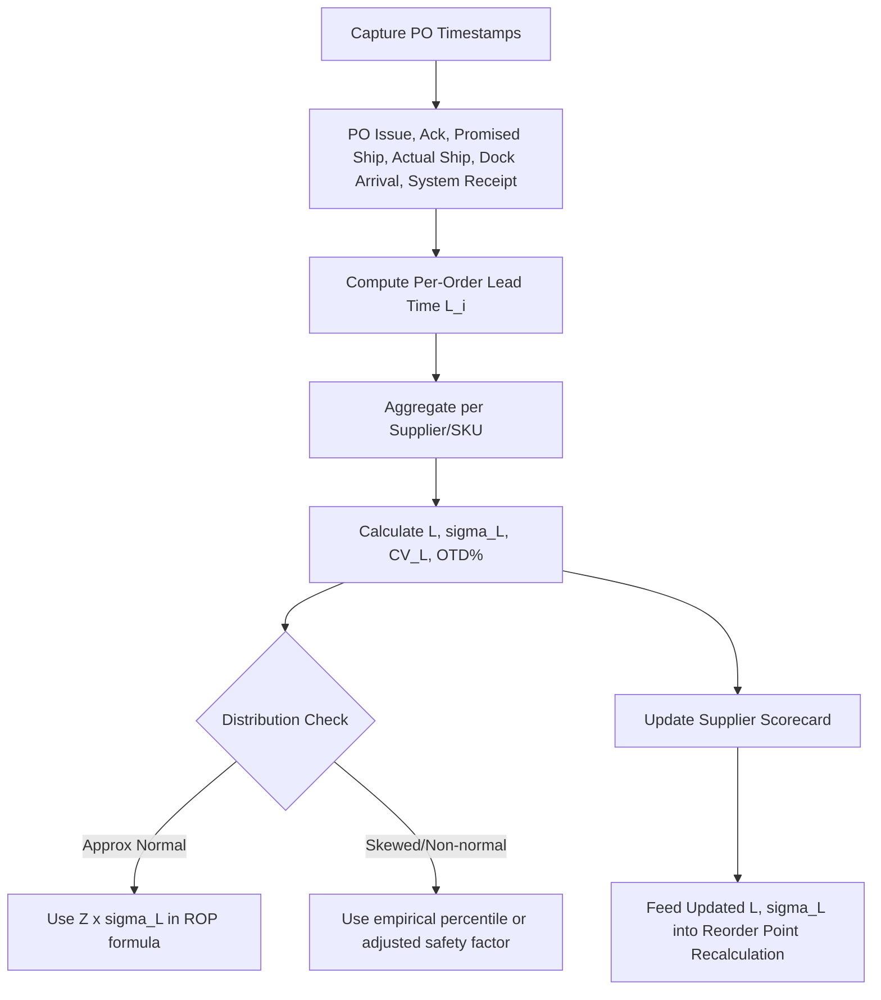

## Supplier Lead Time Reliability Assessment

### Definition and Purpose

Supplier lead time reliability assessment is the systematic measurement and monitoring of how consistently a supplier delivers against quoted or historical lead times. Where lead time variability quantifies the *statistical impact* of $\sigma_L$ on reorder point and safety stock, reliability assessment is the *operational practice* of measuring, scoring, and tracking that variability per supplier and per SKU so the resulting $L$ and $\sigma_L$ inputs are accurate and current.

### Core Data Requirements

Reliable assessment depends on capturing discrete, timestamped events per purchase order rather than a single order-to-receipt duration:

- PO issue date
- Supplier order acknowledgment date
- Promised/quoted ship date
- Actual ship date
- Actual dock arrival date
- System receipt (available-to-use) date

**Key Points**

- Without acknowledgment and promised-date fields, it is impossible to separate supplier-caused delay from transit-caused delay or receiving-caused delay.
- This data structure mirrors the components decomposed under Components of Total Order Lead Time — reliability assessment is effectively the measurement layer that feeds those component estimates.

### Core Reliability Metrics

#### 1. On-Time Delivery Rate (OTD)

The percentage of POs received on or before the promised/quoted date.

$$OTD = \frac{\text{Orders received on or before promised date}}{\text{Total orders}} \times 100\%$$

**Key Points**

- Simple and widely used, but binary (on-time/late) — it discards magnitude information about *how* late deliveries were.
- Should be defined precisely: "on-time" against the original quoted date, or against a supplier-confirmed/acknowledged date. Measuring against acknowledgment date rewards suppliers for pushing back dates after order placement, masking true responsiveness.

#### 2. Mean Lead Time and Lead Time Standard Deviation

The direct statistical inputs to the reorder point formula, computed from actual historical PO-to-receipt intervals per supplier/SKU combination:

$$L = \frac{1}{n}\sum_{i=1}^{n} L_i \qquad \sigma_L = \sqrt{\frac{1}{n-1}\sum_{i=1}^{n}(L_i - L)^2}$$

**Key Points**

- Sample standard deviation (dividing by $n-1$) is standard practice for finite historical samples.
- Should be recalculated on a rolling window (e.g., trailing 12 months or trailing 20 orders) rather than as a static, all-time figure, since supplier performance drifts.

#### 3. Coefficient of Variation (CV) of Lead Time

Normalizes variability relative to the mean, enabling comparison across suppliers or SKUs with different average lead times.

$$CV_L = \frac{\sigma_L}{L}$$

**Key Points**

- A supplier with $L = 30$ days and $\sigma_L = 6$ days ($CV_L = 0.20$) is proportionally less reliable than one with $L = 10$ days and $\sigma_L = 1$ day ($CV_L = 0.10$), even though the absolute $\sigma_L$ is larger for the first.
- Useful for supplier scorecarding when comparing across product categories with structurally different lead times.

#### 4. Lead Time Distribution Skewness

Actual supplier lead times are frequently right-skewed (many on-time or early deliveries, occasional severe delays) rather than symmetric.

**Key Points**

- [Inference] When skewness is material, the standard normal-distribution assumption underlying $Z \times \sigma_L$ in the reorder point formula understates tail risk, because a normal distribution assumes delays and early arrivals are symmetric, while real supplier behavior often shows a long right tail of rare-but-severe delays with limited upside from early delivery.
- Assessment should include a skewness check (e.g., comparing mean vs. median lead time, or visual histogram review) before assuming normality is adequate for that supplier.

#### 5. Fill Rate / Order Completeness

Distinct from timing reliability: measures whether the *full ordered quantity* arrived, not just whether it arrived on time.

$$Fill\ Rate = \frac{\text{Units received}}{\text{Units ordered}} \times 100\%$$

**Key Points**

- A supplier can have perfect OTD but poor fill rate (partial shipments, backorders on remainder), which independently affects effective lead time demand coverage.

### Supplier Scorecard Structure

| Metric | Formula Basis | What It Reveals |
| --- | --- | --- |
| On-Time Delivery % | Binary threshold vs. promised date | Timing consistency |
| Mean Lead Time ($L$) | Sample mean | Baseline planning parameter |
| Lead Time Std Dev ($\sigma_L$) | Sample standard deviation | Direct ROP safety stock input |
| Coefficient of Variation | $\sigma_L / L$ | Cross-supplier reliability comparison |
| Fill Rate % | Units received / ordered | Quantity reliability |
| Quality/Inspection Pass Rate | Units accepted / received | Effective usable lead time (rework adds delay) |

### Assessment Process Flow

### Segmentation Practices

**Key Points**

- **Per-SKU, not just per-supplier:** a single supplier may ship a standard catalog item reliably but a custom/configured item with high variability. Aggregating all SKUs into one supplier-level $\sigma_L$ can obscure this.
- **Per-lane/route:** for suppliers shipping from multiple origin facilities or through different freight lanes, transit variability differs by lane and should be segmented accordingly.
- **New vs. established suppliers:** limited historical sample size for new suppliers makes $\sigma_L$ estimates unstable; wider initial safety margins or Bayesian-style blending with category-average variability is common practice until sufficient order history accumulates.

### Using Assessment Output in Reorder Point Management

The output of supplier lead time reliability assessment directly parameterizes the reorder point formula:

$$ROP = (\bar{d} \times L_{measured}) + Z \times \sqrt{L_{measured} \times \sigma_d^2 + \bar{d}^2 \times \sigma_{L,measured}^2}$$

**Key Points**

- Static, quoted lead times should be replaced with measured $L$ and $\sigma_L$ wherever sufficient order history exists.
- Reliability scores also inform **supplier selection and allocation decisions** independent of the ROP calculation itself — e.g., routing volume away from high-$CV_L$ suppliers for critical or high-$\bar{d}$ SKUs, given the disproportionate ROP sensitivity to lead time variability on those items (see Impact of Lead Time Variability on Reorder Point).
- Reliability degradation trends (rising $\sigma_L$ over successive rolling windows) can serve as an early warning signal to proactively raise safety stock or diversify sourcing before a stockout event occurs.

### Common Pitfalls

- Measuring OTD against a supplier-adjusted promise date rather than the original quoted date, inflating apparent reliability
- Using all-time average lead time instead of a rolling window, masking recent performance degradation
- Ignoring skewness and applying normal-distribution safety factors to a heavily right-skewed lead time distribution
- Aggregating lead time performance across dissimilar SKUs or shipping lanes within the same supplier
- Failing to distinguish supplier-caused delay from internal receiving/inspection-caused delay, misattributing internal process issues to the supplier

### Related Topics

- Full reorder point formula combining lead time demand and safety stock
- Components of total order lead time
- Impact of lead time variability on reorder point
- Dual-sourcing and multi-sourcing strategies for reliability diversification
- Statistical process control (SPC) charts applied to supplier delivery performance
- Vendor scorecarding and supplier performance management programs
- Non-normal lead time distribution modeling (empirical percentile methods)