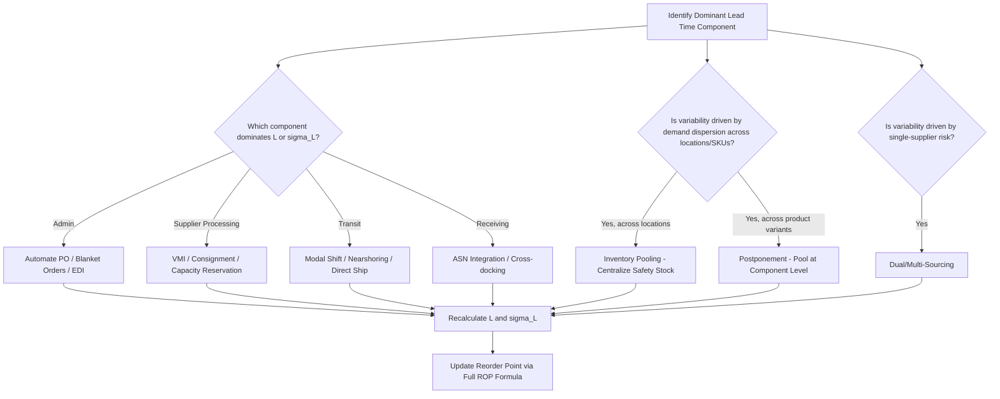

## Lead Time Compression and Pooling Strategies

### Definition and Purpose

Lead time compression refers to deliberate operational and design interventions that reduce the mean ($L$) or standard deviation ($\sigma_L$) of replenishment lead time. Pooling strategies reduce effective variability by aggregating demand, inventory, or supply sources across locations or suppliers so that individual-unit fluctuations partially cancel out. Both approaches directly reduce required safety stock, since safety stock scales with $L$, $\sigma_d$, and $\sigma_L$ in the full reorder point formula — compressing or pooling any of these inputs lowers ROP without accepting higher stockout risk.

### Why Compression and Pooling Matter Financially

Given the full reorder point formula:

$$ROP = (\bar{d} \times L) + Z \times \sqrt{L \times \sigma_d^2 + \bar{d}^2 \times \sigma_L^2}$$

Reducing $L$ lowers both terms simultaneously (lead time demand and the $L \times \sigma_d^2$ component of safety stock). Reducing $\sigma_L$ lowers only the safety stock term, but — per Impact of Lead Time Variability on Reorder Point — that term is scaled by $\bar{d}^2$, so for high-volume SKUs, $\sigma_L$ reduction can yield outsized ROP and carrying-cost savings relative to the effort invested.

### Lead Time Compression Techniques

#### 1. Administrative Compression

Targets $L_{admin}$ from the total lead time decomposition.

- **Automated reorder triggers:** MRP/ERP-generated POs upon reorder point breach, eliminating manual review delay
- **Blanket purchase orders / standing agreements:** pre-negotiated terms and pricing eliminate per-order approval cycles
- **Electronic Data Interchange (EDI) / API-based ordering:** instant PO transmission vs. manual email/portal entry
- **Delegated approval authority:** raising auto-approval thresholds for routine replenishment reduces multi-level sign-off delay

#### 2. Supplier-Side Compression

Targets $L_{supplier}$.

- **Vendor-Managed Inventory (VMI):** supplier monitors buyer's stock levels directly and initiates replenishment, collapsing the admin-to-supplier-acknowledgment gap
- **Consignment stock agreements:** inventory physically located at or near the buyer, drastically reducing effective lead time to near-zero for consumption
- **Make-to-stock vs. make-to-order shift:** negotiating with suppliers to hold finished-goods buffer stock rather than manufacturing on receipt of PO
- **Capacity reservation agreements:** guaranteed production slot allocation reduces queue-time variability at the supplier

#### 3. Transit Compression

Targets $L_{transit}$, typically the largest and most variable component for international sourcing.

- **Modal shift:** air freight vs. ocean freight trades higher per-unit cost for substantially lower $L$ and $\sigma_L$
- **Nearshoring/reshoring:** relocating sourcing closer to point of use reduces both distance-driven $L$ and customs/border variability
- **Direct shipping vs. hub consolidation:** bypassing intermediate consolidation points reduces handling delay, at the cost of full-truckload efficiency
- **Customs pre-clearance programs:** trusted-shipper/trusted-trader programs reduce border variability for international shipments

#### 4. Receiving Compression

Targets $L_{receiving}$.

- **Advance Shipping Notice (ASN) integration:** enables dock scheduling and system pre-receipt processing before physical arrival, overlapping with transit time rather than following it
- **Cross-docking:** bypassing put-away entirely for high-velocity items, moving directly from inbound to outbound
- **Reduced inspection sampling for proven suppliers:** statistically justified reduction in incoming inspection hold time for suppliers with strong quality track records

### Pooling Strategies

Pooling reduces effective variability by combining demand or supply across multiple entities rather than treating each in isolation. The statistical basis is that the coefficient of variation of *aggregated* demand or lead time is typically lower than that of individual components, due to imperfect correlation between them.

#### 1. Inventory Pooling (Centralization)

Consolidating safety stock for a SKU into fewer, larger stocking locations (e.g., regional DC instead of per-store stock) rather than holding independent safety stock at each downstream location.

**Statistical basis — the square-root law of inventory pooling:**

$$SS_{pooled} \approx SS_{single} \times \sqrt{n}$$

Where $SS_{single}$ is the safety stock required at one location and $n$ is the number of locations being consolidated into one pooled location, assuming demand across locations is uncorrelated and identically distributed. This shows that pooled safety stock grows with $\sqrt{n}$ rather than linearly with $n$, meaning total system-wide safety stock is reduced by centralizing.

**Worked Example**

Four regional warehouses each independently hold $SS_{single} = 100$ units of a SKU.

$$SS_{decentralized, total} = 4 \times 100 = 400 \text{ units}$$

Consolidated into one central location:

$$SS_{pooled} \approx 100 \times \sqrt{4} = 200 \text{ units}$$

**Interpretation:** Pooling into a single location theoretically halves total system safety stock (400 → 200 units) for the same aggregate service level, assuming demand across the four regions is independent.

**Key Points**

- [Inference] The benefit shrinks as demand across locations becomes more positively correlated (e.g., regions sharing a common seasonal driver), since the square-root law assumes zero or low correlation; highly correlated demand approaches the linear (non-pooled) case.
- Trade-off: centralization increases outbound transit distance/time and cost to downstream locations, effectively shifting variability from "stockout risk" to "delivery lead time to the next tier," which must be weighed against the safety stock savings.

#### 2. Supplier / Source Pooling (Dual or Multi-Sourcing)

Splitting volume across two or more suppliers so a delay or disruption at one supplier does not fully expose the buyer to stockout.

**Key Points**

- Reduces effective $\sigma_L$ exposure by allowing the buyer to shift volume toward whichever source is currently performing reliably.
- [Inference] The combined lead time distribution under dual sourcing is generally not a simple average of the two suppliers' individual distributions — if orders can be dynamically routed to the faster-performing source, the effective lead time distribution is closer to a minimum-of-two-distributions model, which typically has a lower mean and tighter variance than either supplier individually, though this benefit depends on the buyer's ability to actually re-route orders dynamically rather than maintaining fixed split percentages.
- Trade-offs: potential loss of volume-based pricing leverage with a single supplier, dual qualification/audit costs, and increased supply chain management complexity.

#### 3. Component/Risk Pooling (Postponement)

Delaying final product differentiation until closer to the point of demand, so that a common upstream component or subassembly serves multiple downstream SKU variants — pooling demand variability across variants that would otherwise each carry independent safety stock.

**Key Points**

- Reduces effective $\sigma_d$ at the pooled (undifferentiated) inventory point, since aggregate demand for the common component is less variable than the sum of independently-forecasted variant-level demands.
- Common in industries with late-stage customization (e.g., generic subassembly held in stock, final configuration/labeling applied on order).

#### 4. Time Pooling (Order Consolidation)

Aggregating multiple smaller, frequent orders into fewer, larger periodic orders (or vice versa, depending on context) to smooth demand variability observed by the supplier and stabilize replenishment cycles.

### Compression and Pooling Strategy Comparison

| Strategy | Primary Target | Mechanism | Key Trade-off |
| --- | --- | --- | --- |
| Automated PO / EDI | $L_{admin}$ | Eliminates manual delay | Requires system integration investment |
| VMI / Consignment | $L_{supplier}$ | Supplier holds/manages buffer | Shifts inventory ownership/cost negotiation |
| Modal shift (air vs. ocean) | $L_{transit}$, $\sigma_L$ | Faster, more consistent transit | Higher per-unit freight cost |
| Nearshoring | $L_{transit}$, $\sigma_L$ | Shorter distance, less customs exposure | Potential unit cost increase, supplier requalification |
| ASN + cross-docking | $L_{receiving}$ | Overlaps receiving prep with transit | Requires system/data integration with supplier |
| Inventory pooling (centralization) | $\sigma_d$ (system-wide) | Square-root law variance reduction | Increased downstream distribution lead time |
| Dual/multi-sourcing | $\sigma_L$ | Route around underperforming source | Reduced volume leverage, added qualification cost |
| Postponement / component pooling | $\sigma_d$ | Shared upstream inventory across variants | Requires product/process redesign |

### Decision Flow

### Related Topics

- Full reorder point formula combining lead time demand and safety stock
- Components of total order lead time
- Impact of lead time variability on reorder point
- Supplier lead time reliability assessment
- Multi-echelon inventory optimization and distribution network design
- Postponement and mass customization strategies
- Total landed cost analysis for modal shift and nearshoring decisions