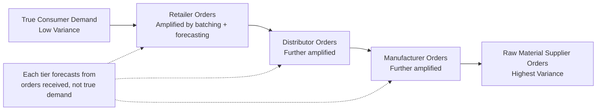

## The Bullwhip Effect and Its Mitigation

### Definition

The bullwhip effect describes the phenomenon in which small fluctuations in end-consumer demand become progressively amplified as they propagate upstream through a multi-echelon supply chain — from retailer to distributor to manufacturer to raw material supplier. Each upstream tier observes and reacts to *orders* placed by the tier immediately downstream, rather than to true end-consumer demand, and each tier's own forecasting, batching, and safety stock behavior adds further distortion at each step. The result is order variance that increases at each successive echelon, even when actual consumer demand is relatively stable.

**Key Points**

- Named for the increasing amplitude of a whip's motion from handle to tip, mirroring the increasing order variance from downstream to upstream.
- The effect is a structural/informational phenomenon, not primarily a forecasting-skill problem — it arises even when every tier forecasts rationally given the (incomplete) information available to it.

### Relationship to Reorder Point and Safety Stock

Bullwhip amplification directly inflates the inputs used in the full reorder point formula at upstream tiers. An upstream supplier observing artificially volatile order patterns from its downstream customer will estimate a higher $\sigma_d$ (perceived demand variability) than the true end-consumer $\sigma_d$, which propagates into inflated safety stock and reorder points throughout the chain:

$$ROP_{upstream} = (\bar{d}_{observed} \times L) + Z \times \sqrt{L \times \sigma_{d,observed}^2 + \bar{d}^2 \times \sigma_L^2}$$

Because $\sigma_{d,observed} > \sigma_{d,true}$ under bullwhip conditions, every upstream tier systematically over-provisions safety stock relative to what true consumer demand variability would justify.

### Root Causes

#### 1. Demand Signal Processing (Forecast Updating)

Each tier forecasts future demand based on the orders it receives from the tier below, then adds its own safety margin on top of that already-distorted signal, compounding the distortion at each step.

- [Inference] Simple exponential smoothing or moving-average forecast methods applied naively to order data (rather than true sell-through/POS data) tend to overreact to short-term order spikes, since the forecast update itself amplifies whatever noise is present in the order signal it's built from.

#### 2. Order Batching

Downstream tiers often place orders in batches (weekly, monthly, or triggered by economic order quantity thresholds) rather than continuously matching consumption. This converts a relatively smooth continuous consumption pattern into a lumpy, periodic order pattern observed upstream.

- Fixed order cycles (e.g., monthly ordering windows)
- Full-truckload or full-container minimum order quantities
- Periodic review inventory policies with infrequent review intervals

#### 3. Price Fluctuations (Forward Buying)

Promotional pricing, volume discounts, or anticipated price increases induce customers to order in large quantities ahead of or during price changes, then reduce ordering afterward to draw down the resulting excess stock — creating order volatility disconnected from underlying consumption.

#### 4. Rationing and Shortage Gaming

When a supplier allocates limited supply proportionally to orders received during a shortage, downstream customers learn to inflate their orders beyond true need to secure a larger allocation share. Once the shortage passes, orders are cancelled or drastically reduced, creating phantom demand spikes followed by phantom demand collapses.

#### 5. Lead Time Amplification

Because safety stock and lead time demand both scale with lead time $L$ (per the reorder point formula), longer or more variable lead times amplify how strongly each tier reacts to perceived demand changes — a given forecast error translates into a larger absolute order quantity swing when $L$ is long.

### Amplification Mechanism Across Echelons

### Quantifying Amplification

A simplified measure of bullwhip amplification at a given tier compares the variance of orders placed to the variance of demand received:

$$Bullwhip\ Ratio = \frac{Var(Orders_{placed})}{Var(Demand_{received})}$$

**Key Points**

- A ratio greater than 1 indicates amplification at that tier; a ratio of 1 indicates the tier is passing demand through without distortion.
- [Inference] Under simple order-up-to policies with demand forecasted via moving average, the bullwhip ratio has been shown analytically (in the operations research literature, notably Lee, Padmanabhan, and Whang) to increase with both the forecast smoothing parameter's responsiveness and the replenishment lead time, meaning longer lead times structurally worsen amplification independent of any behavioral factors.

### Mitigation Strategies

#### 1. Information Sharing (Point-of-Sale Data Visibility)

Providing upstream tiers direct visibility into true end-consumer demand (POS data) rather than relying solely on downstream order patterns.

- **Vendor-Managed Inventory (VMI):** supplier directly accesses retailer's POS/inventory data and manages replenishment, bypassing the distorted order signal entirely
- **Collaborative Planning, Forecasting, and Replenishment (CPFR):** joint forecast development between trading partners using shared demand data
- **Electronic Data Interchange (EDI) demand visibility feeds:** automated sharing of sell-through data across tiers

#### 2. Order Batch Size Reduction

- Smaller, more frequent order cycles smooth the order pattern observed upstream toward the underlying continuous consumption pattern
- Reducing minimum order quantities and full-truckload requirements where economically feasible
- Continuous replenishment programs in place of periodic batch ordering

#### 3. Price Stabilization

- **Everyday Low Pricing (EDLP):** reducing promotional price volatility removes the forward-buying incentive that drives order-timing distortion
- Limiting frequency and depth of promotional discounting cycles

#### 4. Allocation Rules That Discourage Gaming

- Allocating scarce supply based on historical actual sell-through rather than current order volume, removing the incentive to inflate orders during shortages
- Transparent, rules-based rationing communicated in advance to reduce speculative over-ordering

#### 5. Lead Time Reduction

Per Lead Time Compression and Pooling Strategies, shortening and stabilizing $L$ reduces the amplification magnitude of any given forecast error, since order quantity swings driven by perceived demand shifts scale with lead time.

#### 6. Single Control Point / Centralized Replenishment

Designating one node in the supply chain (often the manufacturer, via VMI-style arrangements) to calculate replenishment needs for multiple downstream tiers based on true consumption data, rather than each tier independently forecasting from the tier below it — structurally eliminates the layered forecast-on-forecast distortion.

### Mitigation Strategy Summary

| Root Cause | Primary Mitigation | Mechanism |
| --- | --- | --- |
| Demand signal processing | POS data sharing, CPFR | Forecast from true demand, not order noise |
| Order batching | Smaller/frequent orders, continuous replenishment | Reduces lumpiness of upstream-observed demand |
| Price fluctuations | EDLP, reduced promotion volatility | Removes forward-buying incentive |
| Shortage gaming | Allocation based on sell-through history | Removes incentive to over-order during scarcity |
| Lead time amplification | Lead time compression (see related topic) | Reduces order-quantity sensitivity to forecast error |
| Layered independent forecasting | VMI / centralized replenishment control | Eliminates forecast-on-forecast distortion |

### Related Topics

- Full reorder point formula combining lead time demand and safety stock
- Lead time compression and pooling strategies
- Vendor-managed inventory (VMI) and consignment stock models
- Collaborative Planning, Forecasting, and Replenishment (CPFR)
- Multi-echelon safety stock allocation
- Demand forecasting methods and forecast error propagation
- Inventory pooling and the square-root law of safety stock aggregation