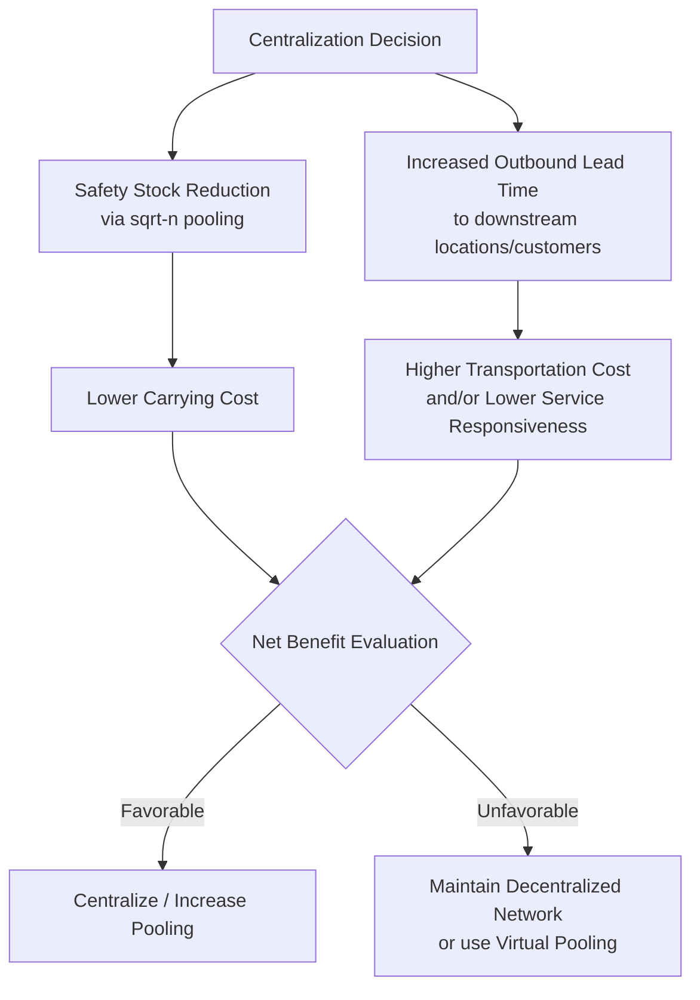

## Risk Pooling and Inventory Centralization

### Definition

Risk pooling is the statistical principle that aggregating independent (or imperfectly correlated) sources of demand uncertainty into a single point reduces the *relative* variability of that combined demand, compared to managing each source separately. Inventory centralization is the operational application of this principle: consolidating safety stock for a SKU from multiple decentralized stocking locations into fewer, larger pooled locations. This chapter item formalizes and extends the inventory pooling strategy introduced under Lead Time Compression and Pooling Strategies, focusing specifically on the statistical mechanics, network design trade-offs, and implementation forms of centralization in multi-echelon networks.

### Statistical Foundation: Why Pooling Reduces Variability

When demand at $n$ independent locations is aggregated, the variance of total pooled demand is the sum of individual variances, but the *coefficient of variation* (relative variability) of the pooled demand is lower than the average coefficient of variation of the individual locations. This is a direct consequence of variance summation under independence combined with the fact that means simply add:

$$\sigma_{pooled}^2 = \sum_{i=1}^{n} \sigma_i^2 \qquad \bar{d}_{pooled} = \sum_{i=1}^{n} \bar{d}_i$$

If all $n$ locations have identical mean $\bar{d}$ and standard deviation $\sigma$, and demand across locations is uncorrelated:

$$\sigma_{pooled} = \sigma \times \sqrt{n} \qquad \bar{d}_{pooled} = n \times \bar{d}$$

$$CV_{pooled} = \frac{\sigma_{pooled}}{\bar{d}_{pooled}} = \frac{\sigma \sqrt{n}}{n\bar{d}} = \frac{CV_{single}}{\sqrt{n}}$$

**Key Points**

- The coefficient of variation shrinks by a factor of $\sqrt{n}$ under pooling, even though absolute variance increases.
- This CV reduction is what drives the reduction in *proportional* safety stock required to maintain a given service level.

### The Square-Root Law of Inventory Pooling

Substituting the pooled standard deviation into a standard safety stock formula ($SS = Z \times \sigma \times \sqrt{L}$, holding $L$ constant) yields the square-root law:

$$SS_{pooled} = Z \times \sigma_{pooled} \times \sqrt{L} = Z \times \sigma \times \sqrt{n} \times \sqrt{L}$$

Compared to the sum of $n$ independently-held safety stocks:

$$SS_{decentralized,total} = n \times (Z \times \sigma \times \sqrt{L})$$

$$\frac{SS_{pooled}}{SS_{decentralized,total}} = \frac{\sqrt{n}}{n} = \frac{1}{\sqrt{n}}$$

**Key Points**

- Total system safety stock under full centralization is reduced by a factor of $1/\sqrt{n}$ relative to full decentralization, for the same target service level.
- This ratio assumes zero correlation between location-level demands and identical demand distributions across locations — both simplifying assumptions that rarely hold exactly in practice.

### Worked Example

Six regional distribution points each carry independent, identically distributed demand with $\bar{d}_i = 50$ units/day, $\sigma_i = 12$ units/day, $L = 7$ days, $Z = 1.65$ (95% service level).

**Decentralized (6 independent locations):**

$$SS_{single} = 1.65 \times 12 \times \sqrt{7} \approx 1.65 \times 12 \times 2.646 \approx 52.4 \text{ units}$$

$$SS_{decentralized,total} = 6 \times 52.4 = 314.4 \text{ units}$$

**Centralized (pooled into one location):**

$$\sigma_{pooled} = 12 \times \sqrt{6} \approx 29.4$$

$$SS_{pooled} = 1.65 \times 29.4 \times \sqrt{7} \approx 1.65 \times 29.4 \times 2.646 \approx 128.4 \text{ units}$$

**Reduction:**

$$\frac{128.4}{314.4} \approx 0.408 \Rightarrow \text{about a 59\% reduction in total safety stock}$$

This matches the theoretical $1/\sqrt{6} \approx 0.408$ ratio.

### Effect of Demand Correlation

The full square-root law assumes zero correlation between locations. When demand across locations is positively correlated (e.g., driven by a shared regional or seasonal factor), the pooled variance calculation must include covariance terms:

$$\sigma_{pooled}^2 = \sum_{i=1}^{n}\sigma_i^2 + 2\sum_{i<j}\rho_{ij}\sigma_i\sigma_j$$

Where $\rho_{ij}$ is the correlation coefficient between demand at locations $i$ and $j$.

**Key Points**

- As $\rho_{ij} \to 1$ (perfect positive correlation), pooling benefit disappears entirely — pooled standard deviation approaches the simple sum $\sum \sigma_i$, matching the decentralized case.
- As $\rho_{ij} \to -1$ (perfect negative correlation, i.e., demand at one location rising exactly offsets demand falling at another), pooling benefit is maximized, potentially driving pooled variance toward zero.
- [Inference] Real-world regional demand for most consumer products tends to show weak-to-moderate positive correlation (shared macroeconomic and seasonal drivers), meaning realized pooling benefits are typically smaller than the idealized $1/\sqrt{n}$ figure suggests, though still directionally favorable versus full decentralization.

### Forms of Centralization

#### 1. Physical Centralization

Consolidating actual inventory into fewer physical locations (e.g., closing regional DCs in favor of one national or continental DC).

- Maximizes pooling benefit since demand is genuinely aggregated at a single stocking point
- Increases outbound transit distance and lead time to end customers/downstream locations
- Reduces total facility and handling overhead costs

#### 2. Virtual Pooling (Transshipment Networks)

Inventory remains physically distributed across multiple locations, but locations are networked so that a stockout at one location can be filled by lateral transshipment from another location carrying surplus, rather than each location carrying full independent safety stock.

- Retains proximity/lead-time advantage of decentralized stock for the common case
- Requires real-time inventory visibility across the network and a transshipment logistics capability
- [Inference] Virtual pooling captures a meaningful share of the statistical pooling benefit without fully centralizing physical stock, though the achievable benefit depends heavily on transshipment lead time and cost relative to a stockout — if lateral transshipment is nearly as slow as a full replenishment cycle, the effective pooling benefit is much closer to the decentralized case than the idealized square-root law suggests.

#### 3. Postponement-Based Pooling (Component-Level Centralization)

Rather than pooling finished-goods inventory, undifferentiated components or subassemblies are held centrally and configured/finished close to the point of demand — pooling demand variability at the component level across multiple downstream SKU variants, as introduced under Lead Time Compression and Pooling Strategies.

### Network Design Trade-off

**Key Points**

- Centralization is not universally optimal — it trades safety stock reduction against increased outbound distribution lead time and transportation cost/complexity to reach the final point of demand.
- The decision depends on the relative cost of carrying inventory (favoring centralization when high) versus the cost/service sensitivity of outbound delivery time (favoring decentralization when high).
- High-value, low-velocity SKUs (where carrying cost dominates) are typically better candidates for centralization than low-value, high-velocity SKUs with tight local delivery requirements.

### Applicability Considerations

**Key Points**

- **Demand correlation across locations** is the single largest driver of realized pooling benefit; assess historical correlation before assuming the idealized square-root law applies.
- **Number of locations pooled ($n$):** marginal benefit of pooling diminishes as $n$ grows, since $1/\sqrt{n}$ decreases at a decreasing rate — the largest proportional gains come from pooling the first few locations.
- **Service level requirements downstream:** if end customers require very short delivery windows, physical centralization may be infeasible regardless of safety stock savings, making virtual pooling or a hybrid hub-and-spoke design more appropriate.
- **SKU criticality and value:** centralization decisions are often made per-SKU or per-category rather than network-wide, reserving full centralization for slower-moving, higher-value, or lower-criticality items.

### Related Topics

- Lead time compression and pooling strategies
- Full reorder point formula combining lead time demand and safety stock
- The bullwhip effect and its mitigation
- Multi-echelon safety stock allocation and echelon inventory positioning
- Transshipment network design and lateral resupply policies
- Postponement and mass customization strategies
- Hub-and-spoke distribution network design