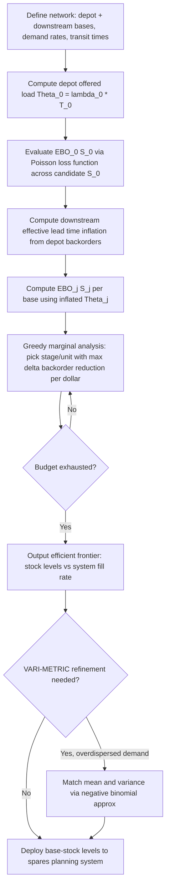

## Stochastic Service Model for Multi-Echelon Safety Stock

### Overview

The Stochastic Service Model (SSM) — sometimes called the "METRIC-type" model, after Sherbrooke's 1968 Multi-Echelon Technique for Recoverable Item Control — is an alternative to the Guaranteed Service Model (GSM) for setting safety stock across a supply chain network. Where GSM assumes each stage can contractually *guarantee* a bounded replenishment time to its downstream customer, SSM makes no such guarantee: each stage's actual replenishment lead time is itself a **random variable**, driven by the possibility of stockouts and backorders at its supplying stage(s). Safety stock at each echelon must therefore be sized against a *distribution* of lead times, not a fixed, contractually bounded one.

SSM is the dominant framework in **repairable/spare-parts inventory systems** (aircraft parts, capital equipment, field service networks) where a downstream base cannot simply "wait a guaranteed 3 days" — if the central depot is out of stock, the downstream replenishment time stretches unpredictably.

### Key Points

- Replenishment lead time at a downstream stage = deterministic transit/order time **plus** a stochastic delay caused by potential stockouts/backorders at the upstream stage.
- Because upstream stockout probability depends on the upstream stage's own stock level, the model requires **iterative or recursive** computation — stock decisions at each echelon interact.
- Widely implemented via the **METRIC approximation**: treats the number of backorders at a supply source as a random variable whose mean can be computed from an $M/M/\infty$ or $M/G/\infty$ queueing approximation (each unit "in repair" or "in transit" behaves like a customer in an infinite-server queue).
- Primarily built around a **base-stock (one-for-one, (S-1,S)) policy** at each stage, appropriate for expensive, low-demand-rate items (aircraft engines, expensive rotables) rather than high-volume consumables.
- Optimizes **expected backorders** or **fill rate** network-wide under a budget constraint, rather than optimizing service *time* directly as in GSM.

### Core Mechanics: The METRIC Approximation

Consider a two-echelon system: one central depot (warehouse) supplying $N$ downstream bases (or a single downstream stage for simplicity).

**Step 1 — Depot's expected backorders.**

For the depot, with base-stock level $S_0$, demand rate $\lambda_0$ (aggregated across all downstream bases), and average repair/replenishment time $T_0$:

The offered load (Palm's theorem, using an $M/G/\infty$ approximation) is:

$$\Theta_0 = \lambda_0 \cdot T_0$$

The number of units in resupply at the depot is Poisson-distributed with mean $\Theta_0$ (this is the classical **Palm's Theorem** result underlying METRIC — exact for Poisson demand and any repair-time distribution when repair capacity is ample).

Expected backorders at the depot, $EBO_0(S_0)$, using the Poisson loss formula:

$$EBO_0(S_0) = \sum_{x=S_0}^{\infty} (x - S_0) \cdot P(x; \Theta_0)$$

where $P(x;\Theta_0)$ is the Poisson pmf with mean $\Theta_0$.

**Step 2 — Downstream effective lead time.**

A downstream base's *effective* replenishment lead time is inflated by depot backorders. The expected additional delay a downstream order experiences due to depot stockouts is approximated as:

$$T_j^{eff} = T_j^{transit} + \frac{EBO_0(S_0)}{S_0} \cdot (\text{avg delay factor})$$

More precisely, in the classical METRIC formulation, the downstream base's demand during its (now stochastic) replenishment lead time is modeled with an inflated variance/mean that reflects the probability its resupply is delayed by depot backorders — this couples the downstream base-stock decision to the depot's.

**Step 3 — Downstream expected backorders.**

Each downstream base $j$ computes its own $EBO_j(S_j)$ using the same Poisson-loss logic, but with $\Theta_j = \lambda_j \cdot T_j^{eff}$ (using the *inflated* lead time from Step 2).

**Step 4 — Joint optimization.**

The system-wide objective is typically to minimize total expected backorders (or maximize average fill rate) across all bases subject to a total inventory investment budget $C$:

$$\min \sum_j EBO_j(S_j) \quad \text{s.t.} \quad \sum_j c_j S_j \le C$$

This is solved via a **greedy marginal-analysis algorithm** (originally due to Sherbrooke): at each iteration, add one unit of stock to whichever stage $(0 \text{ or } j)$ yields the largest marginal reduction in expected system backorders per dollar spent — continuing until the budget is exhausted. This produces an efficient frontier of stock-investment vs. backorder-performance tradeoffs.

### Fill Rate and Availability Metrics

Given $EBO_j(S_j)$, the fill rate at base $j$ (probability an order is met immediately from stock) is:

$$FR_j = 1 - \frac{EBO_j(S_j)}{\lambda_j \cdot T_j^{eff}}$$

System-wide (supply) availability for end customers, when multiple echelons must each succeed, is approximated as the product of conditional fill probabilities along the path — reflecting that an end customer is served only if *every* stage on its replenishment path has stock.

### Worked Example

Two-echelon spares network: 1 depot supplying 3 identical field bases.

| Parameter | Value |
| --- | --- |
| Base demand rate $\lambda_j$ (each) | 2 units/month |
| Depot repair/order time $T_0$ | 2 months |
| Base transit time $T_j^{transit}$ | 0.25 months |
| Unit cost | $50,000 |

**Depot:** aggregate demand $\lambda_0 = 3 \times 2 = 6$/month. Offered load $\Theta_0 = 6 \times 2 = 12$.

Suppose the marginal analysis selects $S_0 = 14$ (a modest buffer above the mean). Using the Poisson pmf with mean 12:

$$EBO_0(14) \approx 1.42 \text{ units (illustrative, computed via Poisson loss table)}$$

**Downstream inflation:** each base's effective lead time incorporates a fraction of the depot's expected delay. If the resulting inflation raises each base's effective mean demand-during-lead-time from $2 \times 0.25 = 0.5$ to approximately $0.5 + (EBO_0/S_0) \approx 0.6$, each base then computes its own $EBO_j(S_j)$ at $\Theta_j \approx 0.6$.

At $S_j = 2$ for each base:

$$EBO_j(2) \approx 0.03 \text{ units [Inference — illustrative order of magnitude from standard Poisson-loss tables at low }\Theta\text{; exact value depends on precise inflation formula used]}$$

Resulting system fill rate at each base: $FR_j \approx 1 - 0.03/0.6 \approx 0.95$ (95%).

**Key Points**

- Note the qualitative behavior the example is meant to show: depot stock decisions materially shape downstream achievable fill rate — this coupling is exactly what SSM captures and GSM does not model explicitly (GSM instead assumes the coupling is resolved contractually via guaranteed $S_j$).
- The greedy algorithm would continue adding units wherever marginal $\Delta EBO / \Delta cost$ is largest, comparing depot vs. any base at each step.

### Stochastic vs. Guaranteed Service Model — Structural Comparison

| Aspect | SSM (METRIC-type) | GSM |
| --- | --- | --- |
| Lead time nature | Random variable (depends on upstream stock) | Fixed, contractually bounded |
| Coupling mechanism | Queueing-theoretic (Palm's theorem, backorder propagation) | Deterministic service-time algebra ($NRT = SI+T-S$) |
| Typical policy | (S-1,S) one-for-one, low-demand-rate items | Periodic review base-stock, any demand rate |
| Optimization objective | Minimize expected backorders / maximize fill rate under budget | Minimize holding cost under service-time SLA |
| Computational approach | Greedy marginal analysis + Poisson/queueing approximations | Dynamic programming / MILP on service times |
| Best suited for | Expensive, slow-moving, repairable spares (aerospace, defense, capital equipment) | Retail, CPG, manufacturing supply chains with contractual lead times |
| Exactness | Approximate (Palm's theorem exact only under specific assumptions; VARI-METRIC improves accuracy) | Exact for tree networks (given the bounded-demand assumption) |

### Refinements Beyond Basic METRIC

- **VARI-METRIC** (Slay, 1984; Graves, 1985): improves on basic METRIC by matching both the *mean and variance* of the downstream demand-during-lead-time distribution (rather than assuming Poisson, which forces variance = mean) via a negative binomial approximation — materially improves accuracy when demand is overdispersed relative to Poisson.
- **Multi-indenture, multi-echelon (MIME) models**: extend to systems where end items are composed of repairable subassemblies (aircraft → engine → module), each with its own stock/repair dynamics — used in DoD-style sparing-to-availability tools.
- **Lateral transshipment models**: extend SSM to allow bases to borrow stock from each other rather than only from the depot, requiring modified backorder-probability computations.

### System Architecture (svg_diagram)

<svg xmlns="http://www.w3.org/2000/svg" viewBox="0 0 760 300">
<text x="380" y="24" text-anchor="middle" font-size="16" font-weight="bold" fill="#1a1a1a">Stochastic Service Model — Two-Echelon Spares Network (svg_diagram)</text>
<rect x="300" y="60" width="160" height="70" rx="8" fill="#ede9fe" stroke="#6d28d9" stroke-width="2" />
<text x="380" y="90" text-anchor="middle" font-size="13" font-weight="bold">Depot</text>
<text x="380" y="108" text-anchor="middle" font-size="11">S0=14, Θ0=12</text>
<text x="380" y="122" text-anchor="middle" font-size="11">EBO0≈1.42</text>
<rect x="60" y="210" width="150" height="65" rx="8" fill="#fee2e2" stroke="#b91c1c" stroke-width="2" />
<text x="135" y="238" text-anchor="middle" font-size="12" font-weight="bold">Base 1</text>
<text x="135" y="255" text-anchor="middle" font-size="10">Sj=2, FR≈95%</text>
<rect x="305" y="210" width="150" height="65" rx="8" fill="#fee2e2" stroke="#b91c1c" stroke-width="2" />
<text x="380" y="238" text-anchor="middle" font-size="12" font-weight="bold">Base 2</text>
<text x="380" y="255" text-anchor="middle" font-size="10">Sj=2, FR≈95%</text>
<rect x="550" y="210" width="150" height="65" rx="8" fill="#fee2e2" stroke="#b91c1c" stroke-width="2" />
<text x="625" y="238" text-anchor="middle" font-size="12" font-weight="bold">Base 3</text>
<text x="625" y="255" text-anchor="middle" font-size="10">Sj=2, FR≈95%</text>
<line x1="340" y1="130" x2="150" y2="208" stroke="#333" stroke-width="1.5" marker-end="url(#arrow2)" />
<line x1="380" y1="130" x2="380" y2="208" stroke="#333" stroke-width="1.5" marker-end="url(#arrow2)" />
<line x1="420" y1="130" x2="610" y2="208" stroke="#333" stroke-width="1.5" marker-end="url(#arrow2)" />

<text x="380" y="165" text-anchor="middle" font-size="10" fill="#555">Backorder risk propagates downstream</text>

</svg>

### Algorithmic Flow

### Common Pitfalls

- **Applying basic METRIC to high-volume, cheap items**: the Poisson/one-for-one framework is built for slow-moving, expensive repairables; for fast-moving consumables, periodic-review GSM-style or classical EOQ-based safety stock is far more appropriate and computationally simpler.
- **Ignoring variance-to-mean ratio**: basic METRIC assumes Poisson demand (variance = mean); real repair/demand processes are often overdispersed, understating required safety stock unless VARI-METRIC or negative-binomial corrections are applied. [Inference — well-documented in the sparing literature, though the degree of understatement is instance-specific.]
- **Treating depot and base decisions as independent**: because $EBO_0(S_0)$ directly inflates every downstream base's effective lead time, decoupling the optimization (solving depot stock first, then bases, with no feedback) produces suboptimal or inconsistent budget allocation.
- **Confusing fill rate with backorder count**: a low $EBO$ at the depot does not guarantee high downstream fill rate if downstream demand rates are large — always translate back to $FR_j$ for stakeholder-facing service metrics.
- **Assuming lateral transshipment for "free"**: base models that allow bases to borrow from each other change the backorder probability structure substantially and require adjusted formulas, not a naive overlay on the two-echelon METRIC result.

### Related Topics

- Palm's Theorem and $M/G/\infty$ queueing foundations of METRIC
- VARI-METRIC and negative binomial demand-during-lead-time modeling
- Multi-indenture, multi-echelon (MIME) sparing models for complex assemblies
- Marginal analysis / greedy algorithms for constrained inventory optimization
- Lateral transshipment and pooling in spare-parts networks
- Comparison and hybridization with the Guaranteed Service Model
- Sparing-to-availability optimization for capital equipment fleets
- Poisson loss function tables and expected backorder computation techniques