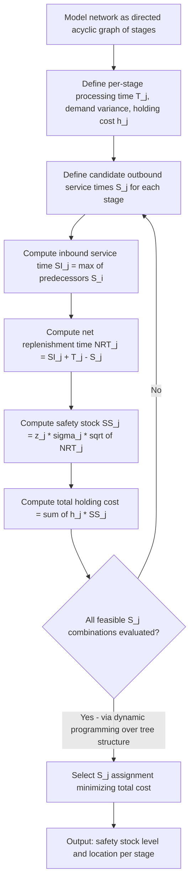

## Echelon inventory and strategic safety stock placement


### Overview

**Key Points**

- Echelon inventory is the sum of stock at a given node *plus* all stock downstream of it in the network — not just the stock physically sitting at that location.
- Strategic safety stock placement (SSP) determines *where* in a multi-echelon network to hold safety stock so that a target end-customer service level is met at minimum total system-wide holding cost, rather than optimizing each node independently.
- The dominant analytical framework is the **Guaranteed-Service Model (GSM)**, originated by Simpson (1958) and generalized by Graves & Willems (2000); an alternative is the **Stochastic-Service Model (SSM)**, rooted in the METRIC framework (Sherbrooke, 1968).
- Core insight: holding safety stock upstream (closer to suppliers) is often cheaper per unit but slower to react; holding it downstream (closer to customers) is more expensive per unit but responds faster — the optimization finds the cost-minimizing placement across the network topology.

---

### Echelon Inventory vs. Local (Installation) Inventory

| Concept | Definition | Formula |
| --- | --- | --- |
| Local (installation) inventory | Physical stock on hand at a specific node | $I_n$ at node $n$ |
| Echelon inventory | Stock at node $n$ plus all stock in transit to and held at every downstream node | $IE_n = I_n + \sum_{d \in \text{downstream}(n)} I_d$ |
| Echelon inventory position | Echelon inventory plus stock on order to node $n$, minus backorders | $IEP_n = IE_n + O_n - B_n$ |

The distinction matters because a reorder decision at an upstream node (e.g., a central DC) should account for *all* inventory already in the pipeline downstream, not just what's sitting in the DC itself. Managing to local inventory alone causes overordering, since upstream nodes don't "see" stock already committed to downstream locations.

---

### Network Topology Classes

| Topology | Description | Typical example |
| --- | --- | --- |
| Serial | Single path of nodes, one predecessor/successor each | Supplier → Plant → DC → Store |
| Distribution (divergent/arborescent) | One upstream node feeds multiple downstream nodes | Central DC → Regional DCs → Stores |
| Assembly (convergent) | Multiple upstream nodes feed one downstream node | Multiple component suppliers → Final assembly |
| General network | Mixed convergent/divergent structure | Full supply chain with shared components and multiple distribution paths |

The Graves-Willems GSM handles all four topology classes, provided the network is representable as a directed acyclic graph (spanning tree structure); general networks with cycles typically require decomposition or heuristic approaches.

---

### Guaranteed-Service Model (GSM) — Core Mechanics

**Key Points**

- Assumes each stage quotes a **guaranteed service time** to its downstream customer(s), promising to fulfill orders within that time window regardless of demand realization, provided demand stays within a bounded range.
- Demand is bounded by a **maximum demand rate** over the **net replenishment time** at each stage, rather than modeled as an unbounded probability distribution — this is what makes the model analytically tractable across a full network.
- Each stage $j$ has a decision variable: its **outbound service time** $S_j$ (the time it guarantees to downstream stages) and receives an **inbound service time** $SI_j$ (the time its upstream supplier guarantees to it).

**Net replenishment time** at stage $j$:

$$NRT_j = SI_j + T_j - S_j$$

where $T_j$ is the stage's own processing/replenishment lead time.

**Safety stock at stage $j$** (assuming normally distributed demand with bounded variation):

$$SS_j = z_j \cdot \sigma_j \cdot \sqrt{NRT_j}$$

where $z_j$ is the service-level factor for stage $j$'s target service level, and $\sigma_j$ is the standard deviation of demand at that stage over the relevant period.

**Objective function** (minimize total network holding cost):

$$\min \sum_{j \in \text{stages}} h_j \cdot SS_j(S_j, SI_j)$$

subject to:

- $S_j \geq 0$ for all $j$
- $SI_j = \max_{i \in \text{predecessors}(j)} S_i$ (a stage can't receive faster guaranteed service than its slowest-quoting upstream supplier)
- $S_j \leq$ maximum allowable outbound service time (often a contractual or customer-imposed constraint)
- $NRT_j \geq 0$ (net replenishment time cannot be negative)

The optimization searches over the discrete set of feasible $(S_j, SI_j)$ combinations — Graves & Willems showed this reduces to a shortest-path-like dynamic program solvable in polynomial time for spanning-tree networks.

---

### Stochastic-Service Model (SSM) — Alternative Framework

**Key Points**

- Rooted in the **METRIC** (Multi-Echelon Technique for Recoverable Item Control) model, originally developed for military spare parts.
- Unlike GSM, SSM does not assume a bounded/guaranteed service time — instead it models full probability distributions of demand and lead time propagating through the network, including the possibility of stockouts at upstream stages delaying downstream stages stochastically.
- More statistically realistic but far less tractable analytically for large general networks; typically solved via approximation (e.g., normal approximation of the "induced" lead time distribution) or simulation.
- Best suited for **repairable/service parts networks** with low, intermittent demand (its original use case), where GSM's bounded-demand assumption is a poor fit.

| Dimension | GSM | SSM (METRIC-based) |
| --- | --- | --- |
| Demand assumption | Bounded max rate over review period | Full probability distribution |
| Tractability | Polynomial-time solvable for tree networks | Requires approximation or simulation for general networks |
| Stockout propagation | Not modeled (guaranteed service by design) | Modeled explicitly (upstream stockout delays downstream) |
| Typical use case | Manufacturing/retail networks with high-volume, roughly continuous demand | Spare parts, repairable item networks, low-volume demand |
| Industry adoption | Widely used in commercial APS/supply chain planning software | More common in defense/aerospace spare parts planning |

---

### Strategic Placement Logic: Where to Hold Safety Stock

**Key Points**

- The optimal placement is *not* simply "hold everything at the cheapest node" or "hold everything closest to the customer" — it depends on the interaction between **lead time variability**, **holding cost differentials**, and **network structure**.
- A node with **short net replenishment time** relative to its downstream demand variability needs less safety stock — this is the mechanism by which placement decisions ripple through the network.
- Common qualitative outcomes from GSM optimization:

| Pattern | Condition | Result |
| --- | --- | --- |
| Push safety stock upstream | Upstream holding cost is much lower than downstream; downstream lead time is short | Downstream nodes hold near-zero safety stock, rely on fast replenishment from a well-stocked upstream buffer |
| Push safety stock downstream | Downstream response time to end customer must be very short (e.g., same-day delivery); upstream lead time is long | Downstream nodes must hold stock locally since they cannot wait for upstream replenishment |
| Decouple at a strategic buffer point | High demand variability upstream, more predictable/aggregated demand downstream (risk pooling) | A single buffer stage (often where component/SKU differentiation occurs — the "decoupling point") holds the bulk of network safety stock |
| Spread stock across echelons | Cost and lead time differentials are moderate | Safety stock distributed proportionally to each stage's contribution to variance reduction |

`[Inference]` In practice, the decoupling point often coincides with a product customization or postponement point (e.g., where a generic subassembly becomes SKU-specific) because holding safety stock in generic/aggregated form before that point captures risk-pooling benefits — this is a widely cited design heuristic (Lee & Billington) but its optimality for a specific network still depends on the actual cost and variance parameters solved via GSM.

---

### Risk Pooling and Its Effect on Placement

Aggregating demand across multiple downstream locations reduces relative variability, since independent demand variances partially cancel under aggregation:

$$\sigma_{\text{pooled}} = \sqrt{\sum_{i=1}^{n} \sigma_i^2}$$

which for $n$ locations with equal, uncorrelated variance $\sigma^2$ gives $\sigma_{\text{pooled}} = \sigma \sqrt{n}$, versus $n \cdot \sigma$ if stock were held independently at each location — a reduction factor of $\sqrt{n}$ relative to the sum of individual safety stocks. This is the quantitative basis for centralizing safety stock upstream at an aggregation point rather than distributing it redundantly downstream, and it directly informs the GSM's holding-cost-minimizing placement solution.

`[Inference]` This $\sqrt{n}$ reduction assumes independent (uncorrelated) demand across locations; positively correlated regional demand (e.g., common seasonality) reduces the pooling benefit, and the actual benefit should be computed from the true covariance structure rather than assumed.

---

### Network Diagram — GSM Service Time Propagation

<svg xmlns="http://www.w3.org/2000/svg" viewBox="0 0 900 420" font-family="monospace" font-size="12">
<rect x="0" y="0" width="900" height="420" fill="#0d1117" />
<text x="20" y="25" fill="#e6edf3" font-size="15" font-weight="bold">Echelon Network — Guaranteed Service Time Propagation (svg_diagram)</text>

<rect x="20" y="70" width="140" height="70" rx="6" fill="#1f6feb" opacity="0.85" />
<text x="32" y="98" fill="#ffffff">Supplier</text>
<text x="32" y="116" fill="#c9d1d9" font-size="11">T = 10 days</text>
<text x="32" y="132" fill="#c9d1d9" font-size="11">S = 5 days (outbound)</text>

<rect x="230" y="70" width="140" height="90" rx="6" fill="#238636" opacity="0.85" />
<text x="242" y="98" fill="#ffffff">Plant</text>
<text x="242" y="116" fill="#c9d1d9" font-size="11">SI = 5, T = 7</text>
<text x="242" y="132" fill="#c9d1d9" font-size="11">S = 3 (outbound)</text>
<text x="242" y="148" fill="#c9d1d9" font-size="11">NRT = 5+7-3 = 9</text>

<rect x="440" y="70" width="150" height="90" rx="6" fill="#8957e5" opacity="0.85" />
<text x="452" y="98" fill="#ffffff">Central DC</text>
<text x="452" y="116" fill="#c9d1d9" font-size="11">SI = 3, T = 2</text>
<text x="452" y="132" fill="#c9d1d9" font-size="11">S = 0 (outbound)</text>
<text x="452" y="148" fill="#c9d1d9" font-size="11">NRT = 3+2-0 = 5</text>

<rect x="660" y="20" width="140" height="90" rx="6" fill="#da3633" opacity="0.85" />
<text x="672" y="48" fill="#ffffff">Store A</text>
<text x="672" y="66" fill="#c9d1d9" font-size="11">SI = 0, T = 1</text>
<text x="672" y="82" fill="#c9d1d9" font-size="11">S = 0 (to customer)</text>
<text x="672" y="98" fill="#c9d1d9" font-size="11">NRT = 0+1-0 = 1</text>

<rect x="660" y="130" width="140" height="90" rx="6" fill="#da3633" opacity="0.85" />
<text x="672" y="158" fill="#ffffff">Store B</text>
<text x="672" y="176" fill="#c9d1d9" font-size="11">SI = 0, T = 1</text>
<text x="672" y="192" fill="#c9d1d9" font-size="11">S = 0 (to customer)</text>
<text x="672" y="208" fill="#c9d1d9" font-size="11">NRT = 0+1-0 = 1</text>

<line x1="160" y1="105" x2="230" y2="105" stroke="#8b949e" stroke-width="2" marker-end="url(#arrow2)" />
<line x1="370" y1="105" x2="440" y2="105" stroke="#8b949e" stroke-width="2" marker-end="url(#arrow2)" />
<line x1="590" y1="90" x2="660" y2="65" stroke="#8b949e" stroke-width="2" marker-end="url(#arrow2)" />
<line x1="590" y1="120" x2="660" y2="175" stroke="#8b949e" stroke-width="2" marker-end="url(#arrow2)" />

<rect x="20" y="250" width="780" height="140" rx="6" fill="#21262d" stroke="#30363d" stroke-width="1.5" />
<text x="35" y="275" fill="#e6edf3" font-weight="bold">Interpretation</text>
<text x="35" y="298" fill="#c9d1d9" font-size="12">Central DC quotes S = 0 (immediate service) to stores — it absorbs variability by holding</text>
<text x="35" y="316" fill="#c9d1d9" font-size="12">safety stock sized to its own NRT = 5 days, protecting stores from needing local buffers.</text>
<text x="35" y="336" fill="#c9d1d9" font-size="12">Stores hold minimal safety stock (NRT = 1 day, their own handling time only) since they</text>
<text x="35" y="354" fill="#c9d1d9" font-size="12">receive guaranteed immediate service from the DC — this is the "push safety stock</text>
<text x="35" y="372" fill="#c9d1d9" font-size="12">upstream" pattern, chosen here because DC holding cost per unit is lower than store cost.</text>
</svg>

---

### GSM Optimization Flow



---

### Solving the GSM in Practice

**Dynamic Programming Decomposition (Graves-Willems)**

For spanning-tree networks, the GSM optimization decomposes into a shortest-path problem solvable stage-by-stage in topological order, because each stage's optimal $S_j$ depends only on its immediate predecessors' quoted service times. This avoids the combinatorial explosion of jointly optimizing all $S_j$ simultaneously across a large network.

**Reference pseudocode (single-path/serial case simplification):**

```python
import numpy as np
from scipy.stats import norm

def net_replenishment_time(SI, T, S):
    """Net replenishment time at a stage; cannot be negative."""
    nrt = SI + T - S
    return max(nrt, 0)

def stage_safety_stock(sigma_demand, nrt, service_level):
    z = norm.ppf(service_level)
    return z * sigma_demand * np.sqrt(nrt)

def evaluate_service_time_assignment(stages, S_assignment, service_level):
    """
    stages: list of dicts with keys: id, T (processing time), sigma (demand std dev),
            h (holding cost/unit/period), predecessors (list of stage ids)
    S_assignment: dict {stage_id: outbound service time}
    """
    total_cost = 0.0
    detail = {}
    for stage in stages:
        sid = stage["id"]
        if stage["predecessors"]:
            SI = max(S_assignment[p] for p in stage["predecessors"])
        else:
            SI = 0  # root supplier stage, no upstream guarantee needed
        S = S_assignment[sid]
        nrt = net_replenishment_time(SI, stage["T"], S)
        ss = stage_safety_stock(stage["sigma"], nrt, service_level)
        cost = stage["h"] * ss
        total_cost += cost
        detail[sid] = {"SI": SI, "S": S, "NRT": nrt, "SS": ss, "cost": cost}
    return total_cost, detail

def grid_search_gsm(stages, service_level, max_service_time=15):
    """
    Brute-force grid search over feasible S_j for small networks.
    For production use on large networks, replace with the
    Graves-Willems dynamic programming decomposition.
    """
    from itertools import product
    stage_ids = [s["id"] for s in stages]
    candidate_ranges = [range(0, max_service_time + 1) for _ in stage_ids]

    best_cost = float("inf")
    best_assignment = None
    best_detail = None

    for combo in product(*candidate_ranges):
        S_assignment = dict(zip(stage_ids, combo))
        cost, detail = evaluate_service_time_assignment(stages, S_assignment, service_level)
        if cost < best_cost:
            best_cost = cost
            best_assignment = S_assignment
            best_detail = detail

    return best_assignment, best_cost, best_detail
```

`[Inference]` Brute-force grid search is exponential in the number of stages and is shown here only for illustrating the mechanics on small networks; production-scale implementations (dozens to hundreds of stages) require the polynomial-time dynamic programming decomposition described by Graves & Willems (2000) or commercial APS solvers implementing it.

---

### Data Requirements for Implementation

| Input | Source | Notes |
| --- | --- | --- |
| Network topology (stage adjacency) | BOM / distribution network master data | Must be a DAG for standard GSM |
| Processing/replenishment time $T_j$ per stage | ERP lead time master data | Should reflect actual, not quoted, lead times |
| Demand mean and variance per stage | Historical demand / forecast error | End-customer-facing stages need true demand variance; upstream stages need *derived* demand variance (propagated from downstream) |
| Holding cost per unit per stage | Cost accounting (capital cost + storage + obsolescence risk) | Should increase moving downstream (value-add accumulates) |
| Target service level per stage | Business/contractual requirement | Often only specified at customer-facing stages; upstream targets are outputs, not inputs |

**Demand variance propagation upstream**: for a divergent (distribution) network, the demand variance an upstream stage must protect against is the *aggregate* variance of all downstream stages it feeds, computed via the pooling formula above (or a full covariance calculation if downstream demands are correlated).

---

### Common Implementation Pitfalls

- **Using local inventory policies instead of echelon-based policies** — causes double-counting of safety stock and overordering, since upstream nodes don't net out downstream inventory already in the pipeline.
- **Ignoring correlation in demand pooling** — assuming independence between downstream nodes when regional demand is actually correlated (e.g., weather, seasonality) overstates the risk-pooling benefit and underestimates required safety stock.
- **Treating $T_j$ as static** — processing/lead times that vary seasonally (e.g., peak season carrier delays) require either scenario-based re-solving of the GSM or padding via a conservative $T_j$.
- **Applying GSM to networks with genuine cycles** — GSM requires a spanning-tree (or DAG) structure; networks with reciprocal flows (e.g., two plants that can both supply and receive from each other) require decomposition into an approximating tree or a different modeling approach.
- **Static placement in a changing network** — safety stock placement should be re-solved when holding costs, lead times, or network topology change materially (e.g., new supplier, new DC), not treated as a one-time setup exercise.

---

**Next Steps**

- Guaranteed-Service Model (GSM) formal derivation and Graves-Willems dynamic programming algorithm
- Stochastic-Service Model / METRIC framework for repairable spare parts networks
- Demand variance propagation and covariance estimation across distribution networks
- Postponement and the decoupling point in supply chain design
- Simulation-based validation of GSM-derived safety stock placements (cross-reference: simulation-based safety stock estimation)
- Commercial APS/supply chain planning tool implementations of multi-echelon inventory optimization (e.g., SAP IBP, o9, Blue Yonder)