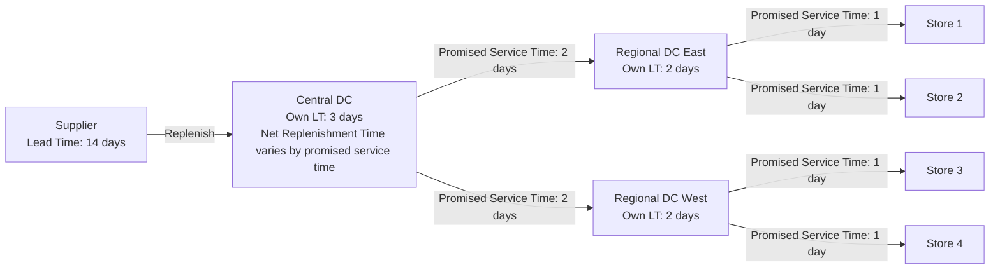

## Distribution Network Design and Inventory Allocation

### Overview

Distribution network design determines the physical structure through which inventory flows from sources (factories, suppliers) to demand points (stores, customers) — the number, location, and role of facilities (plants, central DCs, regional DCs, cross-docks). Inventory allocation determines how much stock sits at each node in that structure and how it is apportioned across echelons and locations once the network topology is fixed. The two problems are deeply coupled: network design decisions (how many DCs, where, serving which markets) fix the transportation lead times and pooling opportunities that drive the safety stock math, while inventory allocation decisions determine the holding costs that make certain network configurations economical or not.

### Why Network Design and Inventory Allocation Are Coupled

**Key Points**

- Facility location decisions change replenishment lead times, which change safety stock requirements at every downstream node.
- Consolidating demand into fewer, larger DCs enables risk pooling, reducing aggregate safety stock — but increases outbound transportation distance and lead time to end customers.
- Decentralizing into many regional DCs shortens last-mile lead time and improves service, but fragments demand and increases aggregate safety stock due to loss of pooling.
- The total landed cost of a network configuration must include: facility fixed costs, inbound/outbound transportation, and inventory carrying cost (cycle stock + safety stock) — optimizing transportation alone or inventory alone yields a suboptimal network.

This is the classic **centralization vs. decentralization tradeoff**, formalized by the square root law of inventory pooling and extended in multi-echelon models.

### The Square Root Law of Inventory Consolidation

If demand at $n$ identical, independent locations is consolidated into one location, the safety stock required to maintain the same service level scales approximately with $\sqrt{n}$ rather than $n$:

$$SS_{consolidated} \approx SS_{single} \times \sqrt{n}$$

where $SS_{single}$ is the safety stock needed at one representative location before consolidation.

**Example**

Suppose 9 independent regional warehouses each carry safety stock of 100 units to hit a 95% cycle service level, for a network total of 900 units. If demand across these 9 regions is uncorrelated and consolidated into a single central DC serving the same aggregate demand:

$$SS_{consolidated} \approx 100 \times \sqrt{9} = 300 \text{ units}$$

This is a 67% reduction in safety stock for the same service level — the pooling effect. [Inference: the exact reduction depends on the correlation structure between regional demands; the law assumes independence, and positive correlation between regions erodes the benefit.]

The law derives directly from the statistics of independent variance summation. If each location's demand has standard deviation $\sigma$, the standard deviation of pooled demand across $n$ independent locations is:

$$\sigma_{pooled} = \sigma\sqrt{n}$$

versus $n\sigma$ if variability were summed linearly (which would be the case under perfect positive correlation). Safety stock is proportional to demand standard deviation ($SS = z \times \sigma_{LT}$), so the same scaling applies to safety stock.

### Generalizing Beyond Identical Locations

Real networks rarely have identical, uncorrelated demand streams. The general pooled safety stock formula for $n$ locations with individual demand standard deviations $\sigma_i$ and pairwise correlation coefficients $\rho_{ij}$ is:

$$\sigma_{pooled} = \sqrt{\sum_{i=1}^{n} \sigma_i^2 + 2\sum_{i<j} \rho_{ij}\sigma_i\sigma_j}$$

**Key Points**

- When $\rho_{ij} = 0$ for all pairs, this collapses to $\sigma_{pooled} = \sqrt{\sum \sigma_i^2}$, the independent case.
- When $\rho_{ij} = 1$ for all pairs (perfectly correlated demand, e.g., driven by a common macro trend), $\sigma_{pooled} = \sum \sigma_i$ — no pooling benefit at all.
- Negative correlation between locations (e.g., regions with offsetting seasonal patterns) can reduce pooled variance below what independence alone would predict.
- Practical network design should estimate cross-location demand correlation empirically before assuming square-root-law savings; retail chains with correlated regional demand (driven by national marketing, weather systems, or macroeconomic cycles) see much smaller consolidation benefits than the naive law suggests.

### Multi-Echelon Network Topologies

**Direct Shipment (Single Echelon)**

Suppliers ship directly to each demand point. No intermediate stocking node.

- Lowest lead time variability from a single hop, but no pooling — full safety stock burden falls on each demand node independently.
- Appropriate when demand volumes per lane are large and stable enough to fill efficient transportation loads.

**Central DC / Hub-and-Spoke**

All inbound flow passes through one central DC, which then replenishes downstream demand points or stores.

- Captures pooling benefit for the DC's own safety stock against downstream store demand.
- Introduces an added echelon of lead time (source → DC → store), which lengthens the total replenishment lead time to stores unless the DC carries buffer stock to decouple the two legs.

**Regional DC Tier (Two-Echelon)**

Central DC feeds several regional DCs, which feed stores.

- Balances pooling (at the regional tier) against last-mile responsiveness.
- Requires allocating safety stock across *two* echelons — a central decision, not merely a sum of independent single-location calculations (see Multi-Echelon Safety Stock below).

**Cross-Docking**

Inventory flows through a facility without extended storage — inbound trailers are broken down and immediately reloaded onto outbound trailers matched to downstream demand.

- Minimizes inventory holding at the intermediate node, at the cost of requiring highly synchronized inbound/outbound scheduling and accurate downstream demand signals.
- Reduces the "extra echelon lead time" penalty of a stocking DC, but only works when inbound supply and downstream demand can be time-matched.

### Diagram: Network Topology Comparison (svg_diagram)

<svg xmlns="http://www.w3.org/2000/svg" viewBox="0 0 900 420" font-family="sans-serif">
<text x="450" y="24" text-anchor="middle" font-size="16" font-weight="bold">Distribution Network Topologies (svg_diagram)</text>

<text x="120" y="55" text-anchor="middle" font-size="13" font-weight="bold">Direct Shipment</text>

<rect x="90" y="70" width="60" height="30" rx="4" fill="`#c9e4ff`" stroke="#333" />

<text x="120" y="90" text-anchor="middle" font-size="11">Supplier</text>

<line x1="150" y1="85" x2="240" y2="60" stroke="#333" marker-end="url(#arrow)" />

<line x1="150" y1="85" x2="240" y2="100" stroke="#333" marker-end="url(#arrow)" />

<line x1="150" y1="85" x2="240" y2="140" stroke="#333" marker-end="url(#arrow)" />

<rect x="240" y="45" width="60" height="28" rx="4" fill="`#ffe9c9`" stroke="#333" />

<text x="270" y="63" text-anchor="middle" font-size="10">Store A</text>

<rect x="240" y="86" width="60" height="28" rx="4" fill="`#ffe9c9`" stroke="#333" />

<text x="270" y="104" text-anchor="middle" font-size="10">Store B</text>

<rect x="240" y="127" width="60" height="28" rx="4" fill="`#ffe9c9`" stroke="#333" />

<text x="270" y="145" text-anchor="middle" font-size="10">Store C</text>

<text x="450" y="55" text-anchor="middle" font-size="13" font-weight="bold">Hub-and-Spoke</text>

<rect x="420" y="70" width="60" height="30" rx="4" fill="`#c9e4ff`" stroke="#333" />

<text x="450" y="90" text-anchor="middle" font-size="11">Supplier</text>

<line x1="480" y1="85" x2="530" y2="85" stroke="#333" marker-end="url(#arrow)" />

<rect x="530" y="70" width="60" height="30" rx="4" fill="`#c9ffd6`" stroke="#333" />

<text x="560" y="90" text-anchor="middle" font-size="10">Central DC</text>

<line x1="590" y1="85" x2="660" y2="60" stroke="#333" marker-end="url(#arrow)" />

<line x1="590" y1="85" x2="660" y2="100" stroke="#333" marker-end="url(#arrow)" />

<line x1="590" y1="85" x2="660" y2="140" stroke="#333" marker-end="url(#arrow)" />

<rect x="660" y="45" width="60" height="28" rx="4" fill="`#ffe9c9`" stroke="#333" />

<text x="690" y="63" text-anchor="middle" font-size="10">Store A</text>

<rect x="660" y="86" width="60" height="28" rx="4" fill="`#ffe9c9`" stroke="#333" />

<text x="690" y="104" text-anchor="middle" font-size="10">Store B</text>

<rect x="660" y="127" width="60" height="28" rx="4" fill="`#ffe9c9`" stroke="#333" />

<text x="690" y="145" text-anchor="middle" font-size="10">Store C</text>

<text x="450" y="200" text-anchor="middle" font-size="13" font-weight="bold">Two-Echelon Regional</text>

<rect x="420" y="215" width="60" height="30" rx="4" fill="`#c9e4ff`" stroke="#333" />

<text x="450" y="235" text-anchor="middle" font-size="11">Supplier</text>

<line x1="480" y1="230" x2="530" y2="215" stroke="#333" marker-end="url(#arrow)" />

<line x1="480" y1="230" x2="530" y2="260" stroke="#333" marker-end="url(#arrow)" />

<rect x="530" y="200" width="55" height="28" rx="4" fill="`#c9ffd6`" stroke="#333" />

<text x="557" y="218" text-anchor="middle" font-size="9">Regional DC1</text>

<rect x="530" y="248" width="55" height="28" rx="4" fill="`#c9ffd6`" stroke="#333" />

<text x="557" y="266" text-anchor="middle" font-size="9">Regional DC2</text>

<line x1="585" y1="214" x2="640" y2="195" stroke="#333" marker-end="url(#arrow)" />

<line x1="585" y1="214" x2="640" y2="225" stroke="#333" marker-end="url(#arrow)" />

<line x1="585" y1="262" x2="640" y2="250" stroke="#333" marker-end="url(#arrow)" />

<line x1="585" y1="262" x2="640" y2="280" stroke="#333" marker-end="url(#arrow)" />

<rect x="640" y="182" width="55" height="26" rx="4" fill="`#ffe9c9`" stroke="#333" />

<text x="667" y="199" text-anchor="middle" font-size="9">Store A</text>

<rect x="640" y="212" width="55" height="26" rx="4" fill="`#ffe9c9`" stroke="#333" />

<text x="667" y="229" text-anchor="middle" font-size="9">Store B</text>

<rect x="640" y="238" width="55" height="26" rx="4" fill="`#ffe9c9`" stroke="#333" />

<text x="667" y="255" text-anchor="middle" font-size="9">Store C</text>

<rect x="640" y="266" width="55" height="26" rx="4" fill="`#ffe9c9`" stroke="#333" />

<text x="667" y="283" text-anchor="middle" font-size="9">Store D</text>

<text x="450" y="330" text-anchor="middle" font-size="11" fill="#555">More echelons → shorter last-mile lead time, less pooling, higher aggregate safety stock</text>

<text x="450" y="350" text-anchor="middle" font-size="11" fill="#555">Fewer echelons → stronger pooling, lower aggregate safety stock, longer last-mile lead time</text>

</svg>

### Multi-Echelon Safety Stock Placement

In a two-echelon network (central DC → regional DC → store), safety stock cannot be allocated independently at each tier by simply applying the single-location formula everywhere; doing so double-counts protection against the same demand uncertainty. Two dominant frameworks address this:

**Guaranteed Service Model (GSM)**

Each stage quotes a guaranteed replenishment service time to its downstream stage. Safety stock at each node protects only against demand variability during that node's own quoted service time plus its own replenishment lead time, net of the service time it receives from upstream. The optimization problem is to choose *service time* decision variables at each node to minimize total network safety stock cost, subject to a maximum service time constraint at customer-facing nodes.

Net replenishment time at a node:

$$NRT_j = SI_j + T_j - S_j$$

where $SI_j$ is the incoming service time promised by the upstream node, $T_j$ is node $j$'s own processing/replenishment lead time, and $S_j$ is the service time node $j$ promises downstream. Safety stock at node $j$ is then:

$$SS_j = z_j \times \sigma_j \times \sqrt{NRT_j}$$

**Key Points**

- GSM assumes demand is bounded within a specified range during the net lead time (a "guaranteed" worst case), making it tractable for large networks via dynamic programming over the supply chain graph.
- Widely used in practice (e.g., in APS/inventory optimization software) because it decomposes cleanly across a bill-of-materials or distribution tree.

**Stochastic-Service (Echelon) Model**

Treats each stage as holding **echelon inventory** — stock at a stage plus all inventory downstream of it in the pipeline — and computes safety stock based on the variance of demand over the full echelon lead time (own lead time plus all downstream nodes' lead times), net of what is covered by downstream echelon stock. This approach (e.g., Clark-Scarf and its extensions) more accurately captures stochastic demand propagation but is computationally heavier for general networks; closed-form solutions exist mainly for serial and simple tree/assembly structures.

**Key Points**

- Under both frameworks, upstream (central) stock should generally protect against *aggregate* uncertainty across the downstream nodes it serves, while downstream (store-level) stock protects primarily against local demand variability and short-term replenishment risk.
- A common practical heuristic that approximates the qualitative result of the stochastic model: hold a larger share of total network safety stock upstream (where pooling is available) and hold thinner, faster-cycling safety stock downstream, sized primarily to cover the short store-replenishment lead time rather than full end-to-end uncertainty.

### Network Design Diagram: Echelon Lead Time Decomposition

### Allocation Rules Within a Fixed Network

Once the topology is fixed, inventory must be *allocated* across nodes and, at a finer grain, across SKUs and time. Common allocation mechanisms:

**Push (Central Allocation)**

Central planning determines quantities to ship to each downstream node based on forecast, target service level, and available central-DC stock. Common under initial stocking, seasonal launches, and promotional builds.

**Pull (Replenishment-Triggered)**

Downstream nodes trigger replenishment based on their own consumption (e.g., min/max or reorder point logic at the store level), and the DC responds to those signals. Dominant for steady-state, continuously replenished items.

**Fair Share Allocation (under DC stockout risk)**

When central DC supply is insufficient to fully satisfy all downstream replenishment requests, allocation must be rationed. A common rule allocates proportionally to each location's share of aggregate demand or its own safety-stock deficit, rather than first-come-first-served, to avoid systematically starving smaller locations:

$$Allocation_i = \frac{D_i}{\sum_{j} D_j} \times AvailableStock$$

where $D_i$ is location $i$'s demand (or open order requirement).

**Key Points**

- Naive first-come-first-served allocation during shortages tends to reward locations that order more frequently or in larger batches, not those with the greatest actual need — a known distortion in multi-echelon systems (related to the "bullwhip" amplification of order variability).
- More sophisticated allocation policies weight by projected stockout risk or backorder cost at each downstream node rather than by demand share alone. [Inference: which allocation policy is optimal is context-dependent — demand share allocation is simplest to implement and reasonably robust, but risk-weighted allocation can outperform it when downstream nodes have heterogeneous service-level targets or holding costs.]

### Facility Location Modeling (Network Design Formulation)

Facility location for distribution networks is typically formulated as a **capacitated (or uncapacitated) facility location problem**, which combined with inventory considerations becomes a **location-inventory problem**. A simplified objective:

$$\min \sum_{j} f_j y_j + \sum_{i}\sum_{j} c_{ij} x_{ij} + \sum_{j} H_j(y_j)$$

subject to:

$$\sum_j x_{ij} = 1 \quad \forall i \quad \text{(each demand point served by one DC)}$$

$$x_{ij} \le y_j \quad \forall i,j \quad \text{(can only ship from an open facility)}$$

$$y_j \in \{0,1\}$$

where:

- $f_j$ = fixed cost of opening facility $j$
- $y_j$ = binary decision to open facility $j$
- $c_{ij}$ = transportation cost from facility $j$ to demand point $i$
- $x_{ij}$ = fraction of demand point $i$'s demand served by facility $j$
- $H_j(y_j)$ = inventory holding cost at facility $j$, which itself depends on how many demand points $j$ serves (because pooled safety stock scales with $\sqrt{n_j}$ per the square root law, this term is concave in the number of assigned demand points, not linear)

**Key Points**

- Because $H_j$ is concave (increasing but at a decreasing rate) in the number of served demand points, standard facility location solvers must be extended (e.g., via piecewise-linear approximation of the square-root inventory term) to correctly capture pooling economics — treating holding cost as linear in assigned demand systematically over-favors decentralized (many small DC) networks.
- This is the core mechanism connecting Chapter-level topics: network design (location-allocation) and safety stock calculus (pooling) are not separable optimization problems in a fully rigorous model, even though they are frequently solved sequentially in practice for tractability.

### Practical Sequential Approach (Common in Industry)

Given the computational complexity of joint location-inventory optimization, many practitioners use a staged approach:

1. **Coarse network design** using transportation-cost-only or transportation-plus-fixed-cost facility location models (ignoring inventory pooling effects) to generate a small set of candidate network topologies.
2. **Inventory policy evaluation** for each candidate topology — compute pooled safety stock, cycle stock, and total carrying cost per candidate using multi-echelon safety stock methods (GSM or stochastic-service).
3. **Total landed cost comparison** across candidates (transportation + facility fixed costs + inventory carrying cost) to select the final network.
4. **Sensitivity analysis** on demand correlation assumptions, since the pooling benefit — often the single largest inventory-cost differentiator between centralized and decentralized designs — is highly sensitive to the correlation structure assumed between regional demand streams.

**Key Points**

- This staged approach is an approximation of the jointly optimal solution but is far more tractable and is standard in commercial supply chain network design software.
- [Unverified] The magnitude of error introduced by staging versus joint optimization is problem-specific and not universally quantified; it tends to be small when candidate topologies differ mainly in DC count/location rather than in fundamentally different service architectures.

### Common Pitfalls

**Key Points**

- Treating inventory carrying cost as a minor input to network design when, for high-value or high-variability SKUs, it can dominate transportation cost differences between candidate topologies.
- Assuming full demand independence across regions when consolidating (overestimating pooling benefit) — always validate with historical demand correlation data before committing to a centralization decision.
- Ignoring the added echelon lead time when adding an intermediate DC tier — this can *increase* required safety stock at the DC level even as it decreases store-level safety stock, and the net effect is not automatically favorable.
- Allocating safety stock at every echelon using the naive single-location formula independently, which overstates total network safety stock because it double-counts protection against the same underlying demand uncertainty.

**Related Topics**

- Guaranteed Service Model (GSM) formal optimization via dynamic programming over supply chain graphs
- Clark-Scarf stochastic multi-echelon inventory model for serial systems
- Bullwhip effect and its relationship to allocation policy design
- Transshipment and lateral stock balancing between peer DCs
- Postponement and delayed differentiation as an alternative to physical network centralization
- Capacitated vs. uncapacitated facility location problem formulations
- Risk-pooling under positively correlated regional demand (e.g., promotional or weather-driven correlation)