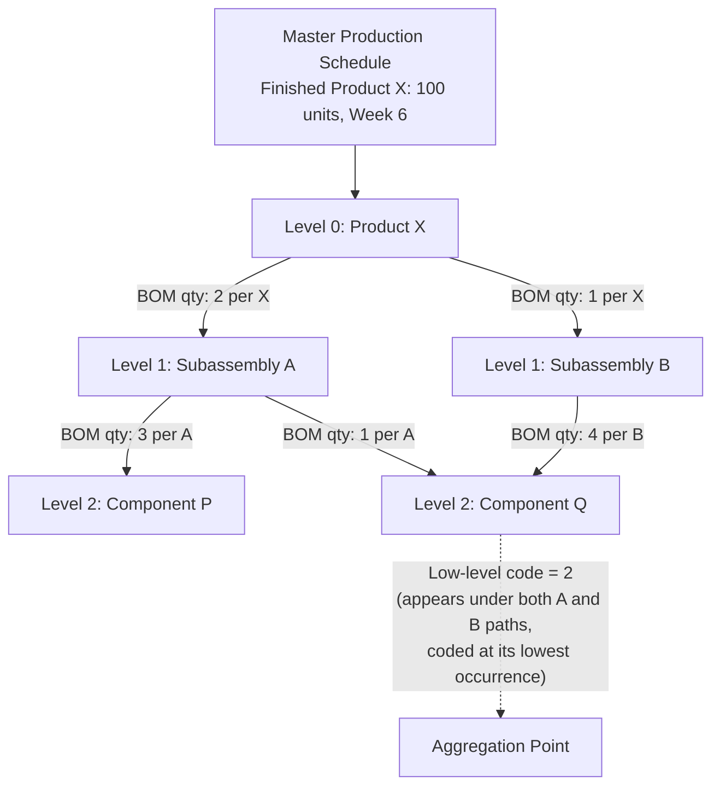

## Material Requirements Planning Fundamentals

### Overview

Material Requirements Planning (MRP) is a computational method for translating a schedule of independent demand (finished goods, spare parts) into time-phased requirements for all dependent-demand items — components, subassemblies, and raw materials — needed to produce it. MRP is the foundational logic underlying almost all modern ERP production planning modules and stands in direct contrast to statistical/probabilistic reorder-point methods used for independent demand items. The core insight, formalized by Joseph Orlicky in the 1960s–70s, is that dependent demand is *calculable*, not *forecastable*: if you know how many finished units you plan to build and when, and you know the bill of materials, you can compute exact component requirements rather than estimating them statistically.

### Dependent vs. Independent Demand

**Key Points**

- **Independent demand** items (finished goods, service parts sold directly to customers) have demand driven by the external market and must be forecast; safety stock and reorder-point/reorder-quantity logic (EOQ, continuous review, periodic review) are appropriate here.
- **Dependent demand** items (components, subassemblies, raw materials consumed in production of a parent item) have demand *derived* from the production schedule of their parent(s); once the parent schedule is known, dependent demand is a deterministic calculation, not a statistical estimate.
- Applying independent-demand inventory methods (e.g., reorder point based on average usage) to dependent-demand items is a classical inventory-management error: it treats calculable, lumpy, discontinuous consumption patterns as if they were smooth and statistically forecastable, leading to systematic over- or under-stocking.

### The Three Primary Inputs to MRP

**Master Production Schedule (MPS)**

The MPS states the quantity and timing of end items to be produced, derived from a combination of firm customer orders and forecast, typically time-bucketed into periods (days, weeks). It is the top-level demand signal MRP explodes downward through the product structure.

**Bill of Materials (BOM)**

A structured, hierarchical record of every component, subassembly, and raw material required to build one unit of a parent item, including quantities per parent unit. The BOM is typically represented as a multi-level tree, and MRP processes it via "BOM explosion" — level by level, from the top (finished good) downward.

**Inventory Records (Item Master / Inventory Status File)**

For every item in the BOM, MRP needs: on-hand quantity, scheduled receipts (open purchase or production orders already in the pipeline), lot-sizing rule, lead time, and safety stock (if applicable). This is often called the **Inventory Status File** in classical MRP literature.

### The MRP Logic: Netting, Lot-Sizing, Offsetting, Exploding

MRP processes items level by level down the BOM (low-level coding ensures each item is processed only after all its parents have been processed, so gross requirements are fully known before netting). For each item, at each time period, the algorithm performs four core computations:

**1. Gross Requirements (GR)**

Total demand for the item in a given period, derived either from the MPS (for top-level items) or from the planned order releases of the item's immediate parent(s), multiplied by the BOM usage quantity per parent unit.

**2. Net Requirements (NR)**

$$NR_t = \max(0,\ GR_t + SS - (OH_{t-1} + SR_t))$$

where $GR_t$ is gross requirements in period $t$, $SS$ is safety stock (if carried for this item), $OH_{t-1}$ is projected on-hand inventory carried in from the prior period, and $SR_t$ is scheduled receipts due in period $t$ (open orders already released).

**3. Planned Order Receipt**

The net requirement, adjusted by the item's lot-sizing rule (see below), determines the quantity that must be received in period $t$ to cover the net requirement.

**4. Planned Order Release**

$$ReleaseDate = ReceiptDate - LeadTime$$

The planned order receipt quantity is offset backward in time by the item's lead time to determine when the order (purchase or production) must actually be released for the material to arrive when needed. This planned order release, once computed, becomes a *gross requirement* for the item's own components one level further down the BOM — this is the "explosion" step that propagates demand down through the entire product structure.

### Worked Example: Single-Item MRP Record

Consider a component with the following starting conditions: beginning on-hand inventory of 50 units, a scheduled receipt of 30 units in period 2, a lead time of 1 period, no safety stock, and a lot-for-lot lot-sizing policy (order exactly what's needed, no batching).

| Period | 1 | 2 | 3 | 4 | 5 |
| --- | --- | --- | --- | --- | --- |
| Gross Requirements | 40 | 60 | 70 | 50 | 80 |
| Scheduled Receipts | — | 30 | — | — | — |
| Projected On-Hand | 10 | -20→0* | 0 | 0 | 0 |
| Net Requirements | 0 | 20 | 70 | 50 | 80 |
| Planned Order Receipt | 0 | 20 | 70 | 50 | 80 |
| Planned Order Release | 20 | 70 | 50 | 80 | — |

*Projected on-hand cannot go negative; once net requirements are computed and covered by a planned receipt, on-hand resets to zero (in a lot-for-lot policy) or to the lot-size remainder (in a batching policy) for that period.

Reading this record: on-hand of 50 covers period 1's gross requirement of 40 (10 units remain). Period 2 needs 60 but only 30 scheduled receipt plus 10 carried-in on-hand are available (40 total), leaving a net requirement of 20, which must be received in period 2 — meaning, with a 1-period lead time, the order must be *released* in period 1. This same logic cascades through periods 3–5.

### Lot-Sizing Rules

MRP's net requirements calculation determines the *minimum* quantity needed, but the actual order quantity placed is governed by a lot-sizing rule, chosen per item based on ordering-cost vs. holding-cost tradeoffs.

**Key Points**

- **Lot-for-Lot (L4L)**: Order exactly the net requirement each period. Minimizes holding cost, maximizes ordering frequency/cost. Appropriate for expensive items, items with high holding cost, or make-to-order environments.
- **Fixed Order Quantity (FOQ)**: Always order a fixed, predetermined batch size (e.g., driven by supplier minimums, container sizes, or machine setup economics) regardless of the exact net requirement — excess is carried as inventory into future periods.
- **Economic Order Quantity (EOQ)**: Apply the classical EOQ formula (see holding-cost/ordering-cost tradeoff below) to determine a standard batch size, then apply that fixed batch to MRP's period-by-period net requirements.
- **Period Order Quantity (POQ)**: Order enough to cover net requirements for a fixed number of *future periods* at once (e.g., cover the next 3 periods' worth of net requirements in a single order), balancing setup frequency against holding cost, but adapting batch size to actual demand pattern rather than using a single fixed EOQ.
- **Least Unit Cost / Least Total Cost / Part-Period Balancing**: Heuristic methods that compute total cost (ordering + holding) for several candidate lot sizes across a rolling horizon and select the lot size that minimizes cost per unit or gets holding cost closest to ordering cost — attempts to approximate the mathematically optimal (but computationally harder) Wagner-Whitin algorithm.
- **Wagner-Whitin Algorithm**: A dynamic-programming method that finds the mathematically optimal ordering schedule over a finite horizon given time-varying demand, minimizing total ordering plus holding cost exactly (rather than heuristically). Computationally more expensive than the heuristics above, so it is used less frequently in high-volume production MRP but is the benchmark against which lot-sizing heuristics are evaluated.

Lot-sizing choice materially affects downstream requirements: a fixed or EOQ-driven lot size at a parent level creates lumpy, batch-driven gross requirements at the child level, which is a primary source of the demand "lumpiness" that makes dependent-demand items poor candidates for statistical forecasting methods.

### BOM Explosion and Low-Level Coding

**Key Points**

- When an item appears at multiple levels of different product structures (a common component used both directly in a top-level assembly and inside a subassembly), MRP must ensure gross requirements from *all* parent sources are fully aggregated before netting for that item — otherwise the algorithm risks under- or over-stating requirements at that item's true earliest point of need.
- **Low-level coding** solves this by assigning every item a code equal to the *lowest* level at which it appears anywhere in any BOM across the enterprise, and processing the MRP run strictly in low-level-code order (top to bottom). This guarantees that by the time any item is netted, all of its parent-level gross requirements from every BOM it appears in have already been calculated and aggregated.
- Without correct low-level coding, an MRP run could net a shared component's requirements from one parent before another parent's requirement (computed at a lower level) has even been generated, producing an incomplete and incorrect net requirement.

### Diagram: MRP Explosion Through a Product Structure

### The Regenerative vs. Net-Change MRP Distinction

**Key Points**

- **Regenerative MRP**: The entire MRP explosion is recalculated from scratch for all items on a periodic basis (e.g., nightly or weekly), using the full current MPS and inventory status. Computationally heavier but simpler to reason about and less prone to accumulated calculation drift.
- **Net-Change MRP**: Only items affected by a specific transaction (a new order, a schedule change, an inventory adjustment) are recalculated, propagated only through the affected portion of the BOM tree. More computationally efficient for large, frequently-changing environments, but requires careful change-tracking logic to ensure all downstream effects are correctly captured.
- Most modern ERP-embedded MRP engines use variants or hybrids of net-change logic combined with periodic full regeneration as a reconciliation safeguard. [Unverified: exact hybridization strategy is vendor- and configuration-specific.]

### MRP's Core Assumptions and Known Limitations

**Key Points**

- **Infinite capacity assumption**: Classical MRP performs pure time-phased material calculation without checking whether the resulting planned order releases are actually feasible given finite machine, labor, or supplier capacity. This is the central limitation that Manufacturing Resource Planning (MRP II) and, later, capacity-constrained finite scheduling systems were built to address.
- **Fixed, deterministic lead times**: MRP assumes a lead time is a known constant per item, independent of order quantity or shop congestion. In practice, lead times often lengthen under high shop load (a phenomenon central to critiques from Theory of Constraints and lean manufacturing perspectives), which MRP's static lead-time assumption does not capture.
- **BOM and inventory data accuracy dependency**: MRP's output is only as reliable as its inputs. Inaccurate on-hand counts, outdated BOMs, or unrecorded scrap/yield loss propagate directly into incorrect planned orders — a widely cited practical failure mode of MRP implementations independent of the algorithm's correctness.
- **Nervousness**: Small changes to the MPS (e.g., a minor forecast revision) can cause disproportionately large changes in planned orders at lower BOM levels, especially when lot-sizing rules amplify small requirement changes into full-batch reordering swings. Techniques such as **firm planned orders**, time fences, and freezing near-term schedule segments are used to dampen this instability.

### MRP vs. MRP II vs. ERP (Scope Distinction)

**Key Points**

- **MRP (Material Requirements Planning)**: The narrow computational logic described above — converting an MPS and BOM into time-phased material requirements. Purely a materials-planning calculation.
- **MRP II (Manufacturing Resource Planning)**: An extension that closes the loop by adding capacity requirements planning (CRP), rough-cut capacity planning, shop floor control, and financial/business planning integration on top of the core MRP logic — a full manufacturing management framework, not just a materials calculation.
- **ERP (Enterprise Resource Planning)**: A further extension integrating MRP II-style manufacturing planning with finance, HR, procurement, and other enterprise functions into a single integrated data and transaction system. Modern ERP systems (SAP, Oracle, Microsoft Dynamics, etc.) embed MRP as one module/engine within a much broader platform.

**Related Topics**

- Manufacturing Resource Planning (MRP II) and closed-loop capacity requirements planning
- Distribution Requirements Planning (DRP) as the distribution-side analog of MRP
- Theory of Constraints and Drum-Buffer-Rope as an alternative to infinite-capacity MRP scheduling
- Wagner-Whitin dynamic programming algorithm for optimal lot-sizing
- Just-in-Time (JIT) and Kanban pull systems as an alternative dependent-demand replenishment philosophy
- Advanced Planning and Scheduling (APS) systems and finite-capacity scheduling
- Bullwhip effect amplification through multi-level BOM explosion and batch lot-sizing