## Bill of Materials and Master Production Schedule Inputs

### Conceptual Foundation

Dependent demand systems distinguish themselves from independent demand (safety stock, reorder point) systems by deriving requirements mathematically rather than forecasting them statistically. A component's demand is *dependent* when it can be computed directly from the demand of a parent item — the classic example being MRP (Material Requirements Planning), where component demand is derived rather than forecast.

Two structures feed this derivation:

- **Bill of Materials (BOM)**: the hierarchical, quantitative recipe describing what components (and in what quantities) compose a parent item.
- **Master Production Schedule (MPS)**: the time-phased statement of what end items will be produced, and when.

The MPS answers "what and when" at the top level; the BOM answers "what's inside it, and how much." MRP logic multiplies these together, exploding the schedule down through the product structure.

### Bill of Materials Structure

**Single-Level BOM**

A single-level BOM lists only the immediate children (one level down) of a parent item, each with a quantity-per relationship.

| Parent: Bicycle (FG-100) | Qty per Assembly |
| --- | --- |
| Frame (SA-200) | 1 |
| Wheel Assembly (SA-300) | 2 |
| Handlebar Assembly (SA-400) | 1 |
| Seat (PT-500) | 1 |
| Fastener Kit (PT-600) | 1 |

**Indented (Multi-Level) BOM**

The indented BOM shows full explosion — every level of the structure, indented to reflect parent-child depth.



```
Level 0: Bicycle (FG-100)                    Qty: 1
  Level 1: Frame (SA-200)                     Qty: 1
    Level 2: Frame Tubing (PT-201)            Qty: 4
    Level 2: Frame Welding Kit (PT-202)       Qty: 1
  Level 1: Wheel Assembly (SA-300)            Qty: 2
    Level 2: Rim (PT-301)                     Qty: 1
    Level 2: Spokes (PT-302)                  Qty: 32
    Level 2: Tire (PT-303)                    Qty: 1
    Level 2: Hub (PT-304)                     Qty: 1
  Level 1: Handlebar Assembly (SA-400)        Qty: 1
    Level 2: Handlebar Bar (PT-401)           Qty: 1
    Level 2: Grip Set (PT-402)                Qty: 2
  Level 1: Seat (PT-500)                      Qty: 1
  Level 1: Fastener Kit (PT-600)              Qty: 1
```

Note that quantities compound multiplicatively down the tree: 2 Wheel Assemblies × 32 Spokes each = 64 spokes required per bicycle. This multiplicative explosion is the mechanical core of MRP's gross-to-net requirement calculation.

**Low-Level Coding**

When an item appears at multiple levels across different parent structures (a common part used both directly in a top-level assembly and inside a sub-assembly), MRP systems assign each item a **low-level code (LLC)** — the *lowest* level at which it appears anywhere in any BOM. This ensures the item's requirements are fully netted (all parent demand aggregated) before its own net requirement is calculated, preventing premature or incomplete planning runs. Processing proceeds level by level, from LLC 0 downward, guaranteeing gross requirements at a given level reflect every parent's contribution.

$$LLC(item) = \max_{\text{all parents } p \text{ of item}} \left( LLC(p) + 1 \right)$$

**BOM Types**

- **Engineering BOM (EBOM)**: reflects product design/function, often organized by engineering discipline; not necessarily how the item is manufactured.
- **Manufacturing BOM (MBOM)**: reflects the actual build sequence, structured to match production and assembly steps.
- **Planning BOM**: an artificial, non-buildable structure used to simplify forecasting — includes constructs like the **modular BOM** (options and common items grouped for configurable products) and **super BOM** (percentage-based planning across product variants).
- **Phantom BOM**: a sub-assembly that exists in the structure for documentation/engineering purposes but is never actually stocked or built as a discrete item — it's "exploded through" instantly, with zero lead time, so its components net directly against the parent's requirement.

### Master Production Schedule (MPS)

**Definition and Role**

The MPS is the anticipated build schedule for end items (or, in configure-to-order environments, for planning-BOM modules) stated in specific quantities and time periods. It serves as the interface between aggregate Sales & Operations Planning (S&OP) and the detailed execution level (MRP, capacity planning, shop floor scheduling).

**MPS Inputs**

| Input | Description |
| --- | --- |
| Sales forecast | Statistical/qualitative demand projection for independent-demand items |
| Actual customer orders | Firm, booked demand (consumes forecast in available-to-promise logic) |
| Beginning inventory | On-hand quantity at period start |
| Production/capacity constraints | Available machine hours, labor, bottleneck resource limits |
| Safety stock policy | Buffer target the MPS must replenish toward |
| Lot-sizing rules | Minimum order quantities, batch multiples, economic order quantity constraints |
| Time fences | Zones of decreasing schedule flexibility (frozen, firm, planning) |

**Time Fences**

Time fences govern how much change is tolerated in the near-term schedule versus the far-term plan:

- **Demand Time Fence (DTF)**: inside this horizon, the MPS is driven by actual firm orders; forecast is largely ignored because there isn't enough lead time to react to it anyway.
- **Planning Time Fence (PTF)**: beyond DTF but within PTF, changes require deliberate review (often involving planners/schedulers) because components may already be committed.
- Beyond PTF: the MPS is freely adjustable based on forecast changes, since no material commitments have yet been triggered.

```mermaid
gantt
    title MPS Time Fence Structure (svg_diagram)
    dateFormat  X
    axisFormat %s
    section Demand Time Fence
    Firm orders drive schedule (frozen) :done, dtf, 0, 10
    section Planning Time Fence
    Forecast + orders, change requires review :active, ptf, 10, 25
    section Beyond PTF
    Forecast-driven, freely adjustable :future, 25, 45
```



**Available-to-Promise (ATP)**

ATP is a derived quantity showing how much of the MPS quantity in a given period remains uncommitted and can be promised to new customer orders. The discrete ATP calculation for a period is:

$$ATP_t = MPS_t - \sum(\text{Customer Orders due before the next MPS receipt})$$

Cumulative ATP carries forward any uncommitted quantity from prior periods that wasn't consumed.

### The Explosion Calculation: BOM × MPS → Gross Requirements

This is the mechanical link between the two structures. For each component $c$ that is a child of parent item $p$ at quantity-per $q_{p,c}$, the gross requirement of $c$ in period $t$ is:

$$GR_{c,t} = \sum_{p} \left( PORel_{p, t - LT_p} \times q_{p,c} \right)$$

Where $PORel_{p,t}$ is the planned order release of parent $p$ in period $t$ (offset by the parent's lead time $LT_p$ to determine when the component is actually needed — i.e., when parent production is scheduled to *begin*, not when it's due).

**Worked Example**

Given the Bicycle (FG-100) MPS:

| Week | 1 | 2 | 3 | 4 |
| --- | --- | --- | --- | --- |
| MPS (Bicycles) | 0 | 0 | 100 | 0 |

Bicycle assembly lead time = 1 week → Planned Order Release in Week 2 (production must start in Week 2 to complete by Week 3).

Wheel Assembly (SA-300) has qty-per = 2. Gross requirement for Wheel Assembly:

| Week | 1 | 2 | 3 | 4 |
| --- | --- | --- | --- | --- |
| Gross Req (Wheel Assy) | 0 | 200 | 0 | 0 |

This gross requirement of 200 in Week 2 then becomes the input to the Wheel Assembly's own MRP record — netted against its on-hand inventory and scheduled receipts, then offset by *its* lead time to generate planned order releases for Rims, Spokes, Tires, and Hubs. This cascading recursion continues down through every level of the BOM until raw materials or purchased parts are reached.

**Key Points**

- BOM provides the *structural and quantitative* relationship; MPS provides the *timing and volume* trigger.
- Indented BOMs and low-level coding ensure demand is fully aggregated before netting at each level.
- Time-phasing in MPS must account for lead time offsets at every level, not just the top; a delay in Week-2 wheel assembly production cascades backward into earlier hub/spoke/rim requirement dates.
- Planning BOMs and phantom BOMs exist purely to make forecasting and netting tractable — they don't represent physically stocked configurations. [Inference: exact phantom-BOM handling — instantaneous zero-lead-time netting versus small planned offsets — can vary by MRP/ERP system configuration.]
- Inaccurate BOM quantity-per or lead-time data propagates errors multiplicatively down the explosion, a common root cause of MRP "nervousness" and phantom shortages.

**Related Topics**

- Net requirements calculation and lot-sizing techniques (lot-for-lot, EOQ, period order quantity)
- MRP record mechanics (gross requirements, scheduled receipts, projected on-hand, planned order release)
- Pegging and where-used inquiry for exception management
- Capacity Requirements Planning (CRP) and rough-cut capacity planning (RCCP)
- Configure-to-order systems and modular/planning BOM design
- MRP nervousness and system-managed freeze horizons