## Netting Logic and Time-Phased Planning

### Conceptual Foundation

Netting is the arithmetic core of MRP: converting a gross requirement (derived from BOM explosion against the MPS) into a **net requirement** by subtracting what's already available or already on order. Time-phasing is what makes this netting meaningful — it organizes gross requirements, receipts, and inventory into discrete time buckets so that supply and demand are matched *period by period*, not just in aggregate.

Without time-phasing, an item with 500 units on hand and 500 units due in six months would appear to cover a requirement of 400 units due next week — a false positive that time-phased logic prevents by respecting *when* supply actually arrives relative to *when* demand actually occurs.

### The MRP Record

The standard time-phased record is a matrix of rows (record elements) against columns (time buckets, typically weeks). The canonical row set:

| Row | Definition |
| --- | --- |
| Gross Requirements (GR) | Total demand in the period (from BOM explosion, forecast, or independent orders) |
| Scheduled Receipts (SR) | Open purchase/production orders already released, due to arrive in the period |
| Projected On-Hand (POH) | Beginning inventory carried forward, adjusted for receipts and requirements |
| Net Requirements (NR) | Shortfall not covered by on-hand + scheduled receipts |
| Planned Order Receipts (POR) | Lot-sized quantity planned to arrive to cover net requirements |
| Planned Order Release (POREL) | POR offset backward by lead time — when the order must actually be released |

**Core Netting Formula**

For period $t$:

$$POH_t = POH_{t-1} + SR_t + POR_t - GR_t$$

$$NR_t = \max\left(0,\; GR_t - (POH_{t-1} + SR_t)\right)$$

A net requirement is only generated when projected on-hand would otherwise go negative. Once $NR_t > 0$, a planned order receipt is created (sized according to the applicable lot-sizing rule), and that receipt is offset backward by the item's lead time to determine the planned order release date:

$$POREL_t = POR_{t + LT}$$

### Worked Example

Item: Wheel Assembly (SA-300). Lead time = 1 week. Lot-for-lot ordering. Beginning on-hand = 50. One scheduled receipt of 100 due Week 1.

| Week | 1 | 2 | 3 | 4 |
| --- | --- | --- | --- | --- |
| Gross Requirements | 0 | 200 | 0 | 0 |
| Scheduled Receipts | 100 | 0 | 0 | 0 |
| Projected On-Hand | 150 | 0 | 0 | 0 |
| Net Requirements | 0 | 50 | 0 | 0 |
| Planned Order Receipt | — | 50 | — | — |
| Planned Order Release | 50 | — | — | — |

Walkthrough:

- **Week 1**: POH = 50 (beginning) + 100 (SR) − 0 (GR) = 150. No shortfall.
- **Week 2**: GR of 200 arrives. Available supply = 150 (carried POH) + 0 (no SR) = 150. Shortfall = 200 − 150 = 50 → NR = 50.
- A Planned Order Receipt of 50 is created in Week 2 to close the gap.
- Because lead time = 1 week, the Planned Order Release is pushed back to **Week 1** — the order must be released now for it to arrive in time.
- POH resets: $150 + 0(SR) + 50(POR) - 200(GR) = 0$ in Week 2, then holds at 0 through Weeks 3–4 (no further demand).

This backward offset — POR minus lead time equals POREL — is the mechanism that "time-phases" the plan: it converts a *due date* into an *action date*.

```mermaid
gantt
    title Lead Time Offset: Receipt vs Release (svg_diagram)
    dateFormat  X
    axisFormat Week %s
    section Wheel Assembly SA-300
    Planned Order Release (Week 1) :active, rel, 1, 1
    Lead Time (1 week) :crit, lt, 1, 2
    Planned Order Receipt (Week 2) :done, rec, 2, 1
    Gross Requirement Due :milestone, gr, 2, 0
```

### Netting Against Safety Stock

When an item carries a safety stock policy, the netting formula is modified so the system replenishes down to — but not below — the safety stock floor:

$$NR_t = \max\left(0,\; GR_t + SS - (POH_{t-1} + SR_t)\right)$$

Here, $SS$ acts as a phantom demand floor: even with zero gross requirement in a period, if projected on-hand would fall below $SS$, a net requirement is triggered to protect the buffer. This is the standard technique for blending dependent-demand netting logic with independent-demand buffer protection (common for critical or long-lead-time components even when their higher-level demand is technically dependent).

### Lot-Sizing's Interaction with Netting

The *size* of the Planned Order Receipt that netting generates is governed by the lot-sizing rule in effect, not simply by the net requirement itself:

| Rule | Order Quantity Logic |
| --- | --- |
| Lot-for-Lot (L4L) | POR = exact NR (minimizes inventory, maximizes order frequency) |
| Fixed Order Quantity (FOQ) | POR = fixed lot size (rounded up if NR exceeds it, or excess carried forward if under) |
| Economic Order Quantity (EOQ) | POR = calculated economic batch size, may cover multiple periods' NR at once |
| Period Order Quantity (POQ) | POR = sum of NR across a fixed number of future periods, bucketed as one release |
| Min/Max with multiples | POR = smallest quantity ≥ NR that satisfies minimum order and multiple/increment constraints |

Lot-sizing choice directly affects Projected On-Hand in subsequent periods: L4L produces a POH profile that hugs zero, while FOQ/EOQ/POQ produce "sawtooth" profiles with residual inventory carried into future periods — which itself changes whether future periods generate a net requirement at all.

### Pegging and Exception Visibility

Because net requirements originate from gross requirements that were themselves derived (via BOM explosion) from a specific parent's planned order, well-implemented MRP systems support **pegging** — the ability to trace a net requirement back up to the specific parent order(s) that caused it. This is essential for exception management: if a net requirement can't be met on time, pegging tells the planner exactly which end-item MPS entries will be affected, rather than just flagging an isolated shortage.

**Key Points**

- Netting = Gross Requirements − (Projected On-Hand + Scheduled Receipts), with a floor of zero.
- Time-phasing means every record element is bucketed by period — netting is calculated bucket by bucket, using the running carry-forward of on-hand, not lump-sum totals.
- The lead time offset (Planned Order Release = Planned Order Receipt shifted backward by lead time) is what converts "when it's needed" into "when action must be taken."
- Lot-sizing rules determine POR quantity once NR is established, and that choice feeds back into future periods' POH, potentially suppressing or triggering further net requirements downstream.
- Safety stock can be netted against by treating it as an always-present demand floor rather than a one-time buffer check.

**Related Topics**

- Lot-sizing algorithm comparison and cost trade-offs (ordering cost vs. carrying cost)
- MRP regeneration vs. net-change processing modes
- Pegging, where-used, and exception message design (expedite, de-expedite, cancel signals)
- Lead time components (queue, setup, run, move, wait) and their effect on offset accuracy
- Safety stock vs. safety lead time strategies for dependent-demand buffering
- Bucketless (transaction-dated) vs. bucketed time-phasing in modern MRP/ERP engines