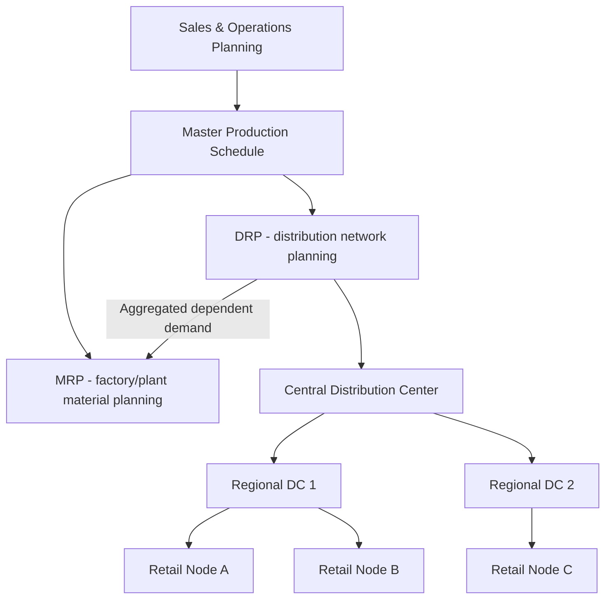
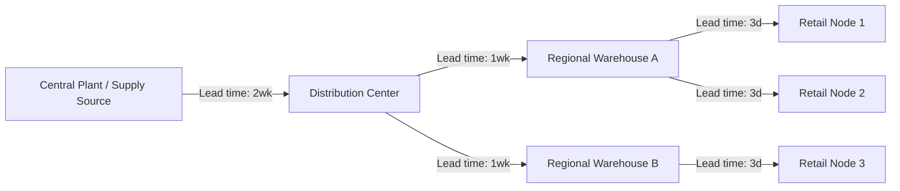

## Distribution Requirements Planning

### Overview

Distribution Requirements Planning (DRP) is a time-phased, demand-driven method for planning inventory replenishment across a multi-echelon distribution network. It extends the logic of Material Requirements Planning (MRP) — time-phased netting against a bill of materials — to the distribution side of the supply chain, where the "bill of materials" is replaced by a **bill of distribution (BOD)**: the hierarchical network of warehouses, distribution centers (DCs), and retail/field locations through which a product flows from a central supply point to the point of consumption.

Where MRP answers "what do I need to make, and when, to satisfy dependent demand from a parent item," DRP answers "what do I need to ship, and when, to satisfy dependent demand from downstream distribution nodes." Demand at a regional DC is not independent — it is *dependent* on the replenishment needs of the retail outlets or customer-facing nodes it feeds, cascading upward until it reaches the central supply source, factory, or supplier.

### Position in the Planning Hierarchy

DRP sits downstream of the Master Production Schedule (MPS) and often runs in parallel with or as an input to MRP:

A key architectural point: DRP's output — the aggregated, time-phased gross requirements at the central supply point — becomes an **input** to MRP or the MPS, closing the loop between distribution and manufacturing planning. This is what distinguishes DRP from simple reorder-point or statistical-forecast replenishment: it explicitly links downstream consumption timing to upstream production timing.

### Core Mechanics: The Time-Phased Record

DRP is executed through a **time-phased record**, structurally identical to the MRP planning table, computed independently for each SKU-location combination and then rolled up the network.

**Key Points**

The standard DRP record contains these rows across a series of time buckets (typically weekly):

- **Gross Requirements (GR):** Forecasted or actual demand at that location for the period (for the lowest-echelon nodes, this is independent/forecasted demand; for upstream nodes, it is the *sum of planned order releases from all downstream children*)
- **Scheduled Receipts (SR):** Open orders/shipments already in transit or confirmed, due to arrive in that period
- **Projected On-Hand (POH):** Inventory expected at the end of each period
- **Net Requirements:** The shortfall, if any, after netting GR against SR and beginning POH
- **Planned Order Receipt (POR):** The quantity that must arrive in a period to cover net requirements
- **Planned Order Release (POL):** The POR offset backward in time by the lead time — this is what triggers a shipment/production order

The core netting equation for each period $t$ is:

$$POH_t = POH_{t-1} + SR_t + POR_t - GR_t$$

A planned order receipt is generated whenever $POH_{t-1} + SR_t - GR_t$ would fall below the safety stock threshold, and it is scaled to whatever the location's **order policy** dictates (lot-for-lot, fixed order quantity, period order quantity, or min/max).

The planned order release date is calculated as:

$$POL_t = POR_{t+L}$$

where $L$ is the transportation/replenishment lead time from the supplying node.

### Worked Example: Two-Echelon Network

Consider a central DC supplying two regional warehouses (RW-A and RW-B), each with a 1-week transit lead time from the DC.

**RW-A time-phased record (units, weekly buckets):**

| Period | 1 | 2 | 3 | 4 |
| --- | --- | --- | --- | --- |
| Gross Requirements | 100 | 100 | 100 | 100 |
| Scheduled Receipts | 100 | — | — | — |
| Projected On-Hand (begin = 150) | 150 | 50 | 150 | 50 |
| Planned Order Receipt | — | — | 200 | — |
| Planned Order Release | — | 200 | — | — |

(Safety stock = 50; order policy = fixed lot of 200)

**RW-B time-phased record:**

| Period | 1 | 2 | 3 | 4 |
| --- | --- | --- | --- | --- |
| Gross Requirements | 80 | 80 | 80 | 80 |
| Scheduled Receipts | 80 | — | — | — |
| Projected On-Hand (begin = 120) | 120 | 40 | 110 | 30 |
| Planned Order Receipt | — | — | 150 | — |
| Planned Order Release | — | 150 | — | — |

**Central DC gross requirements** are then the **sum of the children's planned order releases**, time-aligned:

| Period | 1 | 2 | 3 | 4 |
| --- | --- | --- | --- | --- |
| GR from RW-A | — | 200 | — | — |
| GR from RW-B | — | 150 | — | — |
| **Total DC Gross Requirements** | — | **350** | — | — |

This 350-unit demand spike in Period 2 at the DC — invisible to any single-location reorder-point system — is the essential output DRP provides upstream: a forward-looking, time-phased signal that lets the DC (and ultimately the factory via MRP) plan capacity and material *before* the demand materializes, rather than reacting to it.

### DRP vs. Reorder Point / Statistical Replenishment

| Dimension | DRP | Reorder Point (ROP) |
| --- | --- | --- |
| Demand nature | Treated as dependent, derived from downstream plans | Treated as independent, forecast-driven |
| Visibility | Time-phased, forward-looking (full planning horizon) | Reactive, triggered at a fixed threshold |
| Network awareness | Explicitly models multi-echelon hierarchy | Each location optimized independently |
| Upstream signal quality | Aggregated, lumpy but visible in advance | Smoothed but "surprises" upstream nodes |
| Bullwhip effect | Reduced via shared visibility (if implemented well) | Amplified — classic bullwhip driver |
| Best suited for | Multi-echelon networks with known lead times and stable BOD structure | Single-echelon, simple networks, low SKU complexity |

### Bill of Distribution (BOD)

The BOD is the structural backbone of DRP, analogous to the bill of materials in MRP. It defines:

- **Network topology** — which locations supply which downstream locations
- **Lead times** — transit/replenishment time between each parent-child link
- **Sourcing rules** — for multi-sourced nodes, allocation percentages or priority rules
- **Order policies** — lot sizing rules applicable at each node

### Interaction with Safety Stock

DRP does not eliminate the need for safety stock — it changes *where and how* safety stock is most effectively positioned. Because DRP provides visibility of dependent demand up the chain, organizations can apply **strategic stock positioning**: concentrating safety stock at upstream consolidation points (where demand variability pools and partially cancels out via the square-root-of-time / portfolio effect) rather than duplicating buffers at every downstream node.

For an upstream node aggregating $n$ independent downstream demand streams, if each has standard deviation of demand $\sigma_i$, the aggregated standard deviation (assuming independence) is:

$$\sigma_{agg} = \sqrt{\sum_{i=1}^{n} \sigma_i^2}$$

This is strictly less than $\sum \sigma_i$ (the sum if safety stock were held independently at each node), which is the quantitative basis for holding proportionally less safety stock at a consolidated echelon — a core justification for postponement and centralization strategies used alongside DRP.

### Handling Uncertainty and Variability

**Key Points**

- Forecast error at the lowest echelon propagates upward through the planned order release logic; DRP systems typically re-explode the network on a periodic basis (nightly/weekly) to absorb forecast revisions
- Lead time variability is usually managed by adding **time-based safety stock** (an extra time bucket of coverage) in addition to or instead of quantity-based safety stock, particularly at nodes with unreliable carrier/transit performance
- Systems must handle **exception messages** — the DRP equivalent of MRP action messages — flagging situations such as: planned orders falling inside the firm/frozen zone, negative projected on-hand, or orders that would violate minimum shipment quantities (e.g., truckload economics)

[Inference] In practice, most commercial DRP implementations run a "net change" or "regenerative" explosion cycle rather than continuous real-time recalculation, because full network explosion across many echelons and SKUs is computationally intensive at scale; the specific cadence is implementation-dependent.

### DRP II (Distribution Resource Planning)

The concept was extended by Andre Martin (who is broadly credited with formalizing DRP in the 1970s–80s) into **DRP II**, which incorporates resource constraints beyond inventory — warehouse capacity, transportation capacity (truckload/trailer limits), and labor — into the same time-phased framework, mirroring how MRP II extended MRP to include capacity requirements planning (CRP) and financial planning.

### System Implementation Considerations

- **Master data dependencies:** DRP output quality is entirely bounded by the accuracy of lead times, the BOD hierarchy, and order policy parameters — garbage-in/garbage-out is more acute here than in single-echelon systems because errors compound across echelons
- **Batch vs. event-driven explosion:** Legacy DRP modules (e.g., within ERP MRP-II suites) typically run as scheduled batch jobs; modern supply chain planning platforms increasingly run incremental/event-driven recalculation
- **Integration surface:** DRP typically needs live or near-live feeds of POS/consumption data (for the lowest echelon's gross requirements), in-transit shipment status (scheduled receipts), and current on-hand by location

[Inference] For a system like a government LGU document/records platform with an inventory or supplies module, a full multi-echelon DRP engine is likely overkill unless the LGU manages distribution of physical supplies (e.g., medical, disaster relief, or office supplies) across multiple barangay or department-level stock points; in that narrower case, even a simplified two-echelon DRP-style netting logic (central supply office → department stockrooms) could meaningfully improve replenishment timing over a flat reorder-point approach.

**Related Topics**

- Material Requirements Planning (MRP) explosion logic and lot-sizing rules
- Multi-echelon inventory optimization (MEIO)
- Bullwhip effect and information-sharing mitigation strategies
- Safety stock positioning and postponement strategy
- Distribution Resource Planning (DRP II) and integrated capacity/transportation planning
- Vendor-managed inventory (VMI) as an alternative coordination mechanism
- Sales & Operations Planning (S&OP) as the upstream demand input to DRP