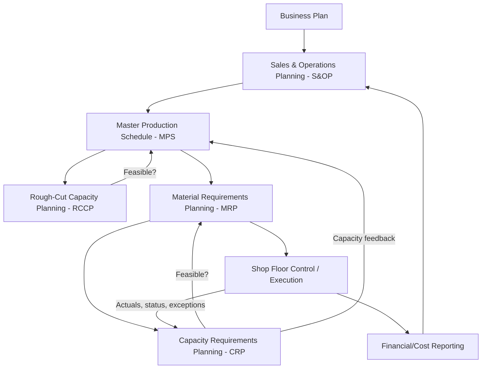
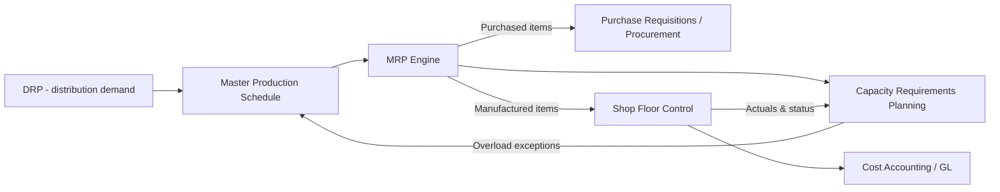

## Manufacturing Resource Planning Integration

### Overview

Manufacturing Resource Planning (MRP II) integration refers to the closed-loop architecture that connects material planning (MRP) with the full set of manufacturing resource domains — capacity, scheduling, shop floor execution, and financial reporting — into a single coherent planning system. Where MRP (Material Requirements Planning) answers "what materials do I need and when," MRP II answers the broader question: "given my materials plan, do I have the *capacity*, *labor*, and *financial resources* to execute it, and how do actual results feed back to correct the plan?"

The term "integration" here has two layers:

1. **Internal integration** — how MRP's material plan connects to Capacity Requirements Planning (CRP), Shop Floor Control (SFC), and Rough-Cut Capacity Planning (RCCP) within the closed loop
2. **External/systems integration** — how an MRP II module or engine integrates with adjacent enterprise systems (financials/GL, procurement, distribution/DRP, and modern ERP or cloud manufacturing platforms) via APIs, message queues, or shared data models

### The Closed-Loop MRP II Architecture

MRP II, as formalized by Oliver Wight in the early 1980s, is fundamentally a **closed-loop system**: unlike basic MRP (open-loop, one-directional explosion of requirements), MRP II feeds execution and capacity feasibility data back into the planning levels above it.

**Key Points**

- **RCCP** validates the MPS against bottleneck/critical resources *before* MRP explodes it into detailed material requirements — a coarse, fast feasibility check
- **CRP** validates the detailed MRP output (planned order releases) against actual work-center capacity, using routing and standard time data — a fine-grained check
- The feedback arrows are what make it "closed-loop": if CRP finds a work center overloaded, that information must flow back to adjust the MPS or MRP plan, not just get logged as an exception

### Data Model: What MRP Needs From Manufacturing to Integrate

For MRP II integration to function, the MRP engine depends on manufacturing-resource data that pure MRP does not require on its own:

| Data Entity | Purpose in Integration | Owned By |
| --- | --- | --- |
| Routing | Sequence of operations, work centers, and standard times per item | Manufacturing engineering |
| Work Center Master | Available capacity (hours/shift, efficiency, utilization %) | Production/plant |
| Bill of Materials (BOM) | Parent-component structure, feeds MRP explosion | Engineering/PLM |
| Calendar/Shift Data | Working days, shift patterns, holidays — governs lead time offsetting | Plant operations |
| Standard Cost / Routing Cost | Links material and labor consumption to cost accounting | Finance |
| Open Shop Orders | Scheduled receipts equivalent for in-process work | Shop floor execution |

The routing and work center master are the critical bridge tables: MRP's planned order releases become CRP's *load* on a work center only once each operation in the routing is time-phased against the work center's calendar and standard run/setup times.

### Load Calculation Logic

CRP calculates required capacity per work center per period using the routing's standard times:

$$\text{Load}_{wc,t} = \sum_{i} \left( Q_i \times (T_{setup,i} + Q_i \times T_{run,i}) \right)$$

for all planned/released orders $i$ routed through work center $wc$ in period $t$, where $Q_i$ is order quantity, $T_{setup,i}$ is setup time, and $T_{run,i}$ is per-unit run time.

This is compared against **available capacity**:

$$\text{Available}_{wc,t} = \text{Hours/shift} \times \text{Shifts} \times \text{Days}_t \times \text{Efficiency} \times \text{Utilization}$$

When $\text{Load}_{wc,t} > \text{Available}_{wc,t}$, the work center is overloaded and CRP generates an exception message, which is the trigger for the closed-loop feedback: either the MPS is adjusted (level-loading, moving demand to another period), capacity is added (overtime, subcontracting, additional shift), or an alternate routing is used.

### Integration Points With Adjacent Systems

**Key Points**

- **MRP → CRP:** Planned order releases and their routings become load records; this is the tightest and most fundamental MRP II integration
- **MRP II → Shop Floor Control:** Released orders (converted from planned orders once they pass capacity checks) become dispatch lists at each work center; execution status (start/complete/scrap/rework) flows back as actuals
- **MRP II → Procurement:** Planned order releases for purchased items generate purchase requisitions; this is often the most externally-integrated leg, connecting to supplier EDI or procurement modules
- **MRP II → DRP:** As covered separately, DRP's aggregated dependent demand at the central supply point becomes an input to the MPS, which then flows through the same MRP II closed loop
- **MRP II → Financials:** Standard costs attached to routings and BOMs let the system roll up planned/actual manufacturing cost, feeding cost accounting and variance analysis — this is the piece that distinguishes MRP II from a pure production-scheduling tool

### Modern ERP/Cloud Integration Patterns

In a contemporary system landscape, MRP II's internal closed loop is typically implemented as modules within a single ERP suite (SAP PP, Oracle Manufacturing Cloud, Microsoft Dynamics 365 SCM), but integration with *external* systems commonly follows these patterns:

- **API-based (REST/OData):** For near-real-time exchange of shop order status, inventory levels, or capacity data with MES (Manufacturing Execution Systems) or WMS
- **EDI/batch integration:** Still common for supplier-facing procurement integration (purchase order transmission, ASN receipt)
- **Message queue/event-driven (Kafka, MQ):** Increasingly used for propagating shop floor actuals back into the planning engine without waiting for a full batch MRP regeneration cycle
- **MES-to-MRP feedback loop:** Modern architectures often insert an MES layer between shop floor equipment and the MRP II system, aggregating machine-level data (OEE, downtime, scrap) before it reaches the planning layer

[Inference] The specific integration pattern (batch vs. event-driven) is highly implementation-dependent; legacy on-premise ERP deployments still commonly run MRP/CRP regeneration as an overnight batch job, while cloud-native manufacturing platforms increasingly support incremental net-change recalculation triggered by shop floor events.

### Net Change vs. Regenerative Integration Cycles

| Mode | Behavior | Integration Implication |
| --- | --- | --- |
| Regenerative | Full explosion of all items/orders on a schedule (e.g., nightly) | Simpler to integrate (batch feeds), but stale between runs |
| Net Change | Only re-plans items affected by a transaction (new order, cancellation, BOM change) | Requires event-driven integration; more complex but far more responsive |

### Common Integration Failure Modes

**Key Points**

- **Routing/BOM data drift** — engineering changes not synchronized to the planning system cause CRP loads to be calculated against obsolete standard times
- **Calendar mismatches** — work center calendars not reflecting actual plant shutdowns/holidays cause phantom capacity availability
- **Infinite vs. finite loading confusion** — classic CRP is *infinite loading* (it calculates load without constraining it to available capacity, merely flagging overloads); teams sometimes mistakenly treat CRP output as an already-feasible finite schedule, which is properly the job of a downstream **Advanced Planning and Scheduling (APS)** or finite-capacity scheduling system
- **Feedback loop latency** — if shop floor actuals do not flow back into MRP/CRP quickly enough, the "closed loop" effectively becomes open-loop again, and the plan drifts from reality

[Inference] Whether infinite-loading CRP or a finite-capacity APS engine is the better integration target depends on production environment complexity (job shop vs. flow shop) and is a common point of architectural disagreement between classical MRP II theory and modern APS vendors; this is not a universally settled question.

**Related Topics**

- Capacity Requirements Planning (CRP) and finite vs. infinite loading
- Rough-Cut Capacity Planning (RCCP) and resource profiles
- Advanced Planning and Scheduling (APS) as an MRP II successor layer
- Manufacturing Execution Systems (MES) and shop-floor data integration
- Closed-loop MRP and exception message management
- Distribution Requirements Planning (DRP) as an upstream demand input
- Standard costing and cost roll-up in manufacturing ERP