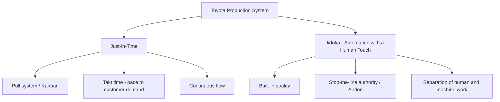

## JIT Philosophy and Waste Elimination

### Overview

Just-in-Time (JIT) is a production philosophy, originating primarily from the Toyota Production System (TPS) developed by Taiichi Ohno and Eiji Toyoda at Toyota beginning in the late 1940s, whose central principle is producing and delivering **only what is needed, when it is needed, in the quantity needed** — no more, no less. Where MRP and DRP are demand-driven *push* systems that plan and schedule production in advance based on forecasts and time-phased requirements, JIT is fundamentally a **pull** system: downstream demand (an actual customer order or a downstream process's consumption) triggers upstream production, rather than upstream production being scheduled ahead and pushed forward.

JIT is not merely an inventory-reduction technique; it is a comprehensive management philosophy in which low inventory is a *consequence* of eliminating the root causes of waste, variability, and inflexibility in a production system — not a goal pursued in isolation. Reducing inventory without addressing those root causes typically just exposes a system to stockouts and disruption.

### The Two Pillars of TPS

Toyota's own description of TPS rests on two pillars, and JIT is one of them:

- **Jidoka** ("automation with a human touch") ensures defects are caught and stopped at the source rather than passed downstream — without reliable quality at each step, a pull system with minimal buffers would be constantly disrupted by defective parts
- **JIT** ensures material and information flow at the pace of actual demand, without excess inventory buffering process instability

The two pillars are mutually reinforcing: JIT's low-inventory pull system *exposes* problems (a stoppage anywhere ripples visibly through the system) that Jidoka's stop-the-line culture then forces the organization to solve permanently, rather than papering over with buffer stock.

### The Seven (or Eight) Wastes — Muda

**Key Points**

JIT waste elimination is organized around identifying and systematically removing **muda** (無駄, waste) — any activity that consumes resources without adding value the customer is willing to pay for. Taiichi Ohno originally identified seven; an eighth (unused human talent) is commonly added in modern lean literature.

| # | Waste (Japanese/English) | Description | Typical Inventory-Related Example |
| --- | --- | --- | --- |
| 1 | Overproduction | Producing more, earlier, or faster than needed | Building to forecast instead of actual pull signal |
| 2 | Waiting | Idle time — people, machines, or material waiting | Parts sitting in a queue between work centers |
| 3 | Transportation | Unnecessary movement of materials/products | Long or circuitous material handling routes |
| 4 | Overprocessing | Doing more work than the customer values | Excess inspection, redundant approvals |
| 5 | Inventory | Excess raw material, WIP, or finished goods | Safety stock masking process variability |
| 6 | Motion | Unnecessary movement of people | Poor workstation ergonomics/layout |
| 7 | Defects | Rework, scrap, correction | Quality escapes requiring downstream fixes |
| 8 | Unused talent | Underutilizing employee skills/ideas | Not soliciting frontline improvement input |

**Overproduction is considered the "worst" waste** in TPS thinking because it *causes* or masks all the others: it generates excess inventory, which hides quality problems, consumes transportation and storage capacity, and ties up capital — a cascading effect rather than an isolated inefficiency.

### JIT vs. Push (MRP/Forecast-Driven) Systems

| Dimension | JIT (Pull) | MRP/Push |
| --- | --- | --- |
| Trigger for production | Actual downstream consumption (kanban signal) | Forecast + time-phased plan |
| Inventory posture | Minimal, ideally single-piece flow | Buffer/safety stock at multiple points |
| Response to demand change | Immediate, visible at point of pull | Requires plan regeneration/re-explosion |
| Reliance on forecast accuracy | Low (short planning horizon reaction) | High (errors compound through the BOM) |
| Best suited for | Stable, repetitive, high-volume production | Complex BOMs, long lead times, engineer-to-order |

In practice, most manufacturing environments use a **hybrid**: MRP or DRP for longer-horizon material and capacity planning (especially for long-lead-time or externally-sourced items), combined with JIT/kanban pull mechanisms for the shop-floor execution layer where flow is stable and repetitive enough to support it.

### Core JIT Mechanisms

**Kanban** is the visual/physical signaling mechanism that implements pull. A kanban card (or electronic equivalent) authorizes production or movement of exactly one container's worth of material; when a downstream process consumes a container, the returned kanban is the *only* trigger for the upstream process to replenish it.

The number of kanban cards in a loop is calculated to bound WIP:

$$N = \frac{D \times (T_w + T_p) \times (1 + \alpha)}{C}$$

where $N$ is the number of kanban cards, $D$ is average demand rate per unit time, $T_w$ is waiting time (queue + transport), $T_p$ is processing time, $\alpha$ is a safety factor, and $C$ is container capacity. This directly caps the maximum inventory in that loop at $N \times C$ — inventory is a *designed output* of the kanban count, not an independent decision.

**Takt time** is the rate at which products must be completed to match customer demand, calculated as:

$$\text{Takt Time} = \frac{\text{Available Production Time}}{\text{Customer Demand}}$$

Takt time is the pacing mechanism that ties every workstation's cycle time back to actual demand — the JIT analog of the master schedule, but continuously self-adjusting rather than periodically re-planned.

**SMED (Single-Minute Exchange of Die)**, developed by Shigeo Shingo, reduces changeover/setup time, which is a structural prerequisite for JIT: small-lot, mixed-model production is only economically viable if setup times are driven down, since otherwise the economic order quantity math would push toward large batches (the opposite of JIT's intent).

### Relationship to Safety Stock

JIT does not claim safety stock should be zero universally — it aims to reduce the *need* for safety stock by attacking its root causes: demand variability, supply variability, and process variability. The classic safety stock formula,

$$SS = z \times \sigma_{LT} \times \sqrt{L}$$

(where $z$ is the service-level factor, $\sigma_{LT}$ is demand standard deviation over lead time, and $L$ is lead time) shows the JIT levers directly: **shortening $L$** (via SMED, closer suppliers, smaller lot sizes) and **reducing $\sigma_{LT}$** (via demand leveling/heijunka and supplier quality) both mathematically reduce required safety stock — this is the quantitative bridge between JIT philosophy and inventory-control math.

**Heijunka** (production leveling) directly targets the demand-variability term: by smoothing the mix and volume of what is produced over a fixed cycle rather than batching by product, it reduces the variability that would otherwise force larger buffers throughout the pull chain.

### Prerequisites and Risks of JIT

**Key Points**

- **Supplier reliability and proximity** — JIT with minimal buffer inventory is highly exposed to supply disruption; this is why Toyota historically clustered suppliers geographically and invested heavily in supplier quality programs
- **Stable, repetitive demand** — JIT performs best where demand patterns are predictable enough that short-cycle pull signals track real consumption without whipsaw
- **Workforce and cultural buy-in** — stop-the-line authority (Jidoka) and continuous improvement (kaizen) require an organizational culture that treats problem visibility as valuable rather than something to hide
- **Fragility to disruption** — the 2011 Tōhoku earthquake and, more broadly, COVID-era global supply chain disruptions are widely cited as evidence that lean/JIT systems with minimal buffers can be vulnerable to low-probability, high-impact shocks, which has driven renewed industry interest in strategic buffer positioning ("just-in-case" hybrid thinking) for critical inputs

[Inference] The degree to which organizations should trade JIT's efficiency gains against resilience to tail-risk disruptions is an active and somewhat unsettled debate in supply chain management practice post-2020, rather than a fully resolved consensus; specific risk tolerance is context- and industry-dependent.

### Continuous Improvement — Kaizen

JIT waste elimination is not a one-time implementation but an ongoing discipline. **Kaizen** (改善, "change for better") is the continuous, incremental improvement process — typically driven by frontline workers identifying and eliminating small sources of waste — that sustains and deepens JIT's effectiveness over time. This connects back to the eighth waste (unused talent): a kaizen culture is explicitly designed to capture frontline problem-solving capacity that a purely top-down waste-elimination program would leave untapped.

**Related Topics**

- Kanban system design and card-count calculation
- SMED (Single-Minute Exchange of Die) and setup reduction
- Heijunka (production leveling) and mixed-model scheduling
- Jidoka and built-in quality / andon systems
- 5S workplace organization
- Value stream mapping
- Safety stock reduction levers and lead-time compression
- Supply chain resilience vs. lean trade-offs (post-2020 rethinking)