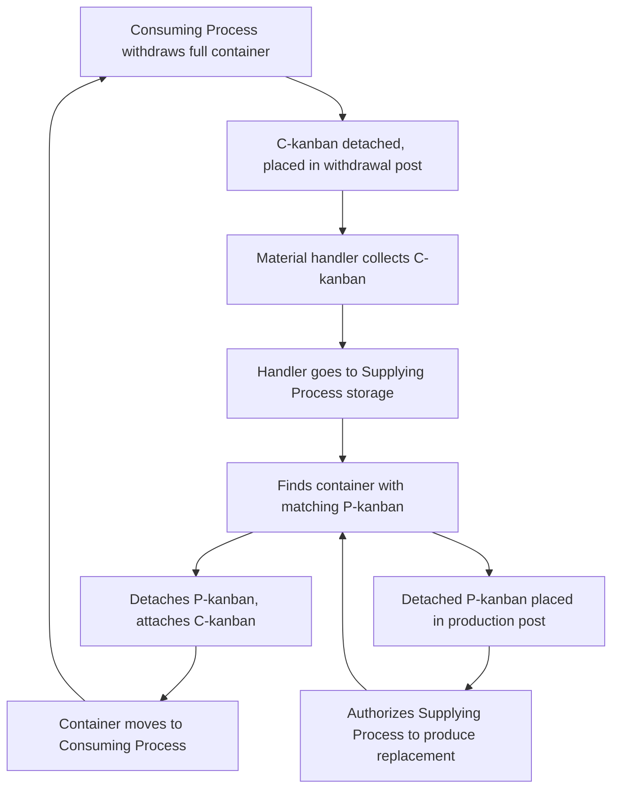
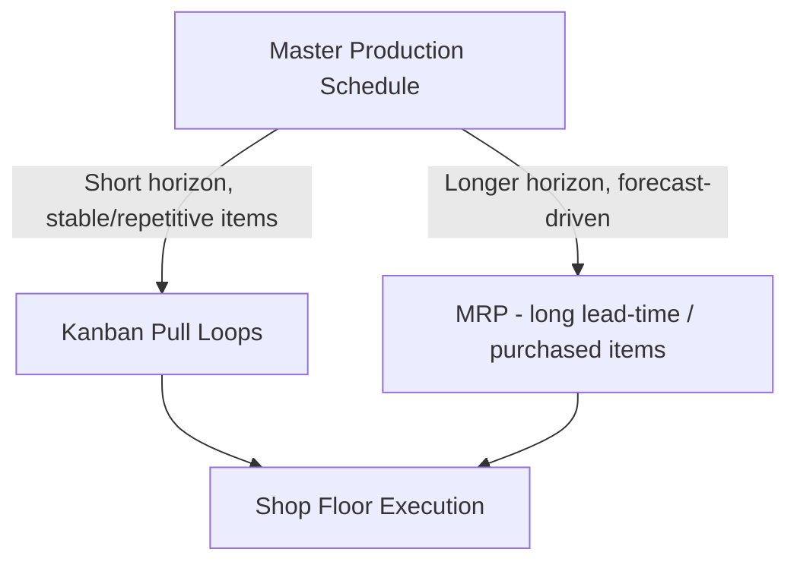

## Kanban Pull System Mechanics

### Overview

Kanban (かんばん, "signboard" or "visual card") is the physical or electronic signaling mechanism that implements pull-based production control within JIT/lean systems. Where a push system (MRP/DRP) schedules production based on a forecast-driven plan issued in advance, a kanban system authorizes production or material movement **only in direct response to an actual, observed consumption signal** from a downstream process. Mechanically, kanban is best understood as a self-regulating, decentralized control loop: no central scheduler dictates output at each station period-by-period; instead, local card/signal counts and simple rules propagate demand backward through the process chain in real time.

### The Fundamental Rule: Two-Card / One-Card Kanban

**Key Points**

Toyota's original implementation used two kanban types operating together:

- **Production Kanban (P-kanban):** Authorizes a workstation to *produce* a specific part in a specific quantity — it travels with the part once made and stays with it until consumed
- **Withdrawal/Conveyance Kanban (C-kanban):** Authorizes *movement* of a completed container from a supplying process to a consuming process — it travels with material between stations, not within a single station's production

The classic two-card loop:



Simpler implementations — especially single-station or electronic systems — often collapse this into a **single-card kanban**, where one signal serves both the "produce" and "move" authorization. Modern electronic kanban (e-kanban) systems typically implement this as a single digital signal fired automatically on consumption (e.g., a barcode/RFID scan at point of use).

### Sizing a Kanban Loop

The number of kanban cards (equivalently, containers) circulating in a loop directly determines the maximum inventory that loop can hold — this is the core mechanical link between kanban design and inventory levels. The standard formula:

$$N = \frac{D \times (T_w + T_p) \times (1 + \alpha)}{C}$$

Where:

- $N$ = number of kanban cards (rounded up to the nearest integer)
- $D$ = average demand rate (units per unit time)
- $T_w$ = waiting time — includes queue time, transport time, and any time the card spends in a collection cycle before being acted on
- $T_p$ = processing time to produce/replenish one container's worth
- $\alpha$ = safety factor (expressed as a decimal, e.g., 0.10 for 10%), covering demand and process variability
- $C$ = container capacity (units per container)

**Maximum WIP/inventory in the loop** is then bounded directly by:

$$\text{Max Inventory} = N \times C$$

This is a materially different inventory-control mechanism than a reorder-point or safety-stock calculation: rather than triggering a *variable-size* replenishment order when inventory crosses a threshold, kanban caps the *system* at a fixed maximum by construction, and replenishment quantity is always one fixed container size.

### Worked Example

Given: demand $D = 20$ units/hour; container capacity $C = 5$ units; replenishment lead time $T_w + T_p = 45$ minutes (0.75 hr); safety factor $\alpha = 0.15$:

$$N = \frac{20 \times 0.75 \times 1.15}{5} = \frac{17.25}{5} = 3.45 \rightarrow 4 \text{ cards}$$

Maximum inventory in this loop = $4 \times 5 = 20$ units — roughly one hour of demand, matching the replenishment cycle time plus buffer, as intended.

Reducing $N$ (fewer cards) is the primary lever kanban practitioners use to drive continuous improvement: deliberately removing a card from circulation shrinks the buffer, which — per JIT philosophy — exposes hidden process problems (a station that can no longer "hide" behind excess WIP) and forces their resolution. This is the mechanical implementation of "inventory reduction reveals problems," a core JIT tenet.

### Kanban Board Structure (Visual Control)

Whether physical (card + rack/post system) or digital (software board), kanban visual control typically organizes into three lanes/states per station:

```mermaid
flowchart LR
    subgraph Board [Kanban Board (svg_diagram)]
    direction LR
    A[To Do / Pending Withdrawal] --> B[In Process / Being Produced]
    B --> C[Done / Awaiting Withdrawal]
    end
```

**Key Points**

- Cards accumulate in the "pending" lane as withdrawal signals arrive
- A **trigger point** or reorder line on the board (often marked physically, e.g., red/yellow/green zones on the card rack) signals when accumulated withdrawal kanban has reached a threshold that should initiate production
- Full containers with their production kanban sit in "done," awaiting the next withdrawal cycle

This visual structure is what makes kanban "self-managing" at the shop-floor level: any operator or supervisor can assess system state — over- or under-loaded, on pace or falling behind — by looking at the physical/digital board, without consulting a central schedule.

### CONWIP as a Kanban Variant

**Constant Work-In-Process (CONWIP)** is a related pull mechanism that caps total WIP across an *entire line* with a single, shared card pool, rather than capping WIP at each individual station-to-station link as classic kanban does.

| Dimension | Classic Kanban | CONWIP |
| --- | --- | --- |
| Control point | Each station-to-station link independently | Whole line, single card pool |
| Card scope | Local (one loop per part/station pair) | Global (one loop for the entire line) |
| Flexibility for product mix | Lower — each part number typically needs its own kanban loop | Higher — same card pool authorizes any product entering the line |
| Complexity to administer | Higher (many loops for many SKUs) | Lower (single loop, dispatching rule decides what to produce next) |

CONWIP is often preferred in environments with **high product mix and low volume per SKU**, where maintaining a dedicated kanban loop (and card count) for every individual part number would be administratively unwieldy — this is a common adaptation issue in job-shop-like or mixed-model environments trying to adopt pull principles without pure Toyota-style repetitive flow.

### Electronic Kanban (e-Kanban) Mechanics

Modern manufacturing execution and ERP systems commonly implement kanban digitally rather than with physical cards:

**Key Points**

- Consumption is captured via **barcode/RFID scan, IoT sensor, or ERP transaction** at the point of use, replacing the physical card-detachment event
- The signal transmits electronically (often via the same MES/ERP integration layer discussed for MRP II) directly to the supplying process or supplier's system — this can extend the pull signal across organizational boundaries, e.g., triggering a supplier's shipment directly
- e-Kanban systems can implement **dynamic kanban sizing**, recalculating $N$ automatically as demand $D$ or lead time $T_w + T_p$ shift, rather than requiring manual card-count revision — a capability physical card systems lack
- Loss of the physical/visual simplicity that makes classic kanban self-evidently manageable on the shop floor is a commonly cited trade-off of e-kanban; some lean practitioners argue this undermines the "visual control" principle central to the original method

[Inference] Whether e-kanban's loss of physical visual-control simplicity is a meaningful practical drawback, versus an acceptable trade-off for the integration and dynamic-sizing benefits, is a matter of ongoing debate among lean practitioners rather than a settled conclusion — outcomes likely depend heavily on implementation discipline and shop-floor culture.

### Preconditions for Kanban to Function Correctly

- **Stable, repetitive demand** at the pull-signal level — highly erratic or one-off demand breaks the steady-state assumptions behind the sizing formula
- **Reliable process capability** at each station — a station with unpredictable yield or breakdown risk will violate its assumed $T_p$, causing either stockouts (card count too low) or the buffer creeping back up (informally increasing effective $N$)
- **Fixed or near-fixed container/lot sizing** — kanban's simplicity depends on the replenishment quantity being constant (one container), which conflicts with environments requiring highly variable batch sizes
- **Short, predictable lead times** ($T_w + T_p$) — kanban is generally unsuited to loops with long or highly variable supply lead times, which is why many organizations use kanban for shop-floor and short-lead-time supplier links while retaining MRP/DRP for long-lead-time or capacity-constrained items

### Kanban's Position Relative to Broader Planning Systems

Kanban operates as the **execution-layer pull mechanism** within a broader planning hierarchy that may still include MRP or DRP for higher-level, longer-horizon planning:



This hybrid pattern — sometimes called "MRP for planning, kanban for execution" — is common in practice: MRP/DRP provide the longer-horizon capacity and material visibility (especially for long-lead or externally sourced components), while kanban governs the moment-to-moment pull of stable, high-volume, repetitive items on the shop floor.

**Related Topics**

- Kanban card-count optimization and continuous improvement (card removal)
- CONWIP and mixed-model pull system design
- Two-bin systems as a simplified physical kanban variant
- Heijunka (production leveling) as a kanban precondition
- Electronic kanban / e-kanban integration with ERP and MES
- Little's Law and its relationship to WIP-capped pull systems
- Supplier kanban and cross-organizational pull signals