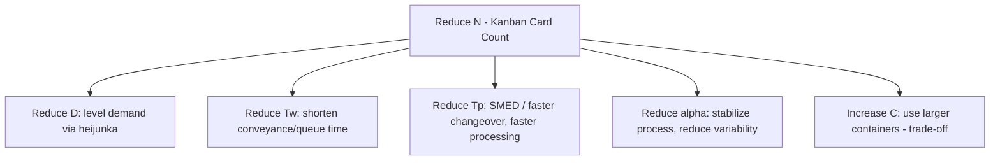

## Kanban Card Sizing Calculations

### Overview

Kanban card sizing is the quantitative process of determining two coupled parameters for each kanban loop: the **container size** ($C$) — how many units each kanban authorizes at a time — and the **number of cards/containers** ($N$) circulating in the loop. Together, $N \times C$ fixes the maximum inventory that loop can ever hold, making this calculation the direct mechanical link between kanban system design and the inventory levels it produces. Unlike a reorder-point or EOQ-style continuous-review calculation, kanban sizing is a **discrete, structural design decision** made once (and periodically revised) rather than a per-order economic calculation.

### The Core Sizing Formula

$$N = \frac{D \times (T_w + T_p) \times (1 + \alpha)}{C}$$

| Symbol | Meaning | Units |
| --- | --- | --- |
| $N$ | Number of kanban cards (containers) in the loop | integer count |
| $D$ | Average demand rate at the consuming process | units per unit time |
| $T_w$ | Waiting time — queue time, transport/conveyance time, and time a card spends before being collected/acted on | same time unit as $D$ |
| $T_p$ | Processing/replenishment time to produce or fill one container | same time unit as $D$ |
| $\alpha$ | Safety factor, covering demand and process variability | decimal (e.g., 0.10 = 10%) |
| $C$ | Container capacity | units per container |

$N$ is always **rounded up** to the nearest whole number, since a fractional card cannot exist — this rounding itself introduces a small, unavoidable amount of extra buffer beyond the theoretical minimum, which practitioners should account for when tuning tightly.

The **lead time component** $(T_w + T_p)$ represents the full replenishment cycle: from the moment a kanban is detached (signaling consumption) to the moment a full replacement container is back in stock and available. This is directly analogous to lead time $L$ in a safety stock formula — the longer this cycle, the more cards (and thus inventory) are needed to cover demand during the exposure window.

### Deriving Maximum and Average Inventory

Once $N$ and $C$ are fixed, the loop's inventory behavior is bounded:

$$\text{Maximum Inventory} = N \times C$$

$$\text{Average Inventory} \approx \frac{N \times C}{2}$$

(the average approximation assumes containers cycle roughly evenly between full and empty states across the loop — a full container waiting for withdrawal, and an empty one waiting for replenishment, at any given moment).

### Worked Example: Full Card-Count Derivation

A sub-assembly station consumes bracket components at $D = 240$ units/day (based on daily takt-time-driven demand). The supplying process's container holds $C = 60$ units. Conveyance (transport + waiting in queue) takes $T_w = 0.25$ day; production of one full container takes $T_p = 0.20$ day. A safety factor of $\alpha = 0.20$ is applied to absorb demand variability.

**Step 1 — Compute total replenishment cycle time:**

$$T_w + T_p = 0.25 + 0.20 = 0.45 \text{ day}$$

**Step 2 — Apply the formula:**

$$N = \frac{240 \times 0.45 \times 1.20}{60} = \frac{129.6}{60} = 2.16 \rightarrow 3 \text{ cards}$$

**Step 3 — Derive resulting inventory levels:**

$$\text{Max Inventory} = 3 \times 60 = 180 \text{ units}$$

$$\text{Average Inventory} \approx \frac{180}{2} = 90 \text{ units}$$

This confirms the loop holds at most 180 units (0.75 day of demand coverage) — the physical evidence of the $\approx$0.45-day replenishment cycle plus rounding and safety margin, exactly as the design intends.

### Choosing Container Size $C$

Container size is not solved for mathematically — it is typically constrained by ergonomics, handling equipment, and standard packaging, and then $N$ is solved to fit around it. The trade-offs:

| Container Size | Effect |
| --- | --- |
| Larger $C$ | Fewer cards needed for a given $N \times C$ target, but coarser inventory granularity and larger single-batch quality-exposure risk |
| Smaller $C$ | More cards/containers required, finer control, faster feedback on defects (smaller batch caught sooner), but more handling transactions |

**Key Points**

- Container size is frequently set to match ergonomic handling limits (what one person can lift/move) or standard tote/pallet fractions
- Smaller containers align better with JIT's waste-elimination goals (faster defect detection, lower WIP exposure per batch) but increase material-handling transaction frequency — a direct trade-off against the "transportation" and "motion" wastes
- In mixed physical/automated environments, $C$ is sometimes fixed by an automated conveyance or ASRS (automated storage/retrieval) system's tray/bin standard, removing it as a free variable entirely

### Sensitivity and Card-Count Reduction as Continuous Improvement

Because $N$ is directly proportional to $D$, $T_w$, $T_p$, and $(1+\alpha)$, and inversely proportional to $C$, each of these levers is a distinct improvement target:

The classic kaizen practice of **deliberately pulling a card out of circulation** is a direct, practical application of this formula: physically removing one card reduces $N$ by exactly one, shrinking $N \times C$ by exactly one container's worth of inventory. If the system continues to function without stockouts, that card is permanently retired and the process has structurally improved (shorter $T_w+T_p$, lower $\alpha$, or better $D$ stability absorbed the reduction). If stockouts occur, the card is restored and the underlying cause investigated — this is the mechanical embodiment of "lowering the water level to reveal the rocks," the standard JIT metaphor for using inventory reduction to expose hidden process problems.

### Reorder/Trigger Point Sizing (Signal Kanban)

For **signal kanban** (used with larger batch or supplier-replenished items, sometimes called triangle kanban), a distinct trigger-point calculation determines at what accumulated-withdrawal level a batch production/order signal fires — structurally similar to a reorder point:

$$\text{Trigger Point} = D \times (T_w + T_p) + SS$$

where $SS$ is an explicit safety stock quantity (rather than the proportional $\alpha$ factor used in the standard card formula). This variant is common when replenishment must occur in fixed lot sizes larger than a single container (e.g., a supplier minimum order quantity or a machine's economic batch size), bridging kanban pull mechanics with lot-sizing logic more typical of MRP-style planning.

### Two-Bin System as a Simplified Special Case

The **two-bin kanban** ($N = 2$ fixed) is a common simplification, particularly for low-value, high-frequency C-class items (per ABC analysis) where the overhead of a formal card-count calculation isn't justified:

- Bin 1 is used until empty, triggering replenishment
- Bin 2 covers consumption during the replenishment lead time
- Each bin's size is set to approximately cover $D \times (T_w + T_p)$, with the second bin implicitly serving the safety-stock role

This trades sizing precision for administrative simplicity, appropriate where the cost of moderate over- or under-sizing is low relative to the cost of maintaining a precisely tuned calculation.

### Common Sizing Errors

**Key Points**

- **Omitting queue/waiting time** ($T_w$) and sizing only against processing time ($T_p$) — this understates the true replenishment cycle and produces chronic stockouts, since queue and transport delays are often the larger component of total lead time in practice
- **Using average demand without accounting for variability** — a safety factor $\alpha$ calibrated only to historical average masks the risk of a demand spike outrunning the loop's fixed buffer; unlike a continuously-recalculated safety stock formula, kanban's fixed card count does not automatically adapt to a demand-distribution shift unless manually revised
- **Static card counts in the face of changing demand** — $D$ is rarely perfectly constant; seasonal or trending demand requires periodic re-calculation of $N$, or the loop will be systematically over- or under-buffered relative to current conditions

[Inference] The appropriate review cadence for recalculating $N$ (e.g., monthly, quarterly, or triggered by a demand-variance threshold) is not standardized in the literature and is generally set based on how volatile a given production environment's demand and lead times are — a stable, mature product line may need far less frequent revision than a newly introduced one.

**Related Topics**

- Kanban pull system mechanics and two-card/one-card loop design
- SMED and setup-time reduction as a $T_p$-reduction lever
- Heijunka (production leveling) as a $D$-stabilization lever
- Safety stock calculus and its parallels to the $\alpha$ safety factor
- CONWIP sizing for whole-line WIP caps
- ABC analysis and item-class-appropriate control methods
- Little's Law and the relationship between WIP, throughput, and cycle time