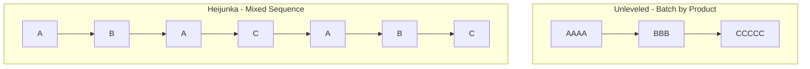

## Heijunka and Production Leveling

### Overview

Heijunka (平準化, "leveling") is the lean/JIT practice of smoothing production **volume and mix** over a fixed planning cycle, rather than producing in large batches sequenced by product type or building strictly to the raw, unsmoothed pattern of incoming customer orders. Where a naive make-to-order approach schedules production in the exact sequence and lot sizes customers request, heijunka deliberately re-sequences and re-batches that same total demand into a smoother, more repetitive pattern — trading short-term scheduling "fidelity" to individual orders for system-wide stability, which is what makes small kanban buffers and JIT pull mechanics viable in the first place.

Heijunka is not a demand-forecasting or demand-shaping technique aimed at customers; it operates entirely on the **production-scheduling side**, taking a given demand stream as input and converting it into a leveled internal production sequence.

### Why Leveling Matters: The Mathematical Link to Safety Stock and Kanban

Heijunka's purpose becomes explicit when connected back to the safety stock and kanban sizing formulas covered elsewhere in this material. In the safety stock formula,

$$SS = z \times \sigma_{LT} \times \sqrt{L}$$

$\sigma_{LT}$ is demand variability over lead time — and heijunka directly attacks this term. Similarly, in the kanban card-count formula,

$$N = \frac{D \times (T_w + T_p) \times (1 + \alpha)}{C}$$

the safety factor $\alpha$ exists specifically to absorb demand variability; a leveled $D$ allows $\alpha$ (and therefore $N$, and therefore inventory) to shrink. Heijunka is, in this sense, the scheduling-layer intervention that makes the *quantitative* case for smaller buffers throughout the rest of the JIT system actually hold up in practice — without it, kanban loops and safety stocks would need to be sized against raw, lumpy order variability, defeating much of JIT's inventory-reduction intent.

### The Two Dimensions of Leveling

**Key Points**

Heijunka levels production along two independent axes, and both must be addressed:

- **Volume leveling (heijunka by quantity):** Smoothing the *total daily/period output* so that production rate doesn't spike and trough with raw order arrival patterns — e.g., producing a consistent daily quantity rather than batching a month's worth of orders into one large run
- **Mix leveling (heijunka by sequence):** Smoothing the *sequence of different product variants* within that leveled volume, so that multiple models/SKUs are interspersed in small increments rather than run in large single-product batches



The unleveled pattern forces every downstream process (and every supplier) to absorb large swings in both volume and mix over time; the leveled pattern presents a small, repeating, predictable pattern that every upstream station and supplier can plan against with minimal buffer.

### Worked Example: Converting Raw Demand into a Heijunka Schedule

Assume weekly customer orders for three product variants:

| Product | Weekly Demand |
| --- | --- |
| A | 200 units |
| B | 100 units |
| C | 50 units |
| **Total** | **350 units** |

**Step 1 — Determine takt time** (assuming a 5-day, 8-hour/day production window with 90% uptime):

$$\text{Available Time} = 5 \times 8 \times 60 \times 0.90 = 2{,}160 \text{ minutes/week}$$


$$\text{Takt Time} = \frac{2{,}160}{350} \approx 6.17 \text{ minutes/unit}$$

**Step 2 — Determine the repeating mix ratio.** The demand ratio A:B:C is 200:100:50, which simplifies to **4:2:1**. This becomes the smallest repeatable production sequence unit — every 7 units produced (4+2+1), the mix should contain exactly this ratio.

**Step 3 — Interleave the sequence** rather than batching:

$$\text{A - B - A - C - A - B - A} \quad \text{(repeating block of 7 units)}$$

This 7-unit pattern repeats 50 times across the week ($350 \div 7 = 50$) to deliver exactly the required weekly volume of each variant, but every station downstream sees a short, predictable, constantly-repeating pattern rather than long runs of a single variant followed by long gaps.

### The Heijunka Box (Physical Scheduling Tool)

The traditional physical implementation is the **heijunka box** — a wall-mounted grid of slots, with rows representing product variants and columns representing fixed time increments (often called "pitch," a multiple of takt time matched to container/kanban size). Production kanban cards are placed into the appropriate time-slot/product cell in the leveled sequence; an operator or material handler pulls cards from left to right, and the box's slot layout physically enforces the interleaved mix.

```mermaid
flowchart LR
    subgraph HeijunkaBox [Heijunka Box - Leveled Schedule (svg_diagram)]
    direction TB
    RowA["Product A slots: | X | | X | | X | | X |"]
    RowB["Product B slots: | | X | | | | X | |"]
    RowC["Product C slots: | | | | X | | | |"]
    end
```

**Pitch** is the time increment represented by each column, typically calculated as:

$$\text{Pitch} = \text{Takt Time} \times \text{Container Quantity}$$

This ties heijunka directly to kanban container sizing: each box "cell" corresponds to exactly one kanban card's worth of production, meaning the heijunka box is effectively the sequencing/dispatch layer sitting on top of the kanban pull mechanism discussed separately in this material.

### Preconditions Heijunka Depends On

**Key Points**

Heijunka's viability rests on capabilities developed elsewhere in the JIT toolkit — it cannot be implemented in isolation:

- **SMED (fast changeover):** Interleaving small batches of different products (as in the A-B-A-C-A-B-A sequence above) requires frequent changeovers between variants; without setup-time reduction, the changeover cost of leveled mix production would be prohibitive, pushing the economics back toward large batches
- **Standardized work:** Predictable, repeatable cycle times at each station are required for the leveled sequence's timing (pitch) to hold — high cycle-time variability at any station breaks the schedule's assumptions
- **Reliable quality (Jidoka):** A defect that stops the line disrupts the leveled sequence for every downstream station simultaneously, since there is minimal buffer to absorb it — reinforcing why Jidoka and JIT are treated as inseparable pillars

### Heijunka vs. Build-to-Order Sequencing

| Dimension | Pure Build-to-Order (unleveled) | Heijunka |
| --- | --- | --- |
| Sequence | Exact order-arrival sequence | Re-sequenced into a smoothed, repeating pattern |
| Volume per period | Follows raw demand fluctuation | Smoothed to a target rate |
| Supplier/upstream impact | Absorbs full demand variability | Sees smoothed, predictable pull signal |
| Customer lead time | Can be shorter for an individual urgent order | Generally longer for any single order, but more consistent overall |
| System stability | Lower — buffers must be sized for raw variability | Higher — buffers sized for the smoothed pattern |

This table surfaces heijunka's central trade-off: it deliberately sacrifices strict order-sequence fidelity (an individual customer's order may not be built in the exact order it arrived) in exchange for system-wide predictability. Make-to-stock and configure-to-order environments accommodate this more easily than pure engineer-to-order or highly customized production, where heijunka's mix-leveling logic is harder to apply.

### Modern Digital/Software Analogs

[Inference] In software-driven scheduling systems (APS, MES, or ERP production-scheduling modules), heijunka logic is typically implemented as sequencing algorithms or leveling rules layered on top of the demand/order backlog, rather than a physical box — but the underlying goal (bounded volume and mix variability per fixed time bucket) remains the same; specific vendor implementations vary and aren't standardized across the industry.

### Relationship to Demand Aggregation in DRP/MRP Context

Heijunka's leveling logic connects conceptually to the aggregation math covered under DRP: just as consolidating independent demand streams at an upstream node reduces aggregate variability via $\sigma_{agg} = \sqrt{\sum \sigma_i^2}$, heijunka achieves a related effect at the *scheduling* layer — by smoothing the sequence of what is produced regardless of the raw order arrival pattern, it reduces the effective variability the production system (and its kanban loops) must be sized against, even though the underlying customer demand itself hasn't changed.

**Related Topics**

- Kanban pull system mechanics and card sizing calculations
- SMED and setup-time reduction
- Takt time and pacing to customer demand
- Jidoka and built-in quality as a heijunka precondition
- Standardized work
- Mixed-model production scheduling
- Demand aggregation and variability pooling (DRP context)