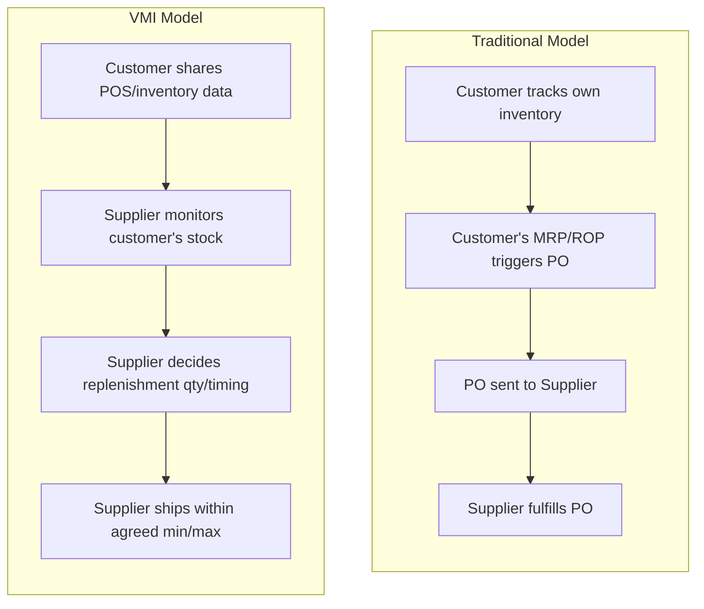
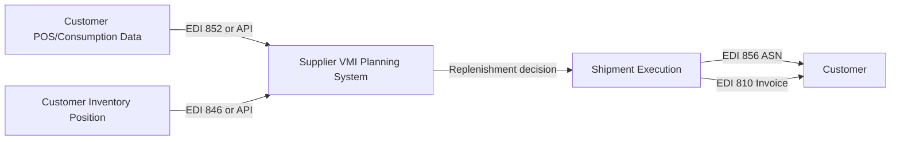

## Vendor-Managed Inventory and Continuous Replenishment

### Overview

Vendor-Managed Inventory (VMI) is a supply chain arrangement in which the **supplier**, rather than the buyer/customer, takes responsibility for monitoring inventory levels at the customer's location and determining when and how much to replenish. This is a fundamental inversion of the traditional purchasing model: instead of the customer's planning system (MRP, DRP, or reorder-point logic) generating purchase orders that are sent to the supplier, the supplier is given visibility into the customer's actual consumption/inventory data and uses that visibility to plan and execute replenishment shipments proactively, typically within pre-agreed inventory bounds (min/max levels).

**Continuous Replenishment (CRP — not to be confused with Capacity Requirements Planning, also abbreviated CRP, covered under MRP II)** is closely related and often implemented alongside VMI: rather than replenishing in discrete, periodic batch orders, the supplier ships smaller quantities on a more frequent, near-continuous basis, timed to match actual consumption rather than a fixed order cycle. VMI describes *who decides* when to replenish; continuous replenishment describes *how frequently/in what pattern* the replenishment happens. The two are commonly combined but are conceptually distinct.

### Traditional Replenishment vs. VMI

**Key Points**

- Ownership of the *replenishment decision* moves from customer to supplier — this is VMI's defining characteristic, not merely faster shipping or better forecasting
- The customer typically retains ownership of the *inventory policy parameters* (min/max thresholds, service level targets) even though the supplier executes against them — VMI is collaborative planning with delegated execution, not the supplier operating unconstrained
- Data visibility is the prerequisite: VMI cannot function without the customer sharing consumption data (POS/withdrawal transactions), current on-hand inventory, and often forward demand signals, typically via EDI, API, or a shared portal

### The Min/Max Replenishment Logic

Most VMI implementations operate on a **min/max** (or "order-up-to") policy that the supplier monitors and executes against, structurally similar to a continuous-review reorder-point system but executed by the supplier rather than triggered by a customer purchase order:

$$\text{Reorder Trigger: } I(t) \leq Min$$

$$\text{Replenishment Quantity: } Q = Max - I(t)$$

where $I(t)$ is current inventory position (on-hand plus in-transit) at time $t$, $Min$ is the agreed minimum stock level (often set at or near the calculated safety stock plus lead-time demand), and $Max$ is the agreed ceiling the supplier will not exceed without customer authorization.

$Min$ is typically derived using the same safety stock logic applied elsewhere in inventory planning:

$$Min = D \times L + SS = D \times L + z \times \sigma_{LT} \times \sqrt{L}$$

where $D$ is average demand rate, $L$ is replenishment lead time, and the safety stock term follows the standard formula. The distinction from a conventional reorder-point system is organizational, not mathematical: the supplier — who typically has better visibility into their own production/shipping constraints — calculates and executes against this trigger rather than waiting for a formal purchase order.

### Worked Example

A retail customer and supplier agree on VMI terms for a SKU with:

- Average daily demand $D = 50$ units/day
- Replenishment lead time $L = 3$ days
- Desired service level $z = 1.65$ (≈95%)
- Demand standard deviation $\sigma_{LT} = 15$ units over the lead time

$$SS = 1.65 \times 15 = 24.75 \approx 25 \text{ units}$$

$$Min = (50 \times 3) + 25 = 175 \text{ units}$$

If $Max$ is set at, say, 350 units (roughly 7 days of supply, reflecting the supplier's shipment economics and the customer's storage constraints), the supplier's monitoring system triggers a replenishment shipment whenever the customer's tracked inventory position falls to or below 175 units, sized to bring it back up to 350.

### Data and Systems Architecture

**Key Points**

A functioning VMI/continuous replenishment program requires several integration components:

- **Point-of-sale or consumption data feed** — typically EDI 852 (Product Activity Data) transaction sets in traditional retail VMI, or equivalent API/webhook feeds in modern implementations, reporting actual sell-through or withdrawal
- **Inventory position visibility** — EDI 846 (Inventory Inquiry/Advice) or equivalent, giving the supplier current on-hand and in-transit quantities
- **Order/shipment confirmation** — EDI 850 (Purchase Order, sometimes auto-generated by the supplier's own system for record-keeping) and EDI 856 (Advance Ship Notice) once the supplier initiates a shipment
- **Invoicing** — EDI 810, typically still following standard invoicing flows despite the inverted replenishment-decision model

[Inference] Modern VMI implementations increasingly favor API-based, near-real-time data exchange over traditional batch EDI, particularly for e-commerce and omnichannel retail contexts, though EDI remains heavily entrenched in traditional grocery, big-box retail, and industrial supply relationships due to established trading-partner infrastructure.

### Benefits and Underlying Rationale

| Stakeholder | Benefit | Mechanism |
| --- | --- | --- |
| Customer | Reduced inventory carrying cost | Supplier optimizes replenishment against its own production/shipping schedule rather than customer guessing |
| Customer | Reduced stockouts | Supplier has better visibility into its own supply constraints and can proactively manage risk |
| Customer | Lower planning/ordering labor | No manual PO generation/tracking for VMI-managed SKUs |
| Supplier | Improved demand visibility | Direct consumption data replaces noisy, batched order signals — directly mitigating the bullwhip effect |
| Supplier | Production/shipping smoothing | Better forward visibility supports more level-loaded production scheduling |
| Both | Reduced bullwhip amplification | Shared, granular data replaces the order-batching and information-delay dynamics that amplify variability upstream |

The bullwhip-effect mitigation is arguably VMI's most cited systemic benefit: in a traditional model, each tier in the supply chain sees only the *order* pattern from the tier below (which is itself distorted by batching, safety-stock padding, and promotional/price-driven order spikes), and each tier's own forecasting and safety-stock behavior further amplifies that distortion moving upstream. VMI short-circuits this by giving the supplier direct access to the *actual consumption signal*, closer to true end demand, rather than the amplified order signal.

### Risks and Failure Modes

**Key Points**

- **Data quality dependency** — VMI performance is entirely bounded by the accuracy and timeliness of the shared consumption/inventory data; stale or inaccurate feeds cause the supplier to make replenishment decisions on bad information, potentially worse than a well-run customer-side reorder-point system
- **Misaligned incentives** — if the supplier is compensated on shipped volume rather than customer service level or inventory turns, VMI can drift toward the supplier over-stocking the customer (a principal-agent risk inherent to delegating the replenishment decision)
- **Ownership and liability ambiguity** — contracts must clearly define at what point inventory ownership transfers (some VMI arrangements use **consignment inventory**, where the supplier retains ownership until consumption, adding financial/accounting complexity)
- **Single point of dependency** — concentrating the replenishment decision with one supplier reduces the customer's own visibility and control, which can be a risk if the supplier relationship deteriorates or the supplier's own systems fail

[Inference] The consignment-inventory variant (supplier retains legal ownership until point of consumption) is common in VMI programs specifically because it helps realign the incentive-misalignment risk noted above — the supplier bears carrying cost risk directly, which discourages over-stocking — though this is a contractual/financial design choice layered on top of VMI rather than an inherent requirement of the model.

### VMI's Position Relative to Other Systems Covered

| System | Who Decides Replenishment | Demand Signal Used | Typical Scope |
| --- | --- | --- | --- |
| MRP/DRP | Customer's planning system | Forecast + time-phased dependent demand | Internal, multi-echelon within one organization |
| Kanban | Downstream process (pull) | Actual local consumption | Internal, shop-floor/station-to-station |
| Reorder Point | Customer's system, threshold-triggered | Forecast + historical variability | Single-location, independent demand |
| VMI | Supplier, within agreed bounds | Shared actual consumption data | Cross-organizational, customer-supplier boundary |

VMI can be understood as extending kanban's pull-signal logic *across an organizational boundary*: rather than an internal downstream process pulling from an internal upstream process via a kanban card, an external customer's actual consumption pulls replenishment from an external supplier, mediated by shared data rather than a physical card. Some VMI programs are explicitly implemented as **supplier kanban**, using physical or electronic kanban signals that cross directly from the customer's receiving dock to the supplier's shipping schedule.

**Related Topics**

- Bullwhip effect and information-sharing mitigation
- Consignment inventory and financial/ownership structures
- EDI transaction sets in supply chain integration (846, 852, 856, 810)
- Collaborative Planning, Forecasting, and Replenishment (CPFR)
- Kanban pull system mechanics (as an internal analog to VMI)
- Safety stock calculus applied to min/max VMI thresholds
- Supplier relationship management and incentive alignment