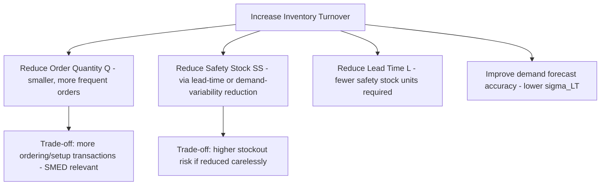

## Inventory Turnover Ratio

### Overview

Inventory turnover ratio (also called stock turn or turns) measures how many times a company's inventory is sold and replaced over a given period. It is one of the most widely used inventory performance KPIs because it directly connects two things senior stakeholders care about: capital efficiency (how much cash is tied up in stock) and operational health (whether inventory is moving or stagnating). A high turnover ratio generally indicates strong sales relative to inventory investment; a low ratio can signal overstocking, weak demand, obsolescence risk, or poor purchasing discipline — though, as covered below, the ratio must be interpreted in context rather than optimized in isolation.

### Core Formula

$$\text{Inventory Turnover} = \frac{\text{Cost of Goods Sold (COGS)}}{\text{Average Inventory}}$$

**Average Inventory** is typically calculated as:

$$\text{Average Inventory} = \frac{\text{Beginning Inventory} + \text{Ending Inventory}}{2}$$

**Key Points**

- **COGS is used in the numerator, not revenue/sales** — this is the standard and more accurate convention, because both COGS and inventory are valued at cost, keeping the ratio's units consistent. Using sales revenue in the numerator (a common but technically inconsistent variant) overstates turnover because revenue includes markup that inventory valuation does not
- **Average inventory**, not a single point-in-time snapshot (e.g., year-end inventory), should be used wherever possible, since a single snapshot can be distorted by seasonality or a one-time bulk purchase near the period boundary
- For more precision, average inventory can be computed from multiple intra-period snapshots (e.g., the average of 12 month-end balances for an annual ratio) rather than just beginning and ending values, which smooths out seasonal distortion further

### Worked Example

A company reports:

- COGS for the year: $2,400,000
- Beginning inventory: $220,000
- Ending inventory: $180,000

**Step 1 — Average inventory:**

$$\text{Average Inventory} = \frac{220{,}000 + 180{,}000}{2} = 200{,}000$$

**Step 2 — Turnover ratio:**

$$\text{Inventory Turnover} = \frac{2{,}400{,}000}{200{,}000} = 12$$

This means inventory turned over 12 times during the year — roughly once per month on average.

### Days Inventory Outstanding (DIO) — The Complementary Metric

Inventory turnover is frequently converted into a time-based metric, **Days Inventory Outstanding** (also called Days Sales of Inventory, DSI, or Days in Inventory, DII), which is often more intuitive for operational stakeholders:

$$DIO = \frac{365}{\text{Inventory Turnover}}$$

or, computed directly:

$$DIO = \frac{\text{Average Inventory}}{\text{COGS}} \times 365$$

For the example above:

$$DIO = \frac{365}{12} \approx 30.4 \text{ days}$$

This indicates inventory sits, on average, roughly 30 days before being sold — a directly actionable operational figure that "12 turns per year" alone does not immediately convey to non-financial stakeholders.

**Key Points**

- Use 365 for a calendar-year period; 360 is sometimes used in some financial conventions for simplified monthly math, and 90/91 for a quarterly DIO — the period length used must match the period over which COGS and average inventory were measured
- Turnover ratio and DIO are mathematically inverse expressions of the same underlying efficiency — reporting both is common because each serves a different audience (turnover for trend/benchmark comparison, DIO for operational planning)

### Segmenting the Ratio: Why Aggregate Turnover Can Mislead

**Key Points**

A single company-wide or warehouse-wide turnover ratio blends together items with very different velocity profiles, which can obscure more than it reveals:

- **By SKU/item:** A fast-moving A-class item (per ABC analysis) might turn 24 times/year while a slow-moving C-class item turns twice — an aggregate ratio averages these together, hiding both the outperformance and the risk
- **By category/product line:** Different product families often have structurally different turnover norms (e.g., perishable goods vs. durable spare parts) — comparing them on one blended figure produces a misleading benchmark
- **By location:** In a multi-echelon distribution network (as covered under DRP), turnover at a central DC will differ structurally from turnover at a retail-facing node, since the central DC holds more aggregated safety stock by design

Best practice is to calculate turnover at the SKU or category level and use the aggregate figure only as a high-level trend indicator, not as the primary diagnostic tool.

### Turnover Rate and Its Relationship to Safety Stock and EOQ

Turnover is not an independent lever — it is a *downstream consequence* of the inventory policy parameters covered elsewhere in this material (safety stock, order quantity, reorder point). Specifically:

$$\text{Average Inventory} \approx \frac{Q}{2} + SS$$

where $Q$ is the order quantity (e.g., from an EOQ calculation) and $SS$ is safety stock. Substituting into the turnover formula:

$$\text{Inventory Turnover} = \frac{\text{COGS}}{\frac{Q}{2} + SS}$$

This makes explicit that turnover can be improved through the same levers used to reduce inventory elsewhere in this curriculum:

This is the direct bridge between this KPI chapter and the lean/JIT material: JIT's waste-elimination levers (shorter lead times via SMED, demand leveling via heijunka, tighter kanban card counts) are, from a financial-metrics perspective, turnover-improvement levers. A company pursuing JIT without tracking turnover has no clean way to demonstrate the financial impact of those operational changes; conversely, a company chasing turnover targets without understanding EOQ/safety-stock trade-offs risks cutting $Q$ or $SS$ in ways that increase stockout frequency or ordering cost disproportionately.

### The Danger of Over-Optimizing Turnover in Isolation

**Key Points**

- **Stockout risk:** Aggressively cutting safety stock or order quantities to boost the ratio, without addressing the underlying lead-time/variability drivers, increases stockout probability — turnover is a *lagging* efficiency indicator, not a service-level indicator, and improving it does not guarantee (and can actively harm) fill rate
- **Ordering cost trade-off:** Per the EOQ framework, shrinking $Q$ below its cost-optimal point to inflate turnover increases total ordering/setup cost, potentially more than offsetting the reduced carrying cost the higher turnover implies
- **Obsolescence vs. genuine efficiency:** A rising turnover ratio driven by markdown/liquidation of aging stock (reducing average inventory through write-downs rather than genuine sell-through) can *look* like an operational improvement while actually reflecting a forecasting or purchasing failure — turnover should always be interpreted alongside sell-through rate and aging/obsolescence metrics, not in isolation
- **Industry and business-model context is essential** — turnover benchmarks vary enormously by industry (grocery/perishables typically show turnover in the 15–30+ range; heavy machinery, aerospace parts, or capital goods commonly run below 5) — comparing a company's ratio only against a generic cross-industry benchmark rather than sector peers produces a distorted read

[Inference] "Good" turnover targets are industry- and business-model-specific rather than governed by a universal standard; a ratio interpreted as excellent in one sector (e.g., fast fashion) could indicate understocking and lost-sales risk in another (e.g., industrial spare parts with high service-level requirements), so benchmarking against sector-comparable peers is generally more meaningful than a fixed numeric target.

### Relationship to Other Financial Metrics

Inventory turnover is one input into the broader **Cash Conversion Cycle (CCC)**:

$$CCC = DIO + DSO - DPO$$

where $DSO$ (Days Sales Outstanding) measures receivables collection time and $DPO$ (Days Payable Outstanding) measures how long the company takes to pay its own suppliers. A reduction in $DIO$ — driven by improved inventory turnover — directly shortens the cash conversion cycle, freeing working capital, which is why inventory turnover is frequently reported alongside CCC in financial performance reviews rather than treated as a purely operational metric.

**Related Topics**

- Days Inventory Outstanding (DIO) and the Cash Conversion Cycle
- ABC analysis and turnover segmentation by item class
- Economic Order Quantity (EOQ) and its relationship to average inventory
- Safety stock calculus and service-level trade-offs
- Sell-through rate and obsolescence/aging metrics
- Fill rate and order fulfillment KPIs
- Carrying cost of inventory