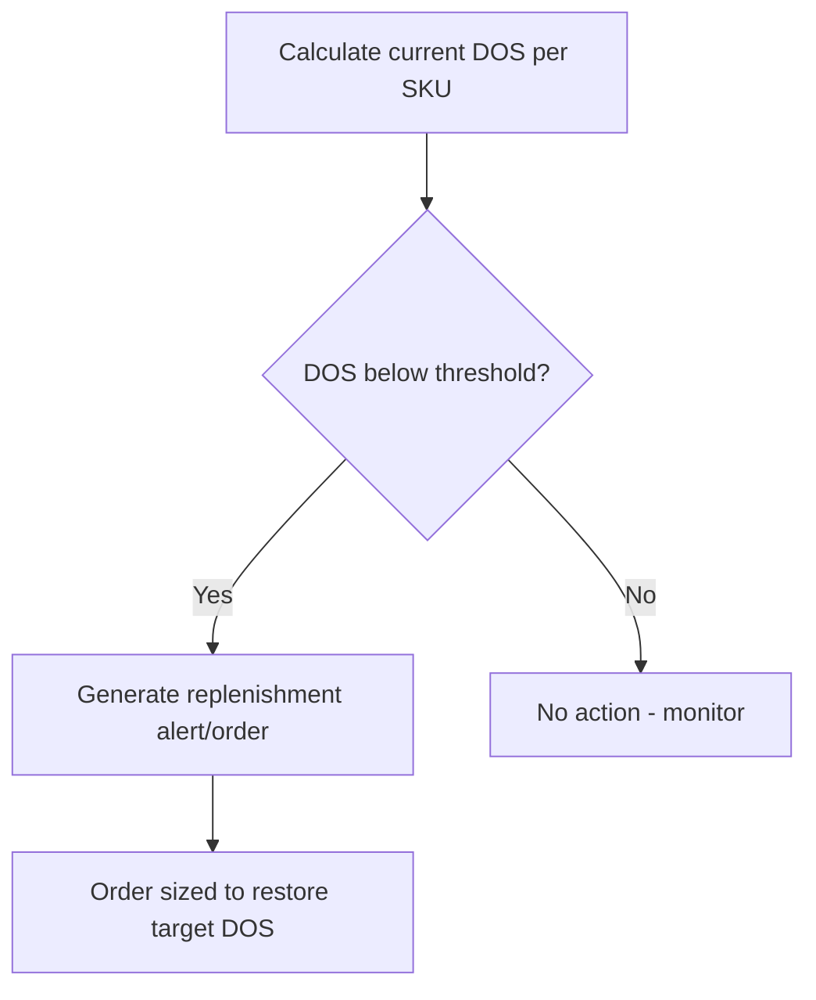

## Days of Supply and Days of Inventory Outstanding

### Overview

Days of Supply (DOS) and Days Inventory Outstanding (DIO) are both time-based expressions of how long current inventory will last or has taken to sell — but they answer subtly different questions and are used by different audiences. **DIO** is a backward-looking financial/accounting metric, computed from historical COGS and average inventory, used to assess overall inventory efficiency (as introduced under inventory turnover ratio). **Days of Supply** is a forward-looking operational metric, computed from current on-hand inventory and expected future demand, used to answer the immediate planning question: "at current stock levels and expected consumption, how many more days can we operate before running out?" Both are covered together here because they are frequently confused despite serving distinct planning horizons — DIO explains *what happened*, DOS informs *what happens next*.

### Days Inventory Outstanding (DIO) — Recap and Formal Definition

$$DIO = \frac{\text{Average Inventory}}{\text{COGS}} \times \text{Number of Days in Period}$$

equivalently, derived from the turnover ratio:

$$DIO = \frac{\text{Number of Days in Period}}{\text{Inventory Turnover}}$$

DIO is a **trailing, aggregate** metric — it looks backward over a completed accounting period (month, quarter, year) and is typically calculated at the company, business-unit, or product-category level rather than per-SKU per-day, because it depends on period-end financial figures (COGS, average inventory valuation) rather than daily transactional data.

### Days of Supply (DOS) — Formal Definition

$$DOS = \frac{\text{Current On-Hand Inventory}}{\text{Average Daily Demand (or Usage Rate)}}$$

**Key Points**

- DOS is calculated **per SKU, per location**, using current, real-time (or near-real-time) inventory position and a forward-looking demand rate — not historical COGS
- The demand rate in the denominator can be historical average daily usage, a forecasted rate, or a blended figure, depending on the planning system's sophistication — this choice materially affects DOS accuracy in a way that DIO's COGS-based calculation does not need to consider
- DOS is the operational-planning analog of the $\frac{POH}{D}$ relationship embedded in the time-phased MRP/DRP records covered earlier — it is essentially a snapshot summary of "how many periods of coverage remain" at a single point in time, without needing to run a full time-phased explosion

### Worked Example — DOS

A DC currently holds 1,800 units of a SKU on hand. Average daily demand (based on a trailing 30-day average) is 60 units/day.

$$DOS = \frac{1{,}800}{60} = 30 \text{ days}$$

This tells a planner that, absent any incoming replenishment and assuming demand holds steady, the location has 30 days of coverage before stockout — directly actionable for triggering replenishment or flagging risk, in a way a trailing annual DIO figure cannot provide at the SKU/location granularity needed for daily operations.

### Side-by-Side Comparison

| Dimension | Days Inventory Outstanding (DIO) | Days of Supply (DOS) |
| --- | --- | --- |
| Orientation | Backward-looking (historical period) | Forward-looking (current position, future demand) |
| Numerator basis | Average inventory (valued at cost) | Current on-hand inventory (units) |
| Denominator basis | COGS (financial, cost-valued) | Daily demand/usage rate (units) |
| Typical granularity | Company, business unit, or category | SKU × location |
| Primary audience | Finance, executive reporting | Operations, planning, procurement |
| Update frequency | Periodic (monthly/quarterly close) | Daily or near-real-time |
| Primary use | Efficiency benchmarking, CCC input | Stockout risk flagging, replenishment triggering |

**Key Points**

- Despite the near-identical names, DIO and DOS are **not interchangeable** and answer different questions at different levels of granularity — a common source of confusion in cross-functional discussions between finance and operations teams
- A company can have healthy aggregate DIO (efficient on average) while individual SKUs show critically low DOS (imminent stockout risk) — aggregation across SKUs masks exactly the kind of item-level risk DOS is designed to surface, echoing the segmentation caution raised under inventory turnover
- Conversely, a SKU can show comfortable DOS today while contributing to poor DIO over a full period, if that comfortable coverage was achieved via an oversized, infrequent order that inflates average inventory relative to COGS across the period

### Using DOS as an Operational Control Signal

DOS is frequently used as a direct trigger mechanism in inventory management systems, functioning similarly to (and sometimes implemented in place of) a traditional reorder point:

A target DOS band is often set per item class (informed by ABC analysis and the item's role in the safety-stock/service-level framework):

| Class | Typical Target DOS Range | Rationale |
| --- | --- | --- |
| A-items (high value/velocity) | Tighter band, closely monitored | High carrying cost of excess; stockout cost also high — precision matters |
| B-items | Moderate band | Balanced risk profile |
| C-items | Wider band, looser monitoring | Low value; simpler control (e.g., two-bin) is often adequate |

This connects DOS directly to the min/max logic covered under VMI and continuous replenishment: a **target DOS** effectively defines the $Max$ level, while a **minimum DOS threshold** defines the $Min$/reorder trigger, expressed in time units rather than raw quantity — often more intuitive for cross-functional communication than a bare unit count, since "12 days of cover" is easier to interpret at a glance than "840 units," especially across SKUs with very different unit sizes or demand rates.

### DOS in a Multi-Echelon (DRP) Context

Because DOS is calculated per location, it can be rolled up or compared across the distribution network covered under DRP to identify network-wide imbalances:

$$DOS_{network} = \frac{\sum_{i} \text{On-Hand}_i}{\sum_{i} \text{Daily Demand}_i}$$

but — echoing the aggregation caution above — a healthy network-average DOS can mask a severe imbalance where one node is critically short while another is significantly overstocked. In DRP-managed networks, DOS is therefore typically monitored **per node**, and large DOS disparities across nodes for the same SKU are a common trigger for lateral transshipment (moving stock directly between peer locations) rather than waiting for the standard upstream replenishment cycle.

### Sensitivity to Demand Rate Estimation

**Key Points**

DOS accuracy is entirely dependent on the quality of the demand-rate denominator, which introduces estimation choices that DIO's COGS-based calculation avoids:

- **Trailing average (e.g., 30-day):** Simple, stable, but lags behind genuine trend or seasonal shifts — can overstate DOS during a demand upturn (understating stockout risk) or understate it during a downturn
- **Forecasted rate:** More forward-looking and responsive to known seasonality or promotions, but inherits whatever forecast error exists in the underlying demand model
- **Blended/weighted approach:** Some systems weight recent actuals more heavily than older data (e.g., exponential smoothing) to balance stability against responsiveness

[Inference] The choice of demand-rate estimation method for DOS calculation is generally a system/policy configuration decision rather than a fixed standard, and different items within the same catalog may warrant different approaches (e.g., trailing average for stable staple items, forecasted rate for seasonal or promotional items) — this is a common area of custom tuning in inventory planning systems rather than a one-size-fits-all default.

### Practical Reporting Convention

In many operational dashboards, DOS and DIO are reported together to give a complete picture: DIO for period-over-period efficiency trending (suitable for executive/financial review), and current DOS by SKU/location for day-to-day exception management (suitable for planner/buyer action). Treating either metric as a substitute for the other is a common analytical error — a system reporting only aggregate DIO has no early-warning capability for imminent stockouts, while a system reporting only DOS has no clean way to benchmark overall capital efficiency against prior periods or industry peers.

**Related Topics**

- Inventory turnover ratio and its relationship to DIO
- Safety stock calculus and reorder point triggers
- ABC analysis and class-based DOS target-setting
- Distribution Requirements Planning (DRP) and multi-echelon coverage monitoring
- Lateral transshipment strategies
- Cash Conversion Cycle (CCC)
- Demand forecasting methods and forecast error measurement