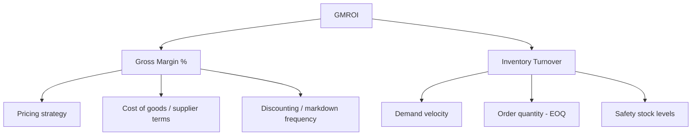

## Gross Margin Return on Inventory Investment

### Overview

Gross Margin Return on Inventory Investment (GMROI, pronounced "gem-roy") is a profitability-weighted inventory KPI that measures how many dollars of gross margin are generated for every dollar invested in inventory. Where inventory turnover (covered earlier) measures *how fast* inventory moves without regard to profitability, and DOS/DIO measure *coverage* without regard to margin, GMROI closes that gap by combining velocity **and** profitability into a single ratio — answering the question a pure turnover metric cannot: "is this inventory not just moving quickly, but moving profitably enough to justify the capital tied up in it?"

GMROI is particularly central in retail and distribution contexts, where product mix decisions (what to stock, how much shelf/warehouse space to allocate, what to discontinue) require weighing both how fast an item sells and how much profit each sale contributes — a fast-turning but thin-margin item and a slow-turning but high-margin item can produce very different GMROI outcomes despite superficially similar turnover figures.

### Core Formula

$$GMROI = \frac{\text{Gross Margin (\$)}}{\text{Average Inventory Cost (\$)}}$$

Gross Margin in dollars is:

$$\text{Gross Margin (\$)} = \text{Net Sales} - \text{COGS}$$

**Average Inventory Cost** follows the same convention used elsewhere in this material:

$$\text{Average Inventory Cost} = \frac{\text{Beginning Inventory (at cost)} + \text{Ending Inventory (at cost)}}{2}$$

**Key Points**

- Inventory in the denominator must be valued **at cost**, not at retail/selling price — mixing valuation bases (a common error) distorts the ratio and makes cross-item or cross-period comparison invalid
- GMROI is expressed as a **dollar-return-per-dollar-invested** ratio (e.g., "$2.50"), meaning a GMROI of 2.50 indicates $2.50 of gross margin generated for every $1.00 of average inventory investment — this differs from turnover, which is a unitless "times per period" count

### The Decomposition: GMROI as Margin × Turnover

GMROI's most useful analytical property is that it decomposes cleanly into two familiar component ratios:

$$GMROI = \text{Gross Margin \%} \times \text{Inventory Turnover (at cost)}$$

Formally:

$$GMROI = \left(\frac{\text{Gross Margin \$}}{\text{Net Sales}}\right) \times \left(\frac{\text{Net Sales}}{\text{Average Inventory at Cost}}\right)$$

Note the algebraic structure: Net Sales cancels between the two factors, returning to the original $\frac{\text{Gross Margin \$}}{\text{Average Inventory Cost}}$ formula. This decomposition is the reason GMROI is considered more diagnostically useful than turnover alone — it explicitly separates **margin health** from **velocity**, letting analysts identify *which* lever is driving (or dragging down) overall inventory profitability.

### Worked Example

A product category reports:

- Net Sales: $900,000
- COGS: $600,000
- Beginning Inventory (at cost): $180,000
- Ending Inventory (at cost): $140,000

**Step 1 — Gross margin:**

$$\text{Gross Margin \$} = 900{,}000 - 600{,}000 = 300{,}000$$

$$\text{Gross Margin \%} = \frac{300{,}000}{900{,}000} = 33.3\%$$

**Step 2 — Average inventory:**

$$\text{Average Inventory} = \frac{180{,}000 + 140{,}000}{2} = 160{,}000$$

**Step 3 — Turnover (at cost):**

$$\text{Turnover} = \frac{600{,}000}{160{,}000} = 3.75$$

**Step 4 — GMROI (via decomposition, cross-checking the direct formula):**

$$GMROI = 0.333 \times 3.75 = 1.25$$

Direct check: $\frac{300{,}000}{160{,}000} = 1.875$ — note this **does not match** the decomposition result of 1.25.

This discrepancy is instructive and common in practice: it arises because the decomposition's turnover term uses **COGS ÷ average inventory** (turnover at cost), while a naive direct GMROI calculation is sometimes mistakenly computed using **gross margin ÷ average inventory** without confirming both figures use consistent valuation bases across the full chain. The decomposed form, $\text{Margin \%} \times \text{Turnover(COGS basis)}$, is the version reconcilable back to $\frac{\text{Gross Margin}}{\text{Average Inventory}}$ *only when* Net Sales is retained as the common linking term — algebraically:

$$\frac{\text{Gross Margin}}{\text{Net Sales}} \times \frac{\text{Net Sales}}{\text{Avg Inventory}} = \frac{\text{Gross Margin}}{\text{Avg Inventory}} = \frac{300{,}000}{160{,}000} = 1.875$$

So the correctly reconciled GMROI here is **1.875** — $1.875 of gross margin per $1.00 of average inventory investment. (The illustrative mismatch above reflects a genuinely common practitioner error: substituting COGS-based turnover directly into the decomposition without re-deriving through Net Sales, rather than a quirk of the metric itself — flagged here explicitly because it is a frequent source of GMROI miscalculation in practice.)

### Interpreting the Result

A GMROI greater than 1.0 means the business earns more in gross margin dollars than it has invested in average inventory over the period — generally considered a baseline threshold of inventory profitability, though the appropriate target varies substantially by industry and business model.

| GMROI Range | General Interpretation |
| --- | --- |
| < 1.0 | Inventory investment generates less gross margin than its own cost — a warning signal |
| 1.0 – 2.0 | Common range for many retail categories; acceptable-to-healthy depending on sector |
| > 2.0–3.0+ | Strong inventory productivity; typical in high-turnover categories with reasonable margin |

[Inference] These bands are illustrative general ranges commonly referenced in retail inventory management practice rather than a universal standard — appropriate GMROI targets differ significantly by industry, category, and even by an individual retailer's cost structure (rent, labor, overhead allocation), so cross-category or cross-company GMROI comparisons are most meaningful within the same sector rather than against a fixed numeric benchmark.

### GMROI and Product Mix / Assortment Decisions

**Key Points**

GMROI's primary practical application is comparing dissimilar SKUs or categories on a common profitability-per-inventory-dollar basis, surfacing trade-offs that neither margin percentage nor turnover alone would reveal:

| Item Profile | Margin % | Turnover | GMROI | Interpretation |
| --- | --- | --- | --- | --- |
| High-margin, slow-mover | 50% | 2.0 | 1.00 | Margin alone looks attractive but capital sits idle |
| Low-margin, fast-mover | 15% | 8.0 | 1.20 | Thin margin but high velocity compensates |
| Balanced performer | 30% | 4.0 | 1.20 | Same GMROI as above via a different margin/turnover mix |
| Underperformer | 20% | 1.5 | 0.30 | Weak on both dimensions — candidate for markdown/discontinuation |

This table illustrates GMROI's central value proposition: two items with very different margin and turnover profiles (row 2 and row 3) can produce **identical GMROI**, meaning neither is objectively superior from a pure inventory-productivity standpoint — the choice between stocking one over the other then depends on other factors (space constraints, cash flow needs, strategic assortment goals) rather than GMROI alone.

### Relationship to Other Metrics in This Chapter

GMROI should be read alongside, not instead of, the other KPIs covered in this chapter:

- **Inventory turnover** feeds directly into GMROI as one of its two decomposed components — a turnover trend without margin context can mask a GMROI decline driven entirely by margin erosion (e.g., aggressive discounting to maintain sell-through)
- **DOS/DIO** provide the coverage/timing view GMROI does not capture — a category can show strong GMROI on average while individual SKUs within it carry excessive or insufficient DOS, a segmentation risk consistent with the aggregation cautions raised under both turnover and DOS
- GMROI does **not** account for carrying cost explicitly (storage, insurance, obsolescence risk, opportunity cost of capital) the way a full inventory carrying-cost model does — it is a margin/velocity productivity measure, not a comprehensive total-cost-of-inventory metric, and is best used as one input among several rather than a sole decision criterion

### Common Calculation Pitfalls

**Key Points**

- **Valuation basis mismatch** — using retail-value inventory in the denominator instead of cost-value inventory is the single most common GMROI calculation error, and produces a systematically understated (and non-comparable) ratio
- **Blending Net Sales and COGS conventions inconsistently** — as shown in the worked example, failing to keep the decomposition's linking term (Net Sales) consistent across both factors produces a non-reconciling result
- **Ignoring markdown/return adjustments** — Net Sales and Gross Margin should reflect actual realized figures (net of returns and markdowns) rather than gross list-price figures, or the ratio will overstate true inventory productivity

**Related Topics**

- Inventory turnover ratio and its role as a GMROI component
- Gross margin percentage and pricing strategy
- Days of Supply / Days Inventory Outstanding
- ABC analysis and assortment/category management decisions
- Carrying cost of inventory (as a complement GMROI does not capture)
- Markdown management and clearance strategy
- Category management and space/shelf allocation decisions