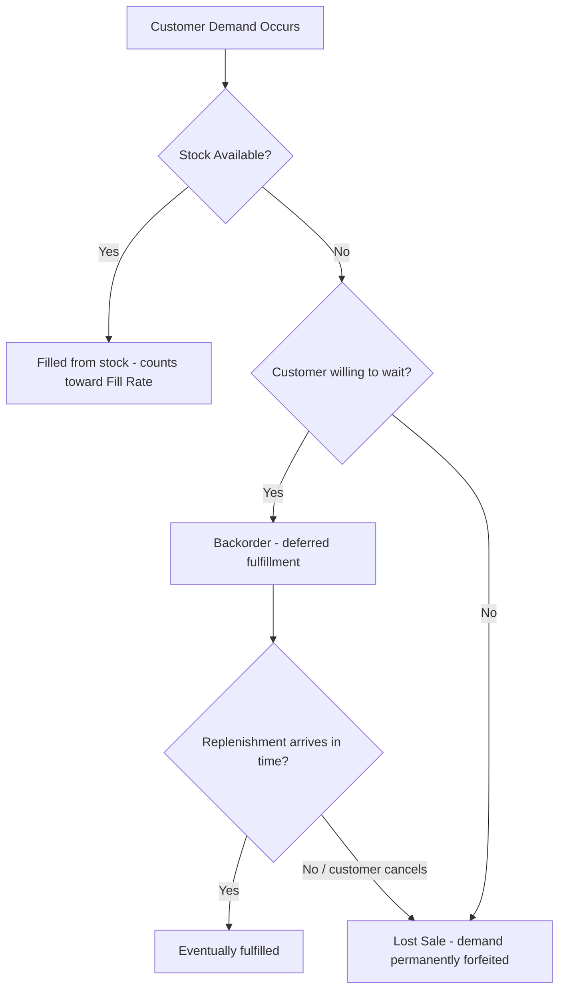
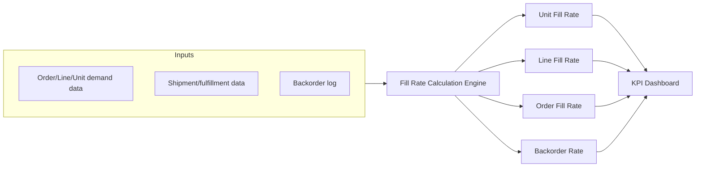

## Fill Rate and Backorder Rate Tracking

### Overview

Fill rate and backorder rate are complementary customer-service-level KPIs that measure how well an inventory system actually satisfies demand as it occurs, in contrast to the capital-efficiency metrics (turnover, GMROI) and coverage metrics (DOS/DIO) covered earlier in this chapter. Where those metrics ask "how efficiently is inventory being used," fill rate and backorder rate ask the more direct operational question: "when a customer wanted something, did we have it?" This distinction matters because, as flagged under inventory turnover, an inventory system can be optimized to look efficient on turnover/GMROI while quietly degrading service level — fill rate tracking is the primary safeguard against that failure mode, and the metric most directly tied back to the service-level term ($z$) embedded in the safety stock formula used throughout this material.

### Fill Rate — Core Definitions

"Fill rate" is not a single metric but a family of related measures, and confusing them is a common source of misreported service performance. The three standard variants:

**Unit Fill Rate** — the percentage of ordered *units* shipped complete and on time from available stock:

$$\text{Unit Fill Rate} = \frac{\text{Units Shipped from Stock (on first pass)}}{\text{Total Units Ordered}} \times 100\%$$

**Order Fill Rate (Line Fill Rate variant also common)** — the percentage of entire *orders* (or order lines) shipped complete, with no backorder or partial shipment:

$$\text{Order Fill Rate} = \frac{\text{Orders Shipped 100\% Complete}}{\text{Total Orders Placed}} \times 100\%$$

**Case/Line Fill Rate** — the percentage of individual order *lines* (SKU-level line items within an order) filled complete:

$$\text{Line Fill Rate} = \frac{\text{Order Lines Filled Complete}}{\text{Total Order Lines}} \times 100\%$$

**Key Points**

- **Order fill rate is always the most conservative (lowest) of the three** for the same underlying data, because a single missing unit on a single line is enough to disqualify the entire order from being "complete," even if 95% of total units across that order shipped fine
- **Unit fill rate is typically the highest and most forgiving**, since it averages across all units ordered rather than requiring perfect completeness at the order or line level
- Reporting only one variant without specifying which can materially mislead stakeholders — a company reporting "98% fill rate" using the unit basis may be masking a much lower order-complete rate that customers actually experience as service quality

### Worked Example — Comparing the Three Variants

A distribution center processes 100 orders in a week, totaling 500 order lines and 5,000 total units ordered. Results:

- 4,850 units shipped from stock on the first pass
- 460 of the 500 order lines shipped complete
- 82 of the 100 orders shipped 100% complete (no missing lines/units)

**Unit Fill Rate:**

$$\frac{4{,}850}{5{,}000} \times 100\% = 97.0\%$$

**Line Fill Rate:**

$$\frac{460}{500} \times 100\% = 92.0\%$$

**Order Fill Rate:**

$$\frac{82}{100} \times 100\% = 82.0\%$$

This 15-percentage-point spread between unit fill rate (97.0%) and order fill rate (82.0%) — from the *same underlying week of data* — illustrates why variant selection matters enormously in reporting: a customer whose order shipped 4 of 5 lines complete experiences that as an incomplete, disrupted order, not as "97% satisfied," even though the unit-level math looks strong.

### Backorder Rate — Core Definition

Backorder rate is the complementary "failure" measure, tracking the proportion of demand that could not be immediately filled from available stock and was instead deferred to a later fulfillment:

$$\text{Backorder Rate} = \frac{\text{Units (or Orders/Lines) Backordered}}{\text{Total Units (or Orders/Lines) Demanded}} \times 100\%$$

Using the same basis convention as fill rate (unit, line, or order), backorder rate and fill rate are structurally complementary:

$$\text{Fill Rate} + \text{Backorder Rate} = 100\%$$

*(This holds precisely only when "backordered" and "lost sale/cancelled" are treated as the same outcome category; in systems that distinguish a backorder — deferred but eventually fulfilled — from a true stockout-driven lost sale, a third category must be tracked separately, as covered below.)*

### Distinguishing Backorder from Lost Sale

**Key Points**

This distinction is operationally critical and frequently conflated in casual reporting:

- **Backorder:** The customer's demand is recorded and will be fulfilled once stock is replenished — the sale is not lost, only delayed. This still represents a service failure worth tracking, but its financial impact differs substantially from a lost sale
- **Lost sale:** The customer, faced with unavailability, cancels the order or purchases from a competitor instead — demand is not merely delayed but permanently forfeited
- Many demand-history systems undercount true demand because they only capture **units actually sold**, silently missing backordered-then-cancelled and lost-sale volume entirely unless a specific unmet-demand-capture process exists — this directly affects the accuracy of the $D$ (demand rate) term used throughout this material's safety stock and DOS formulas, since a system training its demand forecast only on historical *sales* rather than true *demand* will systematically understate real demand during any period stock was constrained

### The Newsvendor / Service-Level Connection

Fill rate connects directly back to the service-level parameter ($z$) used in the safety stock formula covered earlier in this material:

$$SS = z \times \sigma_{LT} \times \sqrt{L}$$

**Key Points**

- The $z$-value chosen for safety stock calculation is typically derived from a **target cycle service level** (probability of *not* stocking out during a replenishment cycle) — but cycle service level and unit fill rate are related, **not identical**, metrics, another common point of confusion
- **Cycle service level (Type 1 service level)** measures the probability of *any* stockout occurring during a replenishment cycle — a binary, per-cycle measure
- **Fill rate (Type 2 service level)** measures the *proportion of total demand* satisfied from stock — a continuous, volume-weighted measure that accounts for *how severe* a stockout was, not just whether one occurred
- A system can have a high cycle service level (rarely stocks out) but a moderate fill rate if, on the rare occasions it does stock out, the shortfall is large relative to demand — the two metrics answer related but distinct questions, and safety-stock parameter selection should be explicit about which one is being targeted

The relationship between fill rate and safety stock is approximately governed by the **expected shortage per cycle** (often calculated via the standard normal loss function $L(z)$ in more advanced treatments), such that increasing $z$ (and thus $SS$) increases fill rate at a diminishing rate — pushing fill rate from, say, 98% to 99.5% typically requires a disproportionately larger safety stock increase than moving from 90% to 95%, reflecting the same diminishing-returns dynamic that governs cycle service level.

### Fill Rate Tracking as a KPI Dashboard Component

**Key Points**

- Fill rate should be tracked and reported at the **same segmentation levels** flagged under turnover and DOS (by SKU, category, and location) — an aggregate company-wide fill rate can mask severe service failures concentrated in specific fast-moving items or high-priority customer segments
- Trending fill rate over time (weekly/monthly) is generally more actionable than a single snapshot, since it reveals whether service level is improving, degrading, or seasonal
- Root-cause tagging of backorders (supplier delay, forecast miss, demand spike, quality rejection) turns backorder-rate tracking from a passive metric into an active diagnostic tool feeding back into safety stock, lead time, and forecasting parameter tuning

### Trade-Offs: Fill Rate vs. Inventory Investment

Fill rate and backorder rate must be read alongside the capital-efficiency metrics covered earlier in this chapter, because pushing fill rate higher without limit is rarely economically optimal:

| Fill Rate Target | Inventory Investment Implication | Typical Context |
| --- | --- | --- |
| ~90–95% | Moderate safety stock; standard for many B2C retail categories | Balanced service/cost trade-off |
| ~98–99% | Substantially higher safety stock (diminishing-returns effect) | Critical spare parts, healthcare, contractual SLAs |
| ~99.9%+ | Very high inventory investment; often uneconomical for most items | Life-safety or regulatory-mandated availability only |

[Inference] Because the relationship between fill rate and required safety stock is non-linear with diminishing returns, most inventory management practice treats near-100% fill rate targets as economically justified only for a small subset of critical items (per ABC/critical-item classification) rather than applying a uniform high target across an entire catalog — the specific threshold where the trade-off becomes uneconomical is context-dependent on holding cost, stockout cost, and item criticality rather than a fixed rule.

**Related Topics**

- Safety stock calculus and the cycle service level ($z$) parameter
- Days of Supply and Days Inventory Outstanding
- ABC analysis and differentiated service-level targeting by item class
- Demand forecasting and true-demand capture vs. sales-only data
- Inventory turnover ratio and GMROI as complementary efficiency metrics
- Vendor-managed inventory and its impact on backorder frequency
- Root-cause analysis for stockout and backorder events