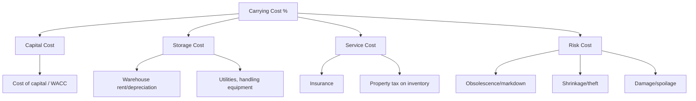
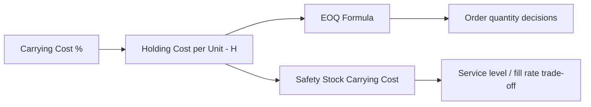

## Carrying Cost as a Percentage of Inventory Value

### Overview

Carrying cost (also called holding cost) is the total cost an organization incurs to hold inventory over a given period, and it is most commonly expressed and benchmarked as a **percentage of average inventory value** — a normalized rate that allows comparison across companies, categories, and time periods regardless of absolute inventory size. This percentage figure is not a standalone KPI observed in isolation; it is the direct input ($H$, holding cost per unit per period, or $C_h$ as an annual carrying rate) that drives the EOQ formula, the safety stock economic trade-off, and the turnover/GMROI optimization logic covered throughout this chapter — making it arguably the single most consequential cost parameter in the entire inventory-management cost model, despite being one of the least precisely measured in practice.

### The Component Structure of Carrying Cost

**Key Points**

Carrying cost as a percentage is not a single line item but an aggregate of several distinct cost categories, each estimated separately and then summed:

$$\text{Carrying Cost \%} = \text{Capital Cost \%} + \text{Storage Cost \%} + \text{Service Cost \%} + \text{Risk Cost \%}$$

| Component | What It Captures | Typical Range (of inventory value, annualized) |
| --- | --- | --- |
| **Capital cost** | Opportunity cost of cash tied up in inventory instead of alternative uses (WACC, cost of debt, or hurdle rate) | 8–15% |
| **Storage cost** | Warehouse space, utilities, material handling equipment, facility depreciation | 2–5% |
| **Service cost** | Insurance, taxes on inventory value, IT/systems cost of tracking inventory | 1–3% |
| **Risk cost** | Obsolescence, shrinkage/theft, damage, spoilage, markdown risk | 3–10%+ (highly category-dependent) |
| **Total (typical range)** |  | **15–35%**, commonly cited around 20–25% as an industry rule of thumb |

[Inference] The specific percentage ranges above are commonly cited industry rules of thumb rather than a universal standard — actual carrying cost percentage varies substantially by industry, facility ownership structure (owned vs. leased warehousing), capital cost environment (prevailing interest rates), and product category (perishables and high-obsolescence-risk electronics sit at the high end; stable, durable industrial parts sit lower).

### Core Calculation

Once the aggregate percentage rate is established, annual carrying cost in dollar terms is:

$$\text{Annual Carrying Cost (\$)} = \text{Carrying Cost \%} \times \text{Average Inventory Value}$$

### Worked Example

A distribution operation estimates its cost components as follows:

- Capital cost: 10% (based on the organization's weighted average cost of capital)
- Storage cost: 3% (warehouse lease, utilities, handling equipment amortized against inventory value)
- Service cost: 2% (insurance premiums and inventory-related taxes)
- Risk cost: 6% (historical obsolescence write-offs and shrinkage, category-blended)

**Step 1 — Aggregate carrying cost rate:**

$$10\% + 3\% + 2\% + 6\% = 21\%$$

**Step 2 — Apply to average inventory value** (assume average inventory value of $2,500,000):

$$\text{Annual Carrying Cost} = 0.21 \times 2{,}500{,}000 = \$525{,}000$$

This $525,000 figure is the annual cost of simply *holding* the inventory — separate from the cost of the goods themselves — and is the number that should be weighed against the ordering/setup cost side of the EOQ trade-off, and against the service-level benefit of any additional safety stock.

### Connection to EOQ and Safety Stock

Carrying cost percentage is the direct source of the $H$ (holding cost per unit per year) parameter in the standard Economic Order Quantity formula:

$$EOQ = \sqrt{\frac{2DS}{H}}$$

where $H = \text{Carrying Cost \%} \times \text{Unit Cost}$. Because $H$ sits in the denominator under a square root, EOQ is **relatively insensitive** to moderate errors in the carrying cost percentage estimate — a common and useful robustness property, but one that can mask the fact that the carrying cost estimate itself is frequently built on soft, blended assumptions (as flagged below) rather than precise item-level measurement.

The same rate also scales the **carrying cost side of the safety stock trade-off**: every additional unit of safety stock held to improve fill rate or cycle service level (covered earlier) carries an annual cost equal to $\text{Carrying Cost \%} \times \text{Unit Cost}$ per unit — meaning the carrying cost percentage directly determines how expensive it is, in dollar terms, to buy down stockout risk via inventory rather than via lead-time or variability reduction (the JIT-aligned levers covered in the previous chapter).

### Category-Level Variation and Why Blended Rates Mislead

**Key Points**

Applying a single, company-wide carrying cost percentage across all inventory is a common simplification that can distort item-level and category-level decisions, echoing the segmentation cautions raised under turnover, DOS, and GMROI:

- **Risk cost varies enormously by category** — a perishable or fashion/seasonal item may carry risk cost of 15–20%+ due to spoilage or obsolescence exposure, while a stable industrial spare part might carry near-zero risk cost, yet both may be assigned the same blended company-wide rate in a simplified model
- **Storage cost varies by physical characteristics** — bulky, low-density, or specially-handled items (refrigerated, hazardous, high-security) incur disproportionately higher storage cost per dollar of inventory value than compact, standard-handling items
- **Capital cost is generally uniform** across categories (it reflects the organization's overall cost of capital, not item-specific risk) — making it the one component reasonably applied as a flat rate company-wide

Best practice, where data supports it, is to apply **category-specific or even SKU-class-specific carrying cost rates** (particularly varying the risk-cost component) rather than a single blended figure — since using an understated blended rate for high-risk/high-obsolescence categories will systematically bias EOQ and safety-stock calculations toward over-ordering and over-stocking exactly the items where that error is most costly.

### Measurement Challenges

**Key Points**

- **Capital cost** is the most defensible component to estimate precisely, since it is typically derived from a known corporate WACC or hurdle rate already used for other capital-allocation decisions
- **Storage cost** requires allocating shared warehouse facility costs down to a per-inventory-dollar basis, which involves assumptions about space utilization and throughput that are often approximated rather than precisely activity-based-costed
- **Risk cost**, particularly obsolescence and shrinkage, is frequently the least precisely measured component — it typically relies on historical write-off and shrinkage data, which reflects *past* risk exposure and may not accurately predict *future* risk for new or rapidly-changing product categories
- Because of these measurement challenges, many organizations use a **round-number rule-of-thumb rate** (commonly 20–25%, per the table above) for planning purposes rather than a fully activity-based-costed figure — a pragmatic trade-off between precision and the cost/effort of precise measurement, justified partly by EOQ's relative insensitivity to $H$ noted above, though this insensitivity does **not** extend as forgivingly to carrying-cost-driven category or assortment decisions (e.g., GMROI-informed stocking choices), where a materially wrong risk-cost estimate can meaningfully distort which items appear profitable to hold

[Inference] The trade-off between precise, activity-based carrying-cost measurement and simpler rule-of-thumb rates is a practical resourcing decision rather than a settled best practice — organizations with high-value, high-risk-variance inventory (e.g., electronics, fashion, perishables) generally have stronger justification for granular, category-specific measurement than those with stable, homogeneous inventory, where a blended rate's error is less consequential.

### Reporting Carrying Cost Percentage as a Standalone KPI

Beyond its role as an input to EOQ and safety stock calculations, carrying cost percentage is often tracked as a standalone trend KPI, since a rising rate — independent of inventory volume changes — signals a deteriorating cost structure (e.g., rising interest rates increasing capital cost, or worsening obsolescence driving up risk cost) that warrants investigation separate from the volume-focused metrics (turnover, DOS) covered earlier in this chapter.

**Related Topics**

- Economic Order Quantity (EOQ) and the holding cost parameter
- Safety stock calculus and the cost of buying down stockout risk
- Inventory turnover ratio and GMROI as related capital-efficiency measures
- ABC analysis and category-differentiated cost/service policies
- Obsolescence and markdown management
- Cash Conversion Cycle and cost of capital
- Fill rate / backorder rate as the service-side counterpart to carrying cost