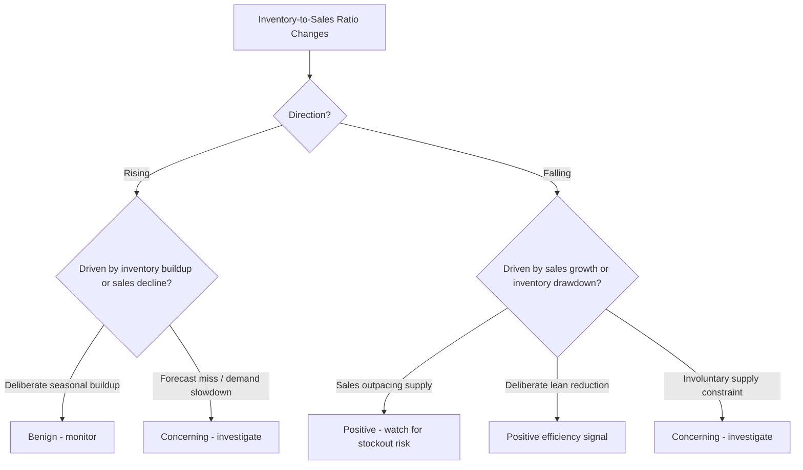

## Inventory-to-Sales Ratio

### Overview

The inventory-to-sales ratio measures the level of inventory a business holds relative to the volume of sales it generates, expressing how many dollars (or units) of inventory are required to support each dollar of sales. It is closely related to — and often confused with — inventory turnover, but the two metrics are used differently: turnover expresses *velocity* (how many times inventory cycles through per period), while inventory-to-sales expresses *proportion* (what fraction, or ratio, of sales value is currently sitting in inventory at a point in time). This makes inventory-to-sales especially useful as a **macro-level, trend-monitoring metric** — it is the metric most commonly used in published economic statistics (e.g., the U.S. Census Bureau's Manufacturing and Trade Inventories and Sales report) to track inventory build-up or drawdown across an entire economy or industry, in addition to its use as a company-level KPI.

### Core Formula

$$\text{Inventory-to-Sales Ratio} = \frac{\text{Ending Inventory (at a point in time)}}{\text{Sales (for the period)}}$$

**Key Points**

- Unlike inventory turnover, which conventionally uses **COGS** in the denominator (for cost-basis consistency with inventory valuation), inventory-to-sales conventionally uses **sales/revenue** — this is a deliberate convention difference, not an error, because the ratio's purpose is different: it is meant to relate stock levels to *demand volume as the market sees it*, not to isolate cost-basis efficiency
- Inventory in the numerator is typically a **snapshot** (month-end or period-end balance), not an average — this is also a deliberate difference from turnover's average-inventory convention, since inventory-to-sales is most often used as a rolling monthly indicator of current inventory positioning relative to the most recent sales pace, rather than a full-period efficiency retrospective
- Both inventory and sales must be measured over/at consistent time bases (e.g., monthly inventory snapshot against trailing monthly sales, not a monthly snapshot against annual sales) or the ratio becomes uninterpretable

### Worked Example

A retailer reports:

- End-of-month inventory (at cost or retail, consistently applied): $3,200,000
- Sales for that same month: $1,600,000

$$\text{Inventory-to-Sales Ratio} = \frac{3{,}200{,}000}{1{,}600{,}000} = 2.0$$

This means the retailer is currently holding $2.00 of inventory for every $1.00 of sales generated in that month — equivalently, roughly two months of inventory on hand at the current sales pace, a relationship made explicit below.

### Relationship to Days of Supply and Turnover

Inventory-to-sales ratio is mathematically related to both DOS/DIO and turnover, but framed around sales rather than COGS or units:

$$\text{Inventory-to-Sales Ratio} \times \text{Number of Periods in Year} = \text{Inventory Turnover (sales basis)}$$

Using the monthly example above:

$$2.0 \times 12 = 24$$

This would imply an annualized sales-basis turnover of 24 if the current month's ratio persisted all year — illustrating why inventory-to-sales is often read as a **forward-looking pace indicator**, similar in spirit to Days of Supply, rather than the backward-looking, full-period efficiency measure that DIO represents. The distinction across all three related metrics:

| Metric | Basis | Time Orientation | Primary Use |
| --- | --- | --- | --- |
| Inventory Turnover (DIO) | COGS / Average Inventory | Backward, full-period | Efficiency benchmarking, financial reporting |
| Days of Supply | Units / Daily demand rate | Forward, point-in-time | Operational stockout-risk monitoring, SKU-level |
| Inventory-to-Sales Ratio | Sales / Point-in-time inventory | Point-in-time snapshot vs. recent pace | Macro trend monitoring, company-level positioning |

### Rising vs. Falling Inventory-to-Sales Ratio: Interpretation

**Key Points**

A change in the ratio can reflect either a change in inventory levels or a change in sales — and correctly diagnosing which one is driving the movement is the central interpretive skill this metric requires:

- **Rising ratio, inventory increasing faster than sales:** Can indicate deliberate build-up (e.g., ahead of anticipated seasonal demand or a planned promotion) — benign — or unintended overstocking from a forecast miss or slowing demand the organization hasn't yet reacted to — concerning
- **Rising ratio, sales declining while inventory holds steady:** Almost always concerning — inventory purchasing has not yet adjusted to a demand slowdown, a classic early-warning signal watched closely in both company-level and macroeconomic reporting
- **Falling ratio, sales growing faster than inventory:** Generally a positive efficiency signal, but if extreme or sudden, can also foreshadow stockout risk if inventory replenishment isn't keeping pace with demand growth
- **Falling ratio, inventory deliberately drawn down:** Can reflect improved efficiency (JIT/lean initiatives reducing buffer levels) or can signal a supply constraint forcing inventory lower involuntarily — again, the same directional movement can be good or bad news depending on cause

This diagnostic ambiguity is the primary limitation of the ratio when viewed in isolation: **the ratio alone cannot distinguish cause**, so it must always be read alongside the underlying inventory and sales trend lines separately, and ideally alongside fill rate/backorder data (covered earlier) to determine whether a falling ratio reflects healthy efficiency or emerging stockout risk.

### Use as a Macroeconomic Indicator

[Inference] Beyond company-level use, the inventory-to-sales ratio is a well-established macroeconomic indicator — government statistical agencies in several countries publish aggregate inventory-to-sales ratios across manufacturing, wholesale, and retail sectors, and economists commonly monitor rising aggregate ratios as an early signal of potential economic slowdown (unsold inventory accumulating as demand weakens) or, conversely, monitor unusually low ratios as a signal of potential future price pressure or supply tightness — though the specific interpretation thresholds and lead/lag relationships to broader economic cycles are subjects of ongoing economic analysis rather than a fixed, universally agreed rule.

### Company-Level Application: Segmentation and Trending

**Key Points**

Consistent with the segmentation caution raised for every other metric in this chapter, a single company-wide inventory-to-sales ratio can mask meaningfully different dynamics at the category or product-line level:

- A retailer's aggregate ratio might appear stable while one category (e.g., a declining product line) shows a sharply rising ratio (unsold inventory accumulating) offset by another category (a growth product line) showing a falling ratio (inventory struggling to keep pace with demand) — the blended figure obscures both signals
- Tracking the ratio **trended over time** (monthly, rolling 12-month) is generally more actionable than any single-period snapshot, since seasonal businesses will show a naturally cyclical pattern (ratio rising ahead of a peak season, falling after) that should not be misread as a structural problem without accounting for that seasonality
- Comparing the ratio against **prior-year same-period** figures, rather than only sequential month-over-month, is standard practice specifically to control for seasonality — a common practice mirrored in how DOS/DIO and turnover trends are also typically benchmarked

### Relationship to Working Capital and Cash Flow

Because inventory-to-sales ratio moves directly with inventory investment relative to revenue-generating activity, it connects to the same working-capital concerns raised under DIO and the Cash Conversion Cycle: a sustained increase in the ratio — even if not immediately flagged as a service or efficiency problem — represents a growing claim on working capital that could otherwise fund other operations, making the ratio a metric of interest to finance/treasury stakeholders monitoring liquidity, not solely to inventory/operations planners.

**Related Topics**

- Inventory turnover ratio and Days Inventory Outstanding (related, differently-based metrics)
- Days of Supply as the SKU-level operational analog
- Fill rate and backorder rate as the service-level cross-check
- Cash Conversion Cycle and working capital management
- Demand forecasting and the causes of forecast-driven overstock
- Seasonal inventory planning
- GMROI as a profitability-weighted complement to pure ratio metrics