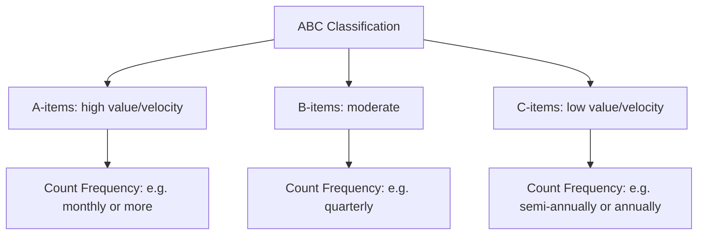
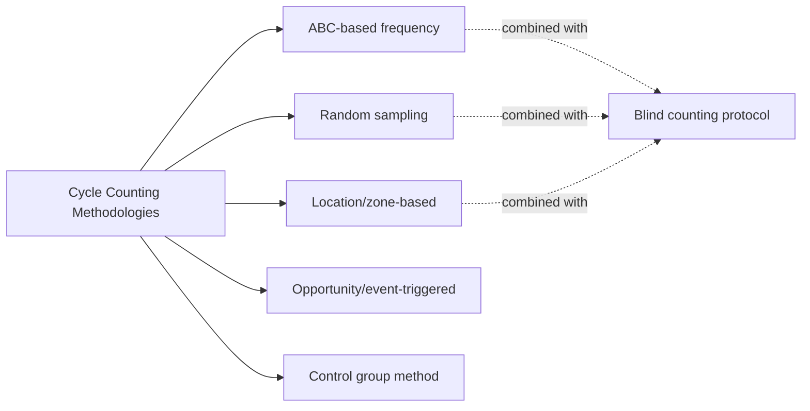
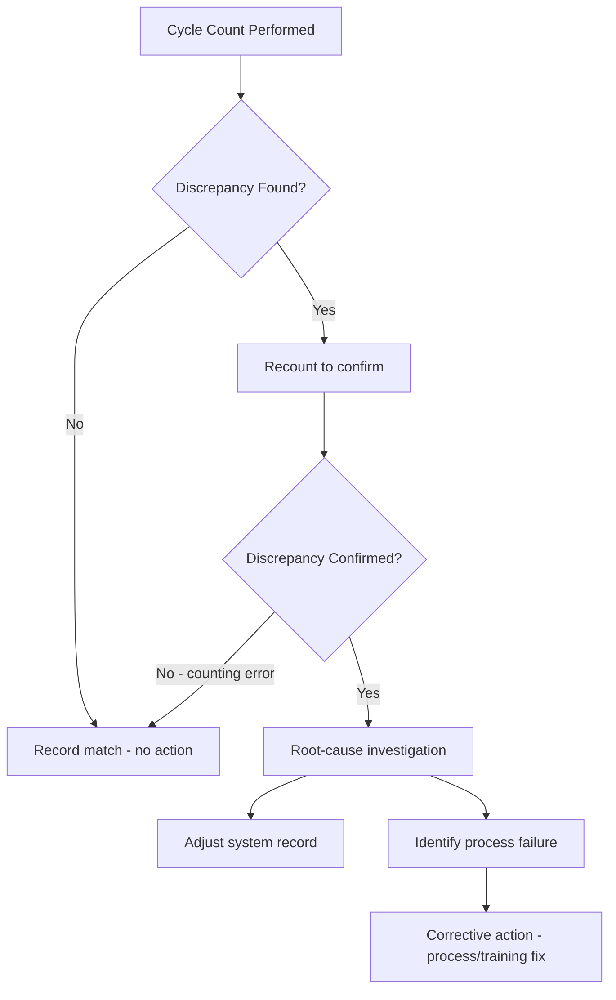

## Cycle Counting Methodologies

### Overview

Cycle counting is a perpetual inventory-auditing discipline in which a subset of inventory is physically counted and reconciled against system records on a rolling, ongoing basis — rather than shutting down operations once a year for a single, comprehensive physical inventory count. The core premise is statistical and operational: by counting a manageable portion of the SKU population frequently and continuously, discrepancies are caught and corrected close to when they occur (making root-cause diagnosis far more tractable), and the *entire* inventory gets audited over a defined cycle (weekly, monthly, quarterly) without ever requiring a full operational shutdown. This directly supports the accuracy of every metric covered in the prior chapter — DOS, fill rate, turnover, and GMROI are only as reliable as the underlying system-of-record inventory figures, and cycle counting is the primary mechanism for keeping that system of record trustworthy.

### Why Cycle Counting Replaces Annual Physical Inventory

| Dimension | Annual Physical Inventory | Cycle Counting |
| --- | --- | --- |
| Frequency | Once per year (typically) | Continuous, rolling (daily/weekly counts) |
| Operational disruption | High — often requires a full shutdown | Low — integrated into normal operations |
| Error discovery lag | Up to 12 months before a discrepancy is found | Days to weeks, depending on cycle frequency |
| Root-cause traceability | Poor — too much time has passed to isolate cause | Strong — recent transactions can be reviewed |
| Labor pattern | Concentrated, high-intensity burst | Distributed, steady workload |
| Statistical accuracy insight | Single point-in-time snapshot | Ongoing accuracy trend data by item/class/location |

**Key Points**

- The error-discovery-lag advantage is arguably cycle counting's single most important benefit: a discrepancy found within days of occurring can usually be traced to a specific transaction (a miskeyed receipt, a picking error, a damaged-goods write-off that wasn't recorded) — the same discrepancy found 11 months later during an annual count is essentially un-diagnosable, so the organization can correct the number but not the underlying process failure that caused it
- Cycle counting does not necessarily eliminate the need for a periodic full physical inventory in every organization (some regulatory, audit, or financial-reporting contexts still require one), but it substantially reduces reliance on it as the primary accuracy-assurance mechanism

### ABC-Based Cycle Counting

The most common cycle counting methodology ties count frequency directly to the ABC classification (A/B/C item segmentation by value or velocity) referenced throughout the prior metrics chapter — high-value or high-velocity items are counted far more often than low-value, slow-moving ones, since errors in A-items carry disproportionately larger financial and service-level consequences.

A commonly cited illustrative frequency scheme (specific numbers vary by organization):

| Class | Typical Share of SKUs | Typical Share of Value | Illustrative Count Frequency |
| --- | --- | --- | --- |
| A | ~10–20% | ~70–80% | Monthly or more frequent |
| B | ~20–30% | ~15–25% | Quarterly |
| C | ~50–70% | ~5–10% | Semi-annually or annually |

[Inference] These frequency bands are commonly cited illustrative conventions rather than a fixed industry standard — actual count cadence for each class is typically tuned based on an organization's observed error rates, the cost of counting labor, and the financial materiality of discrepancies for that item class.

**Worked Example — Annual Count Capacity Calculation**

A warehouse holds 6,000 SKUs classified as 900 A-items, 1,500 B-items, and 3,600 C-items, with target frequencies of monthly (A), quarterly (B), and annually (C):

$$\text{Annual A-item counts} = 900 \times 12 = 10{,}800$$

$$\text{Annual B-item counts} = 1{,}500 \times 4 = 6{,}000$$

$$\text{Annual C-item counts} = 3{,}600 \times 1 = 3{,}600$$

$$\text{Total annual count instances} = 10{,}800 + 6{,}000 + 3{,}600 = 20{,}400$$

If each count takes an average of 5 minutes (including system reconciliation), total annual labor requirement is:

$$20{,}400 \times 5 \text{ min} = 102{,}000 \text{ minutes} \approx 1{,}700 \text{ hours/year} \approx 0.85 \text{ FTE}$$

This kind of capacity calculation is standard practice for staffing a cycle-count program — converting the chosen frequency policy into a concrete labor budget before committing to it.

### Other Cycle Counting Methodologies

**Key Points**

Beyond ABC-based frequency, several distinct methodological approaches exist, often used in combination:

- **Random sampling cycle counting:** Items are selected for counting at random from the full population each cycle, without regard to class — statistically simple to implement, but doesn't prioritize the highest-risk/highest-value items the way ABC-based counting does
- **Control group method:** A fixed, small sample of items is counted very frequently (e.g., daily) specifically to validate whether the *overall counting and reconciliation process* itself is functioning correctly — a process-quality check layered on top of, not a replacement for, broader inventory counting
- **Location-based (zone) cycle counting:** All items within a specific physical zone or aisle are counted together on a rotating schedule, regardless of item class — operationally efficient (minimizes staff travel time within the warehouse) but less risk-prioritized than ABC-based counting
- **Opportunity-based (event-triggered) counting:** A count is triggered by a specific event rather than a fixed schedule — e.g., whenever a bin location registers as empty (zero on-hand), a negative on-hand balance appears, or a pick discrepancy is reported — catching high-probability-of-error situations close to when they occur
- **Random/blind counting:** The counter is not shown the expected system quantity before counting (a "blind count"), specifically to prevent count bias — a counter who sees the expected quantity beforehand is statistically more likely to (consciously or unconsciously) report a count that matches the system record rather than the true physical quantity

Most mature cycle-count programs combine several of these: ABC-based frequency as the primary scheduling backbone, blind counting as the execution protocol to prevent bias, and opportunity-based triggers layered on top to catch high-risk events (zero balances, negative balances) outside the regular schedule.

### Measuring Accuracy: The Reconciliation Metric

Cycle counting's output feeds a standard accuracy KPI, **Inventory Record Accuracy (IRA)**:

$$IRA = \frac{\text{Number of SKUs Counted Correctly}}{\text{Total Number of SKUs Counted}} \times 100\%$$

or, weighted by value to reflect financial materiality rather than just item count:

$$IRA_{\text{value-weighted}} = 1 - \frac{\sum |\text{System Qty} - \text{Counted Qty}| \times \text{Unit Cost}}{\sum \text{System Qty} \times \text{Unit Cost}}$$

**Key Points**

- A commonly cited tolerance threshold considers a count "accurate" if it falls within a small percentage band of the system quantity (rather than requiring an exact match), particularly for high-volume, low-unit-value items where minor counting variance is expected — the specific tolerance band is organization- and item-specific
- IRA should be tracked and trended by item class, mirroring the segmentation discipline emphasized throughout this material — an aggregate IRA figure can mask a serious accuracy problem concentrated in one class or zone

### Root-Cause Investigation and the Discrepancy-Correction Loop

**Key Points**

- A **recount step before accepting a discrepancy** is standard practice — many apparent discrepancies are themselves counting errors, and correcting the system record based on an uninvestigated single count can introduce a new error rather than fixing an existing one
- Root causes commonly traced through this process include: receiving errors (wrong quantity logged), picking errors (wrong item or quantity pulled), unrecorded damage/scrap, misplaced stock (physically present but in the wrong location, so effectively "lost" to the system), and transactional timing issues (a count taken mid-transaction, before a receipt or shipment was fully posted)
- Beyond correcting the immediate discrepancy, mature programs track discrepancy **root-cause categories over time** as a diagnostic dataset in its own right — a spike in receiving-error-driven discrepancies, for example, points to a distinct corrective action (receiving process/training) than a spike in misplacement-driven discrepancies (slotting/labeling process)

### Cycle Counting's Position Relative to This Curriculum's Other Systems

Cycle counting accuracy directly underpins the reliability of every planning and metrics system covered earlier:

- **MRP/DRP time-phased records** depend on accurate on-hand and scheduled-receipt data — a systemic inventory-accuracy problem propagates directly into incorrect planned order releases and mistimed replenishment
- **Kanban card-count calculations** assume the physical quantity in circulation matches the design intent ($N \times C$) — undetected shrinkage or misplacement silently erodes the buffer the formula assumes exists
- **Days of Supply** and **fill rate** calculations are only as accurate as the on-hand figure feeding them — a system reporting comfortable DOS based on an inaccurate (overstated) inventory record can mask an imminent stockout that a corrected, cycle-count-validated figure would have flagged

[Inference] Because inventory-record accuracy is a foundational input to nearly every other system and metric in this material rather than an isolated concern, organizations pursuing more sophisticated inventory-control methods (kanban, VMI, DRP) generally have a correspondingly stronger practical need for a disciplined cycle-count program — though the specific accuracy threshold required before a given advanced method becomes reliable is context-dependent rather than governed by a fixed universal standard.

**Related Topics**

- Inventory Record Accuracy (IRA) as a standalone KPI
- ABC analysis and classification methodology
- Root-cause analysis and corrective action processes
- Perpetual inventory systems and real-time inventory tracking
- Shrinkage and loss prevention
- Barcode/RFID technology in inventory auditing
- Physical inventory count procedures and reconciliation